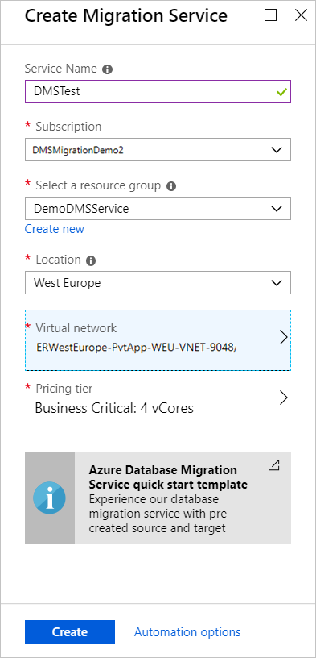
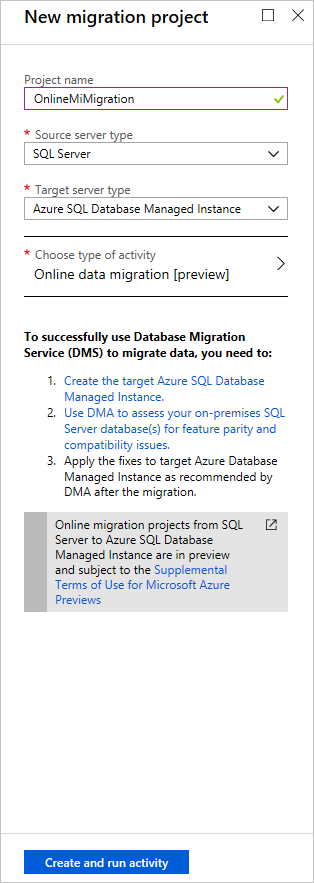
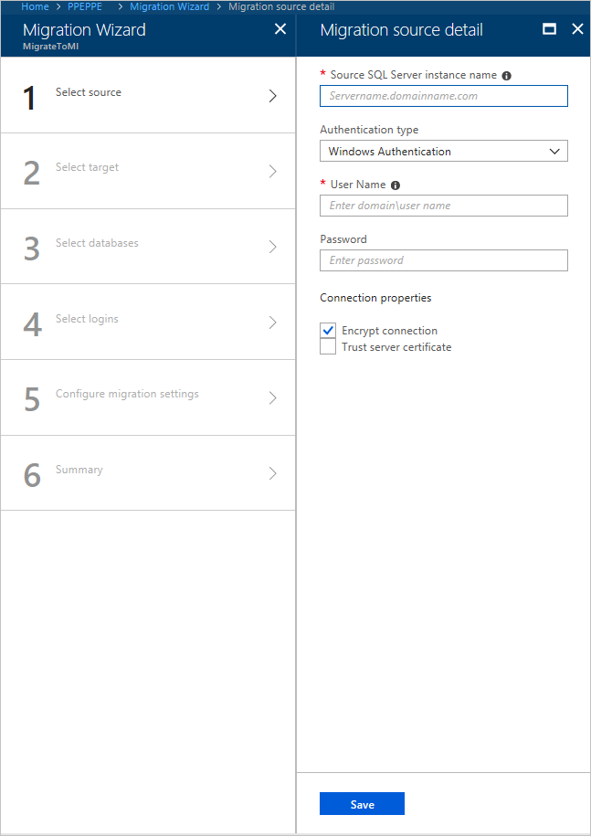
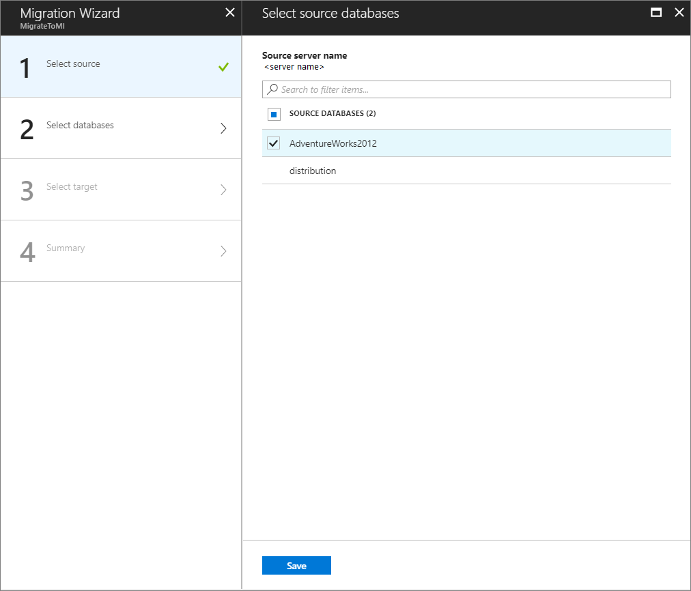
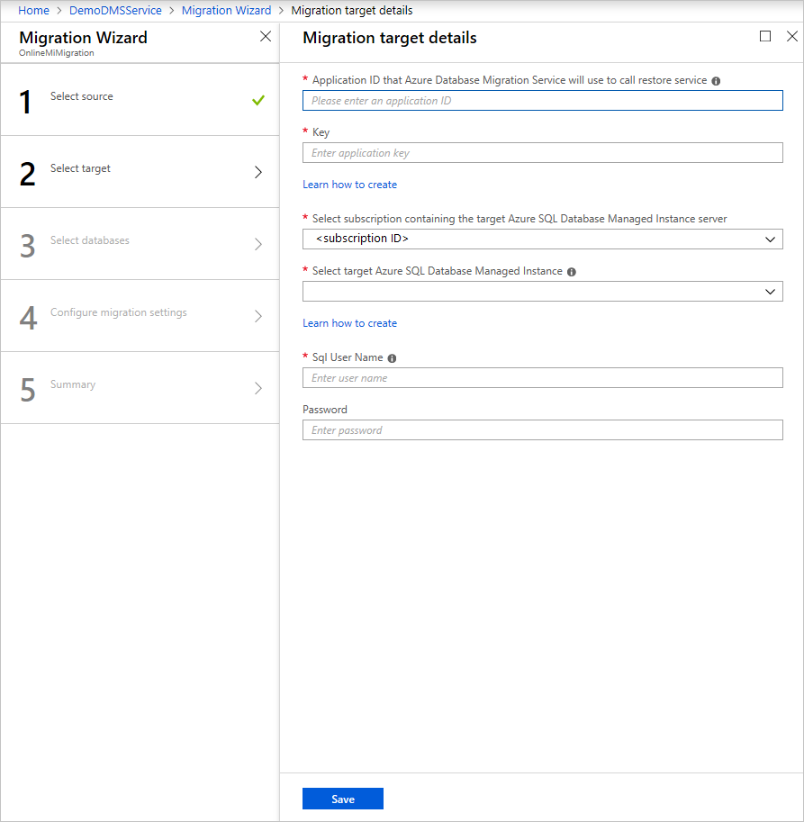
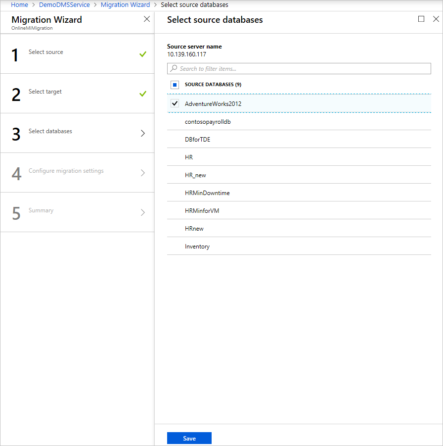
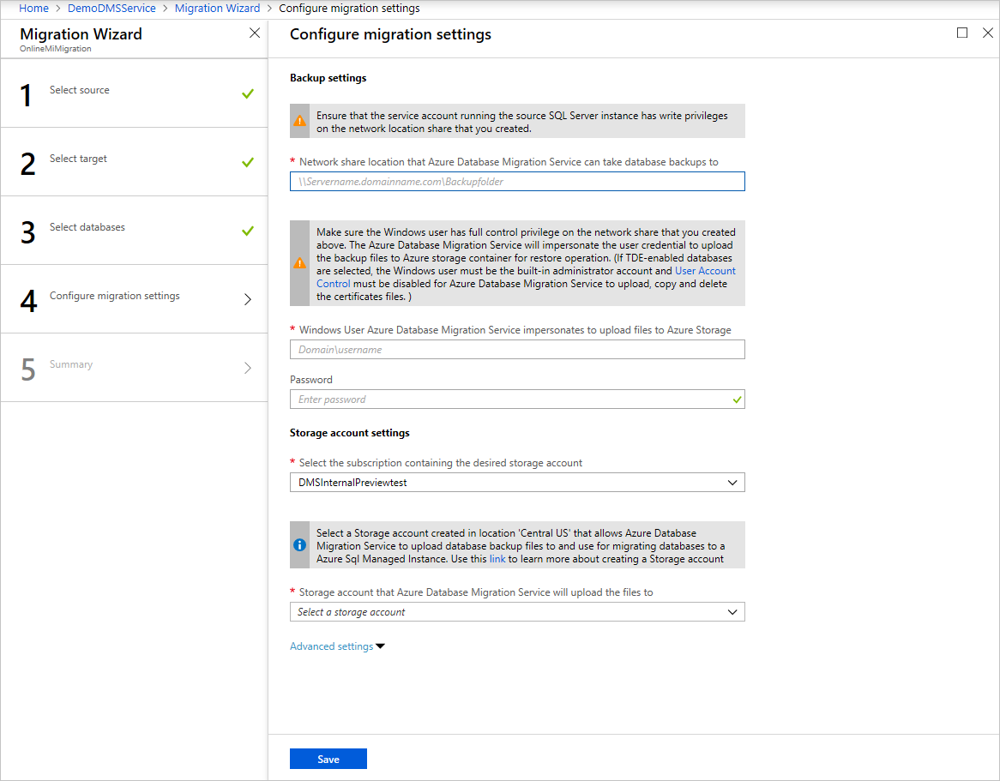
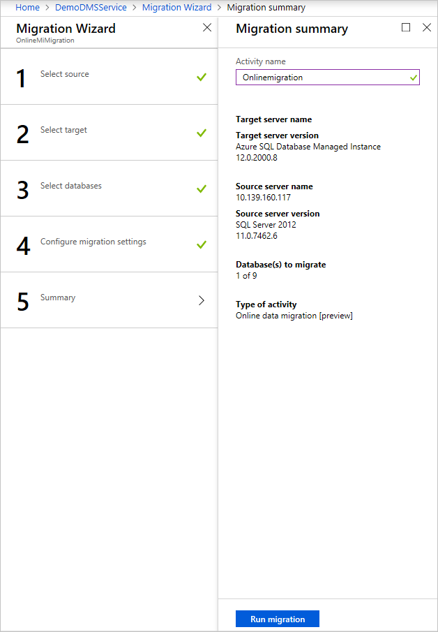
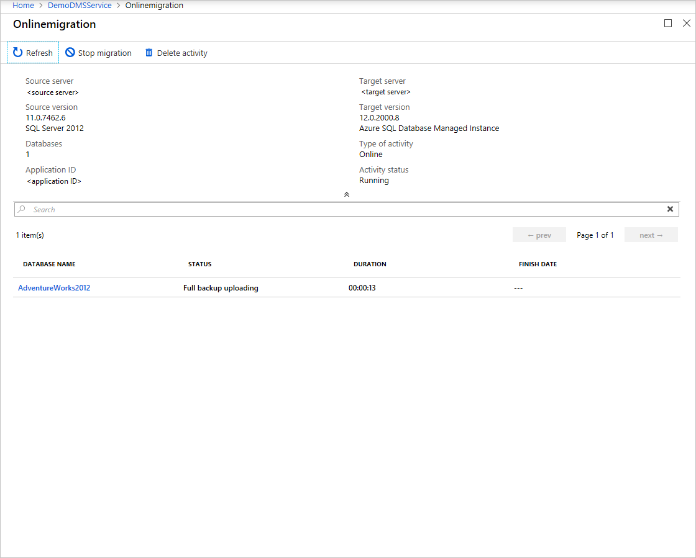
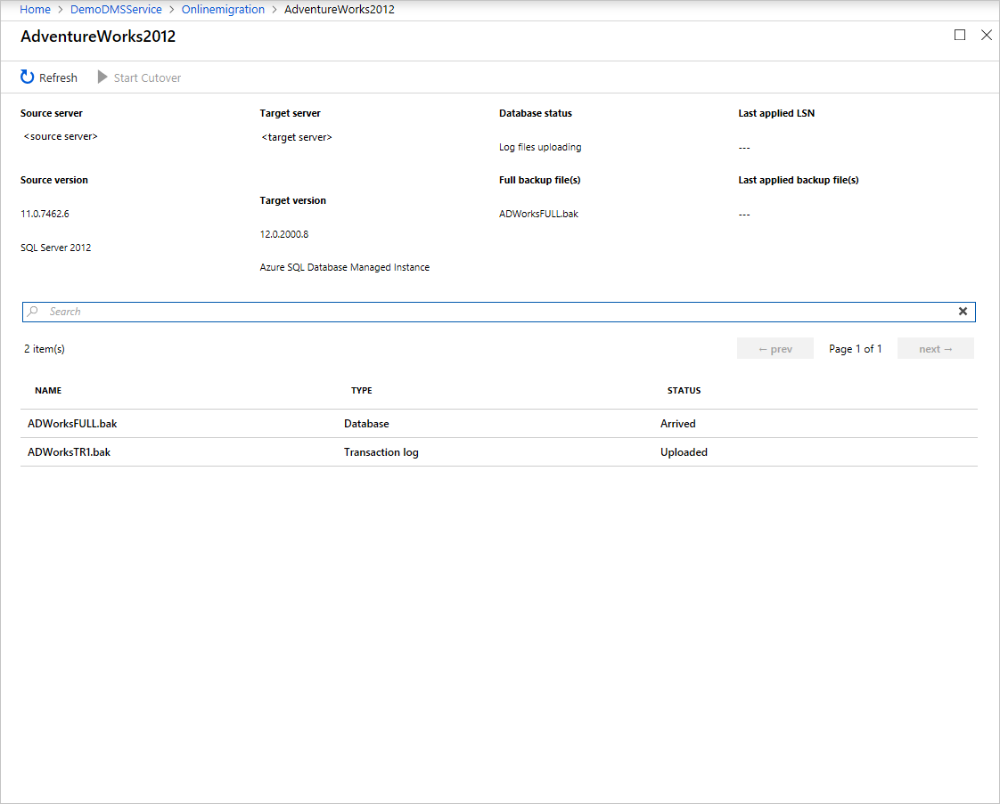

# Tutorial: Migrate SQL Server to an Azure SQL Managed Instance online using DMS

You can use Azure Database Migration Service to migrate the databases from a SQL Server instance to an [Azure SQL Managed Instance](../azure-sql/managed-instance/sql-managed-instance-paas-overview.md) with minimal downtime. For additional methods that may require some manual effort, see the article [SQL Server instance migration to Azure SQL Managed Instance](../azure-sql/managed-instance/migrate-to-instance-from-sql-server.md).

In this tutorial, you migrate the **Adventureworks2012** database from an on-premises instance of SQL Server to a SQL Managed Instance with minimal downtime by using Azure Database Migration Service.

In this tutorial, you learn how to:
> [!div class="checklist"]
>
> * Create an instance of Azure Database Migration Service.
> * Create a migration project and start online migration by using Azure Database Migration Service.
> * Monitor the migration.
> * Perform the migration cutover when you are ready.

> [!IMPORTANT]
> For online migrations from SQL Server to SQL Managed Instance using Azure Database Migration Service,  you must provide the full database backup and subsequent log backups in the SMB network share that the service can use to migrate your databases. Azure Database Migration Service does not initiate any backups, and instead uses existing backups, which you may already have as part of your disaster recovery plan, for the migration.
> Be sure that you take [backups using the WITH CHECKSUM option](https://docs.microsoft.com/sql/relational-databases/backup-restore/enable-or-disable-backup-checksums-during-backup-or-restore-sql-server?view=sql-server-2017). Also, make sure not to append multiple backups (i.e. full and t-log) into a single backup media; take each backup on a separate backup file. Finally, you can use compressed backups to reduce the likelihood of experiencing potential issues associated with migrating large backups.

> [!NOTE]
> Using Azure Database Migration Service to perform an online migration requires creating an instance based on the Premium pricing tier.

> [!IMPORTANT]
> For an optimal migration experience, Microsoft recommends creating an instance of  Azure Database Migration Service in the same Azure region as the target database. Moving data across regions or geographies can slow down the migration process and introduce errors.

> [!IMPORTANT]
> Reduce the duration of the online migration process as much as possible to minimize the risk of interruption caused by instance reconfiguration or planned maintenance. In case of such an event, migration process will start from the beginning. In case of planned maintenance, there is a grace period of 36 hours before migration process is restarted.

[!INCLUDE [online-offline](../../includes/database-migration-service-offline-online.md)]

This article describes an online migration from SQL Server to a SQL Managed Instance. For an offline migration, see [Migrate SQL Server to a SQL Managed Instance offline using DMS](tutorial-sql-server-to-managed-instance.md).

## Prerequisites

To complete this tutorial, you need to:

* Create a Microsoft Azure Virtual Network for Azure Database Migration Service by using the Azure Resource Manager deployment model, which provides site-to-site connectivity to your on-premises source servers by using either [ExpressRoute](https://docs.microsoft.com/azure/expressroute/expressroute-introduction) or [VPN](https://docs.microsoft.com/azure/vpn-gateway/vpn-gateway-about-vpngateways). [Learn network topologies for SQL Managed Instance migrations using Azure Database Migration Service](https://aka.ms/dmsnetworkformi). For more information about creating a virtual network, see the [Virtual Network Documentation](https://docs.microsoft.com/azure/virtual-network/), and especially the quickstart articles with step-by-step details.

    > [!NOTE]
    > During virtual network setup, if you use ExpressRoute with network peering to Microsoft, add the following service [endpoints](https://docs.microsoft.com/azure/virtual-network/virtual-network-service-endpoints-overview) to the subnet in which the service will be provisioned:
    >
    > * Target database endpoint (for example, SQL endpoint, Cosmos DB endpoint, and so on)
    > * Storage endpoint
    > * Service bus endpoint
    >
    > This configuration is necessary because Azure Database Migration Service lacks internet connectivity.
    >
    >If you don’t have site-to-site connectivity between the on-premises network and Azure or if there is limited site-to-site connectivity bandwidth, consider using Azure Database Migration Service in hybrid mode (Preview). Hybrid mode leverages an on-premises migration worker together with an instance of Azure Database Migration Service running in the cloud. To create an instance of Azure Database Migration Service in hybrid mode, see the article [Create an instance of Azure Database Migration Service in hybrid mode using the Azure portal](https://aka.ms/dms-hybrid-create).

    > [!IMPORTANT]
    > Regarding the storage account used as part of the migration, you must either:
    > * Choose to allow all network to access the storage account.
    > * Turn on [subnet delegation](https://docs.microsoft.com/azure/virtual-network/manage-subnet-delegation) on MI subnet and update the Storage Account firewall rules to allow this subnet.

* Ensure that your virtual network Network Security Group rules don't block the following inbound communication ports to Azure Database Migration Service: 443, 53, 9354, 445, 12000. For more detail on virtual network NSG traffic filtering, see the article [Filter network traffic with network security groups](https://docs.microsoft.com/azure/virtual-network/virtual-networks-nsg).
* Configure your [Windows Firewall for source database engine access](https://docs.microsoft.com/sql/database-engine/configure-windows/configure-a-windows-firewall-for-database-engine-access).
* Open your Windows Firewall to allow Azure Database Migration Service to access the source SQL Server, which by default is TCP port 1433.
* If you're running multiple named SQL Server instances using dynamic ports, you may wish to enable the SQL Browser Service and allow access to UDP port 1434 through your firewalls so that Azure Database Migration Service can connect to a named instance on your source server.
* If you're using a firewall appliance in front of your source databases, you may need to add firewall rules to allow Azure Database Migration Service to access the source database(s) for migration, as well as files via SMB port 445.
* Create a SQL Managed Instance by following the detail in the article [Create a SQL Managed Instance in the Azure portal](https://aka.ms/sqldbmi).
* Ensure that the logins used to connect the source SQL Server and the target managed instance are members of the sysadmin server role.
* Provide an SMB network share that contains all your database full database backup files and subsequent transaction log backup files, which Azure Database Migration Service can use for database migration.
* Ensure that the service account running the source SQL Server instance has write privileges on the network share that you created and that the computer account for the source server has read/write access to the same share.
* Make a note of a Windows user (and password) that has full control privilege on the network share that you previously created. Azure Database Migration Service impersonates the user credential to upload the backup files to Azure Storage container for restore operation.
* Create an Azure Active Directory Application ID that generates the Application ID key that Azure Database Migration Service can use to connect to target Azure Database managed instance and Azure Storage Container. For more information, see the article [Use portal to create an Azure Active Directory application and service principal that can access resources](https://docs.microsoft.com/azure/azure-resource-manager/resource-group-create-service-principal-portal).

  > [!NOTE]
  > Azure Database Migration Service requires the Contributor permission on the subscription for the specified Application ID. Alternatively, you can create custom roles that grant the specific permissions that Azure Database Migration Service requires. For step-by-step guidance about using custom roles, see the article [Custom roles for SQL Server to SQL Managed Instance online migrations](https://docs.microsoft.com/azure/dms/resource-custom-roles-sql-db-managed-instance).

* Create or make a note of **Standard Performance tier**, Azure Storage Account, that allows DMS service to upload the database backup files to and use for migrating databases.  Make sure to create the Azure Storage Account in the same region as the Azure Database Migration Service instance is created.

## Register the Microsoft.DataMigration resource provider

1. Sign in to the Azure portal, select **All services**, and then select **Subscriptions**.

    

2. Select the subscription in which you want to create the instance of Azure Database Migration Service, and then select **Resource providers**.

    

3. Search for migration, and then to the right of **Microsoft.DataMigration**, select **Register**.

    

## Create an Azure Database Migration Service instance

1. In the Azure portal, select + **Create a resource**, search for **Azure Database Migration Service**, and then select **Azure Database Migration Service** from the drop-down list.

     

2. On the **Azure Database Migration Service** screen, select **Create**.

    

3. On the **Create Migration Service** screen, specify a name for the service, the subscription, and a new or existing resource group.

4. Select the location in which you want to create the instance of DMS.

5. Select an existing virtual network or create one.

    The virtual network provides Azure Database Migration Service with access to the source SQL Server and target SQL Managed Instance.

    For more information on how to create a virtual network in Azure portal, see the article [Create a virtual network using the Azure portal](https://aka.ms/DMSVnet).

    For additional detail, see the article [Network topologies for SQL Managed Instance migrations using Azure Database Migration Service](https://aka.ms/dmsnetworkformi).

6. Select a SKU from the Premium pricing tier.

    > [!NOTE]
    > Online migrations are supported only when using the Premium tier.

    For more information on costs and pricing tiers, see the [pricing page](https://aka.ms/dms-pricing).

    

7. Select **Create** to create the service.

## Create a migration project

After an instance of the service is created, locate it within the Azure portal, open it, and then create a new migration project.

1. In the Azure portal, select **All services**, search for Azure Database Migration Service, and then select **Azure Database Migration Services**.

    

2. On the **Azure Database Migration Service** screen, search for the name of the instance that you created, and then select the instance.

3. Select + **New Migration Project**.

4. On the **New migration project** screen, specify a name for the project, in the **Source server type** text box, select **SQL Server**, in the **Target server type** text box, select **Azure SQL Managed Instance**, and then for **Choose type of activity**, select **Online data migration**.

   

5. Select **Create and run activity** to create the project.

## Specify source details

1. On the **Migration source detail** screen, specify the connection details for the source SQL Server.

2. If you haven't installed a trusted certificate on your server, select the **Trust server certificate** check box.

    When a trusted certificate isn't installed, SQL Server generates a self-signed certificate when the instance is started. This certificate is used to encrypt the credentials for client connections.

    > [!CAUTION]
    > TLS connections that are encrypted using a self-signed certificate does not provide strong security. They are susceptible to man-in-the-middle attacks. You should not rely on TLS using self-signed certificates in a production environment or on servers that are connected to the internet.

   

3. Select **Save**.

4. On the **Select source databases** screen, select the **Adventureworks2012** database for migration.

   

    > [!IMPORTANT]
    > If you use SQL Server Integration Services (SSIS), DMS does not currently support migrating the catalog database for your SSIS projects/packages (SSISDB) from SQL Server to SQL Managed Instance. However, you can provision SSIS in Azure Data Factory (ADF) and redeploy your SSIS projects/packages to the destination SSISDB hosted by SQL Managed Instance. For more information about migrating SSIS packages, see the article [Migrate SQL Server Integration Services packages to Azure](https://docs.microsoft.com/azure/dms/how-to-migrate-ssis-packages).

5. Select **Save**.

## Specify target details

1. On the **Migration target details** screen, specify the **Application ID** and **Key** that the DMS instance can use to connect to the target instance of SQL Managed Instance and the Azure Storage Account.

    For more information, see the article [Use portal to create an Azure Active Directory application and service principal that can access resources](https://docs.microsoft.com/azure/azure-resource-manager/resource-group-create-service-principal-portal).

2. Select the **Subscription** containing the target instance of SQL Managed Instance, and then select the target instance.

    If you haven't already provisioned the SQL Managed Instance, select the [link](https://aka.ms/SQLDBMI) to help you provision the instance. When the SQL Managed Instance is ready, return to this specific project to execute the migration.

3. Provide **SQL User** and **Password** to connect to the SQL Managed Instance.

    

4. Select **Save**.

## Select source databases

1. On the **Select source databases** screen, select the source database that you want to migrate.

    

2. Select **Save**.

## Configure migration settings

1. On the **Configure migration settings** screen, provide the following detail:

    | | |
    |--------|---------|
    |**SMB Network location share** | The local SMB network share or Azure file share that contains the Full database backup files and transaction log backup files that Azure Database Migration Service can use for migration. The service account running the source SQL Server instance must have read\write privileges on this network share. Provide an FQDN or IP addresses of the server in the network share, for example, '\\\servername.domainname.com\backupfolder' or '\\\IP address\backupfolder'. For improved performance, it's recommended to use separate folder for each database to be migrated. You can provide the database level file share path by using the **Advanced Settings** option. |
    |**User name** | Make sure that the Windows user has full control privilege on the network share that you provided above. Azure Database Migration Service will impersonate the user credential to upload the backup files to Azure Storage container for restore operation. If using Azure File share, use the storage account name pre-pended with AZURE\ as the username. |
    |**Password** | Password for the user. If using Azure file share, use a storage account key as the password. |
    |**Subscription of the Azure Storage Account** | Select the subscription that contains the Azure Storage Account. |
    |**Azure Storage Account** | Select the Azure Storage Account that DMS can upload the backup files from the SMB network share to and use for database migration.  We recommend selecting the Storage Account in the same region as the DMS service for optimal file upload performance. |

    

    > [!NOTE]
    > If Azure Database Migration Service shows error ‘System Error 53’ or ‘System Error 57’, the cause might result from an inability of Azure Database Migration Service to access Azure file share. If you encounter one of these errors, please grant access to the storage account from the virtual network using the instructions [here](https://docs.microsoft.com/azure/storage/common/storage-network-security?toc=%2fazure%2fvirtual-network%2ftoc.json#grant-access-from-a-virtual-network).

    > [!IMPORTANT]
    > If loopback check functionality is enabled and the source SQL Server and file share are on the same computer, then source won't be able to access the files hare using FQDN. To fix this issue, disable loopback check functionality using the instructions [here](https://support.microsoft.com/help/926642/error-message-when-you-try-to-access-a-server-locally-by-using-its-fqd).

2. Select **Save**.

## Review the migration summary

1. On the **Migration summary** screen, in the **Activity name** text box, specify a name for the migration activity.

2. Review and verify the details associated with the migration project.

    

## Run and monitor the migration

1. Select **Run migration**.

2. On the migration activity screen, select **Refresh** to update the display.

   

    You can further expand the databases and logins categories to monitor the migration status of the respective server objects.

   

## Performing migration cutover

After the full database backup is restored on the target instance of SQL Managed Instance, the database is available for performing a migration cutover.

1. When you're ready to complete the online database migration, select **Start Cutover**.

2. Stop all the incoming traffic to source databases.

3. Take the [tail-log backup], make the backup file available in the SMB network share, and then wait until this final transaction log backup is restored.

    At that point, you'll see **Pending changes** set to 0.

4. Select **Confirm**, and then select **Apply**.

    

5. When the database migration status shows **Completed**, connect your applications to the new target instance of SQL Managed Instance.

    

## Next steps

* For a tutorial showing you how to migrate a database to a managed instance using the T-SQL RESTORE command, see [Restore a backup to a managed instance using the restore command](../sql-database/sql-database-managed-instance-restore-from-backup-tutorial.md).
* For information about managed instance, see [What is a managed instance](../azure-sql/managed-instance/sql-managed-instance-paas-overview.md).
* For information about connecting apps to a managed instance, see [Connect applications](../azure-sql/managed-instance/connect-application-instance.md).
