# Tutorial: Migrate SQL Server to Azure SQL Database using DMS (classic)

[!INCLUDE [Azure Database Migration Service (classic) - SQL scenarios retirement announcement](../../includes/deprecation-announcement-dms-classic-sql.md)]

> [!NOTE]
> This tutorial uses an older version of the Azure Database Migration Service. For improved functionality and supportability, consider migrating to Azure SQL Database by using the [Azure SQL migration extension for Azure Data Studio](tutorial-sql-server-azure-sql-database-offline.md).
>
> To compare features between versions, review [compare versions](dms-overview.md#compare-versions).

You can use Azure Database Migration Service to migrate the databases from a SQL Server instance to [Azure SQL Database](/azure/sql-database/). In this tutorial, you migrate the [AdventureWorks2016](/sql/samples/adventureworks-install-configure#download-backup-files) database restored to an on-premises instance of SQL Server 2016 (or later) to a single database or pooled database in Azure SQL Database by using Azure Database Migration Service.

You will learn how to:
> [!div class="checklist"]
>
> - Assess and evaluate your on-premises database for any blocking issues by using the Data Migration Assistant.
> - Use the Data Migration Assistant to migrate the database sample schema. 
> - Register the Azure DataMigration resource provider.
> - Create an instance of Azure Database Migration Service.
> - Create a migration project by using Azure Database Migration Service.
> - Run the migration.
> - Monitor the migration.


## Prerequisites

To complete this tutorial, you need to:

- Download and install [SQL Server 2016 or later](https://www.microsoft.com/sql-server/sql-server-downloads).
- Enable the TCP/IP protocol, which is disabled by default during SQL Server Express installation, by following the instructions in the article [Enable or Disable a Server Network Protocol](/sql/database-engine/configure-windows/enable-or-disable-a-server-network-protocol#SSMSProcedure).
- [Restore the AdventureWorks2016 database to the SQL Server instance.](/sql/samples/adventureworks-install-configure#restore-to-sql-server)
- Create a database in Azure SQL Database, which you do by following the details in the article [Create a database in Azure SQL Database using the Azure portal](/azure/azure-sql/database/single-database-create-quickstart). For purposes of this tutorial, the name of the Azure SQL Database is assumed to be **AdventureWorksAzure**, but you can provide whatever name you wish.

    > [!NOTE]
    > If you use SQL Server Integration Services (SSIS) and want to migrate the catalog database for your SSIS projects/packages (SSISDB) from SQL Server to Azure SQL Database, the destination SSISDB will be created and managed automatically on your behalf when you provision SSIS in Azure Data Factory (ADF). For more information about migrating SSIS packages, see the article [Migrate SQL Server Integration Services packages to Azure](./how-to-migrate-ssis-packages.md).
  
- Download and install the latest version of the [Data Migration Assistant](https://www.microsoft.com/download/details.aspx?id=53595).
- Create a Microsoft Azure Virtual Network for Azure Database Migration Service by using the Azure Resource Manager deployment model, which provides site-to-site connectivity to your on-premises source servers by using either [ExpressRoute](../expressroute/expressroute-introduction.md) or [VPN](../vpn-gateway/vpn-gateway-about-vpngateways.md). For more information about creating a virtual network, see the [Virtual Network Documentation](../virtual-network/index.yml), and especially the quickstart articles with step-by-step details.

    > [!NOTE]
    > During virtual network setup, if you use ExpressRoute with network peering to Microsoft, add the following service [endpoints](../virtual-network/virtual-network-service-endpoints-overview.md) to the subnet in which the service will be provisioned:
    >
    > - Target database endpoint (for example, SQL endpoint, Azure Cosmos DB endpoint, and so on)
    > - Storage endpoint
    > - Service bus endpoint
    >
    > This configuration is necessary because Azure Database Migration Service lacks internet connectivity.
    >
    >If you don't have site-to-site connectivity between the on-premises network and Azure or if there is limited site-to-site connectivity bandwidth, consider using Azure Database Migration Service in hybrid mode (Preview). Hybrid mode leverages an on-premises migration worker together with an instance of Azure Database Migration Service running in the cloud. To create an instance of Azure Database Migration Service in hybrid mode, see the article [Create an instance of Azure Database Migration Service in hybrid mode using the Azure portal](./quickstart-create-data-migration-service-hybrid-portal.md).

- Ensure that your virtual network Network Security Group outbound security rules don't block the outbound port 443 of ServiceTag for ServiceBus, Storage, and AzureMonitor. For more detail on Azure virtual network NSG traffic filtering, see the article [Filter network traffic with network security groups](../virtual-network/virtual-network-vnet-plan-design-arm.md).
- Configure your [Windows Firewall for database engine access](/sql/database-engine/configure-windows/configure-a-windows-firewall-for-database-engine-access).
- Open your firewall on Windows to allow Azure Database Migration Service to access the source SQL Server, which by default is TCP port 1433. If your default instance is listening on some other port, add that to the firewall.
- If you're running multiple named SQL Server instances using dynamic ports, you might wish to enable the SQL Browser Service and allow access to UDP port 1434 through your firewalls so that Azure Database Migration Service can connect to a named instance on your source server.
- When using a firewall appliance in front of your source database(s), you might need to add firewall rules to allow Azure Database Migration Service to access the source database(s) for migration.
- Create a server-level IP [firewall rule](/azure/azure-sql/database/firewall-configure) for Azure SQL Database to allow Azure Database Migration Service access to the target databases. Provide the subnet range of the virtual network used for Azure Database Migration Service.
- Ensure that the credentials used to connect to source SQL Server instance have [CONTROL SERVER](/sql/t-sql/statements/grant-server-permissions-transact-sql) permissions.
- Ensure that the credentials used to connect to target Azure SQL Database instance have [CONTROL DATABASE](/sql/t-sql/statements/grant-database-permissions-transact-sql) permission on the target databases.

    > [!IMPORTANT]
    > Creating an instance of Azure Database Migration Service requires access to virtual network settings that are normally not within the same resource group. As a result, the user creating an instance of DMS requires permission at subscription level. To create the required roles, which you can assign as needed, run the following script:
    >
    > ```
    >
    > $readerActions = `
    > "Microsoft.Network/networkInterfaces/ipConfigurations/read", `
    > "Microsoft.DataMigration/*/read", `
    > "Microsoft.Resources/subscriptions/resourceGroups/read"
    >
    > $writerActions = `
    > "Microsoft.DataMigration/services/*/write", `
    > "Microsoft.DataMigration/services/*/delete", `
    > "Microsoft.DataMigration/services/*/action", `
    > "Microsoft.Network/virtualNetworks/subnets/join/action", `
    > "Microsoft.Network/virtualNetworks/write", `
    > "Microsoft.Network/virtualNetworks/read", `
    > "Microsoft.Resources/deployments/validate/action", `
    > "Microsoft.Resources/deployments/*/read", `
    > "Microsoft.Resources/deployments/*/write"
    >
    > $writerActions += $readerActions
    >
    > # TODO: replace with actual subscription IDs
    > $subScopes = ,"/subscriptions/00000000-0000-0000-0000-000000000000/","/subscriptions/11111111-1111-1111-1111-111111111111/"
    >
    > function New-DmsReaderRole() {
    > $aRole = [Microsoft.Azure.Commands.Resources.Models.Authorization.PSRoleDefinition]::new()
    > $aRole.Name = "Azure Database Migration Reader"
    > $aRole.Description = "Lets you perform read only actions on DMS service/project/tasks."
    > $aRole.IsCustom = $true
    > $aRole.Actions = $readerActions
    > $aRole.NotActions = @()
    >
    > $aRole.AssignableScopes = $subScopes
    > #Create the role
    > New-AzRoleDefinition -Role $aRole
    > }
    >
    > function New-DmsContributorRole() {
    > $aRole = [Microsoft.Azure.Commands.Resources.Models.Authorization.PSRoleDefinition]::new()
    > $aRole.Name = "Azure Database Migration Contributor"
    > $aRole.Description = "Lets you perform CRUD actions on DMS service/project/tasks."
    > $aRole.IsCustom = $true
    > $aRole.Actions = $writerActions
    > $aRole.NotActions = @()
    >
    >   $aRole.AssignableScopes = $subScopes
    > #Create the role
    > New-AzRoleDefinition -Role $aRole
    > }
    > 
    > function Update-DmsReaderRole() {
    > $aRole = Get-AzRoleDefinition "Azure Database Migration Reader"
    > $aRole.Actions = $readerActions
    > $aRole.NotActions = @()
    > Set-AzRoleDefinition -Role $aRole
    > }
    >
    > function Update-DmsConributorRole() {
    > $aRole = Get-AzRoleDefinition "Azure Database Migration Contributor"
    > $aRole.Actions = $writerActions
    > $aRole.NotActions = @()
    > Set-AzRoleDefinition -Role $aRole
    > }
    >
    > # Invoke above functions
    > New-DmsReaderRole
    > New-DmsContributorRole
    > Update-DmsReaderRole
    > Update-DmsConributorRole
    > ```

## Assess your on-premises database

Before you can migrate data from a SQL Server instance to a single database or pooled database in Azure SQL Database, you need to assess the SQL Server database for any blocking issues that might prevent migration. Using the Data Migration Assistant, follow the steps described in the article [Performing a SQL Server migration assessment](/sql/dma/dma-assesssqlonprem) to complete the on-premises database assessment. A summary of the required steps follows:

1. In the Data Migration Assistant, select the New (+) icon, and then select the **Assessment**  project type.
2. Specify a project name. From the **Assessment type** drop-down list, select **Database Engine**, in the **Source server type** text box, select **SQL Server**, in the **Target server type** text box, select **Azure SQL Database**, and then select **Create** to create the project.

    When you're assessing the source SQL Server database migrating to a single database or pooled database in Azure SQL Database, you can choose one or both of the following assessment report types:

   - Check database compatibility
   - Check feature parity

    Both report types are selected by default.

3. In the Data Migration Assistant, on the **Options** screen, select **Next**.
4. On the **Select sources** screen, in the **Connect to a server** dialog box, provide the connection details to your SQL Server, and then select **Connect**.
5. In the **Add sources** dialog box, select **AdventureWorks2016**, select **Add**, and then select **Start Assessment**.

    > [!NOTE]
    > If you use SSIS, DMA does not currently support the assessment of the source SSISDB. However, SSIS projects/packages will be assessed/validated as they are redeployed to the destination SSISDB hosted by Azure SQL Database. For more information about migrating SSIS packages, see the article [Migrate SQL Server Integration Services packages to Azure](./how-to-migrate-ssis-packages.md).

    When the assessment is complete, the results display as shown in the following graphic:

    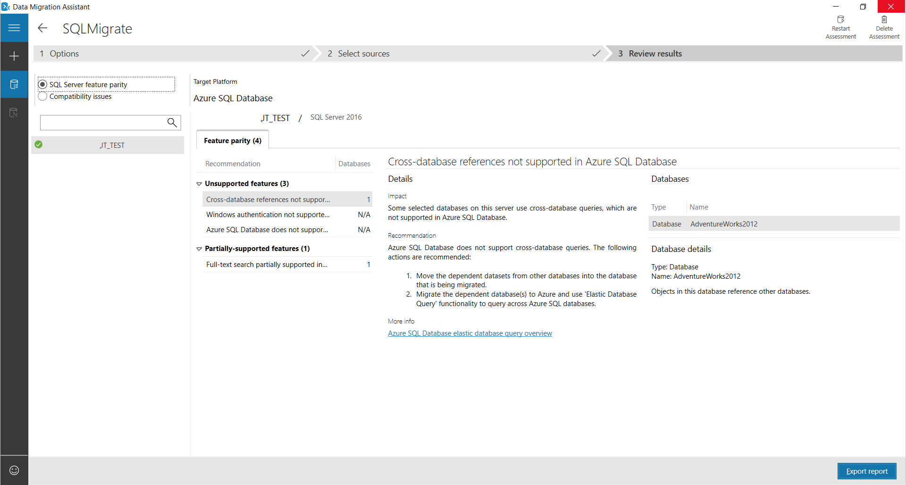

    For databases in Azure SQL Database, the assessments identify feature parity issues and migration blocking issues for deploying to  a single database or pooled database.

    - The **SQL Server feature parity** category provides a comprehensive set of recommendations, alternative approaches available in Azure, and mitigating steps to help you plan the effort into your migration projects.
    - The **Compatibility issues** category identifies partially supported or unsupported features that reflect compatibility issues that might block migrating SQL Server database(s) to Azure SQL Database. Recommendations are also provided to help you address those issues.

6. Review the assessment results for migration blocking issues and feature parity issues by selecting the specific options.

## Migrate the sample schema

After you're comfortable with the assessment and satisfied that the selected database is a viable candidate for migration to a single database or pooled database in Azure SQL Database, use DMA to migrate the schema to Azure SQL Database.

> [!NOTE]
> Before you create a migration project in Data Migration Assistant, be sure that you have already provisioned a database in Azure as mentioned in the prerequisites. 

> [!IMPORTANT]
> If you use SSIS, DMA does not currently support the migration of source SSISDB, but you can redeploy your SSIS projects/packages to the destination SSISDB hosted by Azure SQL Database. For more information about migrating SSIS packages, see the article [Migrate SQL Server Integration Services packages to Azure](./how-to-migrate-ssis-packages.md).

To migrate the **AdventureWorks2016** schema to a single database or pooled database Azure SQL Database, perform the following steps:

1. In the Data Migration Assistant, select the New (+) icon, and then under **Project type**, select **Migration**.
2. Specify a project name, in the **Source server type** text box, select **SQL Server**, and then in the **Target server type** text box, select **Azure SQL Database**.
3. Under **Migration Scope**, select **Schema only**.

    After performing the previous steps, the Data Migration Assistant interface should appear as shown in the following graphic:

    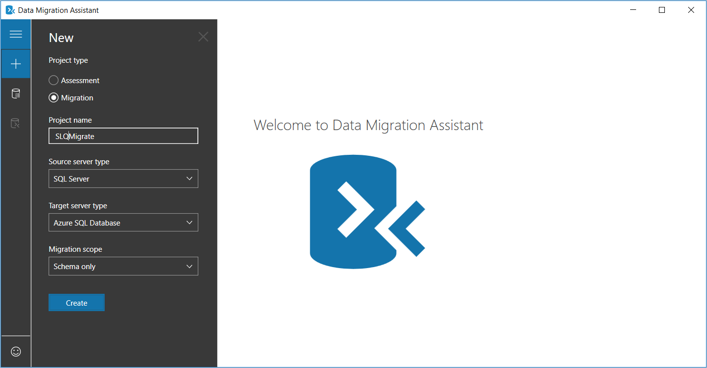

4. Select **Create** to create the project.
5. In the Data Migration Assistant, specify the source connection details for your SQL Server, select **Connect**, and then select the **AdventureWorks2016** database.

    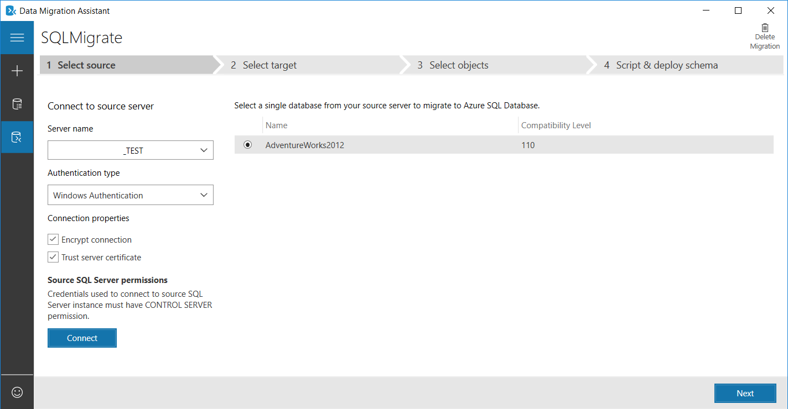

6. Select **Next**, under **Connect to target server**, specify the target connection details for the Azure SQL Database, select **Connect**, and then select the **AdventureWorksAzure** database you had pre-provisioned in Azure SQL Database.

    

7. Select **Next** to advance to the **Select objects** screen, on which you can specify the schema objects in the **AdventureWorks2016** database that need to be deployed to Azure SQL Database.

    By default, all objects are selected.

    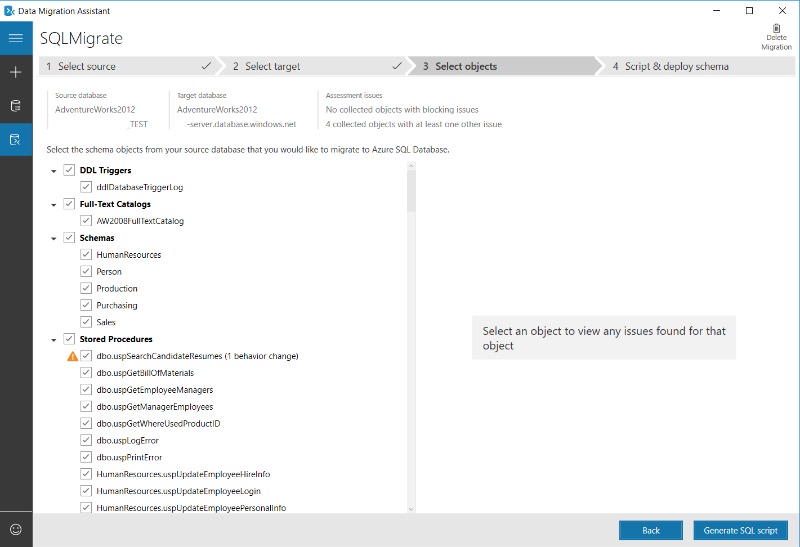

8. Select **Generate SQL script** to create the SQL scripts, and then review the scripts for any errors.

    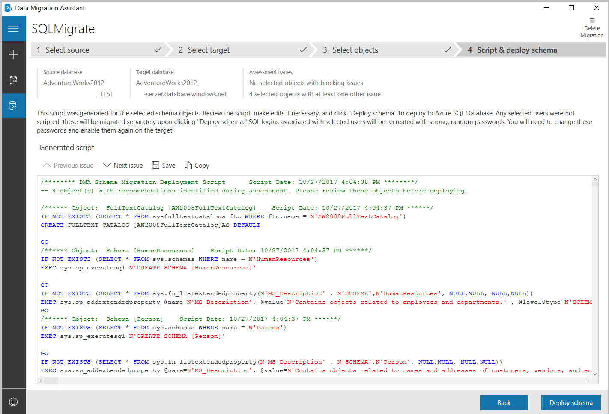

9. Select **Deploy schema** to deploy the schema to Azure SQL Database, and then after the schema is deployed, check the target server for any anomalies.

    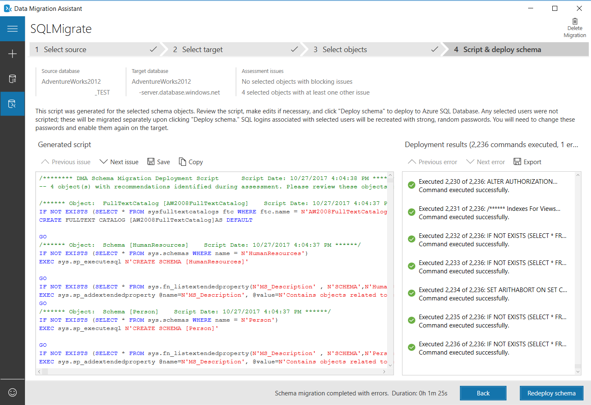

[!INCLUDE [resource-provider-register](../../includes/database-migration-service-resource-provider-register.md)]   

[!INCLUDE [instance-create](../../includes/database-migration-service-instance-create.md)]   

## Create a migration project

After the service is created, locate it within the Azure portal, open it, and then create a new migration project.

1. In the Azure portal menu, select **All services**. Search for and select **Azure Database Migration Services**.

     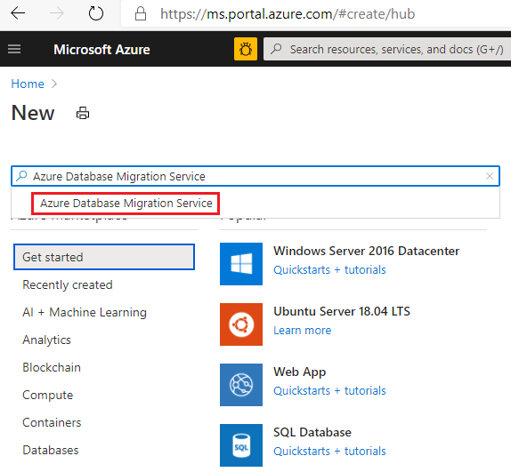

2. On the **Azure Database Migration Services** screen, select the Azure Database Migration Service instance that you created.

3. Select **New Migration Project**.

     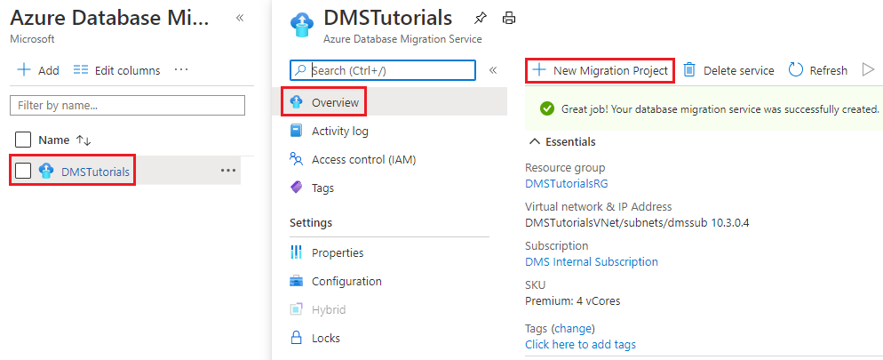

4. On the **New migration project** screen, specify a name for the project, in the **Source server type** text box, select **SQL Server**, in the **Target server type** text box, select **Azure SQL Database**, and then for **Choose Migration activity type**, select **Data migration**.

    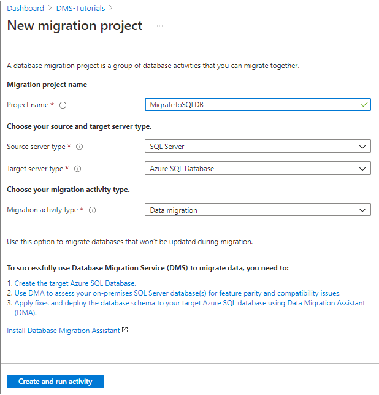

5. Select **Create and run activity** to create the project and run the migration activity.

## Specify source details

1. On the **Select source** screen, specify the connection details for the source SQL Server instance.

    Make sure to use a Fully Qualified Domain Name (FQDN) for the source SQL Server instance name. You can also use the IP Address for situations in which DNS name resolution isn't possible.

2. If you have not installed a trusted certificate on your source server, select the **Trust server certificate** check box.

    When a trusted certificate is not installed, SQL Server generates a self-signed certificate when the instance is started. This certificate is used to encrypt the credentials for client connections.

    > [!CAUTION]
    > TLS connections that are encrypted using a self-signed certificate do not provide strong security. They are susceptible to man-in-the-middle attacks. You should not rely on TLS using self-signed certificates in a production environment or on servers that are connected to the internet.

    > [!IMPORTANT]
    > If you use SSIS, DMS does not currently support the migration of source SSISDB, but you can redeploy your SSIS projects/packages to the destination SSISDB hosted by Azure SQL Database. For more information about migrating SSIS packages, see the article [Migrate SQL Server Integration Services packages to Azure](./how-to-migrate-ssis-packages.md).

   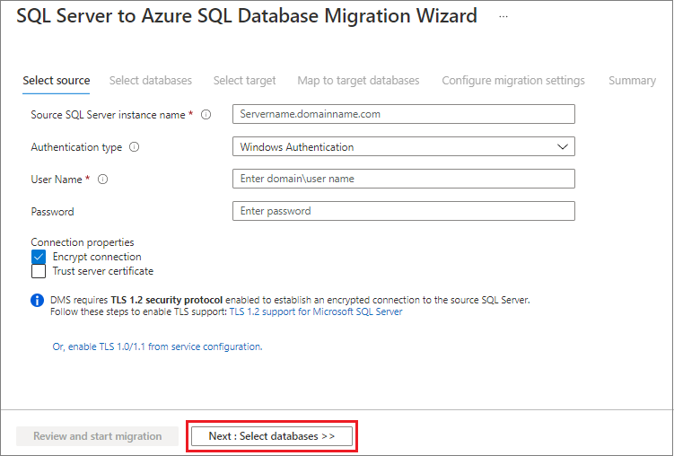
   
3. Select **Next: Select databases**.

## Select databases for migration

Select either all databases or specific databases that you want to migrate to Azure SQL Database. DMS provides you with the expected migration time for selected databases. If the migration downtimes are acceptable continue with the migration. If the migration downtimes are not acceptable, consider migrating to [SQL Managed Instance with near-zero downtime](tutorial-sql-server-managed-instance-online.md) or submit ideas/suggestions for improvement, and other feedback in the [Azure Community forum — Azure Database Migration Service](https://feedback.azure.com/d365community/forum/2dd7eb75-ef24-ec11-b6e6-000d3a4f0da0).

1. Choose the database(s) you want to migrate from the list of available databases. 
1. Review the expected downtime. If it's acceptable, select **Next: Select target >>**

   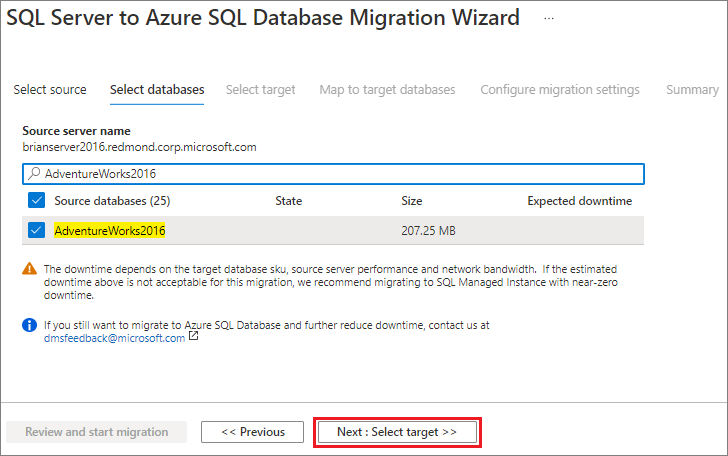


## Specify target details

1. On the **Select target** screen, provide authentication settings to your Azure SQL Database. 

   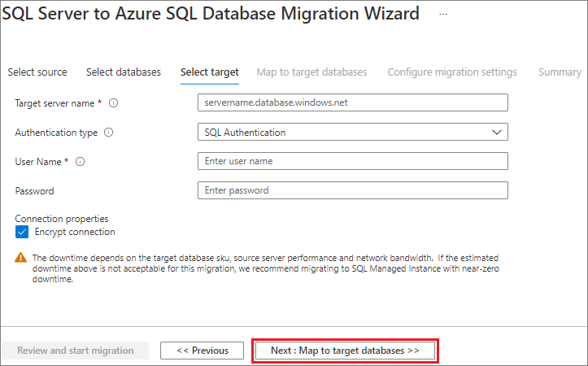
   
   > [!NOTE]
   > Currently, SQL authentication is the only supported authentication type.

1. Select **Next: Map to target databases** screen, map the source and the target database for migration.

    If the target database contains the same database name as the source database, Azure Database Migration Service selects the target database by default.

    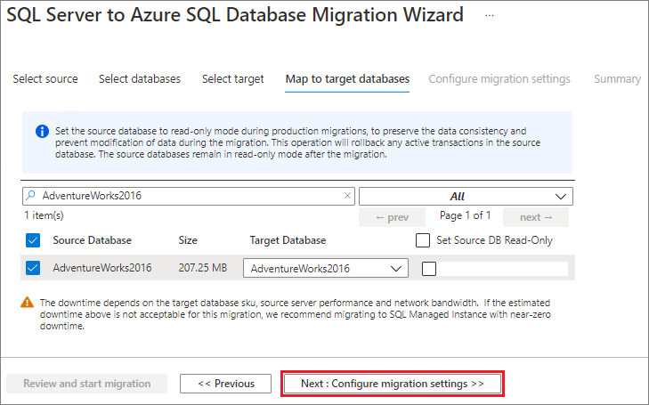

1. Select **Next: Configuration migration settings**, expand the table listing, and then review the list of affected fields.

    Azure Database Migration Service auto selects all the empty source tables that exist on the target Azure SQL Database instance. If you want to remigrate tables that already include data, you need to explicitly select the tables on this blade.

    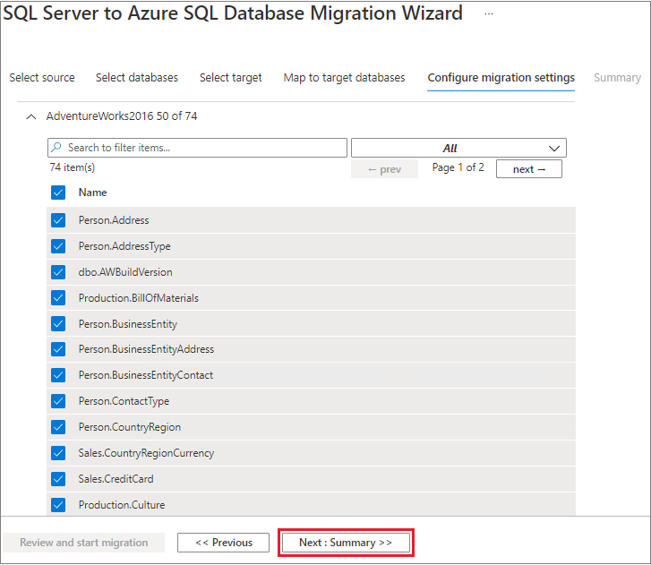

1. Select **Next: Summary**, review the migration configuration and in the **Activity name** text box, specify a name for the migration activity.

    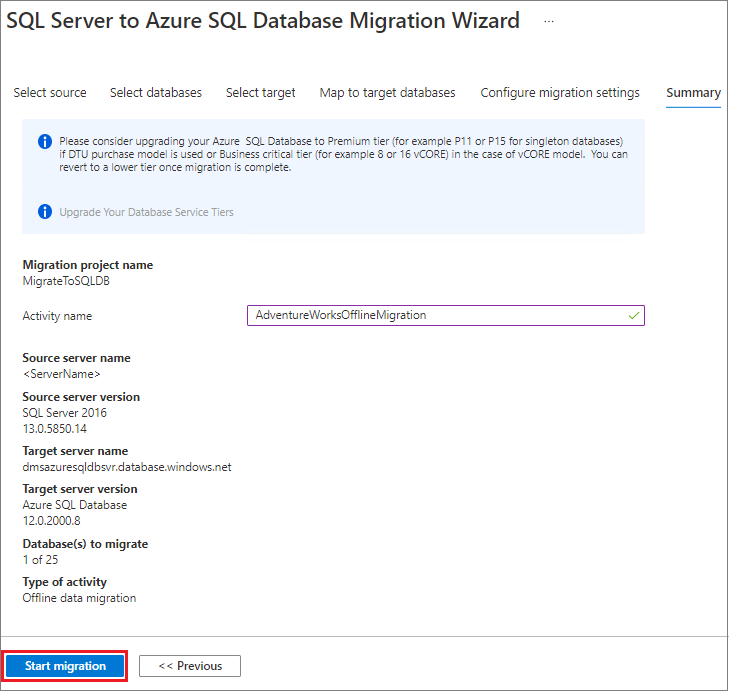

## Run the migration

- Select **Start migration**.

    The migration activity window appears, and the **Status** of the activity is **Pending**.

    

## Monitor the migration

1. On the migration activity screen, select **Refresh** to update the display until the **Status** of the migration shows as **Completed**.

    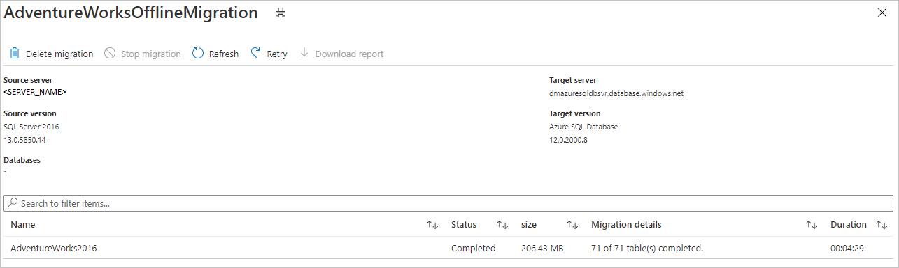

2. Verify the target database(s) on the target **Azure SQL Database**.

## Additional resources

- For information about Azure Database Migration Service, see the article [What is Azure Database Migration Service?](./dms-overview.md).
- For information about Azure SQL Database, see the article [What is the Azure SQL Database service?](/azure/azure-sql/database/sql-database-paas-overview).
