# Tutorial: Migrate SQL Server to an Azure SQL Managed Instance offline using DMS (classic)

[!INCLUDE [Azure Database Migration Service (classic) - SQL scenarios retirement announcement](../../includes/deprecation-announcement-dms-classic-sql.md)]

> [!NOTE]
> This tutorial uses an older version of the Azure Database Migration Service. For improved functionality and supportability, consider migrating to Azure SQL Managed Instance by using the [Azure SQL migration extension for Azure Data Studio](tutorial-sql-server-managed-instance-offline-ads.md). 
>
> To compare features between versions, review [compare versions](dms-overview.md#compare-versions).

You can use Azure Database Migration Service to migrate the databases from a SQL Server instance to an [Azure SQL Managed Instance](/azure/azure-sql/managed-instance/sql-managed-instance-paas-overview). For additional methods that may require some manual effort, see the article [SQL Server to Azure SQL Managed Instance](/azure/azure-sql/migration-guides/managed-instance/sql-server-to-managed-instance-guide).

In this tutorial, you migrate the [AdventureWorks2016](/sql/samples/adventureworks-install-configure#download-backup-files) database from an on-premises instance of SQL Server to a SQL Managed Instance by using Azure Database Migration Service.

You will learn how to:
> [!div class="checklist"]
>
> - Register the Azure DataMigration resource provider.
> - Create an instance of Azure Database Migration Service.
> - Create a migration project by using Azure Database Migration Service.
> - Run the migration.
> - Monitor the migration.

> [!IMPORTANT]
> For offline migrations from SQL Server to SQL Managed Instance, Azure Database Migration Service can create the backup files for you. Alternately, you can provide the latest full database backup in the SMB network share that the service will use to migrate your databases. Each backup can be written to either a separate backup file or multiple backup files. However, appending multiple backups into a single backup media is not supported. Note that you can use compressed backups as well, to reduce the likelihood of experiencing potential issues with migrating large backups.

[!INCLUDE [online-offline](../../includes/database-migration-service-offline-online.md)]

This article describes an offline migration from SQL Server to a SQL Managed Instance. For an online migration, see [Migrate SQL Server to an SQL Managed Instance online using DMS](tutorial-sql-server-managed-instance-online.md).

## Prerequisites

To complete this tutorial, you need to:

- Download and install [SQL Server 2016 or later](https://www.microsoft.com/sql-server/sql-server-downloads).
- Enable the TCP/IP protocol, which is disabled by default during SQL Server Express installation, by following the instructions in the article [Enable or Disable a Server Network Protocol](/sql/database-engine/configure-windows/enable-or-disable-a-server-network-protocol#SSMSProcedure).
- [Restore the AdventureWorks2016 database to the SQL Server instance.](/sql/samples/adventureworks-install-configure#restore-to-sql-server)
- Create a Microsoft Azure Virtual Network for Azure Database Migration Service by using the Azure Resource Manager deployment model, which provides site-to-site connectivity to your on-premises source servers by using either [ExpressRoute](../expressroute/expressroute-introduction.md) or [VPN](../vpn-gateway/vpn-gateway-about-vpngateways.md). [Learn network topologies for SQL Managed Instance migrations using Azure Database Migration Service](./resource-network-topologies.md). For more information about creating a virtual network, see the [Virtual Network Documentation](../virtual-network/index.yml), and especially the quickstart articles with step-by-step details.

    > [!NOTE]
    > During virtual network setup, if you use ExpressRoute with network peering to Microsoft, add the following service [endpoints](../virtual-network/virtual-network-service-endpoints-overview.md) to the subnet in which the service will be provisioned:
    > - Target database endpoint (for example, SQL endpoint, Azure Cosmos DB endpoint, and so on)
    > - Storage endpoint
    > - Service bus endpoint
    >
    > This configuration is necessary because Azure Database Migration Service lacks internet connectivity.

- Ensure that your virtual network Network Security Group rules don't block the outbound port 443 of ServiceTag for ServiceBus, Storage, and AzureMonitor. For more detail on virtual network NSG traffic filtering, see the article [Filter network traffic with network security groups](../virtual-network/virtual-network-vnet-plan-design-arm.md).
- Configure your [Windows Firewall for source database engine access](/sql/database-engine/configure-windows/configure-a-windows-firewall-for-database-engine-access).
- Open your Windows Firewall to allow Azure Database Migration Service to access the source SQL Server, which by default is TCP port 1433. If your default instance is listening on some other port, add that to the firewall.
- If you're running multiple named SQL Server instances using dynamic ports, you may wish to enable the SQL Browser Service and allow access to UDP port 1434 through your firewalls so that Azure Database Migration Service can connect to a named instance on your source server.
- If you're using a firewall appliance in front of your source databases, you may need to add firewall rules to allow Azure Database Migration Service to access the source database(s) for migration, as well as files via SMB port 445.
- Create a SQL Managed Instance by following the detail in the article [Create a SQL Managed Instance in the Azure portal](/azure/azure-sql/managed-instance/instance-create-quickstart).
- Ensure that the logins used to connect the source SQL Server and target SQL Managed Instance are members of the sysadmin server role.

    >[!NOTE]
    >By default, Azure Database Migration Service only supports migrating SQL logins. However, you can enable the ability to migrate Windows logins by:
    >
    >- Ensuring that the target SQL Managed Instance has AAD read access, which can be configured via the Azure portal by a user with the **Global Administrator** role.
    >- Configuring your Azure Database Migration Service instance to enable Windows user/group login migrations, which is set up via the Azure portal, on the Configuration page. After enabling this setting, restart the service for the changes to take effect.
    >
    > After restarting the service, Windows user/group logins appear in the list of logins available for migration. For any Windows user/group logins you migrate, you are prompted to provide the associated domain name. Service user accounts (account with domain name NT AUTHORITY) and virtual user accounts (account name with domain name NT SERVICE) are not supported.

- Create a network share that Azure Database Migration Service can use to back up the source database.
- Ensure that the service account running the source SQL Server instance has write privileges on the network share that you created and that the computer account for the source server has read/write access to the same share.
- Make a note of a Windows user (and password) that has full control privilege on the network share that you previously created. Azure Database Migration Service impersonates the user credential to upload the backup files to Azure Storage container for restore operation.
- Create a blob container and retrieve its SAS URI by using the steps in the article [Manage Azure Blob Storage resources with Storage Explorer](../vs-azure-tools-storage-explorer-blobs.md#get-the-sas-for-a-blob-container), be sure to select all permissions (Read, Write, Delete, List) on the policy window while creating the SAS URI. This detail provides Azure Database Migration Service with access to your storage account container for uploading the backup files used for migrating databases to SQL Managed Instance.

    > [!NOTE]
    > - Azure Database Migration Service does not support using an account level SAS token when configuring the Storage Account settings during the [Configure Migration Settings](#configure-migration-settings) step.
 
- Ensure both the Azure Database Migration Service IP address and the Azure SQL Managed Instance subnet can communicate with the blob container.

[!INCLUDE [resource-provider-register](../../includes/database-migration-service-resource-provider-register.md)]

[!INCLUDE [instance-create](../../includes/database-migration-service-instance-create.md)]   
    
> [!NOTE] 
> For additional detail, see the article [Network topologies for Azure SQL Managed Instance migrations using Azure Database Migration Service](./resource-network-topologies.md).

## Create a migration project

After an instance of the service is created, locate it within the Azure portal, open it, and then create a new migration project.

1. In the Azure portal menu, select **All services**. Search for and select **Azure Database Migration Services**.

    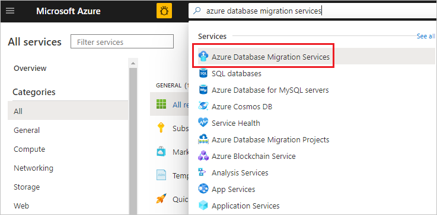

2. On the **Azure Database Migration Services** screen, select the Azure Database Migration Service instance that you created.

3. Select **New Migration Project**.

     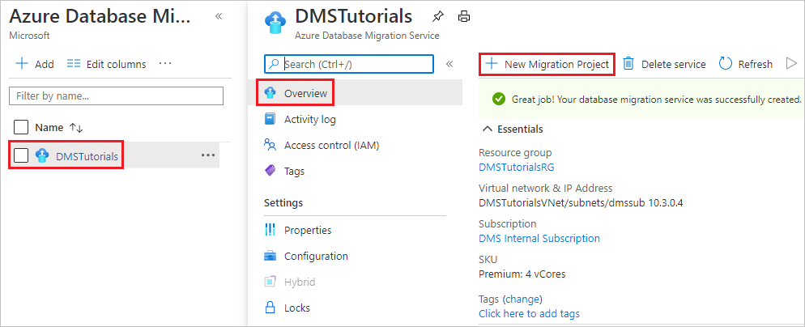

4. On the **New migration project** screen, specify a name for the project, in the **Source server type** text box, select **SQL Server**, in the **Target server type** text box, select **Azure SQL Database Managed Instance**, and then for **Choose type of activity**, select **Offline data migration**.

   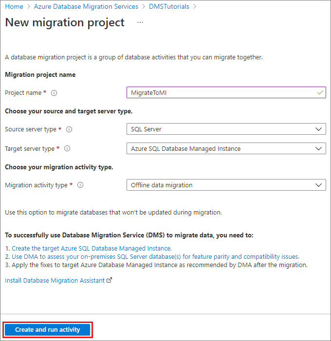

5. Select **Create and run activity** to create the project and run the migration activity.

## Specify source details

1. On the **Select source** screen, specify the connection details for the source SQL Server instance.

    Make sure to use a Fully Qualified Domain Name (FQDN) for the source SQL Server instance name. You can also use the IP Address for situations in which DNS name resolution isn't possible.

2. If you haven't installed a trusted certificate on your server, select the **Trust server certificate** check box.

    When a trusted certificate isn't installed, SQL Server generates a self-signed certificate when the instance is started. This certificate is used to encrypt the credentials for client connections.

    > [!CAUTION]
    > TLS connections that are encrypted using a self-signed certificate does not provide strong security. They are susceptible to man-in-the-middle attacks. You should not rely on TLS using self-signed certificates in a production environment or on servers that are connected to the internet.

   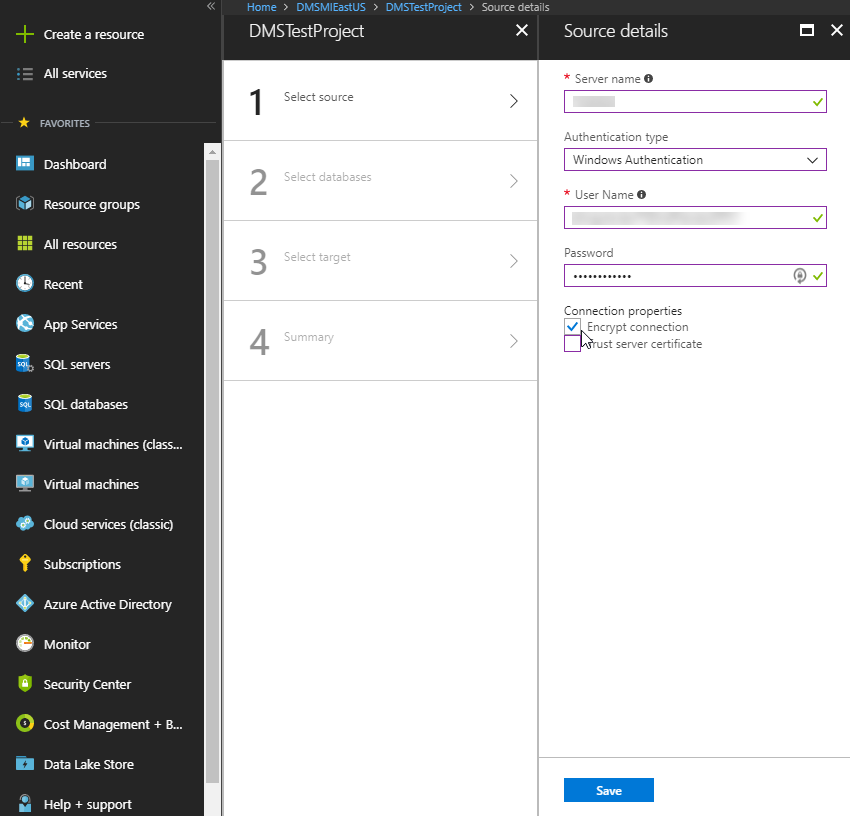

3. Select **Next: Select target**

## Specify target details

1. On the **Select target** screen, specify the connection details for the target, which is the pre-provisioned SQL Managed Instance to which you're migrating the **AdventureWorks2016** database.

    If you haven't already provisioned the SQL Managed Instance, select the [link](/azure/azure-sql/managed-instance/instance-create-quickstart) to help you provision the instance. You can still continue with project creation and then, when the SQL Managed Instance is ready, return to this specific project to execute the migration.

    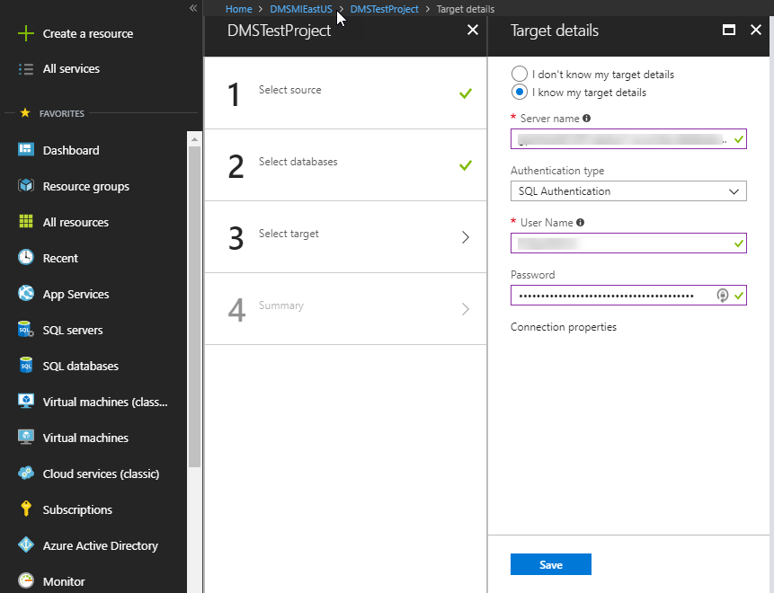

2. Select **Next: Select databases**. On the **Select databases** screen, select the **AdventureWorks2016** database for migration.

   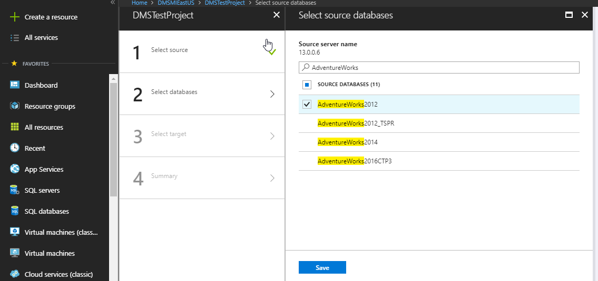

    > [!IMPORTANT]
    > If you use SQL Server Integration Services (SSIS), DMS does not currently support migrating the catalog database for your SSIS projects/packages (SSISDB) from SQL Server to SQL Managed Instance. However, you can provision SSIS in Azure Data Factory (ADF) and redeploy your SSIS projects/packages to the destination SSISDB hosted by SQL Managed Instance. For more information about migrating SSIS packages, see the article [Migrate SQL Server Integration Services packages to Azure](./how-to-migrate-ssis-packages.md).

3. Select **Next: Select logins**

## Select logins

1. On the **Select logins** screen, select the logins that you want to migrate.

    >[!NOTE]
    >By default, Azure Database Migration Service only supports migrating SQL logins. To enable support for migrating Windows logins, see the **Prerequisites** section of this tutorial.

    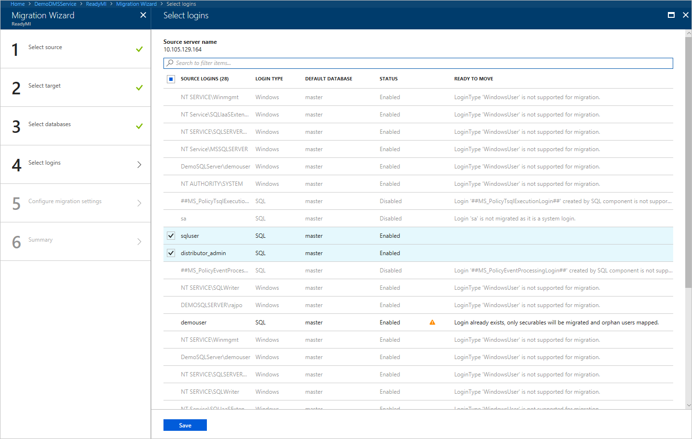

2. Select **Next: Configure migration settings**.

## Configure migration settings

1. On the **Configure migration settings** screen, provide the following details:

    | Parameter | Description |
    |--------|---------|
    |**Choose source backup option** | Choose the option **I will provide latest backup files** when you already have full backup files available for DMS to use for database migration. Choose the option **I will let Azure Database Migration Service create backup files** when you want DMS to take the source database full backup at first and use it for migration. |
    |**Network location share** | The local SMB network share that Azure Database Migration Service can take the source database backups to. The service account running source SQL Server instance must have write privileges on this network share. Provide an FQDN or IP addresses of the server in the network share, for example, '\\\servername.domainname.com\backupfolder' or '\\\IP address\backupfolder'.|
    |**User name** | Make sure that the Windows user has full control privilege on the network share that you provided above. Azure Database Migration Service will impersonate the user credential to upload the backup files to Azure Storage container for restore operation. If TDE-enabled databases are selected for migration, the above windows user must be the built-in administrator account and [User Account Control](/windows/security/identity-protection/user-account-control/user-account-control-overview) must be disabled for Azure Database Migration Service to upload and delete the certificates files.) |
    |**Password** | Password for the user. |
    |**Storage account settings** | The SAS URI that provides Azure Database Migration Service with access to your storage account container to which the service uploads the backup files and that is used for migrating databases to SQL Managed Instance. [Learn how to get the SAS URI for blob container](../vs-azure-tools-storage-explorer-blobs.md#get-the-sas-for-a-blob-container). This SAS URI must be for the blob container, not for the storage account.|
    |**TDE Settings** | If you're migrating the source databases with Transparent Data Encryption (TDE) enabled, you need to have write privileges on the target SQL Managed Instance.  Select the subscription in which the SQL Managed Instance provisioned from the drop-down menu.  Select the target **Azure SQL Database Managed Instance** in the drop-down menu. |

    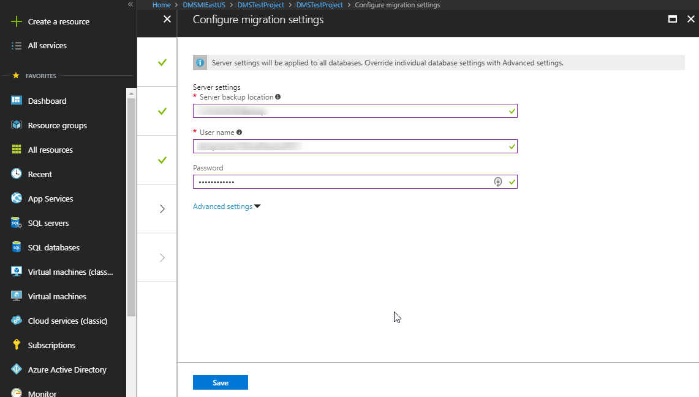

2. Select **Next: Summary**.

## Review the migration summary

1. On the **Summary** screen, in the **Activity name** text box, specify a name for the migration activity.

2. Review and verify the details associated with the migration project.

    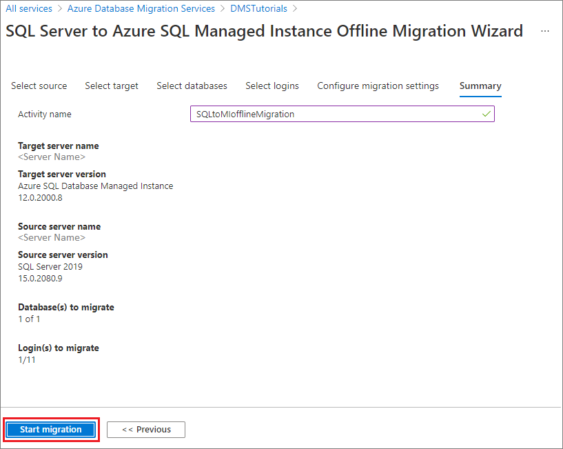

## Run the migration

- Select **Start migration**.

  The migration activity window appears that displays the current migration status of the databases and logins.

## Monitor the migration

1. In the migration activity screen, select **Refresh** to update the display.

   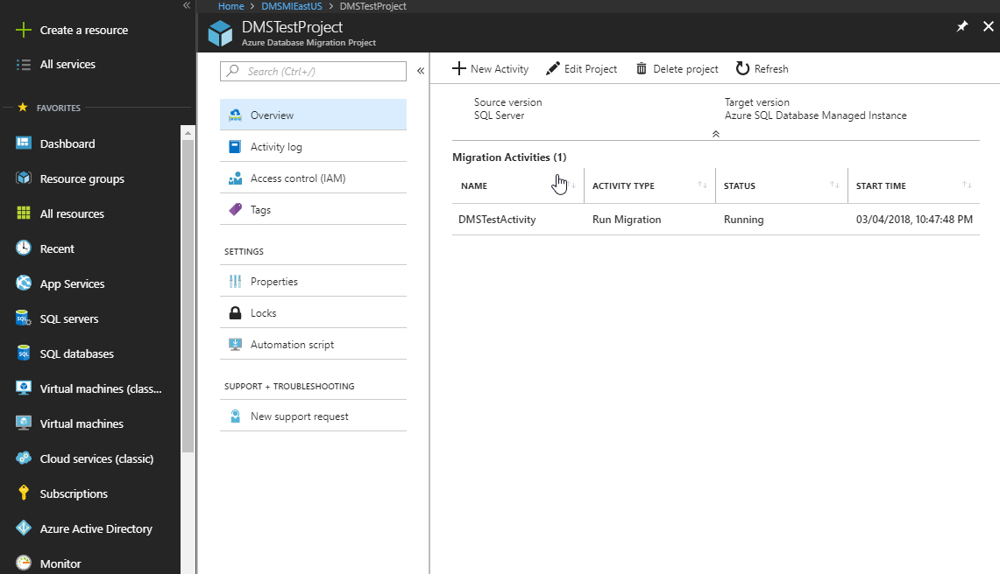

2. You can further expand the databases and logins categories to monitor the migration status of the respective server objects.

   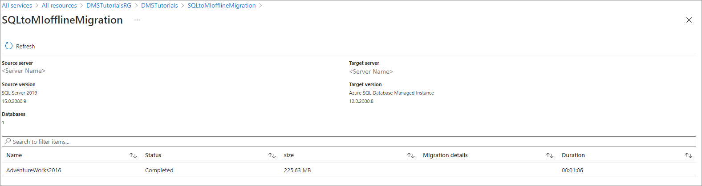

3. After the migration completes, verify the target database on the SQL Managed Instance environment.

## Additional resources

- For a tutorial showing you how to migrate a database to SQL Managed Instance using the T-SQL RESTORE command, see [Restore a backup to SQL Managed Instance using the restore command](/azure/azure-sql/managed-instance/restore-sample-database-quickstart).
- For information about SQL Managed Instance, see [What is SQL Managed Instance](/azure/azure-sql/managed-instance/sql-managed-instance-paas-overview).
- For information about connecting apps to SQL Managed Instance, see [Connect applications](/azure/azure-sql/managed-instance/connect-application-instance).
