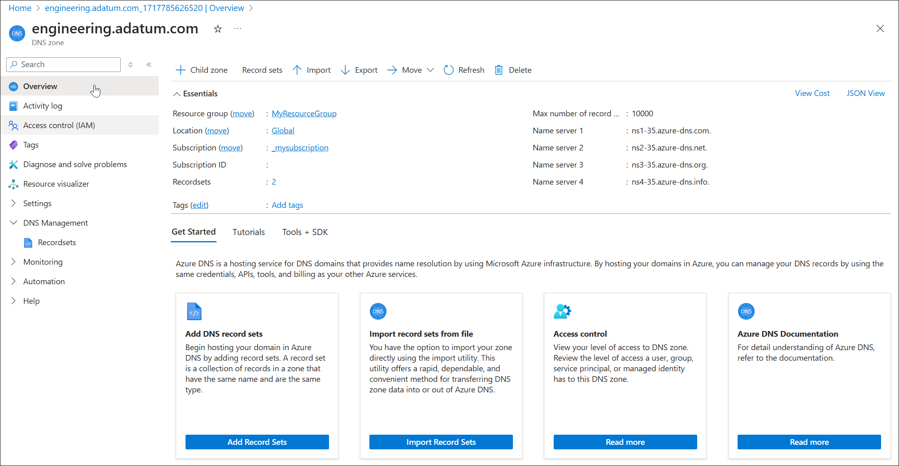
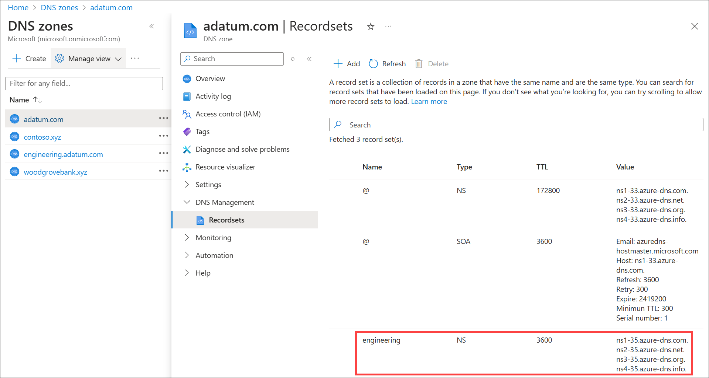

# Delegate an Azure DNS subdomain

You can use the Azure portal to delegate a DNS subdomain. For example, if you own the *adatum.com* domain, you can delegate a subdomain called *engineering.adatum.com* to another separate zone that you can administer separately from the adatum.com zone.

You can also delegate a subdomain using [Azure PowerShell](delegate-subdomain-ps.md).

## Prerequisites

To delegate an Azure DNS subdomain, the parent public domain must first be delegated to Azure DNS. See [Delegate a domain to Azure DNS](./dns-delegate-domain-azure-dns.md) for instructions on how to configure your name servers for delegation. Once your domain is delegated to Azure DNS, you can delegate a subdomain.

> [!NOTE]
> The `adatum.com` zone is used as an example of a parent DNS zone and `engineering.adatum.com` is used for the subdomain. Substitute your own domain names for these domains.

## Delegate a subdomain

The **engineering.adatum.com** subdomain can already exist. If it doesn't exist, it is created.

To delegate the **engineering** subdomain under **adatum.com**:

1. From the Azure portal, search for **DNS zones** and select the **adatum.com** parent zone.
2. Select **+ Child zone** and enter **engineering** next to **Name**. The **Create DNS zone** window opens.

   

3. If desired, change the **Subscription** and **Resource group**. In this example, we use the same subscription and resource group as the parent zone.
4. Select **Review create**, and then select **Create**.
5. When deployment is complete, select **Go to resource** to view the new delegated zone: **engineering.adatum.com**.

   

6. Select the parent **adatum.com** zone again and notice that an **NS** record has been added with the name **engineering** and contents the same as NS records in the child zone. You might need to refresh the page. These are the Azure DNS nameservers that are authoritative for the subdomain (child zone).

   

## Manual entry of NS records (optional)

If desired, you can also create your subdomain and add the subdomain NS record manually.

To create a new subdomain zone, use **Create a resource > DNS zone** and create a zone named **engineering.adatum.com**.

To create a subdomain delegation manually, add a new NS record set (**+ Record set** option) to the parent zone **adatum.com** with the name: **engineering** and specify each of the nameserver entries that are listed in the subdomain (child) zone.

 

This method doesn't use the **+ Child zone** option, but both methods result in the same delegation.

## Create a test record

Next, create an **A** record in the **engineering.adatum.com** zone to use for testing. For example, create a **www** A record and configure it with a **10.10.10.10** IP address.

## Test the delegation

Use nslookup to test the delegation.

1. Open a command prompt.
2. At command prompt, type `nslookup www.engineering.adatum.com.`
3. You should receive a non-authoritative answer showing the address **10.10.10.10**.

## Next steps

Learn how to [configure reverse DNS for services hosted in Azure](dns-reverse-dns-for-azure-services.md).
