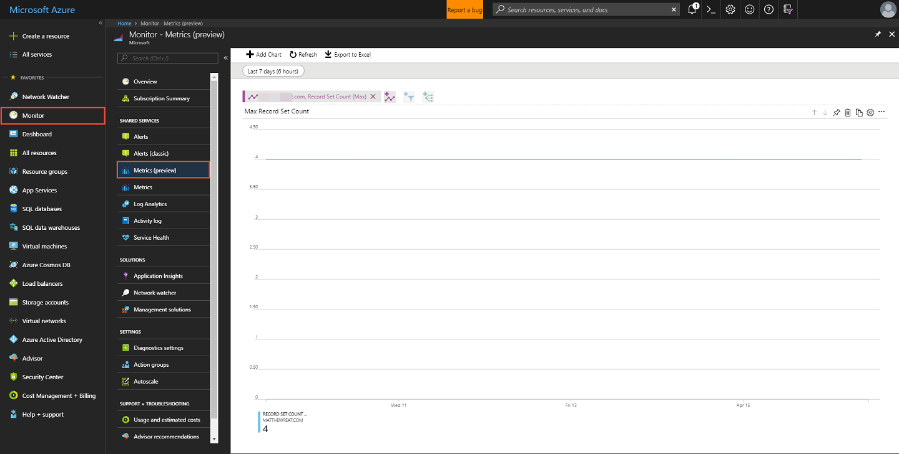

# Azure DNS metrics and alerts

Azure DNS is a hosting service for DNS domains that provides name resolution using the Microsoft Azure infrastructure. This article describes metrics and alerts for the Azure DNS service.

## Azure DNS metrics

Azure DNS provides metrics for you to monitor specific aspects of your DNS zones. With the metrics in Azure DNS, you can configure alerting based on conditions that are met. The metrics provided use the [Azure Monitor service](../azure-monitor/index.yml) to display the data. For more information on the Metrics Explorer experience and charting, see [Azure Monitor Metrics Explorer](../azure-monitor/essentials/metrics-charts.md). 
 
Azure DNS provides the following metrics to Azure Monitor for your DNS zones:

-	QueryVolume
-	RecordSetCount
-	RecordSetCapacityUtilization

For more information, see [metrics definition](../azure-monitor/essentials/metrics-supported.md#microsoftnetworkdnszones).

> [!NOTE]
> At this time, these metrics are only available for Public DNS zones hosted in Azure DNS. If you have Private Zones hosted in Azure DNS, these metrics won't provide data for those zones. In addition, the metrics and alerting feature is only supported in Azure Public cloud. Support for sovereign clouds will follow at a later time. 

The most granular element that you can see metrics for is a DNS zone. You currently can't see metrics for individual resource records within a zone.

### Query volume

The *Query Volume* metric shows the number of DNS queries received by Azure DNS for your DNS zone. The unit of measurement is `Count` and the aggregation is the `Sum` of all the queries received over a period of time.

To view this metric, select **Metrics** explorer experience from the **Monitor** page in the Azure portal. Scope down to your DNS zone and then select **Apply**. In the drop-down for *Metrics*, select`Query Volume`, and then select `Sum` from the drop-down for *Aggregation*.

*Figure: Azure DNS Query Volume metrics*

### Record Set Count

The *Record Set Count* metric shows the number of Record sets in Azure DNS for your DNS zone. All the Record sets defined in your zone are counted. The unit of measurement is `Count` and the aggregation is the `Maximum` of all the Record sets.

To view this metric, select **Metrics** explorer experience from the **Monitor** tab in the Azure portal. Scope down to your DNS zone and then select **Apply**. In the drop-down for *Metrics*, select `Query Volume`, and then select `Sum` from the drop-down for *Aggregation*.

Select your DNS zone from the **Resource** drop-down, select the **Record Set Count** metric, and then select **Max** as the **Aggregation**. 

*Figure: Azure DNS Record Set Count metrics*

### Record Set Capacity Utilization

The *Record Set Capacity Utilization* metric shows the percentage used of your Record set capacity for a DNS Zone. Each Azure DNS zone has a Recordset limit that defines the maximum number of Record sets allowed for the zone. For more information, see [DNS limits](dns-zones-records.md#limits) section. The unit of measurement is a `Percentage` and the aggregation type is `Maximum`.

For example, if you have 500 Record sets configured in your DNS zone, and the zone has the default Record set limit of 5000. The RecordSetCapacityUtilization metric will show the value of 10%, which is obtained by dividing 500 by 5000. 

To view this metric, select **Metrics** explorer experience from the **Monitor** tab in the Azure portal. Scope down to your DNS zone and then select **Apply**. In the drop-down for *Metrics*, select `Record Set Capacity Utilization`, and then select `Sum` from the drop-down for *Aggregation*. 

*Figure: Azure DNS Record Set Capacity Utilization metrics*

## Alerts in Azure DNS

Azure Monitor has alerting that you can configure for each available metric value. For more information, see [Azure Monitor alerts](../azure-monitor/alerts/alerts-metric.md).

1. To configure alerting for Azure DNS zones, select **Alerts** from *Monitor* page in the Azure portal. Then select **+ New alert rule**.

    :::image type="content" source="./media/dns-alerts-metrics/alert-metrics.png" alt-text="Screenshot of Alert button on Monitor page.":::

1. Click the **Select resource** link in the Scope section to open the *Select a resource* page. Filter by **DNS zones** and then select the Azure DNS zone you want as the target resource. Select **Done** once you've chosen the zone.

    :::image type="content" source="./media/dns-alerts-metrics/select-resource.png" alt-text="Screenshot of select resource page in configuring alerts.":::

1. Next, click the **Add condition** link in the Conditions section to open the *Select a signal* page. Select one of the three *Metric* signal types you want to configure the alert for.

    :::image type="content" source="./media/dns-alerts-metrics/select-signal.png" alt-text="Screenshot of available metrics on the select a signal page.":::

1. On the *Configure signal logic* page, configure the threshold and frequency of evaluation for the metric selected.

    :::image type="content" source="./media/dns-alerts-metrics/configure-signal-logic.png" alt-text="Screenshot of configure signal logic page.":::

1. To send a notification or invoke an action triggered by the alert, click the **Add action groups**. On the *Add action groups* page, select **+ Create action group**. For more information, see [Action Group](../azure-monitor/alerts/action-groups.md).

1. Enter an *Alert rule name* then select **Create alert rule** to save your configuration.

    :::image type="content" source="./media/dns-alerts-metrics/create-alert-rule.png" alt-text="Screenshot of create alert rule page.":::

For more information on how to configure alerting for Azure Monitor metrics, see [Create, view, and manage alerts using Azure Monitor](../azure-monitor/alerts/alerts-metric.md). 

## Next steps

- Learn more about [Azure DNS](dns-overview.md).
