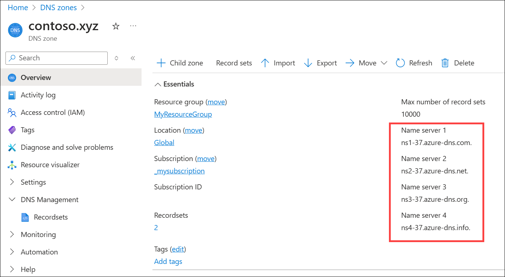

# Tutorial: Host your domain in Azure DNS

You can use Azure DNS to host your DNS domain and manage your DNS records. By hosting your domains in Azure, you can manage your DNS records using the same credentials, APIs, tools, and billing as your other Azure services.

Suppose you buy the domain `contoso.com` from a domain name registrar and then create a zone with the name `contoso.com` in Azure DNS. Since you're the owner of the domain, your registrar offers you the option to configure the name server (NS) records for your domain. The registrar stores the NS records in the `.com` parent zone. Internet users around the world are then directed to your domain in your Azure DNS zone when they try to resolve DNS records in `contoso.com`.

## Overview

To host your domain in Azure:

* Create the DNS zone.
* [Create resource records](dns-operations-recordsets-portal.md) in the DNS zone.
* Retrieve the list of Azure nameservers for your DNS zone.
* Delegate the domain to Azure's nameservers at your registrar.

For example:

:::image type="content" source="./media/dns-delegate-domain-azure-dns/public-dns.png" alt-text="A simple diagram of a DNS zone hosted in Azure that is delegated at the registrar." lightbox="./media/dns-delegate-domain-azure-dns/public-dns.png":::

In this tutorial, you learn how to:

> [!div class="checklist"]
> * Create a DNS zone.
> * Retrieve a list of name servers.
> * Delegate the domain.
> * Verify the delegation is working.

If you don’t have an Azure subscription, create a [free account](https://azure.microsoft.com/free/?WT.mc_id=A261C142F) before you begin.

## Prerequisites

* An Azure account with an active subscription.
* A domain name that you can host in Azure DNS. You must have full control of this domain. Full control includes the ability to set the name server (NS) records for the domain.

> [!NOTE]
> In this tutorial, `contoso.xyz` is used as an example domain name. Replace `contoso.xyz` with your own domain name.

## Sign in to Azure

Sign in to the [Azure portal](https://portal.azure.com).

## Create a DNS zone

1. In the Azure portal, enter *dns zone* in the search box at the top of the portal, and then select **DNS zones** from the search results.
2. In **DNS zones**, select **+ Create**.
3. In the **Create DNS zone** page, enter or select the following information in the **Basics** tab:

    | Setting | Value |
    | ------- | ----- |
    | **Project details**  |       |
    | Subscription | Select your Azure subscription.|
    | Resource group | Choose an existing resource group or select **Create new** and enter a name for the new resource group. For example: **myResourceGroup**. |
    | **Instance details** |       |
    | This zone is a child of an existing zone already hosted in Azure DNS | Clear this checkbox since the DNS zone isn't a [child zone](./tutorial-public-dns-zones-child.md). |
    | Name | Enter your DNS zone name. For example: **contoso.xyz**.|
    | Resource group location | If you created a new resource group, choose a location. </br> The resource group location doesn't affect your DNS zone service, which is global and not bound to a location. |

    :::image type="content" source="./media/dns-delegate-domain-azure-dns/create-parent-dns-zone.png" alt-text="Screenshot of the Create DNS zone page showing the settings used in this tutorial to create a parent DNS zone.":::

1. Select **Review + create**.    
1. Select **Create**.

   > [!NOTE] 
   > If the new zone that you are creating is a child zone see [Create a child DNS zone tutorial](./tutorial-public-dns-zones-child.md).

## Retrieve name servers

Before you can delegate your DNS zone to Azure DNS, you need to know the name servers for your zone. Azure DNS assigns name servers from a pool each time a zone is created.

1. In the Azure portal, enter **DNS zones** in the search box at the top of the portal and then select **DNS zones** from the search results.
2. In **DNS zones**, select the name of your zone. For example: **contoso.xyz**.
3. On the **Overview** page, retrieve the name servers. In this example, the DNS zone **contoso.xyz** has been assigned name servers `ns1-37.azure-dns.com`, `ns2-37.azure-dns.net`, `ns3-37.azure-dns.org`, and `ns4-37.azure-dns.info`:

[  ](./media/dns-delegate-domain-azure-dns/contoso.xyz.overview.png)

Azure DNS automatically creates authoritative NS records in your zone for the assigned name servers.

## Delegate the domain

After the DNS zone is created, you must update the parent domain with the Azure DNS name servers by registering the domain with a domain registrar. Each registrar has its own DNS management tools to assign the name server records for a domain. In the example used here, the parent domain is **xyz**.

1. In the registrar's DNS management page, create or edit the NS records to assign the Azure DNS name servers.
2. When you delegate a domain to Azure DNS, you must use the name servers that Azure DNS provides. Use all four name servers, regardless of the name of your domain. Domain delegation doesn't require a name server to use the same top-level domain as your domain.

> [!IMPORTANT]
> When you copy each name server address, make sure you copy the trailing period at the end of the address. The trailing period indicates the end of a fully qualified domain name. Some registrars append the period if the NS name doesn't have it at the end. To be compliant with the DNS RFC, include the trailing period.

Delegations that use name servers in your own zone, sometimes called *vanity name servers*, aren't currently supported in Azure DNS.

## Verify the delegation

After you complete the delegation, you can verify that it's working by using a tool such as *nslookup* to query the Start of Authority (SOA) record for your zone. The SOA record is automatically created when the zone is created. You may need to wait at least 10 minutes after you complete the delegation, before you can successfully verify that it's working. It can take a while for changes to propagate through the DNS system.

You don't have to specify the Azure DNS name servers. If the delegation is set up correctly, the normal DNS resolution process finds the name servers automatically.

1. From a command prompt, enter a nslookup command similar to the following example:

   ```
   nslookup -type=SOA contoso.xyz
   ```

1. Verify that your response looks similar to the following nslookup output:

   ```
   contoso.xyz
           primary name server = ns1-37.azure-dns.com
           responsible mail addr = azuredns-hostmaster.microsoft.com
           serial = 1
           refresh = 3600 (1 hour)
           retry = 300 (5 mins)
           expire = 604800 (7 days)
           default TTL = 300 (5 mins)
   ```

## Clean up resources

When no longer needed, you can delete all resources created in this tutorial by following these steps:

1. On the Azure portal menu, select **Resource groups**.

2. Select the **myResourceGroup** resource group.

3. Select **Delete resource group**.

4. Enter *myResourceGroup* and select **Delete**.

## Next steps

In this tutorial, you learned how to create a DNS zone for your domain and delegate it to Azure DNS. To learn how to create child DNS zones, continue with the next tutorial:

> [!div class="nextstepaction"]
> [Create a child DNS zone](./tutorial-public-dns-zones-child.md)
