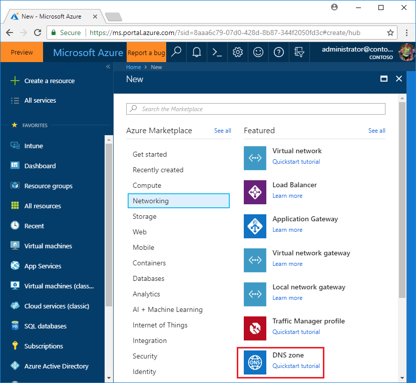
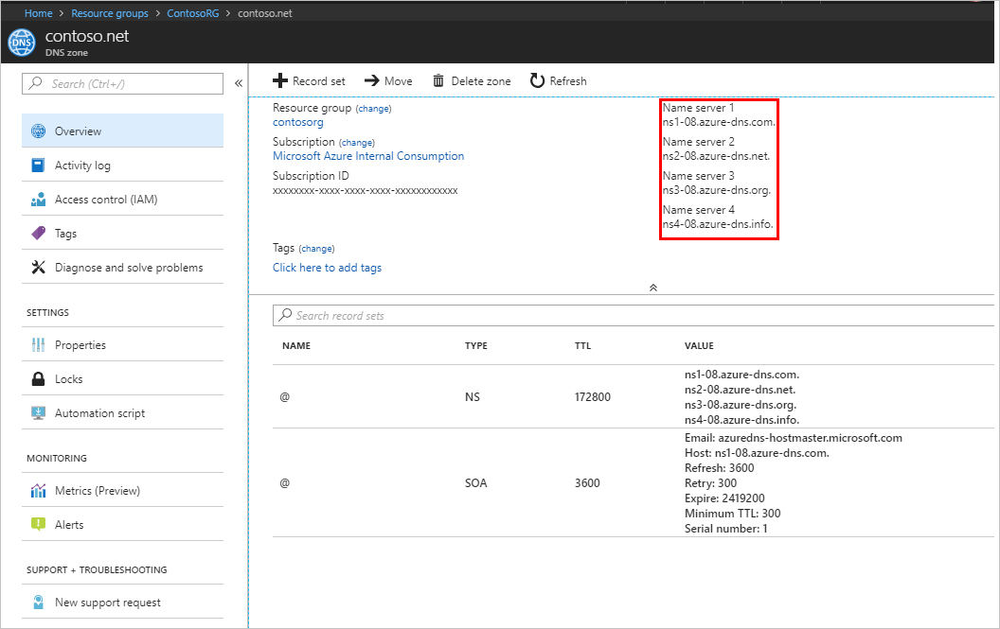

# Tutorial: Host your domain in Azure DNS

You can use Azure DNS to host your DNS domain and manage your DNS records. By hosting your domains in Azure, you can manage your DNS records by using the same credentials, APIs, tools, and billing as your other Azure services.

Suppose you buy the domain contoso.net from a domain name registrar and then create a zone with the name contoso.net in Azure DNS. Because you're the owner of the domain, your registrar offers you the option to configure the name server (NS) records for your domain. The registrar stores the NS records in the .net parent zone. Internet users around the world are then directed to your domain in your Azure DNS zone when they try to resolve DNS records in contoso.net.


In this tutorial, you learn how to:

> [!div class="checklist"]
> * Create a DNS zone.
> * Retrieve a list of name servers.
> * Delegate the domain.
> * Verify the delegation is working.


If you don’t have an Azure subscription, create a [free account](https://azure.microsoft.com/free/?WT.mc_id=A261C142F) before you begin.

## Prerequisites

You must have a domain name available to test with that you can host in Azure DNS . You must have full control of this domain. Full control includes the ability to set the name server (NS) records for the domain.

The example domain used for this tutorial is contoso.net, but use your own domain name.

## Create a DNS zone

1. Go to the [Azure portal](https://portal.azure.com/) to create a DNS zone. Search for and select **DNS zones**.

   

1. Select **Create DNS zone**.
1. On the **Create DNS zone** page, enter the following values, and then select **Create**:

   | **Setting** | **Value** | **Details** |
   |---|---|---|
   |**Name**|[your domain name] |The domain name you bought. This tutorial uses contoso.net as an example.|
   |**Subscription**|[Your subscription]|Select a subscription to create the zone in.|
   |**Resource group**|**Create new:** contosoRG|Create a resource group. The resource group name must be unique within the subscription that you selected.<br>The location of the resource group has no impact on the DNS zone. The DNS zone location is always "global," and isn't shown.|
   |**Location**|East US||

## Retrieve name servers

Before you can delegate your DNS zone to Azure DNS, you need to know the name servers for your zone. Azure DNS allocates name servers from a pool each time a zone is created.

1. With the DNS zone created, in the Azure portal **Favorites** pane, select **All resources**. On the **All resources** page, select your DNS zone. If the subscription that you selected already has several resources in it, you can enter your domain name in the **Filter by name** box to easily access the application gateway. 

1. Retrieve the name servers from the DNS zone page. In this example, the zone contoso.net has been assigned name servers *ns1-01.azure-dns.com*, *ns2-01.azure-dns.net*, *ns3-01.azure-dns.org*, and *ns4-01.azure-dns.info*:

   

Azure DNS automatically creates authoritative NS records in your zone for the assigned name servers.

## Delegate the domain

Now that the DNS zone is created and you have the name servers, you need to update the parent domain with the Azure DNS name servers. Each registrar has its own DNS management tools to change the name server records for a domain. 

1. In the registrar's DNS management page, edit the NS records and replace the NS records with the Azure DNS name servers.

1. When you delegate a domain to Azure DNS, you must use the name servers that Azure DNS provides. Use all four name servers, regardless of the name of your domain. Domain delegation doesn't require a name server to use the same top-level domain as your domain.

> [!NOTE]
> When you copy each name server address, make sure you copy the trailing period at the end of the address. The trailing period indicates the end of a fully qualified domain name. Some registrars append the period if the NS name doesn't have it at the end. To be compliant with the DNS RFC, include the trailing period.

Delegations that use name servers in your own zone, sometimes called *vanity name servers*, aren't currently supported in Azure DNS.

## Verify the delegation

After you complete the delegation, you can verify that it's working by using a tool such as *nslookup* to query the Start of Authority (SOA) record for your zone. The SOA record is automatically created when the zone is created. You might need to wait 10 minutes or more after you complete the delegation, before you can successfully verify that it's working. It can take a while for changes to propagate through the DNS system.

You don't have to specify the Azure DNS name servers. If the delegation is set up correctly, the normal DNS resolution process finds the name servers automatically.

1. From a command prompt, enter an nslookup command similar to the following example:

   ```
   nslookup -type=SOA contoso.net
   ```

1. Verify that your response looks similar to the following nslookup output:

   ```
   Server: ns1-04.azure-dns.com
   Address: 208.76.47.4

   contoso.net
   primary name server = ns1-04.azure-dns.com
   responsible mail addr = msnhst.microsoft.com
   serial = 1
   refresh = 900 (15 mins)
   retry = 300 (5 mins)
   expire = 604800 (7 days)
   default TTL = 300 (5 mins)
   ```

## Clean up resources

You can keep the **contosoRG** resource group if you intend to do the next tutorial. Otherwise, delete the **contosoRG** resource group to delete the resources created in this tutorial.

- Select the **contosoRG** resource group, and then select **Delete resource group**. 

## Next steps

In this tutorial, you created a DNS zone for your domain and delegated it to Azure DNS. To learn about Azure DNS and web apps, continue with the tutorial for web apps.

> [!div class="nextstepaction"]
> [Create DNS records for a web app in a custom domain](./dns-web-sites-custom-domain.md)