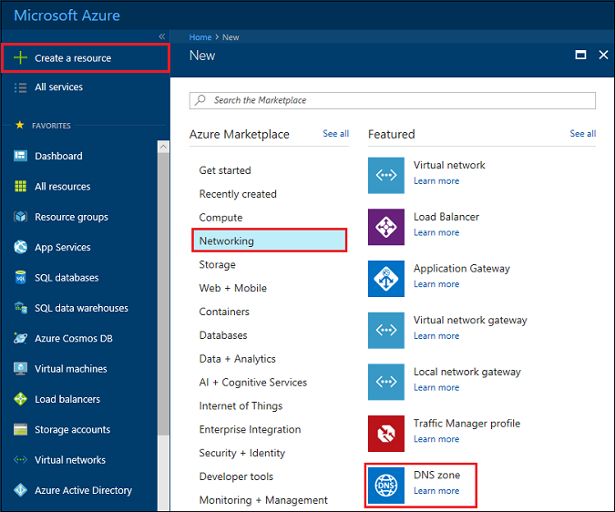

# Delegate a domain to Azure DNS

Azure DNS allows you to host a DNS zone and manage the DNS records for a domain in Azure. In order for DNS queries for a domain to reach Azure DNS, the domain has to be delegated to Azure DNS from the parent domain. Keep in mind Azure DNS is not the domain registrar. This article explains how to delegate your domain to Azure DNS.

For domains purchased from a registrar, your registrar offers the option to set up these NS records. You do not have to own a domain to create a DNS zone with that domain name in Azure DNS. However, you do need to own the domain to set up the delegation to Azure DNS with the registrar.

For example, suppose you purchase the domain 'contoso.net' and create a zone with the name 'contoso.net' in Azure DNS. As the owner of the domain, your registrar offers you the option to configure the name server addresses (that is, the NS records) for your domain. The registrar stores these NS records in the parent domain, in this case '.net'. Clients around the world can then be directed to your domain in Azure DNS zone when trying to resolve DNS records in 'contoso.net'.

## Create a DNS zone

1. Sign in to the Azure portal
1. On the Hub menu, click and click **New > Networking >** and then click **DNS zone** to open the Create DNS zone blade.

    

1. On the **Create DNS zone** blade enter the following values, then click **Create**:

   | **Setting** | **Value** | **Details** |
   |---|---|---|
   |**Name**|contoso.net|The name of the DNS zone|
   |**Subscription**|[Your subscription]|Select a subscription to create the application gateway in.|
   |**Resource group**|**Create new:** contosoRG|Create a resource group. The resource group name must be unique within the subscription you selected. To learn more about resource groups, read the [Resource Manager](../azure-resource-manager/resource-group-overview.md?toc=%2fazure%2fdns%2ftoc.json#resource-groups) overview article.|
   |**Location**|West US||

> [!NOTE]
> The resource group refers to the location of the resource group, and has no impact on the DNS zone. The DNS zone location is always "global", and is not shown.

## Retrieve name servers

Before you can delegate your DNS zone to Azure DNS, you first need to know the name server names for your zone. Azure DNS allocates name servers from a pool each time a zone is created.

1. With the DNS zone created, in the Azure portal **Favorites** pane, click **All resources**. Click the **contoso.net** DNS zone in the **All resources** blade. If the subscription you selected already has several resources in it, you can enter **contoso.net** in the Filter by name… box to easily access the application gateway. 

1. Retrieve the name servers from the DNS zone blade. In this example, the zone 'contoso.net' has been assigned name servers 'ns1-01.azure-dns.com', 'ns2-01.azure-dns.net', 'ns3-01.azure-dns.org', and 'ns4-01.azure-dns.info':

 

Azure DNS automatically creates authoritative NS records in your zone containing the assigned name servers.  To see the name server names via Azure PowerShell or Azure CLI, you simply need to retrieve these records.

The following examples also provide the steps to retrieve the name servers for a zone in Azure DNS with PowerShell and Azure CLI.

### PowerShell

```powershell
# The record name "@" is used to refer to records at the top of the zone.
$zone = Get-AzureRmDnsZone -Name contoso.net -ResourceGroupName contosoRG
Get-AzureRmDnsRecordSet -Name "@" -RecordType NS -Zone $zone
```

The following example is the response.

```
Name              : @
ZoneName          : contoso.net
ResourceGroupName : contosorg
Ttl               : 172800
Etag              : 03bff8f1-9c60-4a9b-ad9d-ac97366ee4d5
RecordType        : NS
Records           : {ns1-07.azure-dns.com., ns2-07.azure-dns.net., ns3-07.azure-dns.org.,
                    ns4-07.azure-dns.info.}
Metadata          :
```

### Azure CLI

```azurecli
az network dns record-set show --resource-group contosoRG --zone-name contoso.net --type NS --name @
```

The following example is the response.

```json
{
  "etag": "03bff8f1-9c60-4a9b-ad9d-ac97366ee4d5",
  "id": "/subscriptions/00000000-0000-0000-0000-000000000000/resourceGroups/contosoRG/providers/Microsoft.Network/dnszones/contoso.net/NS/@",
  "metadata": null,
  "name": "@",
  "nsRecords": [
    {
      "nsdname": "ns1-07.azure-dns.com."
    },
    {
      "nsdname": "ns2-07.azure-dns.net."
    },
    {
      "nsdname": "ns3-07.azure-dns.org."
    },
    {
      "nsdname": "ns4-07.azure-dns.info."
    }
  ],
  "resourceGroup": "contosoRG",
  "ttl": 172800,
  "type": "Microsoft.Network/dnszones/NS"
}
```

## Delegate the domain

Now that the DNS zone is created and you have the name servers, the parent domain needs to be updated with the Azure DNS name servers. Each registrar has their own DNS management tools to change the name server records for a domain. In the registrar's DNS management page, edit the NS records and replace the NS records with the ones Azure DNS created.

When delegating a domain to Azure DNS, you must use the name server names provided by Azure DNS. It is recommended to use all four name server names, regardless of the name of your domain. Domain delegation does not require the name server name to use the same top-level domain as your domain.

You should not use 'glue records' to point to the Azure DNS name server IP addresses, since these IP addresses may change in future. Delegations using name server names in your own zone, sometimes called 'vanity name servers', are not currently supported in Azure DNS.

## Verify name resolution is working

After completing the delegation, you can verify that name resolution is working by using a tool such as 'nslookup' to query the SOA record for your zone (which is also automatically created when the zone is created).

You do not have to specify the Azure DNS name servers, if the delegation has been set up correctly, the normal DNS resolution process finds the name servers automatically.

```
nslookup -type=SOA contoso.com
```

The following is an example response from the preceding command:

```
Server: ns1-04.azure-dns.com
Address: 208.76.47.4

contoso.com
primary name server = ns1-04.azure-dns.com
responsible mail addr = msnhst.microsoft.com
serial = 1
refresh = 900 (15 mins)
retry = 300 (5 mins)
expire = 604800 (7 days)
default TTL = 300 (5 mins)
```

## Delegate sub-domains in Azure DNS

If you want to set up a separate child zone, you can delegate a sub-domain in Azure DNS. For example, having set up and delegated 'contoso.net' in Azure DNS, suppose you would like to set up a separate child zone, 'partners.contoso.net'.

1. Create the child zone 'partners.contoso.net' in Azure DNS.
2. Look up the authoritative NS records in the child zone to obtain the name servers hosting the child zone in Azure DNS.
3. Delegate the child zone by configuring NS records in the parent zone pointing to the child zone.

### Create a DNS zone

1. Sign in to the Azure portal
1. On the Hub menu, click and click **New > Networking >** and then click **DNS zone** to open the Create DNS zone blade.

    

1. On the **Create DNS zone** blade enter the following values, then click **Create**:

   | **Setting** | **Value** | **Details** |
   |---|---|---|
   |**Name**|partners.contoso.net|The name of the DNS zone|
   |**Subscription**|[Your subscription]|Select a subscription to create the application gateway in.|
   |**Resource group**|**Use Existing:** contosoRG|Create a resource group. The resource group name must be unique within the subscription you selected. To learn more about resource groups, read the [Resource Manager](../azure-resource-manager/resource-group-overview.md?toc=%2fazure%2fdns%2ftoc.json#resource-groups) overview article.|
   |**Location**|West US||

> [!NOTE]
> The resource group refers to the location of the resource group, and has no impact on the DNS zone. The DNS zone location is always "global", and is not shown.

### Retrieve name servers

1. With the DNS zone created, in the Azure portal **Favorites** pane, click **All resources**. Click the **partners.contoso.net** DNS zone in the **All resources** blade. If the subscription you selected already has several resources in it, you can enter **partners.contoso.net** in the Filter by name… box to easily access the DNS zone.

1. Retrieve the name servers from the DNS zone blade. In this example, the zone 'contoso.net' has been assigned name servers 'ns1-01.azure-dns.com', 'ns2-01.azure-dns.net', 'ns3-01.azure-dns.org', and 'ns4-01.azure-dns.info':

 

Azure DNS automatically creates authoritative NS records in your zone containing the assigned name servers.  To see the name server names via Azure PowerShell or Azure CLI, you simply need to retrieve these records.

### Create name server record in parent zone

1. Navigate to the **contoso.net** DNS zone in the Azure portal.
1. Click **+ Record set**
1. On the **Add record set** blade, enter the following values, then click **OK**:

   | **Setting** | **Value** | **Details** |
   |---|---|---|
   |**Name**|partners|The name of the child DNS zone|
   |**Type**|NS|Use NS for name server records.|
   |**TTL**|1|Time to live.|
   |**TTL unit**|Hours|sets time to live unit to hours|
   |**NAME SERVER**|{name servers from partners.contoso.net zone}|Enter all 4 of the name servers from partners.contoso.net zone. |

   


### Delegating sub-domains in Azure DNS with other tools

The following examples provide the steps to delegate sub-domains in Azure DNS with PowerShell and CLI:

#### PowerShell

The following PowerShell example demonstrates how this works. The same steps can be executed via the Azure portal, or via the cross-platform Azure CLI.

```powershell
# Create the parent and child zones. These can be in same resource group or different resource groups as Azure DNS is a global service.
$parent = New-AzureRmDnsZone -Name contoso.net -ResourceGroupName contosoRG
$child = New-AzureRmDnsZone -Name partners.contoso.net -ResourceGroupName contosoRG

# Retrieve the authoritative NS records from the child zone as shown in the next example. This contains the name servers assigned to the child zone.
$child_ns_recordset = Get-AzureRmDnsRecordSet -Zone $child -Name "@" -RecordType NS

# Create the corresponding NS record set in the parent zone to complete the delegation. The record set name in the parent zone matches the child zone name, in this case "partners".
$parent_ns_recordset = New-AzureRmDnsRecordSet -Zone $parent -Name "partners" -RecordType NS -Ttl 3600
$parent_ns_recordset.Records = $child_ns_recordset.Records
Set-AzureRmDnsRecordSet -RecordSet $parent_ns_recordset
```

Use `nslookup` to verify that everything is set up correctly by looking up the SOA record of the child zone.

```
nslookup -type=SOA partners.contoso.com
```

```
Server: ns1-08.azure-dns.com
Address: 208.76.47.8

partners.contoso.com
    primary name server = ns1-08.azure-dns.com
    responsible mail addr = msnhst.microsoft.com
    serial = 1
    refresh = 900 (15 mins)
    retry = 300 (5 mins)
    expire = 604800 (7 days)
    default TTL = 300 (5 mins)
```

#### Azure CLI

```azurecli
#!/bin/bash

# Create the parent and child zones. These can be in same resource group or different resource groups as Azure DNS is a global service.
az network dns zone create -g contosoRG -n contoso.net
az network dns zone create -g contosoRG -n partners.contoso.net
```

Retrieve the name servers for the `partners.contoso.net` zone from the output.

```
{
  "etag": "00000003-0000-0000-418f-250de2b2d201",
  "id": "/subscriptions/00000000-0000-0000-0000-000000000000/resourceGroups/contosorg/providers/Microsoft.Network/dnszones/partners.contoso.net",
  "location": "global",
  "maxNumberOfRecordSets": 5000,
  "name": "partners.contoso.net",
  "nameServers": [
    "ns1-09.azure-dns.com.",
    "ns2-09.azure-dns.net.",
    "ns3-09.azure-dns.org.",
    "ns4-09.azure-dns.info."
  ],
  "numberOfRecordSets": 2,
  "resourceGroup": "contosorg",
  "tags": {},
  "type": "Microsoft.Network/dnszones"
}
```

Create the record set and NS records for each name server.

```azurecli
#!/bin/bash

# Create the record set
az network dns record-set ns create --resource-group contosorg --zone-name contoso.net --name partners

# Create a ns record for each name server.
az network dns record-set ns add-record --resource-group contosorg --zone-name contoso.net --record-set-name partners --nsdname ns1-09.azure-dns.com.
az network dns record-set ns add-record --resource-group contosorg --zone-name contoso.net --record-set-name partners --nsdname ns2-09.azure-dns.net.
az network dns record-set ns add-record --resource-group contosorg --zone-name contoso.net --record-set-name partners --nsdname ns3-09.azure-dns.org.
az network dns record-set ns add-record --resource-group contosorg --zone-name contoso.net --record-set-name partners --nsdname ns4-09.azure-dns.info.
```

## Delete all resources

To delete all resources created in this article, complete the following steps:

1. In the Azure portal **Favorites** pane, click **All resources**. Click the **contosorg** resource group in the All resources blade. If the subscription you selected already has several resources in it, you can enter **contosorg** in the **Filter by name…** box to easily access the resource group.
1. In the **contosorg** blade, click the **Delete** button.
1. The portal requires you to type the name of the resource group to confirm that you want to delete it. Type *contosorg* for the resource group name, then click **Delete**. Deleting a resource group deletes all resources within the resource group, so always be sure to confirm the contents of a resource group before deleting it. The portal deletes all resources contained within the resource group, then deletes the resource group itself. This process takes several minutes.

## Next steps

[Manage DNS zones](dns-operations-dnszones.md)

[Manage DNS records](dns-operations-recordsets.md)
