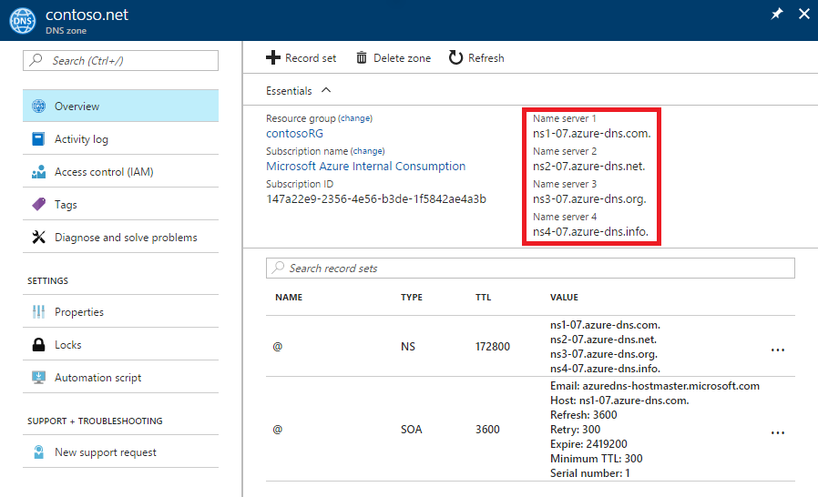

<properties
   pageTitle="Delegate your domain to Azure DNS | Microsoft Azure"
   description="Understand how to change domain delegation and use Azure DNS name servers to provide domain hosting."
   services="dns"
   documentationCenter="na"
   authors="cherylmc"
   manager="carmonm"
   editor=""/>

<tags
   ms.service="dns"
   ms.devlang="na"
   ms.topic="get-started-article"
   ms.tgt_pltfrm="na"
   ms.workload="infrastructure-services"
   ms.date="06/30/2016"
   ms.author="cherylmc"/>

# Delegate a domain to Azure DNS

Azure DNS allows you to host a DNS zone and manage the DNS records for a domain in Azure. In order for DNS queries for a domain to reach Azure DNS, the domain has to be delegated to Azure DNS from the parent domain. Keep in mind Azure DNS is not the domain registrar. This article explains how domain delegation works and how to delegate domains to Azure DNS.

## How DNS delegation works

### Domains and zones

The Domain Name System is a hierarchy of domains. The hierarchy starts from the ‘root’ domain, whose name is simply ‘**.**’.  Below this come top-level domains, such as ‘com’, ‘net’, ‘org’, ‘uk’ or ‘jp’.  Below these are second-level domains, such as ‘org.uk’ or ‘co.jp’.  And so on. The domains in the DNS hierarchy are hosted using separate DNS zones. These zones are globally distributed, hosted by DNS name servers around the world.

**DNS zone**

A domain is a unique name in the Domain Name System, for example ‘contoso.com’. A DNS zone is used to host the DNS records for a particular domain. For example, the domain ‘contoso.com’ may contain a number of DNS records such as ‘mail.contoso.com’ (for a mail server) and ‘www.contoso.com’ (for a website).

**Domain registrar**

A domain registrar is a company who can provide Internet domain names. They will verify if the Internet domain you want to use is available and allow you to purchase it. Once the domain name is registered, you will be the legal owner for the domain name. If you already have an Internet domain, you will use the current domain registrar to delegate to Azure DNS.

>[AZURE.NOTE] To find out more information on who owns a given domain name, or for information on how to buy a domain, see [Internet domain management in Azure AD](https://msdn.microsoft.com/library/azure/hh969248.aspx).

### Resolution and delegation

There are two types of DNS servers:

- An _authoritative_ DNS server hosts DNS zones. It answers DNS queries for records in those zones only.
- A _recursive_ DNS server does not host DNS zones. It answers all DNS queries by calling authoritative DNS servers to gather the data it needs.

DNS clients in PCs or mobile devices typically call a recursive DNS server to perform any DNS queries the client applications need.

When a recursive DNS server receives a query for a DNS record such as ‘www.contoso.com’, it first needs to find the name server hosting the zone for the ‘contoso.com’ domain. To do this, it starts at the root name servers, and from there finds the name servers hosting the ‘com’ zone. It then queries the ‘com’ name servers to find the name servers hosting the ‘contoso.com’ zone.  Finally, it is able to query these name servers for ‘www.contoso.com’.  

This is called resolving the DNS name. Strictly speaking, DNS resolution includes additional steps such as following CNAMEs, but that’s not important to understanding how DNS delegation works.

How does a parent zone ‘point’ to the name servers for a child zone? It does this using a special type of DNS record called an NS record (NS stands for ‘name server’). For example, the root zone contains NS records for 'com' and shows the name servers for the ‘com’ zone. In turn, the ‘com’ zone contains NS records for ‘contoso.com’, which shows the name servers for the ‘contoso.com’ zone. Setting up the NS records for a child zone in a parent zone is called delegating the domain.

Each delegation actually has two copies of the NS records; one in the parent zone pointing to the child, and another in the child zone itself. The ‘contoso.com’ zone contains the NS records for ‘contoso.com’ (in addition to the NS records in ‘com’). These are called authoritative NS records and they sit at the apex of the child zone.

## Delegating a domain to Azure DNS

Once you create your DNS zone in Azure DNS, you need to set up NS records in the parent zone to make Azure DNS the authoritative source for name resolution for your zone. For domains purchased from a registrar, your registrar will offer the option to set up these NS records.

>[AZURE.NOTE] You do not have to own a domain in order to create a DNS zone with that domain name in Azure DNS. However, you do need to own the domain to set up the delegation to Azure DNS with the registrar.

For example, suppose you purchase the domain ‘contoso.com’ and create a zone with the name ‘contoso.com’ in Azure DNS. As the owner of the domain, your registrar will offer you the option to configure the name server addresses (that is, the NS records) for your domain. The registrar will store these NS records in the parent domain, in this case ‘.com’. Clients around the world will then be directed to your domain in Azure DNS zone when trying to resolve DNS records in ‘contoso.com’.

### Finding the name server names

Before you can delegate your DNS zone to Azure DNS, you first need to know the name server names for your zone. Azure DNS allocates name servers from a pool each time a zone is created.

The easiest way to see the name servers assigned to your zone is via the Azure portal.  In this example, the zone ‘contoso.net’ has been assigned name servers ‘ns1-01.azure-dns.com’, ‘ns2-01.azure-dns.net’, ‘ns3-01.azure-dns.org’, and ‘ns4-01.azure-dns.info’:

 

Azure DNS automatically creates authoritative NS records in your zone containing the assigned name servers.  To see the name server names via Azure PowerShell or Azure CLI, you simply need to retrieve these records.

Using Azure PowerShell, the authoritative NS records can be retrieved as follows. Note that the record name “@” is used to refer to records at the apex of the zone. 

	PS> $zone = Get-AzureRmDnsZone –Name contoso.net –ResourceGroupName MyResourceGroup
	PS> Get-AzureRmDnsRecordSet –Name “@” –RecordType NS –Zone $zone

	Name              : @
	ZoneName          : contoso.net
	ResourceGroupName : MyResourceGroup
	Ttl               : 3600
	Etag              : 5fe92e48-cc76-4912-a78c-7652d362ca18
	RecordType        : NS
	Records           : {ns1-01.azure-dns.com, ns2-01.azure-dns.net, ns3-01.azure-dns.org,
                        ns4-01.azure-dns.info}
	Tags              : {}

You can also use the cross-platform Azure CLI to retrieve the authoritative NS records and hence discover the name servers assigned to your zone:

	C:\> azure network dns record-set show MyResourceGroup contoso.net @ NS
	info:    Executing command network dns record-set show
		+ Looking up the DNS Record Set "@" of type "NS"
	data:    Id                              : /subscriptions/.../resourceGroups/MyResourceGroup/providers/Microsoft.Network/dnszones/contoso.net/NS/@
	data:    Name                            : @
	data:    Type                            : Microsoft.Network/dnszones/NS
	data:    Location                        : global
	data:    TTL                             : 172800
	data:    NS records
	data:        Name server domain name     : ns1-01.azure-dns.com.
	data:        Name server domain name     : ns2-01.azure-dns.net.
	data:        Name server domain name     : ns3-01.azure-dns.org.
	data:        Name server domain name     : ns4-01.azure-dns.info.
	data:
	info:    network dns record-set show command OK

### To set up delegation

Each registrar has their own DNS management tools to change the name server records for a domain. In the registrar’s DNS management page, edit the NS records and replace the NS records with the ones Azure DNS created.

When delegating a domain to Azure DNS, you must use the name server names provided by Azure DNS.  You should always use all 4 name server names, regardless of the name of your domain.  Domain delegation does not require the name server name to use the same top-level domain as your domain.

You should not use 'glue records' to point to the Azure DNS name server IP addresses, since these IP addresses may change in future. Delegations using name server names in your own zone, sometimes called 'vanity name servers', are not currently supported in Azure DNS.

### To verify name resolution is working

After completing the delegation, you can verify that name resolution is working by using a tool such as ‘nslookup’ to query the SOA record for your zone (which is also automatically created when the zone is created).

Note that you do not have to specify the Azure DNS name servers, since the normal DNS resolution process will find the name servers automatically if the delegation has been set up correctly.

	nslookup –type=SOA contoso.com

	Server: ns1-04.azure-dns.com
	Address: 208.76.47.4

	contoso.com
	primary name server = ns1-04.azure-dns.com
	responsible mail addr = msnhst.microsoft.com
	serial = 1
	refresh = 900 (15 mins)
	retry = 300 (5 mins)
	expire = 604800 (7 days)
	default TTL = 300 (5 mins)

## Delegating sub-domains in Azure DNS

If you want to set up a separate child zone, you can delegate a sub-domain in Azure DNS. For example, having set up and delegated ‘contoso.com’ in Azure DNS, suppose you would like to set up a separate child zone, ‘partners.contoso.com’. 

Setting up a sub-domain follows a similar process as a normal delegation. The only difference is that in step 3 the NS records must be created in the parent zone ‘contoso.com’ in Azure DNS, rather than being set up via a domain registrar.

1. Create the child zone ‘partners.contoso.com’ in Azure DNS.
2. Look up the authoritative NS records in the child zone to obtain the name servers hosting the child zone in Azure DNS.
3. Delegate the child zone by configuring NS records in the parent zone pointing to the child zone.

### To delegate a sub-domain

The following PowerShell example demonstrates how this works. The same steps can be executed via the Azure Portal, or via the cross-platform Azure CLI.

#### Step 1. Create the parent and child zones

First, we create the parent and child zones. These can be in same resource group or different resource groups.

	$parent = New-AzureRmDnsZone -Name contoso.com -ResourceGroupName RG1
	$child = New-AzureRmDnsZone -Name partners.contoso.com -ResourceGroupName RG1

#### Step 2. Retrieve NS records

Next, we retrieve the authoritative NS records from child zone as shown in the next example.  This contains the name servers assigned to the child zone. 

	$child_ns_recordset = Get-AzureRmDnsRecordSet -Zone $child -Name "@" -RecordType NS

#### Step 3. Delegate the child zone

Create corresponding NS record set in the parent zone to complete the delegation. Note that the record set name in the parent zone matches the child zone name, in this case "partners".

	$parent_ns_recordset = New-AzureRmDnsRecordSet -Zone $parent -Name "partners" -RecordType NS -Ttl 3600
	$parent_ns_recordset.Records = $child_ns_recordset.Records
	Set-AzureRmDnsRecordSet -RecordSet $parent_ns_recordset

### To verify name resolution is working

You can verify that everything is set up correctly by looking up the SOA record of the child zone.

	nslookup –type=SOA partners.contoso.com

	Server: ns1-08.azure-dns.com
	Address: 208.76.47.8

	partners.contoso.com
		primary name server = ns1-08.azure-dns.com
		responsible mail addr = msnhst.microsoft.com
		serial = 1
		refresh = 900 (15 mins)
		retry = 300 (5 mins)
		expire = 604800 (7 days)
		default TTL = 300 (5 mins)

## Next steps

[Manage DNS zones](dns-operations-dnszones.md)

[Manage DNS records](dns-operations-recordsets.md)

