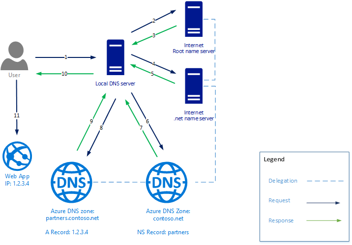

# Delegation of DNS zones with Azure DNS

Azure DNS allows you to host a DNS zone and manage the DNS records for a domain in Azure. In order for DNS queries for a domain to reach Azure DNS, the domain has to be delegated to Azure DNS from the parent domain. Keep in mind Azure DNS isn't the domain registrar. This article explains how domain delegation works and how to delegate domains to Azure DNS.

## How DNS delegation works

### Domains and zones

The Domain Name System is a hierarchy of domains. The hierarchy starts from the 'root' domain, whose name is simply '**.**'.  Below this come top-level domains, such as 'com', 'net', 'org', 'uk' or 'jp'.  Below these top-level domains are second-level domains, such as 'org.uk' or 'co.jp'.  And so on. The domains in the DNS hierarchy are hosted using separate DNS zones. These zones are globally distributed, hosted by DNS name servers around the world.

**DNS zone** - A domain is a unique name in the Domain Name System, for example 'contoso.com'. A DNS zone is used to host the DNS records for a particular domain. For example, the domain 'contoso.com' may contain several DNS records such as 'mail.contoso.com' (for a mail server) and 'www.contoso.com' (for a website).

**Domain registrar** - A domain registrar is a company who can provide Internet domain names. They verify if the Internet domain you want to use is available and allow you to purchase it. Once the domain name is registered, you're the legal owner for the domain name. If you already have an Internet domain, you'll use the current domain registrar to delegate to Azure DNS.

For more information about accredited domain registrars, see [ICANN-Accredited Registrars](https://www.icann.org/registrar-reports/accredited-list.html).

### Resolution and delegation

There are two types of DNS servers:

* An *authoritative* DNS server hosts DNS zones. It answers DNS queries for records in those zones only.
* A *recursive* DNS server doesn't host DNS zones. It answers all DNS queries by calling authoritative DNS servers to gather the data it needs.

Azure DNS provides an authoritative DNS service.  It doesn't provide a recursive DNS service. Cloud Services and VMs in Azure are automatically configured to use a recursive DNS service that is provided separately as part of Azure's infrastructure. For information on how to change these DNS settings, see [Name Resolution in Azure](../virtual-network/virtual-networks-name-resolution-for-vms-and-role-instances.md#name-resolution-that-uses-your-own-dns-server).

DNS clients in PCs or mobile devices typically call a recursive DNS server to do any DNS queries the client applications need.

When a recursive DNS server receives a query for a DNS record such as 'www.contoso.com', it first needs to find the name server hosting the zone for the 'contoso.com' domain. To find the name server, it starts at the root name servers, and from there finds the name servers hosting the 'com' zone. It then queries the 'com' name servers to find the name servers hosting the 'contoso.com' zone.  Finally, it's able to query these name servers for 'www.contoso.com'.

This procedure is called resolving the DNS name. Strictly speaking, DNS resolution includes more steps such as following CNAMEs, but that's not important to understanding how DNS delegation works.

How does a parent zone 'point' to the name servers for a child zone? It does this using a special type of DNS record called an NS record (NS stands for 'name server'). For example, the root zone contains NS records for 'com' and shows the name servers for the 'com' zone. In turn, the 'com' zone contains NS records for 'contoso.com', which shows the name servers for the 'contoso.com' zone. Setting up the NS records for a child zone in a parent zone is called delegating the domain.

The following image shows an example DNS query. The contoso.net and partners.contoso.net are Azure DNS zones.

1. The client requests `www.partners.contoso.net` from their local DNS server.
2. The local DNS server doesn't have the record so it makes a request to their root name server.
3. The root name server doesn't have the record, but knows the address of the `.net` name server, it provides that address to the DNS server
4. The local DNS server sends the request to the `.net` name server.
5. The `.net` name server doesn't have the record but does know the address of the `contoso.net` name server. In this case, it responds with the address of the name server for the DNS zone hosted in Azure DNS.
6. The local DNS server sends the request to the name server for the `contoso.net` zone hosted in Azure DNS.
7. The zone `contoso.net` doesn't have the record but knows the name server for `partners.contoso.net` and responds with the address. In this case, it's a DNS zone hosted in Azure DNS.
8. The local DNS server sends the request to the name server for the `partners.contoso.net` zone.
9. The `partners.contoso.net` zone has the A record and responds with the IP address.
10. The local DNS server provides the IP address to the client
11. The client connects to the website `www.partners.contoso.net`.

Each delegation actually has two copies of the NS records; one in the parent zone pointing to the child, and another in the child zone itself. The 'contoso.net' zone contains the NS records for 'contoso.net' (in addition to the NS records in 'net'). These records are called authoritative NS records and they sit at the apex of the child zone.

## Next steps

Learn how to [delegate your domain to Azure DNS](dns-delegate-domain-azure-dns.md)
