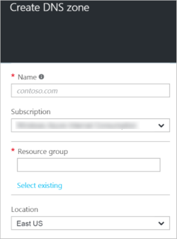

<properties
   pageTitle="How to create and manage a DNS zone in the Azure portal | Microsoft Azure"
   description="Learn how to create DNS zones for Azure DNS. This is a Step-by-step guide to create and manage your first DNS and start hosting your DNS domain using the Azure portal."
   services="dns"
   documentationCenter="na"
   authors="cherylmc"
   manager="carmonm"
   editor=""
   tags="azure-resource-manager"/>

<tags
   ms.service="dns"
   ms.devlang="na"
   ms.topic="article"
   ms.tgt_pltfrm="na"
   ms.workload="infrastructure-services"
   ms.date="03/21/2016"
   ms.author="cherylmc"/>

# Creating and managing a DNS zone in the Azure portal

> [AZURE.SELECTOR]
- [Azure Portal](dns-getstarted-create-dnszone-portal.md)
- [PowerShell](dns-getstarted-create-dnszone.md)
- [Azure CLI](dns-getstarted-create-dnszone-cli.md)

This article will walk you through the steps to create a DNS zone by using the Azure portal. You can also create a DNS zone using PowerShell or CLI.

The domain "contoso.com" may contain a number of DNS records, such as "mail.contoso.com" (for a mail server) and "www.contoso.com" (for a web site).  A DNS zone is used to host the DNS records for a particular domain. To start hosting your domain you will first create a DNS zone. Any DNS record created for a particular domain will be inside a DNS zone for the domain.

### About DNS zone names
 
- The name of the zone must be unique within the resource group, and the zone must not exist already. Otherwise, the operation will fail.

- The same zone name can be re-used in a different resource group or a different Azure subscription.  Where multiple zones share the same name, each instance will be assigned different name server addresses, and only one instance can be delegated from the parent domain. See [Delegate a Domain to Azure DNS](dns-domain-delegation.md) for more information.

### About Etags and Tags for Azure DNS

#### Etags

Suppose two people or two processes try to modify a DNS record at the same time.  Which one wins?  And does the winner know that they’ve just overwritten changes created by someone else?

Azure DNS uses Etags to handle concurrent changes to the same resource safely. Each DNS resource (zone or record set) has an Etag associated with it.  Whenever a resource is retrieved, its Etag is also retrieved. When updating a resource, you have the option to pass back the Etag so Azure DNS can verify that the Etag on the server matches. Since each update to a resource results in the Etag being re-generated, an Etag mismatch indicates a concurrent change has occurred. Etags are also used when creating a new resource to ensure that the resource does not already exist.

By default, Azure DNS PowerShell uses Etags to block concurrent changes to zones and record sets. The optional *-Overwrite* switch can be used to suppress Etag checks, in which case any concurrent changes that have occurred will be overwritten.

At the level of the Azure DNS REST API, Etags are specified using HTTP headers. The following table shows the behavior:

|Header|Behavior|
|------|--------|
|None|PUT always succeeds (no Etag checks)|
|If-match <etag>|PUT only succeeds if resource exists and Etag matches|
|If-match *	|PUT only succeeds if resource exists|
|If-none-match * |PUT only succeeds if resource does not exist|

#### Tags

Tags are different than Etags. Tags are a list of name-value pairs and are used by Azure Resource Manager to label resources for billing or grouping purposes. For more information about Tags, see the article [Using tags to organize your Azure resources](../resource-group-using-tags.md).

You can add Tags in the Azure portal by using the **Settings** blade for your DNS zone.

## To create a DNS zone

1. Sign in to the Azure portal

2. On the Hub menu, click and click **New > Networking >** and then click **DNS zone** to open the DNS zone blade.
 
	

3. On the **DNS zone** blade, click **Create** at the bottom. This will open the **Create DNS zone** blade. 

	

4. On the **Create DNS zone** blade, Name your DNS zone. For example, *contoso.com*. [See About DNS Zone Names](#names) in the section above.

5. Next, specify the resource group that you want to use. You can either create a new resource group, or select one that already exists. 

6. From the **Location** dropdown, specify the location.

7. You can leave the **Pin to dashboard** checkbox selected if you want to easily locate your new zone on your dashboard. Then click **Create**.

	

8. After you click Create, you'll see your new zone being configured on the dashboard.

## View a DNS zone using the portal

Creating a DNS zone also creates the following DNS records, which you can view in the Azure portal on the blade for your DNS zone:

- The "Start of Authority" (SOA) record. The SOA is present at the root of every DNS zone.
- The authoritative name server (NS) records. These show which name servers are hosting the zone. Azure DNS uses a pool of name servers, and so different name servers may be assigned to different zones in Azure DNS. See [delegate a domain to Azure DNS](dns-domain-delegation.md) for more information.

## View DNS zone records:

1. From your DNS zone blade, click on **All settings** to open the **Settings blade** for the DNS zone. 
2. In the lower part of the blade, you can see the record sets for the DNS zone.

Note: If a zone is not available for you to use or did not create correctly, you will see a "Failed" result and the details for the reason of failure in the Operations details window. Typically this happens when you try to create a zone with a name that is not available.

## Test your DNS zone by using DNS tools

You can test your DNS zone by using DNS tools such as nslookup, dig, or the [Resolve-DnsName PowerShell cmdlet](https://technet.microsoft.com/library/jj590781.aspx). 

## Delegate your domain to use the new zone in Azure DNS

If you haven’t yet delegated your domain to use the new zone in Azure DNS, you will need to direct the DNS query directly to one of the name servers for your zone. The name servers for your zone are given in the NS records. See the article [Delegate your domain to Azure DNS](dns-domain-delegation.md) for more information.

## Delete a DNS zone in the portal

You can delete the DNS zone directly from the portal. Before deleting a DNS zone in Azure DNS, you will need to delete all records sets, except for the NS and SOA records at the root of the zone that were created automatically when the zone was created. 

1. Locate the DNS zone blade for the zone you want to delete, then click **Delete** at the top of the blade. 
2. A message will appear letting you know that you must delete all records sets, except NS and SOA records that were automatically created. If you have deleted your record sets, click **Yes**. Note that when deleting a DNS zone from the portal, the Resource Group that the DNS zone is associated with will not be deleted.  

## Next steps

After creating your DNS zone, see [Get started creating record sets and records](dns-getstarted-create-recordset.md), [How to manage DNS zones](dns-operations-dnszones.md), and [How to manage DNS records](dns-operations-recordsets.md).