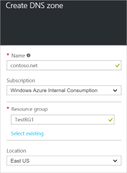
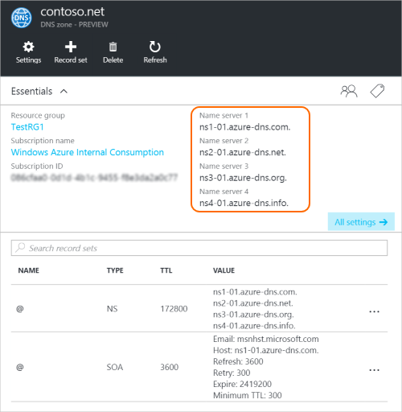
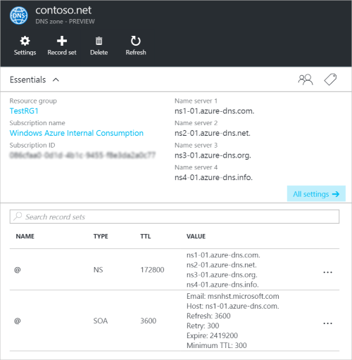

<properties
   pageTitle="How to create and manage a DNS zone in the Azure portal | Microsoft Azure"
   description="Learn how to create DNS zones for Azure DNS. This is a Step-by-step guide to create and manage your first DNS and start hosting your DNS domain using the Azure portal."
   services="dns"
   documentationCenter="na"
   authors="cherylmc"
   manager="carmonm"
   editor=""
   tags="azure-resource-manager"/>

<tags
   ms.service="dns"
   ms.devlang="na"
   ms.topic="article"
   ms.tgt_pltfrm="na"
   ms.workload="infrastructure-services"
   ms.date="05/09/2016"
   ms.author="cherylmc"/>

# Create a DNS zone in the Azure portal

> [AZURE.SELECTOR]
- [Azure Portal](dns-getstarted-create-dnszone-portal.md)
- [PowerShell](dns-getstarted-create-dnszone.md)
- [Azure CLI](dns-getstarted-create-dnszone-cli.md)

This article will walk you through the steps to create a DNS zone by using the Azure portal. You can also create a DNS zone using PowerShell or CLI.

[AZURE.INCLUDE [dns-create-zone-about](../../includes/dns-create-zone-about-include.md)] 

### About Tags for Azure DNS

Tags are a list of name-value pairs and are used by Azure Resource Manager to label resources for billing or grouping purposes. For more information about Tags, see the article [Using tags to organize your Azure resources](../resource-group-using-tags.md).

You can add Tags in the Azure portal by using the **Settings** blade for your DNS zone.

## Create a DNS zone

1. Sign in to the Azure portal

2. On the Hub menu, click and click **New > Networking >** and then click **DNS zone** to open the DNS zone blade.
 
	

3. On the **DNS zone** blade, click **Create** at the bottom. This will open the **Create DNS zone** blade. 

	

4. On the **Create DNS zone** blade, Name your DNS zone. For example, *contoso.com*. See [About DNS Zone Names](#names) in the section above.

5. Next, specify the resource group that you want to use. You can either create a new resource group, or select one that already exists. 

6. From the **Location** dropdown, specify the location of the resource group. Note that this setting refers to the location of the resource group, not the location for DNS zone. The actual DNS zone resource is automatically "global" and is not something that you can (or need to) specify in the portal.

7. You can leave the **Pin to dashboard** checkbox selected if you want to easily locate your new zone on your dashboard. Then click **Create**.

	

8. After you click Create, you'll see your new zone being configured on the dashboard.

	

9. When your new zone has been created, the blade for your new zone will open on the dashboard.

## View records

Creating a DNS zone also creates the following records:

- The "Start of Authority" (SOA) record. The SOA is present at the root of every DNS zone.
- The authoritative name server (NS) records. These show which name servers are hosting the zone. Azure DNS uses a pool of name servers, and so different name servers may be assigned to different zones in Azure DNS. See [Delegate a domain to Azure DNS](dns-domain-delegation.md) for more information.

You can view the records from the Azure portal

1. From your **DNS zone** blade, click on **All settings** to open the **Settings blade** for the DNS zone. 

	

2. In the lower part of the Essentials pane, you can see the record sets for the DNS zone.

	

## Test

You can test your DNS zone by using DNS tools such as nslookup, dig, or the [Resolve-DnsName PowerShell cmdlet](https://technet.microsoft.com/library/jj590781.aspx).

If you haven’t yet delegated your domain to use the new zone in Azure DNS, you will need to direct the DNS query directly to one of the name servers for your zone. The name servers for your zone are given in the NS records, as listed by `Get-AzureRmDnsRecordSet` above. Be sure the substitute the correct values for your zone into the command below.

	nslookup
	> set type=SOA
	> server ns1-01.azure-dns.com
	> contoso.com

	Server: ns1-01.azure-dns.com
	Address:  208.76.47.1

	contoso.com
        	primary name server = ns1-01.azure-dns.com
        	responsible mail addr = msnhst.microsoft.com
        	serial  = 1
        	refresh = 900 (15 mins)
        	retry   = 300 (5 mins)
        	expire  = 604800 (7 days)
        	default TTL = 300 (5 mins)

## Delete a DNS zone

You can delete the DNS zone directly from the portal. Before deleting a DNS zone in Azure DNS, you will need to delete all records sets, except for the NS and SOA records at the root of the zone that were created automatically when the zone was created. 

1. Locate the **DNS zone** blade for the zone you want to delete, then click **Delete** at the top of the blade.
 
2. A message will appear letting you know that you must delete all records sets, except the NS and SOA records that were automatically created. If you have deleted your record sets, click **Yes**. Note that when deleting a DNS zone from the portal, the Resource Group that the DNS zone is associated with will not be deleted.  

## Next steps

After creating a DNS zone, create [record sets and records](dns-getstarted-create-recordset-portal.md) to start resolving names for your Internet domain.
