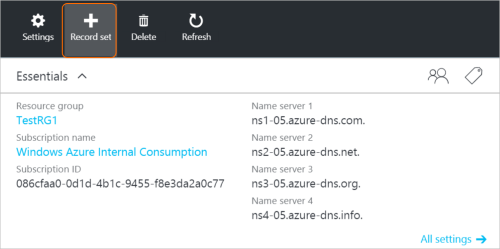
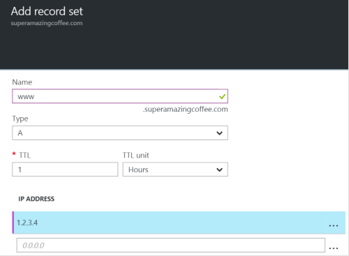

<properties
   pageTitle="Create a record set and records for a DNS Zone using the Azure portal | Microsoft Azure"
   description="How to create host records for Azure DNS and create record sets and records using the Azure portal"
   services="dns"
   documentationCenter="na"
   authors="cherylmc"
   manager="carmonm"
   editor=""
   tags="azure-resource-manager"/>

<tags
   ms.service="dns"
   ms.devlang="na"
   ms.topic="article"
   ms.tgt_pltfrm="na"
   ms.workload="infrastructure-services"
   ms.date="05/06/2016"
   ms.author="cherylmc"/>

# Create DNS record sets and records by using the Azure portal

> [AZURE.SELECTOR]
- [Azure Portal](dns-getstarted-create-recordset-portal.md)
- [PowerShell](dns-getstarted-create-recordset.md)
- [Azure CLI](dns-getstarted-create-recordset-cli.md)

This article walks you through the process of creating records and records sets by using the Azure portal. After you create your DNS zone, you add the DNS records for your domain. To do this, you first need to understand DNS records and record sets.

[AZURE.INCLUDE [dns-about-records-include](../../includes/dns-about-records-include.md)]

## Create a record set and record

The following example walks you through the process of creating a record set and record by using the Azure portal. We'll use the DNS "A" record type.

1. Sign in to the portal.

2. Go to the **DNS zone** blade in which you want to create a record set.

3. At the top of the **DNS zone** blade, select **Record set** to open the **Add record set** blade.

	

4. On the **Add record set** blade, name your record set. For example, you could name your record set "**www**".

	

5. Select the type of record you want to create. For example, select **A**.

6. Set the **TTL**. The default time to live in the portal is one hour.

7. Add the IP addresses, one IP address per line. When you use the suggested record set name and record type described earlier, you add the IPv4 IP addresses to the **A** record for the www record set.

8. After you finish adding IP addresses, select **OK** at the bottom of the blade. The DNS record set will be created.

## Next steps

To manage your record set and records, see [Manage DNS records and record sets by using the Azure portal](dns-operations-recordsets-portal.md).

For more information about Azure DNS, see the [Azure DNS overview](dns-overview.md).
