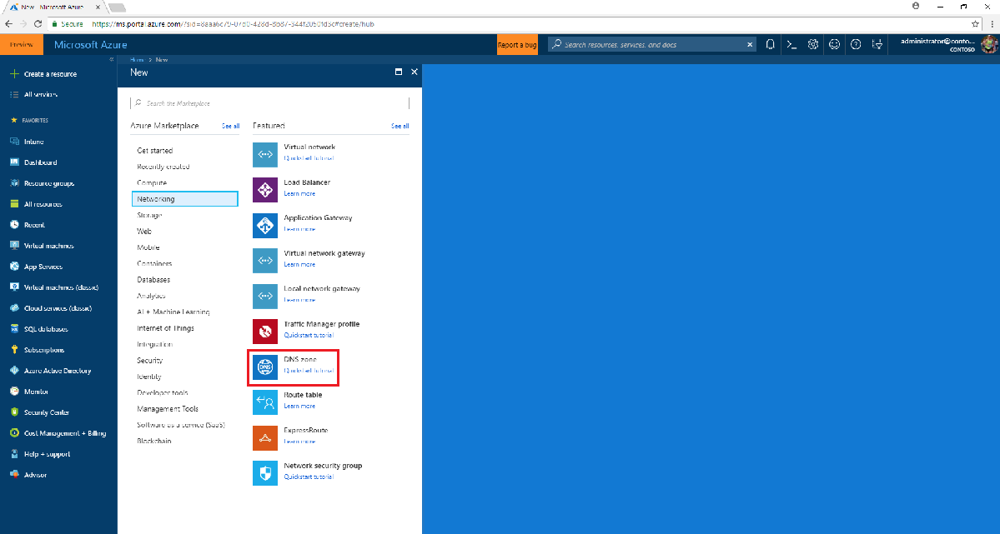
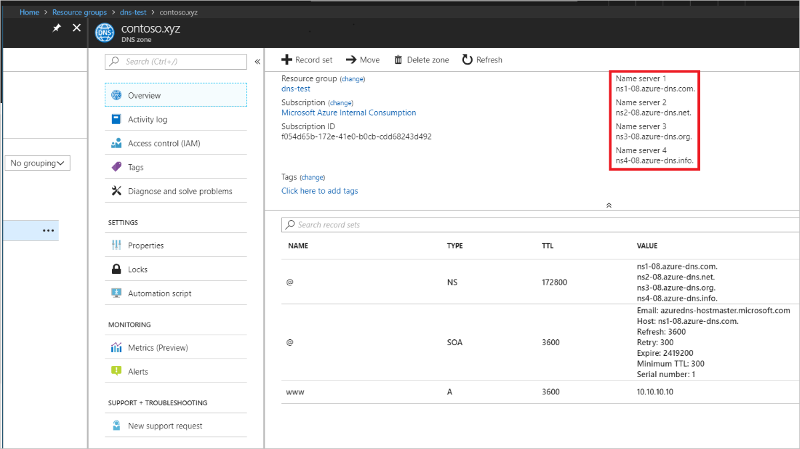
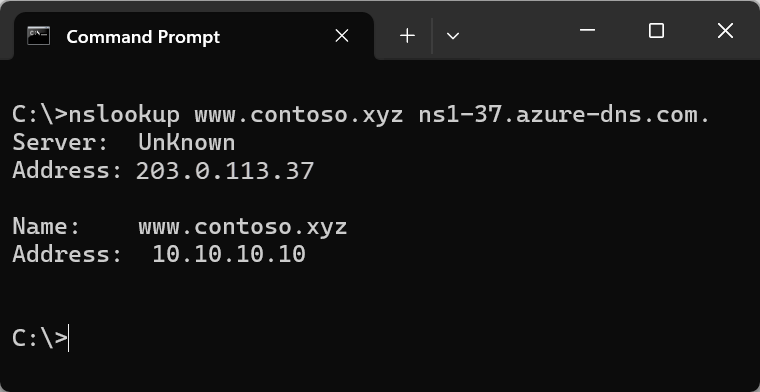

# Quickstart: Create an Azure DNS zone and record using the Azure portal

You can configure Azure DNS to resolve host names in your public domain. For example, if you purchased the *contoso.xyz* domain name from a domain name registrar, you can configure Azure DNS to host the *contoso.xyz* domain and resolve *`www.contoso.xyz`* to the IP address of your web server or web app.

In this quickstart, you will create a test domain, and then create an address record to resolve *www* to the IP address *10.10.10.10*.

>[!IMPORTANT]
>All the names and IP addresses in this quickstart are examples that do not represent real-world scenarios.

<!---
You can also perform these steps using [Azure PowerShell](dns-getstarted-powershell.md) or the cross-platform [Azure CLI](dns-getstarted-cli.md).
--->

If you don't have an Azure subscription, create a [free account](https://azure.microsoft.com/free/?WT.mc_id=A261C142F) before you begin.

For all portal steps, sign in to the [Azure portal](https://portal.azure.com).

## Prerequisites

- An Azure account with an active subscription. [Create an account for free](https://azure.microsoft.com/free/?WT.mc_id=A261C142F).

## Sign in to the Azure portal

Sign in to the [Azure portal](https://portal.azure.com) with your Azure account.

## Create a DNS zone

A DNS zone contains the DNS entries for a domain. To start hosting your domain in Azure DNS, you create a DNS zone for that domain name. 

**To create the DNS zone:**

1. At upper left, select **Create a resource**, then **Networking**, and then **DNS zone**.

1. On the **Create DNS zone** page, type or select the following values:

   - **Name**: Type *contoso.xyz* for this quickstart example. The DNS zone name can be any value that is not already configured on the Azure DNS servers. A real-world value would be a domain that you bought from a domain name registrar.
   - **Resource group**: Select **Create new**, enter *MyResourceGroup*, and select **OK**. The resource group name must be unique within the Azure subscription. 

1. Select **Create**.

   

It may take a few minutes to create the zone.

## Create a DNS record

You create DNS entries or records for your domain inside the DNS zone. Create a new address record or 'A' record to resolve a host name to an IPv4 address.

**To create an 'A' record:**

1. In the Azure portal, under **All resources**, open the **contoso.xyz** DNS zone in the **MyResourceGroup** resource group. You can enter *contoso.xyz* in the **Filter by name** box to find it more easily.

1. At the top of the **DNS zone** page, select **+ Record set**.

1. On the **Add record set** page, type or select the following values:

   - **Name**: Type *www*. The record name is the host name that you want to resolve to the specified IP address.
   - **Type**: Select **A**. 'A' records are the most common, but there are other record types for mail servers ('MX'), IP v6 addresses ('AAAA'), and so on. 
   - **TTL**: Type *1*. *Time-to-live* of the DNS request specifies how long DNS servers and clients can cache a response.
   - **TTL unit**: Select **Hours**. This is the time unit for the **TTL** value. 
   - **IP address**: For this quickstart example, type *10.10.10.10*. This value is the IP address the record name resolves to. In a real-world scenario, you would enter the public IP address for your web server.

Since this quickstart is just for quick testing purposes, there's no need to configure the Azure DNS name servers at a domain name registrar. With a real production domain, you'll want anyone on the Internet to resolve the host name to connect to your web server or app. You'll visit your domain name registrar to replace the name server records with the Azure DNS name servers. For more information, see [Tutorial: Host your domain in Azure DNS](dns-delegate-domain-azure-dns.md#delegate-the-domain).

## Test the name resolution

Now that you have a test DNS zone with a test 'A' record, you can test the name resolution with a tool called *nslookup*. 

**To test DNS name resolution:**

1. In the Azure portal, under **All resources**, open the **contoso.xyz** DNS zone in the **MyResourceGroup** resource group. You can enter *contoso.xyz* in the **Filter by name** box to find it more easily.

1. Copy one of the name server names from the name server list on the **Overview** page. 

   

1. Open a command prompt, and run the following command:

   ```
   nslookup www.contoso.xyz <name server name>
   ```

   For example:

   ```
   nslookup www.contoso.xyz ns1-08.azure-dns.com.
   ```

   You should see something like the following screen:

   

The host name **www\.contoso.xyz** resolves to **10.10.10.10**, just as you configured it. This result verifies that name resolution is working correctly. 

## Clean up resources

When you no longer need the resources you created in this quickstart, remove them by deleting the **MyResourceGroup** resource group. Open the **MyResourceGroup** resource group, and select **Delete resource group**.

## Next steps

> [!div class="nextstepaction"]
> [Create DNS records for a web app in a custom domain](./dns-web-sites-custom-domain.md)
