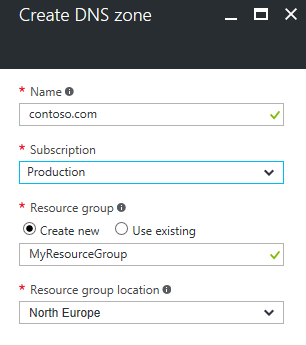
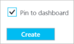
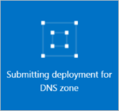
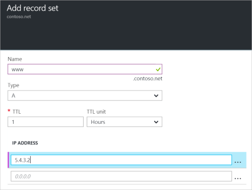

# Get started with Azure DNS using the Azure portal

> [!div class="op_single_selector"]
> * [Azure portal](dns-getstarted-portal.md)
> * [PowerShell](dns-getstarted-powershell.md)
> * [Azure CLI 1.0](dns-getstarted-cli-nodejs.md)
> * [Azure CLI 2.0](dns-getstarted-cli.md)

This article walks you through the steps to create your first DNS zone and record using the Azure portal. You can also perform these steps using Azure PowerShell or the cross-platform Azure CLI.

A DNS zone is used to host the DNS records for a particular domain. To start hosting your domain in Azure DNS, you need to create a DNS zone for that domain name. Each DNS record for your domain is then created inside this DNS zone. Finally, to publish your DNS zone to the Internet, you need to configure the name servers for the domain. Each of these steps is described below.

## Create a DNS zone

1. Sign in to the Azure portal
2. On the Hub menu, click and click **New > Networking >** and then click **DNS zone** to open the Create DNS zone blade.

    

4. On the **Create DNS zone** blade, Name your DNS zone. For example, *contoso.com*.
 
    

5. Next, specify the resource group that you want to use. You can either create a new resource group, or select one that already exists. If you choose to create a new resource group, use the **Location** dropdown to specify the location of the resource group. Note that this setting refers to the location of the resource group, and has no impact on the DNS zone. The DNS zone location is always "global", and is not shown.

6. You can leave the **Pin to dashboard** checkbox selected if you want to easily locate your new zone on your dashboard. Then click **Create**.

    

7. After you click Create, you'll see your new zone being configured on the dashboard.

    

8. When your new zone has been created, the blade for your new zone opens on the dashboard.

## Create a DNS record

The following example walks you through the process of creating new 'A' record. For other record types and to modify existing records, see [Manage DNS records and record sets by using the Azure portal](dns-operations-recordsets-portal.md). 

1. At the top of the **DNS zone** blade, select **+ Record set** to open the **Add record set** blade.

    

4. On the **Add record set** blade, name your record set. For example, you could name your record set "**www**".

    

5. Select the type of record you want to create. For this example, select **A**.
6. Set the **TTL**. The default time to live is one hour.
7. Add the IP address of the record.
8. Select **OK** at the bottom of the blade to create the DNS record.

## View records

In the lower part of the DNS zone blade, you can see the records for the DNS zone. You should see the default DNS and SOA records, which are created in every zone, plus any new records you have created.

## Update name servers

Once you are satisfied that your DNS zone and records have been set up correctly, you need to configure your domain name to use the Azure DNS name servers. This enables other users on the Internet to find your DNS records.

The name servers for your zone are given in the Azure portal:

These name servers should be configured with the domain name registrar (where you purchased the domain name). Your registrar will offer the option to set up the name servers for the domain. For more information, see [Delegate your domain to Azure DNS](dns-domain-delegation.md).

## Next steps

To learn more about Azure DNS, see [Azure DNS overview](dns-overview.md).

To learn more about managing DNS records in Azure DNS, see [Manage DNS records and record sets by using the Azure portal](dns-operations-recordsets-portal.md).

