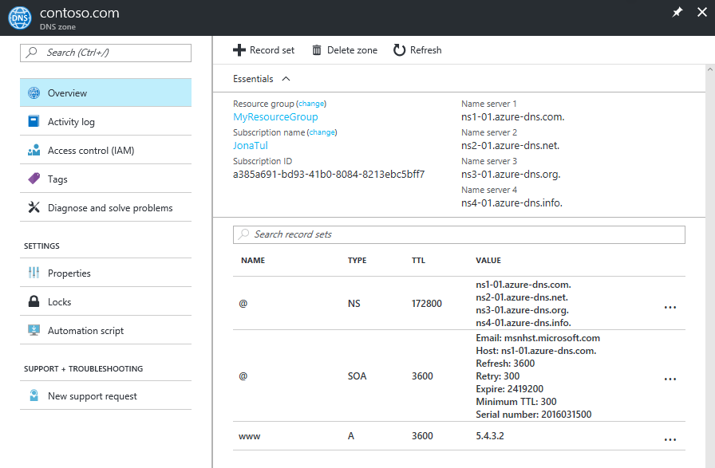

# Get started with Azure DNS using the Azure portal

> [!div class="op_single_selector"]
> * [Azure portal](dns-getstarted-portal.md)
> * [PowerShell](dns-getstarted-powershell.md)
> * [Azure CLI 1.0](dns-getstarted-cli-nodejs.md)
> * [Azure CLI 2.0](dns-getstarted-cli.md)

This article walks you through the steps to create your first DNS zone and record using the Azure portal. You can also perform these steps using Azure PowerShell or the cross-platform Azure CLI.

A DNS zone is used to host the DNS records for a particular domain. To start hosting your domain in Azure DNS, you need to create a DNS zone for that domain name. Each DNS record for your domain is then created inside this DNS zone. Finally, to publish your DNS zone to the Internet, you need to configure the name servers for the domain. Each of these steps is described in the following steps.

## Create a DNS zone

1. Sign in to the Azure portal
2. On the Hub menu, click and click **New > Networking >** and then click **DNS zone** to open the Create DNS zone blade.

    

4. On the **Create DNS zone** blade enter the following values, then click **Create**:

   | **Setting** | **Value** | **Details** |
   |---|---|---|
   |**Name**|contoso.com|The name of the DNS zone|
   |**Subscription**|[Your subscription]|Select a subscription to create the application gateway in.|
   |**Resource group**|**Create new:** contosoDNSRG|Create a resource group. The resource group name must be unique within the subscription you selected. To learn more about resource groups, read the [Resource Manager](../azure-resource-manager/resource-group-overview.md?toc=%2fazure%2fdns%2ftoc.json#resource-groups) overview article.|
   |**Location**|West US||

> [!NOTE]
> The resource group refers to the location of the resource group, and has no impact on the DNS zone. The DNS zone location is always "global", and is not shown.

## Create a DNS record

The following example walks you through the process of creating new 'A' record. For other record types and to modify existing records, see [Manage DNS records and record sets by using the Azure portal](dns-operations-recordsets-portal.md). 

1. With the DNS Zone created, in the Azure portal **Favorites** pane, click **All resources**. Click the **contoso.com** DNS zone in the All resources blade. If the subscription you selected already has several resources in it, you can enter **contoso.com** in the **Filter by name…** box to easily access the DNS Zone.

1. At the top of the **DNS zone** blade, select **+ Record set** to open the **Add record set** blade.

1. On the **Add record set** blade, enter the following values, and click **OK**. In this example, you are creating an A record.

   |**Setting** | **Value** | **Details** |
   |---|---|---|
   |**Name**|www|Name of the record|
   |**Type**|A| Type of DNS record to create, acceptable values are A, AAAA, CNAME, MX, NS, SRV, TXT, and PTR.  For more information about record types, visit [Overview of DNS zones and records](dns-zones-records.md)|
   |**TTL**|1|Time-to-live of the DNS request.|
   |**TTL unit**|Hours|Measurement of time for TTL value.|
   |**IP address**|{ipAddressValue| This value is the IP address that the DNS record resolves.|

## View records

In the lower part of the DNS zone blade, you can see the records for the DNS zone. You should see the default DNS and SOA records, which are created in every zone, plus any new records you have created.

## Update name servers

Once you are satisfied that your DNS zone and records have been set up correctly, you need to configure your domain name to use the Azure DNS name servers. This enables other users on the Internet to find your DNS records.

The name servers for your zone are given in the Azure portal:

These name servers should be configured with the domain name registrar (where you purchased the domain name). Your registrar offers the option to set up the name servers for the domain. For more information, see [Delegate your domain to Azure DNS](dns-domain-delegation.md).

## Delete all resources

To delete all resources created in this article, complete the following steps:

1. In the Azure portal **Favorites** pane, click **All resources**. Click the **MyResourceGroup** resource group in the All resources blade. If the subscription you selected already has several resources in it, you can enter **MyResourceGroup** in the **Filter by name…** box to easily access the resource group.
1. In the **MyResourceGroup** blade, click the **Delete** button.
1. The portal requires you to type the name of the resource group to confirm that you want to delete it. Click **Delete**, Type *MyResourceGroup* for the resource group name, then click **Delete**. Deleting a resource group deletes all resources within the resource group, so always be sure to confirm the contents of a resource group before deleting it. The portal deletes all resources contained within the resource group, then deletes the resource group itself. This process takes several minutes.

## Next steps

To learn more about Azure DNS, see [Azure DNS overview](dns-overview.md).

To learn more about managing DNS records in Azure DNS, see [Manage DNS records and record sets by using the Azure portal](dns-operations-recordsets-portal.md).

