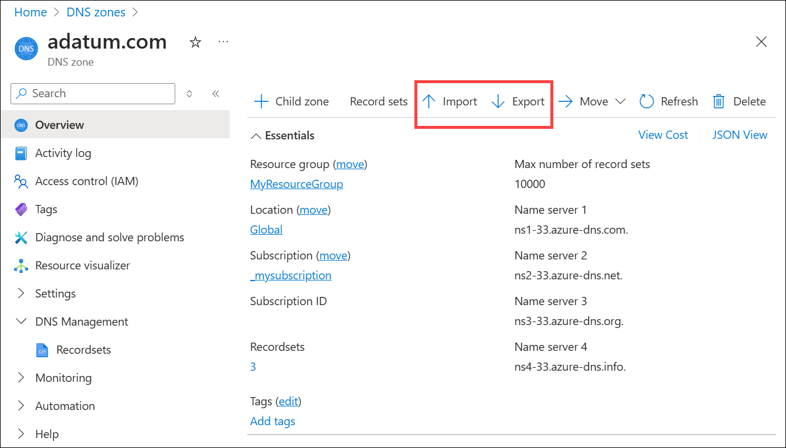
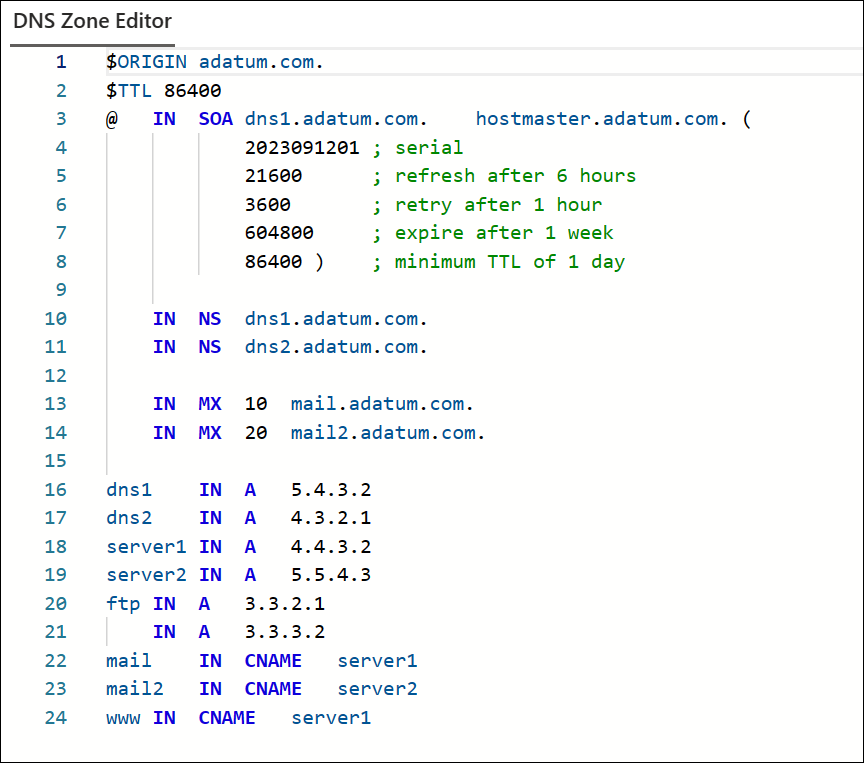
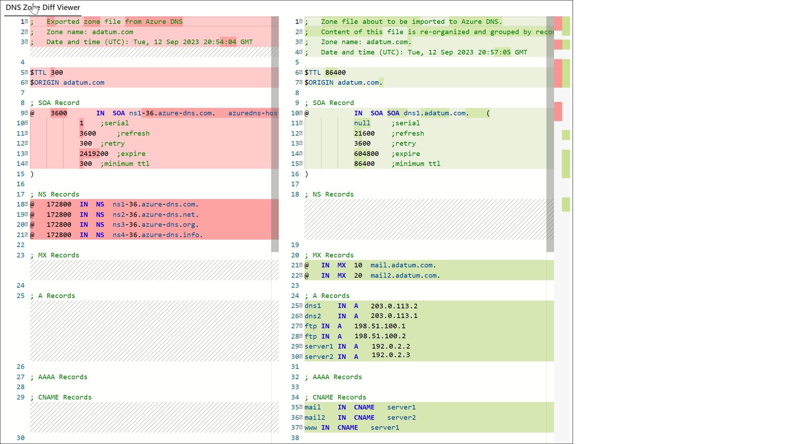
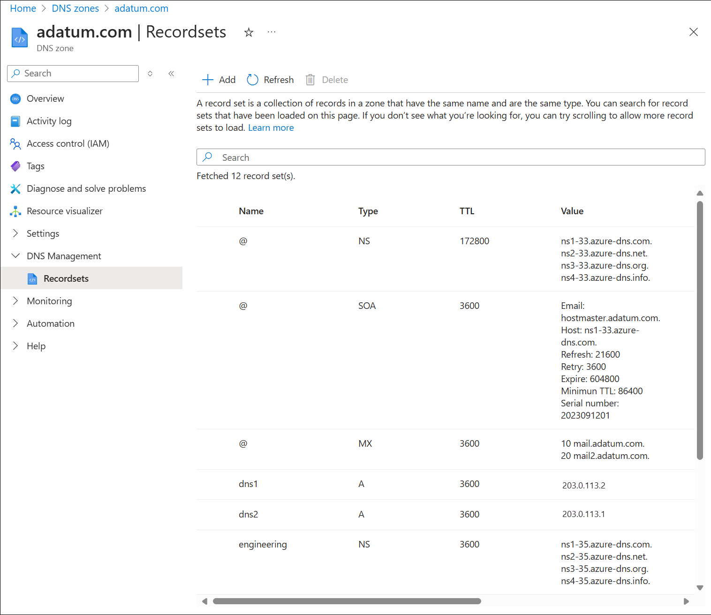
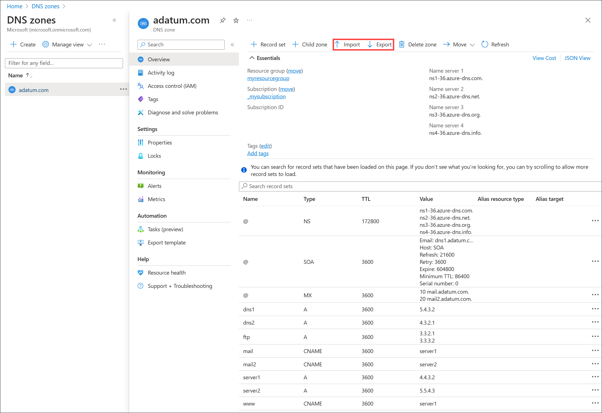

# Import and export a DNS zone file using the Azure portal

In this article, you learn how to  import and export a DNS zone file in Azure DNS using Azure portal. You can also [import and export a zone file using Azure PowerShell](dns-import-export.md).

## Introduction to DNS zone migration

A DNS zone file is a text file containing information about every DNS record in the zone. It follows a standard format, making it suitable for transferring DNS records between DNS systems. Using a zone file is a fast and convenient way to import DNS zones into Azure DNS. You can also export a zone file from Azure DNS to use with other DNS systems.

Azure DNS supports importing and exporting zone files via the Azure CLI and the Azure portal.

## Obtain your existing DNS zone file

Before you import a DNS zone file into Azure DNS, you need to obtain a copy of the zone file. The source of this file depends on where the DNS zone is hosted.

* If your DNS zone is hosted by a partner service, the service should provide a way for you to download the DNS zone file. Partner services include domain registrar, dedicated DNS hosting provider, or an alternative cloud provider.
* If your DNS zone is hosted on Windows DNS, the default folder for the zone files is **%systemroot%\system32\dns**. The full path to each zone file is also shown on the **General** tab of the DNS console.
* If your DNS zone is hosted using BIND, the location of the zone file for each zone gets specified in the BIND configuration file **named.conf**.

> [!IMPORTANT]
> If the zone file that you import contains CNAME entries that point to names in a private zone, Azure DNS resolution of the CNAME fails unless the other zone is also imported, or the CNAME entries are modified.

## Import a DNS zone file into Azure DNS

Importing a zone file creates a new zone in Azure DNS if the zone doesn't already exist. If the zone exists, then the record sets in the zone file are merged with the existing record sets.

### Merge behavior

* By default, the new record sets get merged with the existing record sets. Identical records within a merged record set aren't duplicated.
* When record sets are merged, the time to live (TTL) of pre-existing record sets is used.
* Start of Authority (SOA) parameters, except `host` are always taken from the imported zone file. The name server record set at the zone apex also always uses the TTL taken from the imported zone file.
* An imported CNAME record doesn't replace an existing CNAME record with the same name.  
* When a conflict happens between a CNAME record and another record with the same name of different type, the existing record gets used.

### Additional information about importing

The following notes provide more details about the zone import process.

* The `$TTL` directive is optional, and is supported. When no `$TTL` directive is given, records without an explicit TTL are imported set to a default TTL of 3600 seconds. When two records in the same record set specify different TTLs, the lower value is used.
* The `$ORIGIN` directive is optional, and is supported. When no `$ORIGIN` is set, the default value used is the zone name as specified on the command line, including the ending dot (.).
* The `$INCLUDE` and `$GENERATE` directives aren't supported.
* The following record types are supported: A, AAAA, CAA, CNAME, MX, NS, SOA, SRV, and TXT.
* The SOA record is created automatically by Azure DNS when a zone is created. When you import a zone file, all SOA parameters are taken from the zone file *except* the `host` parameter. This parameter uses the value provided by Azure DNS because it needs to refer to the primary name server provided by Azure DNS.
* The name server record set at the zone apex is also created automatically by Azure DNS when the zone is created. Only the TTL of this record set is imported. These records contain the name server names provided by Azure DNS. The record data isn't overwritten by the values contained in the imported zone file.
* Azure DNS supports only single-string TXT records. Multistring TXT records are to be concatenated and truncated to 255 characters.
* The zone file to be imported must contain 10k or fewer lines with no more than 3k record sets.

## Import a zone file

1. Obtain a copy of the zone file for the zone you wish to import.

    The following small zone file and resource records are used in this example:

    ```text
    $ORIGIN adatum.com. 
    $TTL 86400 
    @	IN	SOA	dns1.adatum.com.	hostmaster.adatum.com. (
			2023091201 ; serial                     
			21600      ; refresh after 6 hours                     
			3600       ; retry after 1 hour                     
			604800     ; expire after 1 week                     
			86400 )    ; minimum TTL of 1 day  	     
	           
	IN	NS	dns1.adatum.com.       
	IN	NS	dns2.adatum.com.        

	IN	MX	10	mail.adatum.com.       
	IN	MX	20	mail2.adatum.com.        

    dns1	IN	A	5.4.3.2
    dns2	IN	A	4.3.2.1		       
    server1	IN	A	4.4.3.2        
    server2	IN	A	5.5.4.3
    ftp	IN	A	3.3.2.1
	    IN	A	3.3.3.2
    mail	IN	CNAME	server1
    mail2	IN	CNAME	server2
    www	    IN	CNAME	server1
    ```
    Names used:
    - Origin zone name: **adatum.com** 
    - Destination zone name: **adatum.com** 
    - Zone filename: **adatum.com.txt** 
    - Resource group: **myresourcegroup** 
2. Open the **DNS zones** overview page and select **Create**.
3. On the **Create DNS zone** page, type or select the following values:
    - **Resource group**: Choose an existing resource group, or select **Create new**, enter **myresourcegroup**, and select **OK**. The resource group name must be unique within the Azure subscription.
    - **Name**: Type **adatum.com** for this example. The DNS zone name can be any value that is not already configured on the Azure DNS servers. A real-world value would be a domain that you bought from a domain name registrar.
4. Select **Review create** and then select **Create**.
5. When deployment is complete, select **Go to resource**. NS and SOA records compatible with Azure public DNS are automatically added to the zone. See the following example:

    

6. Select **Import** and then on the **Import DNS zone** page, select **Browse**.
7. Select the **adatum.com.txt** file and then select **Open**. The zone file is displayed in the DNS Zone Editor. See the following example:

    

8. Edit the zone data values before proceeding to the next step. 

    > [!NOTE]
    > If old NS records are present in the zone file, a non-blocking error is displayed during zone import. Azure NS records are not overwritten. Ideally the old NS records are removed prior to import.<br>
    > If you wish to reset the zone serial number, delete the old serial number from the SOA prior to import. 

9. Select **Review Create** and review information in the DNS Zone Diff Viewer. See the following example:

    

10. Select **Create**. The zone data is imported and the zone is displayed. See the following example:

    [  ](./media/dns-import-export-portal/adatum-imported.png#lightbox)

## Export a zone file

1. Open the **DNS zones** overview page and select the zone you wish to export. For example, **adatum.com**. See the following example:

    [  ](./media/dns-import-export-portal/adatum-export.png#lightbox)

2. Select **Export**.  The file is downloaded to your default downloads directory as a text file with the name AzurePublicDnsZone-adatum.com`number`.txt where `number` is an autogenerated index number.
3. Open the file to view the contents. See the following example:

    ```text
    ; 	Exported zone file from Azure DNS
    ; 	Zone name: adatum.com
    ; 	Date and time (UTC): Tue, 12 Sep 2023 21:33:17 GMT

    $TTL 86400
    $ORIGIN adatum.com

    ; SOA Record
    @	 3600		IN	SOA	SOA	dns1.adatum.com.	(
    	 	 	0	 ;serial
    	 	 	21600	 ;refresh
    	 	 	3600	 ;retry
    	 	 	604800	 ;expire
    	 	 	86400	 ;minimum ttl
    )

    ; NS Records
    @	172800	IN	NS	ns1-36.azure-dns.com.
    @	172800	IN	NS	ns2-36.azure-dns.net.
    @	172800	IN	NS	ns3-36.azure-dns.org.
    @	172800	IN	NS	ns4-36.azure-dns.info.

    ; MX Records
    @	3600	IN	MX	10	mail.adatum.com.
    @	3600	IN	MX	20	mail2.adatum.com.

    ; A Records
    dns1	3600	IN	A	5.4.3.2
    dns2	3600	IN	A	4.3.2.1
    ftp	3600	IN	A	3.3.2.1
    ftp	3600	IN	A	3.3.3.2
    server1	3600	IN	A	4.4.3.2
    server2	3600	IN	A	5.5.4.3

    ; AAAA Records

    ; CNAME Records
    mail	3600	IN	CNAME	server1
    mail2	3600	IN	CNAME	server2
    www	3600	IN	CNAME	server1

    ; PTR Records

    ; TXT Records

    ; SRV Records

    ; SPF Records

    ; CAA Records

    ; DS Records

    ; Azure Alias Records
    ```

## Next steps

* Learn how to [manage record sets and records](./dns-getstarted-cli.md) in your DNS zone.
* Learn how to [delegate your domain to Azure DNS](dns-domain-delegation.md).
