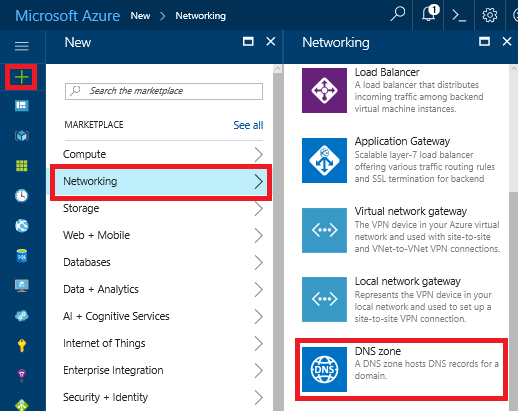
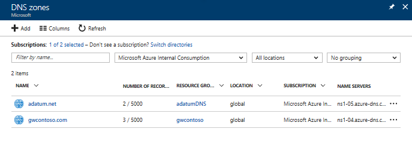

# How to manage DNS Zones in the Azure portal

> [!div class="op_single_selector"]
> * [Portal](dns-operations-dnszones-portal.md)
> * [PowerShell](dns-operations-dnszones.md)
> * [Azure classic CLI](dns-operations-dnszones-cli-nodejs.md)
> * [Azure CLI](dns-operations-dnszones-cli.md)

This article shows you how to manage your DNS zones by using the Azure portal. You can also manage your DNS zones using the cross-platform [Azure CLI](dns-operations-dnszones-cli.md) or the Azure [PowerShell](dns-operations-dnszones.md).

## Create a DNS zone

1. Sign in to the Azure portal
2. On the Hub menu, navigate to **Create a resource > Networking > DNS zone** to open the **Create DNS zone** blade.

    

4. On the **Create DNS zone** blade enter the following values, then click **Create**:

   | **Setting** | **Value** | **Details** |
   |---|---|---|
   |**Name**|contoso.com|The name of the DNS zone|
   |**Subscription**|[Your subscription]|Select a subscription to create the DNS zone in.|
   |**Resource group**|**Create new:** contosoDNSRG|Create a resource group. The resource group name must be unique within the subscription you selected. To learn more about resource groups, read the [Resource Manager](../azure-resource-manager/resource-group-overview.md?toc=%2fazure%2fdns%2ftoc.json#resource-groups) overview article.|
   |**Location**|West US||

> [!NOTE]
> The resource group refers to the location of the resource group, and has no impact on the DNS zone. The DNS zone location is always "global", and is not shown.

## List DNS zones

In the Azure portal, navigate to **More services** > **Networking** > **DNS zones**. Each DNS zone is its own resource, and information such as number of record-sets and name servers are viewable from this view. The column **NAME SERVERS** is not in the default view. To add it, click **Columns**, select **Name servers**, and then click **Done**.

## Delete a DNS zone

Navigate to a DNS zone in the portal. On the **DNS zone** blade, click **Delete zone**. You are then prompted to confirm you are wanting to delete the DNS zone. Deleting a DNS zone also deletes all records that are contained in the zone.

## Next steps

Learn how to work with your DNS Zone and records by visiting [Get started with Azure DNS using the Azure portal](dns-getstarted-portal.md).