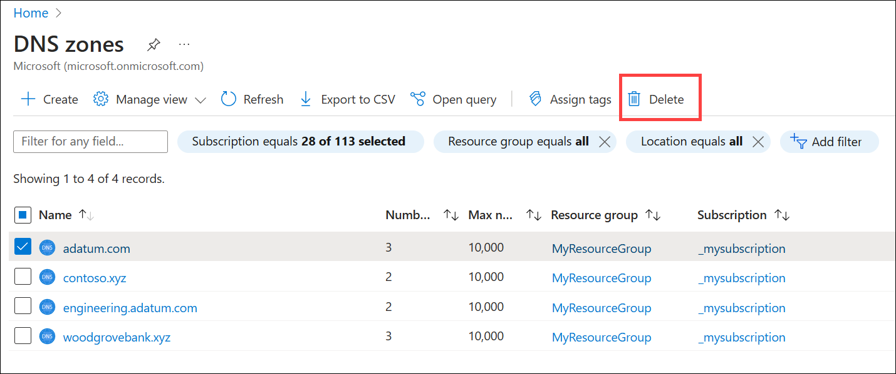

# How to manage DNS Zones in the Azure portal

> [!div class="op_single_selector"]
> * [Portal](dns-operations-dnszones-portal.md)
> * [PowerShell](dns-operations-dnszones.md)
> * [Azure classic CLI](./dns-operations-dnszones-cli.md)
> * [Azure CLI](dns-operations-dnszones-cli.md)

This article shows you how to manage your DNS zones by using the Azure portal. You can also manage your DNS zones using the cross-platform [Azure CLI](dns-operations-dnszones-cli.md) or the Azure [PowerShell](dns-operations-dnszones.md).

## Create a DNS zone

1. Sign in to the [Azure portal](https://portal.azure.com/).
2. On the top left-hand side of the screen, select **Create a resource**. 
3. Search for **DNS zone**, select **DNS zone**, and then select **Create**.
4. On the **Create DNS zone** page enter the following values, then select **Create**:

    | Setting | Details |
    | --- | --- |
    | **Subscription** | Select your subscription.|
    | **Resource group** | Select or create a new resource group. To learn more about resource groups, read the [Resource Manager](../azure-resource-manager/management/overview.md?toc=%2fazure%2fdns%2ftoc.json#resource-groups) overview article.|
    | **Name** | Enter a name for the DNS zone. For example: **contoso.com**. |
    | **Location** | Select the location for the resource group. The location will already be selected if you're using a previously created resource group. |

> [!NOTE]
> The resource group refers to the location of the resource group, and has no impact on the DNS zone. The DNS zone location is always "global", and is not shown.

## List DNS zones

In the search resources at the top of the Azure portal, search for **DNS zones**. Each DNS zone is its own resource. Information such as number of record sets, the resource group, and subscription are viewable from this page. **Name servers** aren't visible from this view. To view name servers for a DNS zone, select the zone. Name servers (NS records) are displayed on the Overview page. To view other record sets in the zone, select **Recordsets**.

## Delete a DNS zone

1. Using the list of DNS zones, select the checkbox next to the zone you wish to delete and then select **Delete**. 
2. Enter **delete** into the text box to confirm deletion and select **Delete**.

   

## Next steps

Learn how to work with your DNS Zone and records by visiting [Get started with Azure DNS using the Azure portal](dns-getstarted-portal.md).
