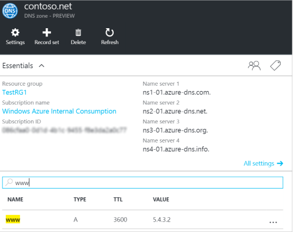
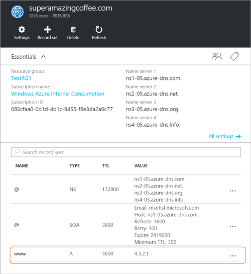
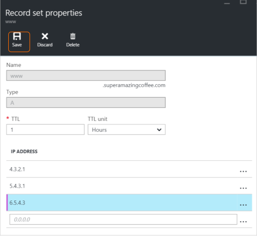
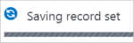
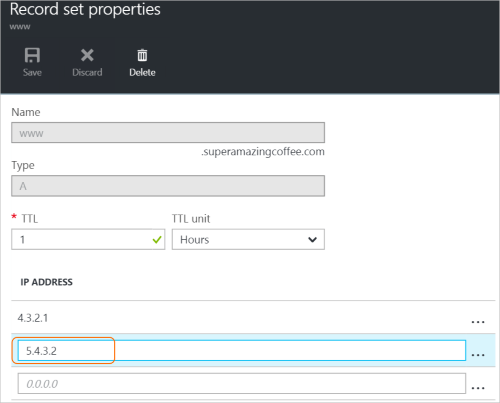
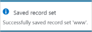
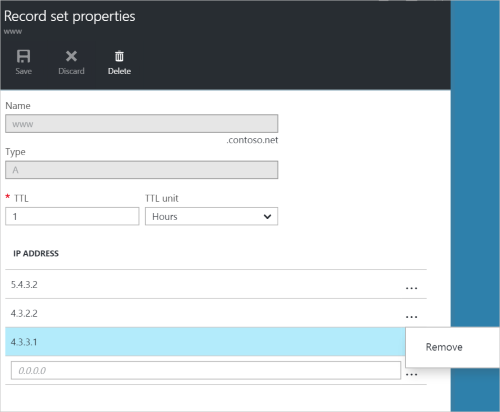

# Manage DNS records and record sets by using the Azure portal

This article shows you how to manage record sets and records for your DNS zone by using the Azure portal.

It's important to understand the difference between DNS record sets and individual DNS records. A record set is a collection of records in a zone that have the same name and are the same type. For more information, see [Create DNS record sets and records by using the Azure portal](dns-getstarted-create-recordset-portal.md).

## Create a new record set and record

To create a record set in the Azure portal, see [Create DNS records by using the Azure portal](dns-getstarted-create-recordset-portal.md).

## View a record set

1. In the Azure portal, go to the **DNS zone** blade.
2. Search for the record set and select it. This opens the record set properties.

    

## Add a new record to a record set

You can add up to 20 records to any record set. A record set cannot contain two identical records. Empty record sets (with zero records) can be created, but do not appear on the Azure DNS name servers. Record sets of type CNAME can contain one record at most.

1. On the **Record set properties** blade for your DNS zone, click the record set that you want to add a record to.

    

2. Specify the record set properties by filling in the fields.

    

3. Click **Save** at the top of the blade to save your settings. Then close the blade.
4. In the corner, you will see that the record is saving.

    

After the record has been saved, the values on the **DNS zone** blade will reflect the new record.

## Update a record

When you update a record in an existing record set, the fields you can update depend on the type of record you're working with.

1. On the **Record set properties** blade for your record set, search for the record.
2. Modify the record. When you modify a record, you can change the available settings for the record. In the following example, the **IP address** field is selected, and the IP address is in the process of being modified.

    

3. Click **Save** at the top of the blade to save your settings. In the upper right corner, you'll see the notification that the record has been saved.

    

After the record has been saved, the values for the record set on the **DNS zone** blade will reflect the updated record.

## Remove a record from a record set

You can use the Azure portal to remove records from a record set. Note that removing the last record from a record set does not delete the record set.

1. On the **Record set properties** blade for your record set, search for the record.
2. Click the record that you want to remove. Then select **Remove**.

    

3. Click **Save** at the top of the blade to save your settings.
4. After the record has been removed, the values for the record on the **DNS zone** blade will reflect the removal.

## Delete a record set

1. On the **Record set properties** blade for your record set, click **Delete**.

    

2. A message appears asking if you want to delete the record set.
3. Verify that the name matches the record set that you want to delete, and then click **Yes**.
4. On the **DNS zone** blade, verify that the record set is no longer visible.

## Work with NS and SOA records

NS and SOA records that are automatically created are managed differently from other record types.

### Modify SOA records

You cannot add or remove records from the automatically created SOA record set at the zone apex (name = "\@"). However, you can modify any of the parameters within the SOA record (except "Host") and the record set TTL.

### Modify NS records at the zone apex

The NS record set at the zone apex is automatically created with each DNS zone. It contains the names of the Azure DNS name servers assigned to the zone.

You can add additional name servers to this NS record set, to support co-hosting domains with more than one DNS provider. You can also modify the TTL and metadata for this record set. However, you cannot remove or modify the pre-populated Azure DNS name servers.

Note that this applies only to the NS record set at the zone apex. Other NS record sets in your zone (as used to delegate child zones) can be modified without constraint.

### Delete SOA or NS record sets

You cannot delete the SOA and NS record sets at the zone apex (name = "\@") that are created automatically when the zone is created. They are deleted automatically when you delete the zone.

## Next steps

* For more information about Azure DNS, see the [Azure DNS overview](dns-overview.md).
* For more information about automating DNS, see [Creating DNS zones and record sets using the .NET SDK](dns-sdk.md).
* For more information about reverse DNS records, see [Overview of reverse DNS and support in Azure](dns-reverse-dns-overview.md).
* For more information about Azure DNS alias records, see [Azure DNS alias records overview](dns-alias.md).
