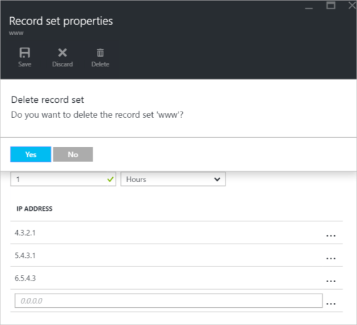

<properties 
   pageTitle="Manage DNS record sets and records using the Azure portal | Microsoft Azure" 
   description="Managing DNS record sets and records when hosting your domain on Azure DNS." 
   services="dns" 
   documentationCenter="na" 
   authors="cherylmc" 
   manager="carmon" 
   editor=""
   tags="azure-resource-manager"/>

<tags
   ms.service="dns"
   ms.devlang="na"
   ms.topic="article"
   ms.tgt_pltfrm="na"
   ms.workload="infrastructure-services" 
   ms.date="05/06/2016"
   ms.author="cherylmc"/>

# Manage DNS records and record sets using the Azure portal

> [AZURE.SELECTOR]
- [Azure Portal](dns-operations-recordsets-portal.md)
- [Azure CLI](dns-operations-recordsets-cli.md)
- [PowerShell](dns-operations-recordsets.md)

This article shows you how to manage record sets and records for your DNS zone using the Azure portal.

It's important to understand the difference between DNS record sets and individual DNS records. A record set is a collection of records in a zone with the same name and the same type. For more information, see [Understanding record sets and records](dns-getstarted-create-recordset-portal.md).

## Create a new record set and a record

To create a record set in the Azure portal, see [Create DNS records using the Azure portal](dns-getstarted-create-recordset-portal.md).

## View a record set

1. In the Azure portal, navigate to your DNS zone blade.

2. You can search for the record set and select it from the listed items. Click the record set to select it. This will open the record set properties.

	

## Add a new record to a record set

You can add up to 20 records to any record set. A record set cannot contain two identical records. Empty record sets (with zero records) can be created, but do not appear at the Azure DNS name servers. Record sets of type CNAME can contain, at most, one record.

1. From the **Record set properties** blade for your DNS zone, click the record set that you want to add a record to.

	

2. Specify the record settings by filling in the fields.

	

2. Click **Save** at the top of the blade to save your settings before closing the blade.

3. In the corner, you will see that the record is saving.

	

4. Once the record has been saved, the values for the record set on the DNS blade will reflect the new record.

## Update a record

When updating a record in an existing record set, the available fields you can update depend on the type of record you are working with. 

1. From the **Record set properties** blade for your record set, search for the record.

2. Modify the record. When you modify a record, you can either change the available settings for the record. In the example below, we clicked the IP address field and the IP address is in the process of being modified.

	

3. Click **Save** at the top of the blade to save your settings. You'll see the notification that the record has been saved in the upper right corner.
	
	

3. Once the record has been saved, the values for the record set on the DNS blade will reflect the updated record.

## Remove a record from a record set

You can use the Azure portal to remove records from a record set. Note that removing the last record from a record set does not delete the record set. 

1. From the **Record set properties** blade for your record set, search for the record.

2. Click the record that you want to remove. Then click **Remove**.

	

3. Click **Save** at the top of the blade to save your settings.

3. Once the record has been removed, the values for the record set on the DNS blade will reflect the record was removed.

## Delete a record set

1. From the **Record set properties** blade for your record set, click **Delete**. 

	

2. A message will appear asking if you want to delete the record set 'name_ of _ record _set'.

3. Verify that the name matches the record set that you want to delete, then click **Yes**.

4. From the DNS zone blade, you can verify that the record set is no longer visible.

## Working with  NS and SOA records

NS and SOA records that are automatically created are managed differently from other record types.

### Modifying SOA records

You cannot add or remove records from the automatically-created SOA record set at the zone apex (name = ‘@’), but you can modify any of the parameters within the SOA record (except 'Host') and the record set TTL.

### Modifying NS records at zone apex

You cannot add to, remove or modify the records in the automatically-created NS record set at the zone apex (name = ‘@’). The only change permitted is to modify the record set TTL.

### Deleting SOA or NS record sets

You cannot delete the SOA and NS record sets at the zone apex (name = ‘@’) that are created automatically when the zone is created.  They will be deleted automatically when deleting the zone.

## Next steps

For more information about Azure DNS, see the [Azure DNS Overview](dns-overview.md). For information about automating DNS, see [Creating DNS zones and record sets using the .NET SDK](dns-sdk.md).

If you want to work with reverse DNS records, see [How to manage reverse DNS records](dns-reverse-dns-record-operations-ps.md).
 
