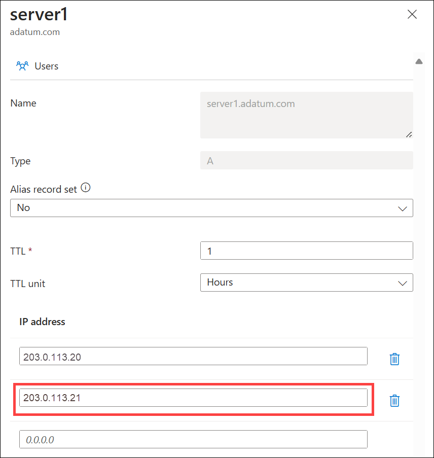

# Manage DNS records and record sets by using the Azure portal

This article shows you how to manage record sets and records for your DNS zone by using the Azure portal.

It's important to understand the difference between DNS record sets and individual DNS records. A record set is a collection of records in a zone that have the same name and are the same type. For more information, see [Create DNS record sets and records by using the Azure portal](./dns-getstarted-portal.md).

## Create a new record set and record

To create a record set in the Azure portal, see [Create an Azure DNS zone and record using the Azure portal](./dns-getstarted-portal.md).

## View a record set

1. In the Azure portal, go to the **DNS zones** overview page.

2. Select your DNS zone and then select **Recordsets**. The current record sets are displayed.

   

## Add a new record to a record set

You can add up to 20 records to any record set. A record set may not contain two identical records. Empty record sets (with zero records) can be created, but don't appear on the Azure DNS name servers. Record sets of type CNAME can contain only one record.

1. On the **Recordsets** page for your DNS zone, select the edit icon next to the record set that you want to modify.

   

2. Specify the record set properties by filling in the fields.

   

3. Select **Apply** at the bottom of the page to save your settings.

After the record has been saved, the values on the **Recordsets** page will reflect the new record.

## Update a record

When you update a record in an existing record set, the fields you can update depend on the type of record you're working with.

1. On the **Recordsets** page for your DNS zone, select the edit icon next to the record set that you want to modify.
2. Modify the record set properties by filling in the fields.
3. Select **Apply** at the bottom of the page to save your settings.

After the record has been saved, the values on the **Recordsets** page will reflect the new record.

## Remove a record from a record set

You can use the Azure portal to remove records from a record set. Removing the last record from a record set doesn't delete the record set.

1. On the **Recordsets** page for your DNS zone, select the edit icon next to the record set that you want to modify.
2. Remove the records you wish to delete by clearing the fields.
3. Select **Apply** at the bottom of the page to save your settings.
4. After the record set data has been removed, the values for the record on the **Recordsets** page will reflect the removal.

## Delete a record set

1. On the **Recordsets** page for your record set, select trash icon next to the record set you wish to remove.
2. A message appears asking if you want to delete the record set.
3. Verify that the name matches the record set that you want to delete, and then select **Yes**.

   

4. On the **DNS zone** page, verify that the record set is no longer visible.

> [!NOTE]
> If an IP address associated with a recrodset is [locked](/azure/azure-resource-manager/management/lock-resources) you must remove the lock prior to deleting the recordset.

## Work with NS and SOA records

NS and SOA records that are automatically created are managed differently from other record types.

### Modify SOA records

You can't add or remove records from the automatically created SOA record set at the zone apex (name = "\@"). However, you can modify any of the parameters within the SOA record, except "Host" and the record set TTL.

### Modify NS records at the zone apex

The NS record set at the zone apex is automatically created with each DNS zone. It contains the names of the Azure DNS name servers assigned to the zone.

You can add more name servers to this NS record set, to support cohosting domains with more than one DNS provider. You can also modify the TTL and metadata for this record set. However, you can't remove or modify the pre-populated Azure DNS name servers.

This restriction only applies to the NS record set at the zone apex. Other NS record sets in your zone (as used to delegate child zones) can be modified without constraint.

### Delete SOA or NS record sets

You can't delete the SOA and NS record sets at the zone apex (name = "\@") that gets automatically created when the zone gets created. They're deleted automatically when you delete the zone.

## Next steps

* For more information about Azure DNS, see the [Azure DNS overview](dns-overview.md).
* For more information about automating DNS, see [Creating DNS zones and record sets using the .NET SDK](dns-sdk.md).
* For more information about reverse DNS records, see [Overview of reverse DNS and support in Azure](dns-reverse-dns-overview.md).
* For more information about Azure DNS alias records, see [Azure DNS alias records overview](dns-alias.md).