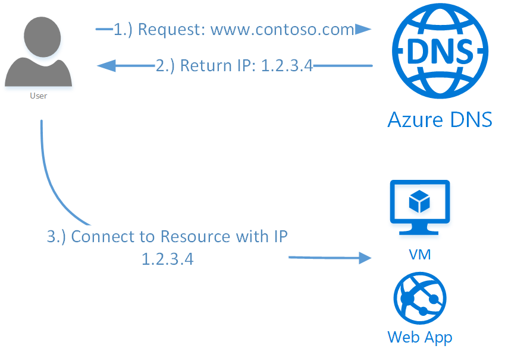

# Azure DNS overview

The Domain Name System, or DNS, is responsible for translating (or resolving) a website or service name to its IP address. Azure DNS is a hosting service for DNS domains, providing name resolution using Microsoft Azure infrastructure. By hosting your domains in Azure, you can manage your DNS records using the same credentials, APIs, tools, and billing as your other Azure services.

## Features

* **Reliability and performance** - DNS domains in Azure DNS are hosted on Azure's global network of DNS name servers. We use Anycast networking so that each DNS query is answered by the closest available DNS server. This provides both fast performance and high availability for your domain.

* **Seamless integration** - The Azure DNS service can be used to manage DNS records for your Azure services and can be used to provide DNS for your external resources as well. Azure DNS is integrated in the Azure portal and uses the same credentials, billing and support contract as your other Azure services.

* **Security** - The Azure DNS service is based on Azure Resource Manager. As such, it benefits from Resource Manager features such as role-based access control, audit logs, and resource locking. Your domains and records can be managed via the Azure portal, Azure PowerShell cmdlets, and the cross-platform Azure CLI. Applications requiring automatic DNS management can integrate with the service via the REST API and SDKs.

Azure DNS does not currently support purchasing of domain names. If you want to purchase domains, you need to use a third-party domain name registrar. The registrar typically charges a small annual fee. The domains can then be hosted in Azure DNS for management of DNS records. See [Delegate a Domain to Azure DNS](dns-domain-delegation.md) for details.

## Pricing

DNS billing is based on the number of DNS zones hosted in Azure and by the number of DNS queries. To learn more about pricing visit [Azure DNS Pricing](https://azure.microsoft.com/pricing/details/dns/).

## FAQ

For frequently asked questions about Azure DNS, see the [Azure DNS FAQ](dns-faq.md).

## Next steps

Learn about DNS zones and records by visiting: [DNS zones and records overview](dns-zones-records.md).

Learn how to [create a DNS zone](./dns-getstarted-create-dnszone-portal.md) in Azure DNS.

