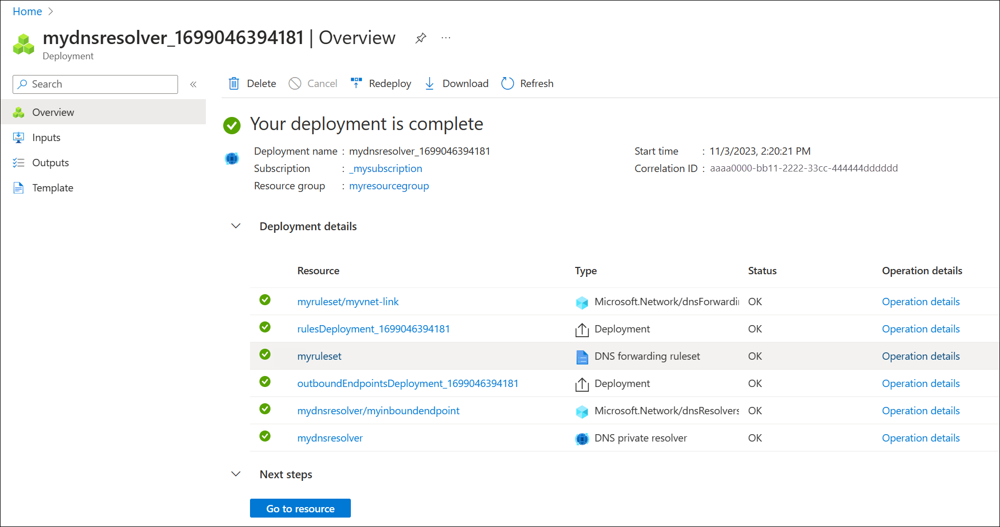

--- 
title: Quickstart - Create an Azure DNS Private Resolver using the Azure portal
description: In this quickstart, you create and test a private DNS resolver in Azure DNS. This article is a step-by-step guide to create and manage your first private DNS resolver using the Azure portal.
services: dns
author: greg-lindsay
ms.author: greglin
ms.date: 11/03/2023
ms.topic: quickstart
ms.service: dns
ms.custom: mode-ui, ignite-2022
#Customer intent: As an experienced network administrator, I want to create an  Azure private DNS resolver, so I can resolve host names on my private virtual networks.
---

# Quickstart: Create an Azure DNS Private Resolver using the Azure portal

This quickstart walks you through the steps to create an Azure DNS Private Resolver using the Azure portal. If you prefer, you can complete this quickstart using [Azure PowerShell](private-dns-getstarted-powershell.md).

Azure DNS Private Resolver enables you to query Azure DNS private zones from an on-premises environment, and vice versa, without deploying VM based DNS servers. You no longer need to provision IaaS based solutions on your virtual networks to resolve names registered on Azure private DNS zones. You can configure conditional forwarding of domains back to on-premises, multicloud and public DNS servers. For more information, including benefits, capabilities, and regional availability, see [What is Azure DNS Private Resolver](dns-private-resolver-overview.md).

## In this article: 

- Two VNets are created: **myvnet** and **myvnet2**.
- An Azure DNS Private Resolver is created in the first VNet with an inbound endpoint at **10.0.0.4**.
- A DNS forwarding ruleset is created for the private resolver.
- The DNS forwarding ruleset is linked to the second VNet.
- Example rules are added to the DNS forwarding ruleset.

This article doesn't demonstrate DNS forwarding to an on-premises network. For more information, see [Resolve Azure and on-premises domains](private-resolver-hybrid-dns.md).

The following figure summarizes the setup used in this article:

## Prerequisites

An Azure subscription is required.
- If you don't already have an Azure subscription, you can create a [free account](https://azure.microsoft.com/free/?WT.mc_id=A261C142F).

## Register the Microsoft.Network provider namespace

Before you can use **Microsoft.Network** services with your Azure subscription, you must register the **Microsoft.Network** namespace:

1. Select the **Subscription** blade in the Azure portal, and then choose your subscription by selecting on it.
2. Under **Settings** select **Resource Providers**.
3. Select **Microsoft.Network** and then select **Register**.

## Create a resource group

First, create or choose an existing resource group to host the resources for your DNS resolver. The resource group must be in a [supported region](dns-private-resolver-overview.md#regional-availability). In this example, the location is **West Central US**. To create a new resource group:

1. Select [Create a resource group](https://portal.azure.com/#create/Microsoft.ResourceGroup).
2. Select your subscription name, enter a name for the resource group, and choose a supported region.
3. Select **Review + create**, and then select **Create**.

    

## Create a virtual network

Next, add a virtual network to the resource group that you created, and configure subnets.

1. In the Azure portal, search for and select **Virtual networks**.
2. On the **Virtual networks** page, select **Create**.
3. On the **Basics** tab, select the resource group you just created, enter **myvnet** for the virtual network name, and select the **Region** that is the same as your resource group.
4. Select the **IP Addresses** tab and enter an **IPv4 address space** of 10.0.0.0/16. This address range might be entered by default.
5. Select the **default** subnet.
6. Enter the following values on the **Edit subnet** page:
    - Name: snet-inbound
    - IPv4 address range: 10.0.0.0.16
    - Starting address: 10.0.0.0
    - Size: /28 (16 IP addresses)
    - Select **Save**
7. Select **Add a subnet** and enter the following values on the **Add a subnet** page:
    - Subnet purpose: Default
    - Name: snet-outbound
    - IPv4 address range: 10.0.0.0/16
    - Starting address: 10.0.1.0
    - Size: /28 (16 IP addresses)
    - Select **Add**
8. Select the **Review + create** tab and then select **Create**.

    

## Create a DNS resolver inside the virtual network 

1. In the Azure portal, search for **DNS Private Resolvers**.
2. Select **DNS Private Resolvers**, select **Create**, and then on the **Basics** tab for **Create a DNS Private Resolver** enter the following:
    - Subscription: Choose the subscription name you're using.
    - Resource group: Choose the name of the resource group that you created.
    - Name: Enter a name for your DNS resolver (ex: mydnsresolver).
    - Region: Choose the region you used for the virtual network.
    - Virtual Network: Select the virtual network that you created.

    Don't create the DNS resolver yet.

    

3. Select the **Inbound Endpoints** tab, select **Add an endpoint**, and then enter a name next to **Endpoint name** (ex: myinboundendpoint).
4. Next to **Subnet**, select the inbound endpoint subnet you created (ex: snet-inbound, 10.0.0.0/28).
5. Next to **IP address assignment**, select **Static**.
6. Next to IP address, enter **10.0.0.4** and then select **Save**.

   > [!NOTE]
   > You can choose a static or dynamic IP address for the inbound endpoint. A dynamic IP address is used by default. Typically the first available [non-reserved](../virtual-network/virtual-networks-faq.md#are-there-any-restrictions-on-using-ip-addresses-within-these-subnets) IP address is assigned (example: 10.0.0.4). This dynamic IP address does not change unless the endpoint is deleted and reprovisioned (for example using a different subnet). In this example **Static** is selected and the first available IP address is entered.

5. Select the **Outbound Endpoints** tab, select **Add an endpoint**, and then enter a name next to **Endpoint name** (ex: myoutboundendpoint).
6. Next to **Subnet**, select the outbound endpoint subnet you created (ex: snet-outbound, 10.1.1.0/28) and then select **Save**.
7. Select the **Ruleset** tab, select **Add a ruleset**, and enter the following:
    - Ruleset name: Enter a name for your ruleset (ex: **myruleset**).
    - Endpoints: Select the outbound endpoint that you created (ex: myoutboundendpoint).
8. Under **Rules**, select **Add** and enter your conditional DNS forwarding rules. For example:
    - Rule name: Enter a rule name (ex: contosocom).
    - Domain Name: Enter a domain name with a trailing dot (ex: contoso.com.).
    - Rule State: Choose **Enabled** or **Disabled**. The default is enabled.
    - Under **Destination** enter a desired destination IPv4 address (ex: 11.0.1.4).
    - If desired, select **Add a destination** again to add another destination IPv4 address (ex: 11.0.1.5).  
    - When you're finished adding destination IP addresses, select **Add**.
9. Select **Review and Create**, and then select **Create**.

    

    This example has only one conditional forwarding rule, but you can create many. Edit the rules to enable or disable them as needed. You can also add or edit rules and rulesets at any time after deployment.

    After selecting **Create**, the new DNS resolver begins deployment. This process might take a minute or two. The status of each component is displayed during deployment.

    

## Create a second virtual network

Create a second virtual network to simulate an on-premises or other environment. To create a second virtual network:

1. Select **Virtual Networks** from the **Azure services** list, or search for **Virtual Networks** and then select **Virtual Networks**.
2. Select **Create**, and then on the **Basics** tab select your subscription and choose the same resource group that you have been using in this guide (ex: myresourcegroup).
3. Next to **Name**, enter a name for the new virtual network (ex: myvnet2).
4. Verify that the **Region** selected is the same region used previously in this guide (ex: West Central US).
5. Select the **IP Addresses** tab and edit the default IP address space. Replace the address space with a simulated on-premises address space (ex: 10.1.0.0/16). 
6. Select and edit the **default** subnet:
    - Subnet purpose: Default
    - Name: backendsubnet
    - Subnet address range: 10.1.0.0/16
    - Starting address: 10.1.0.0
    - Size: /24 (256 addresses)
7. Select **Save**, select **Review + create**, and then select **Create**.

    

## Link your forwarding ruleset to the second virtual network

> [!NOTE]
> In this procedure, a forwarding ruleset is linked to a VNet that was created earlier to simulate an on-premises environment. It is not possible to create a ruleset link to non-Azure resources. The purpose of the following procedure is only to demonstrate how ruleset links can be added or deleted. To understand how a private resolver can be used to resolve on-premises names, see [Resolve Azure and on-premises domains](private-resolver-hybrid-dns.md). 

To apply your forwarding ruleset to the second virtual network, you must create a virtual link.

1. Search for **DNS forwarding rulesets** in the Azure services list and select your ruleset (ex: **myruleset**).
2. Under **Settings**, select **Virtual Network Links**
    - The link **myvnet-link** is already present. This was created automatically when the ruleset was provisioned.
3. Select **Add**, choose **myvnet2** from the **Virtual Network** drop-down list. Use the default **Link Name** of **myvnet2-link**.
3. Select **Add** and verify that the link was added successfully.  You might need to refresh the page.

    

## Delete a virtual network link

Later in this article a rule is created using the private resolver inbound endpoint as a destination. This configuration can cause a DNS resolution loop if the VNet where the resolver is provisioned is also linked to the ruleset.  To fix this issue, remove the link to **myvnet**.

1. Search for **DNS forwarding rulesets** in the Azure services list and select your ruleset (ex: **myruleset**).
2. Select **Virtual Network Links**, choose **myvnet-link**, select **Remove** and select **OK**.

    

## Configure a DNS forwarding ruleset

Add or remove specific rules your DNS forwarding ruleset as desired, such as:
- A rule to resolve an Azure Private DNS zone linked to your virtual network: azure.contoso.com.
- A rule to resolve an on-premises zone: internal.contoso.com.
- A wildcard rule to forward unmatched DNS queries to a protective DNS service.

### Delete a rule from the forwarding ruleset

Individual rules can be deleted or disabled. In this example, a rule is deleted.

1. Search for **DNS Forwarding Rulesets** in the Azure Services list and select it.
2. Select the ruleset you previously configured (ex: **myruleset**) and then under **Settings** select **Rules**.
3. Select the **contosocom** sample rule that you previously configured, select **Delete**, and then select **OK**.

### Add rules to the forwarding ruleset

Add three new conditional forwarding rules to the ruleset. 

1. On the **myruleset | Rules** page, select **Add**, and enter the following rule data:
    - Rule Name: **AzurePrivate**
    - Domain Name: **azure.contoso.com.**
    - Rule State: **Enabled**
2. Under **Destination IP address** enter 10.0.0.4, and then select **Add**.
3. On the **myruleset | Rules** page, select **Add**, and enter the following rule data:
    - Rule Name: **Internal**
    - Domain Name: **internal.contoso.com.**
    - Rule State: **Enabled**
4. Under **Destination IP address** enter 10.1.0.5, and then select **Add**.
5. On the **myruleset | Rules** page, select **Add**, and enter the following rule data:
    - Rule Name: **Wildcard**
    - Domain Name: **.** (enter only a dot)
    - Rule State: **Enabled**
6. Under **Destination IP address** enter 10.5.5.5, and then select **Add**.

    

In this example: 
- 10.0.0.4 is the resolver's inbound endpoint. 
- 10.1.0.5 is an on-premises DNS server.
- 10.5.5.5 is a protective DNS service.

## Test the private resolver

You should now be able to send DNS traffic to your DNS resolver and resolve records based on your forwarding rulesets, including:
- Azure DNS private zones linked to the virtual network where the resolver is deployed.
    - If a VNet is linked to the private zone itself, it doesn't need a rule for the private zone in the forwarding ruleset. Resources in the VNet can directly resolve the zone. However, in this example, the second VNet isn't linked to the private zone. It can still resolve the zone by using the forwarding ruleset. For more information about this design, see [Private Resolver Architecture](private-resolver-architecture.md).
- Private DNS zones that are hosted on-premises.
- DNS zones in the public internet DNS namespace.

## Next steps

> [!div class="nextstepaction"]
> [What is Azure DNS Private Resolver?](dns-private-resolver-overview.md)
