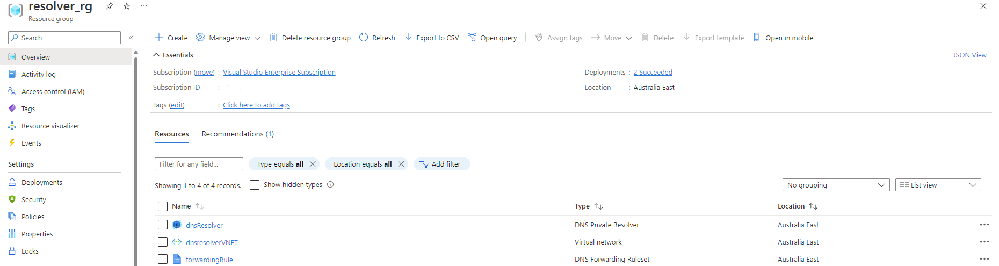
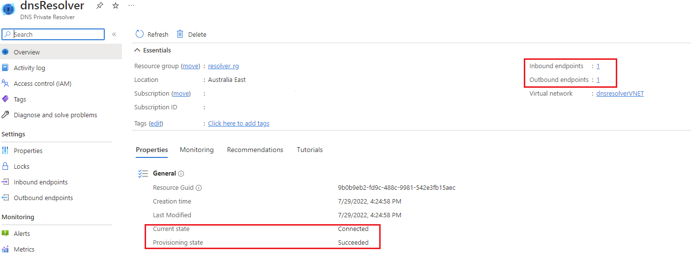
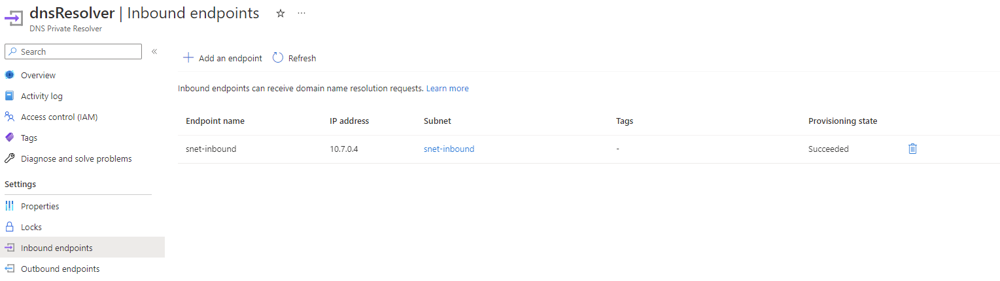
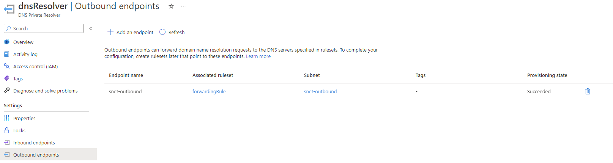
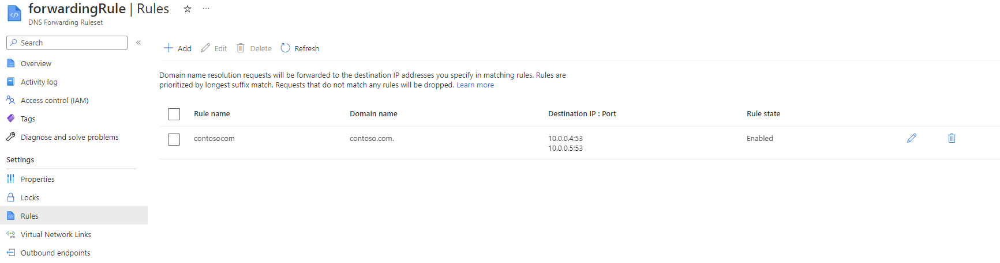
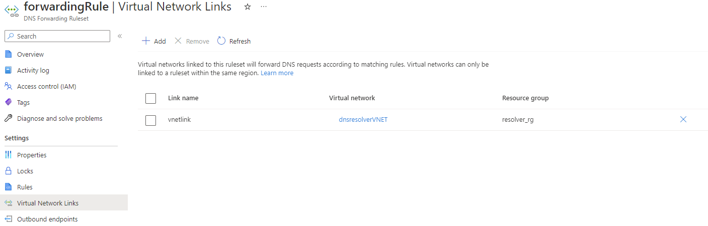

# Quickstart: Create an Azure DNS Private Resolver using an ARM template

This quickstart describes how to use an Azure Resource Manager template (ARM template) to create Azure DNS Private Resolver.

[!INCLUDE [About Azure Resource Manager](../../includes/resource-manager-quickstart-introduction.md)]

If your environment meets the prerequisites and you're familiar with using ARM templates, select the **Deploy to Azure** button. The template will open in the Azure portal.

[](https://portal.azure.com/#create/Microsoft.Template/uri/https%3A%2F%2Fraw.githubusercontent.com%2FAzure%2Fazure-quickstart-templates%2Fmaster%2Fquickstarts%2Fmicrosoft.network%2Fazure-dns-private-resolver%2Fazuredeploy.json)

## Prerequisites

If you don't have an Azure subscription, create a [free account](https://azure.microsoft.com/free/?WT.mc_id=A261C142F) before you begin.

## Review the template

The template used in this quickstart is from [Azure Quickstart Templates](/samples/azure/azure-quickstart-templates/azure-dns-private-resolver/).

This template is configured to create a:

- Virtual network
- DNS resolver
- Inbound & outbound endpoints
- Forwarding Rules & rulesets.

:::code language="bicep" source="~/quickstart-templates/quickstarts/microsoft.network/azure-dns-private-resolver/azuredeploy.json":::

Seven resources have been defined in this template:

- [**Microsoft.Network/virtualnetworks**](/azure/templates/microsoft.network/virtualnetworks)
- [**Microsoft.Network/dnsResolvers**](/azure/templates/microsoft.network/dnsresolvers)
- [**Microsoft.Network/dnsResolvers/inboundEndpoints**](/azure/templates/microsoft.network/dnsresolvers/inboundendpoints)
- [**Microsoft.Network/dnsResolvers/outboundEndpoints**](/azure/templates/microsoft.network/dnsresolvers/outboundendpoints)
- [**Microsoft.Network/dnsForwardingRulesets**](/azure/templates/microsoft.network/dnsforwardingrulesets)
- [**Microsoft.Network/dnsForwardingRulesets/forwardingRules**](/azure/templates/microsoft.network/dnsforwardingrulesets/forwardingrules)
- [**Microsoft.Network/dnsForwardingRulesets/virtualNetworkLinks**](/azure/templates/microsoft.network/dnsforwardingrulesets/virtualnetworklinks)


## Deploy the template

# [CLI](#tab/CLI)

````azurecli-interactive
read -p "Enter the location: " location
resourceGroupName="exampleRG"
templateUri="https://raw.githubusercontent.com/Azure/azure-quickstart-templates/master/quickstarts/microsoft.network/azure-dns-private-resolver/azuredeploy.json"

az group create \
--name $resourceGroupName \
--locataion $location

az deployment group create \
--resource-group $resourceGroupName \
--template-uri $templateUri
````

# [PowerShell](#tab/PowerShell)
````azurepowershell-interactive
$location = Read-Host -Prompt "Enter the location: "
$templateUri = "https://raw.githubusercontent.com/Azure/azure-quickstart-templates/master/quickstarts/microsoft.network/azure-dns-private-resolver/azuredeploy.json"

$resourceGroupName = "exampleRG"

New-AzResourceGroup -Name $resourceGroupName -Location $location
New-AzResourceGroupDeployment -ResourceGroupName $resourceGroupName -TemplateUri $templateUri
````
---

## Validate the deployment

1. Sign in to the [Azure portal](https://portal.azure.com).

1. Select **Resource groups** from the left pane.

1. Select the resource group that you created in the previous section.

1. The resource group should contain the following resources:

    [ ](./media/dns-resolver-getstarted-template/dns-resolver-resource-group.png#lightbox)

1. Select the DNS private resolver service to verify the provisioning and current state.

   [ ](./media/dns-resolver-getstarted-template/resolver-page.png#lightbox)

1. Select the Inbound Endpoints and Outbound Endpoints to verify that the endpoints are created and the outbound endpoint is associated with the forwarding ruleset.

    [ ](./media/dns-resolver-getstarted-template/resolver-inbound-endpoint.png#lightbox)

    [ ](./media/dns-resolver-getstarted-template/resolver-outbound-endpoint.png#lightbox)

1. Select the **Associated ruleset** from the outbound endpoint page to verify the forwarding ruleset and rules creation.

    [ ](./media/dns-resolver-getstarted-template/resolver-forwarding-rule.png#lightbox)

1. Verify the resolver Virtual network is linked with forwarding ruleset.

    [ ](./media/dns-resolver-getstarted-template/resolver-vnet-link.png#lightbox)

## Next steps

In this quickstart, you created a virtual network and DNS private resolver. Now configure name resolution for Azure and on-premises domains
- [Resolve Azure and on-premises domains](private-resolver-hybrid-dns.md)
