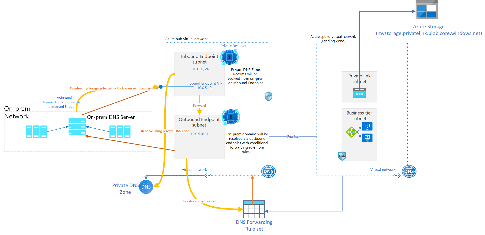

# What is Azure DNS Private Resolver? 

Azure DNS Private Resolver is a new service that enables you to query Azure DNS private zones from an on-premises environment and vice versa without deploying VM based DNS servers. 

## How does it work?

Azure DNS Private Resolver requires an [Azure Virtual Network](../virtual-network/virtual-networks-overview.md).  When you create an Azure DNS Private Resolver inside a virtual network, one or more [inbound endpoints](#inbound-endpoints) are established that can be used as the destination for DNS queries. The resolver's [outbound endpoint](#outbound-endpoints) processes DNS queries based on a [DNS forwarding ruleset](#dns-forwarding-rulesets) that you configure.  DNS queries that are initiated in networks linked to a ruleset can be sent to other DNS servers.

You don't need to change any DNS client settings on your virtual machines (VMs) to use the Azure DNS Private Resolver.

The DNS query process when using an Azure DNS Private Resolver is summarized below:

1. A client in a virtual network issues a DNS query.
2. If the DNS servers for this virtual network are [specified as custom](../virtual-network/virtual-networks-name-resolution-for-vms-and-role-instances.md#specify-dns-servers), then the query is forwarded to the specified IP addresses.
3. If Default (Azure-provided) DNS servers are configured in the virtual network, and there are Private DNS zones [linked to the same virtual network](private-dns-virtual-network-links.md), these zones are consulted.
4. If the query doesn't match a Private DNS zone linked to the virtual network, then [Virtual network links](#virtual-network-links) for [DNS forwarding rulesets](#dns-forwarding-rulesets) are consulted.
5. If no ruleset links are present, then Azure DNS is used to resolve the query.
6. If ruleset links are present, the [DNS forwarding rules](#dns-forwarding-rules) are evaluated.
7. If a suffix match is found, the query is forwarded to the specified address.
8. If multiple matches are present, the longest suffix is used.
9. If no match is found, no DNS forwarding occurs and Azure DNS is used to resolve the query.

The architecture for Azure DNS Private Resolver is summarized in the following figure. DNS resolution between Azure virtual networks and on-premises networks requires [Azure ExpressRoute](../expressroute/expressroute-introduction.md) or a [VPN](../vpn-gateway/vpn-gateway-about-vpngateways.md).

Figure 1: Azure DNS Private Resolver architecture

For more information about creating a private DNS resolver, see:
- [Quickstart: Create an Azure DNS Private Resolver using the Azure portal](dns-private-resolver-get-started-portal.md)
- [Quickstart: Create an Azure DNS Private Resolver using Azure PowerShell](dns-private-resolver-get-started-powershell.md)

## Azure DNS Private Resolver benefits

Azure DNS Private Resolver provides the following benefits:
* Fully managed: Built-in high availability, zone redundancy.
* Cost reduction: Reduce operating costs and run at a fraction of the price of traditional IaaS solutions.
* Private access to your Private DNS zones: Conditionally forward to and from on-premises.
* Scalability: High performance per endpoint.
* DevOps Friendly: Build your pipelines with Terraform, ARM, or Bicep.

## Regional availability

See [Azure Products by Region - Azure DNS](https://azure.microsoft.com/explore/global-infrastructure/products-by-region/?products=dns&regions=all).

## Data residency

Azure DNS Private Resolver doesn't move or store customer data out of the region where the resolver is deployed.

## DNS resolver endpoints and rulesets

A summary of resolver endpoints and rulesets is provided in this article. For detailed information about endpoints and rulesets, see [Azure DNS Private Resolver endpoints and rulesets](private-resolver-endpoints-rulesets.md).

## Inbound endpoints

An inbound endpoint enables name resolution from on-premises or other private locations via an IP address that is part of your private virtual network address space. To resolve your Azure private DNS zone from on-premises, enter the IP address of the inbound endpoint into your on-premises DNS conditional forwarder. The on-premises DNS conditional forwarder must have a network connection to the virtual network.

The inbound endpoint requires a subnet in the VNet where it’s provisioned. The subnet can only be delegated to **Microsoft.Network/dnsResolvers** and can't be used for other services. DNS queries received by the inbound endpoint ingress to Azure. You can resolve names in scenarios where you have Private DNS zones, including VMs that are using auto registration, or Private Link enabled services.

> [!NOTE]
> The IP address assigned to an inbound endpoint can be either static or dynamic. You can use both Azure Portal and [PowerShell to provision the inbound endpoint](dns-private-resolver-get-started-powershell.md#create-the-inbound-endpoint) with a static IP address. The IP address that you choose can't be a [reserved IP address in the subnet](../virtual-network/virtual-networks-faq.md#are-there-any-restrictions-on-using-ip-addresses-within-these-subnets). When using dynamic IP to provision the inbound endpoint, then typically the fifth IP address in the subnet is dynamically assigned. If the inbound endpoint is reprovisioned, this IP address might change, but normally the 5th IP address in the subnet is used again. The IP address does not change unless the inbound endpoint is reprovisioned.

## Outbound endpoints

An outbound endpoint enables conditional forwarding name resolution from Azure to on-premises, other cloud providers, or external DNS servers. This endpoint requires a dedicated subnet in the VNet where it’s provisioned, with no other service running in the subnet, and can only be delegated to **Microsoft.Network/dnsResolvers**. DNS queries sent to the outbound endpoint will egress from Azure.

## Virtual network links

Virtual network links enable name resolution for virtual networks that are linked to an outbound endpoint with a DNS forwarding ruleset. This is a 1:1 relationship.

## DNS forwarding rulesets

A DNS forwarding ruleset is a group of DNS forwarding rules (up to 1000) that can be applied to one or more outbound endpoints, or linked to one or more virtual networks. This is a 1:N relationship. Rulesets are associated with a specific outbound endpoint. For more information, see [DNS forwarding rulesets](private-resolver-endpoints-rulesets.md#dns-forwarding-rulesets).

## DNS forwarding rules

A DNS forwarding rule includes one or more target DNS servers that are used for conditional forwarding, and is represented by:
- A domain name
- A target IP address 
- A target Port and Protocol (UDP or TCP)

## Restrictions

The following limits currently apply to Azure DNS Private Resolver: 

[!INCLUDE [dns-limits-private-resolver](../../includes/dns-limits-private-resolver.md)]

### Virtual network restrictions 

The following restrictions hold with respect to virtual networks:
- A DNS resolver can only reference a virtual network in the same region as the DNS resolver.
- A virtual network can't be shared between multiple DNS resolvers. A single virtual network can only be referenced by a single DNS resolver.

### Subnet restrictions 

Subnets used for DNS resolver have the following limitations:
- A subnet must be a minimum of /28 address space or a maximum of /24 address space. A /28 subnet is sufficient to accommodate current endpoint limits. A subnet size of /27 to /24 can provide flexibility if these limits change.
- A subnet can't be shared between multiple DNS resolver endpoints. A single subnet can only be used by a single DNS resolver endpoint.
- All IP configurations for a DNS resolver inbound endpoint must reference the same subnet. Spanning multiple subnets in the IP configuration for a single DNS resolver inbound endpoint isn't allowed.
- The subnet used for a DNS resolver inbound endpoint must be within the virtual network referenced by the parent DNS resolver.

### Outbound endpoint restrictions

Outbound endpoints have the following limitations:
- An outbound endpoint can't be deleted unless the DNS forwarding ruleset and the virtual network links under it are deleted.

### Ruleset restrictions

- Rulesets can have up to 1000 rules.

### Other restrictions

- IPv6 enabled subnets aren't supported.
- DNS private resolver does not support Azure ExpressRoute FastPath.

## Next steps

* Learn how to create an Azure DNS Private Resolver by using [Azure PowerShell](./dns-private-resolver-get-started-powershell.md) or [Azure portal](./dns-private-resolver-get-started-portal.md).
* Understand how to [Resolve Azure and on-premises domains](private-resolver-hybrid-dns.md) using the Azure DNS Private Resolver.
* Learn about [Azure DNS Private Resolver endpoints and rulesets](private-resolver-endpoints-rulesets.md).
* Learn how to [Set up DNS failover using private resolvers](tutorial-dns-private-resolver-failover.md)
* Learn how to [configure hybrid DNS](private-resolver-hybrid-dns.md) using private resolvers.
* Learn about some of the other key [networking capabilities](../networking/fundamentals/networking-overview.md) of Azure.
* [Learn module: Introduction to Azure DNS](/training/modules/intro-to-azure-dns).
