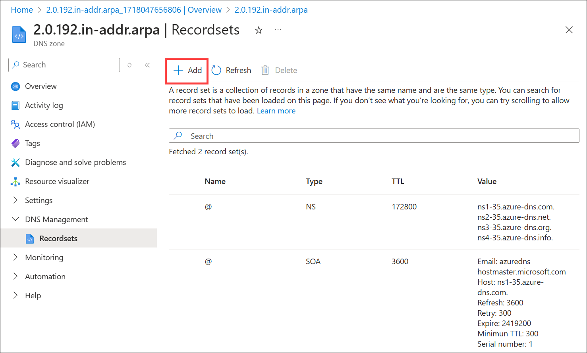

# Host reverse DNS lookup zones in Azure DNS

[!INCLUDE [updated-for-az](~/reusable-content/ce-skilling/azure/includes/updated-for-az.md)]

This article explains how to host reverse DNS lookup zones for your assigned IP ranges with Azure DNS. The IP ranges represented by the reverse lookup zones must be assigned to your organization, typically by your ISP.

To configure reverse DNS for an Azure-owned IP address assigned to your Azure service, see [Configure reverse DNS for services hosted in Azure](dns-reverse-dns-for-azure-services.md).

Before reading this article, you should familiarize yourself with the [overview of reverse DNS](dns-reverse-dns-overview.md) and it's supported in Azure.

In this article, you learn how to create your first reverse lookup DNS zone and record by using the Azure portal, Azure PowerShell, Azure classic CLI, and Azure CLI.

## Create a reverse lookup DNS zone

1. Sign in to the [Azure portal](https://portal.azure.com/).
2. On the top left-hand side of the screen, select **Create a resource**. 
3. Search for **DNS zone**, select **DNS zone**, and then select **Create**.
4. On the **Create DNS zone** page enter the following values, then select **Create**:

    | Setting | Details |
    | --- | --- |
    | **Subscription** | Select your subscription.|
    | **Resource group** | Select or create a new resource group. To learn more about resource groups, read the [Resource Manager](../azure-resource-manager/management/overview.md?toc=%2fazure%2fdns%2ftoc.json#resource-groups) overview article.|
    | **Name** | Enter a name for the DNS zone. Use the instructions for [IPv4](#ipv4) to name your zone.  |
    | **Location** | Select the location for the resource group. The location is already be selected if you're using a previously created resource group. |

5. Select **Review + create**, and then select **Create** once validation has passed.

### IPv4

The name of an IPv4 reverse lookup zone is based on the IP address range that it represents. Use the following format: `<IPv4 network prefix in reverse order>.in-addr.arpa`. For examples, see [Overview of reverse DNS](dns-reverse-dns-overview.md#ipv4) for IPv4.

> [!NOTE]
> When you're creating classless reverse DNS lookup zones in Azure DNS, you must use a hyphen (`-`) instead of a forward slash (`/`) in the zone name.
>
> For example, for the IP range of 192.0.2.128/26, use `128-26.2.0.192.in-addr.arpa` as the zone name instead of `128/26.2.0.192.in-addr.arpa`.
>
> Although the DNS standards support both methods, Azure DNS doesn't support DNS zone names that contain the forward slash (`/`) character.

The following example shows how to create a Class C reverse DNS zone named `2.0.192.in-addr.arpa` in Azure DNS via the Azure portal:

:::image type="content" source="./media/dns-reverse-dns-hosting/ipv4-arpa-zone.png" alt-text="Screenshot of create IPv4 arpa DNS zone.":::

The following examples show how to complete this task using Azure PowerShell and Azure CLI.

#### PowerShell

```azurepowershell-interactive
New-AzDnsZone -Name 2.0.192.in-addr.arpa -ResourceGroupName mydnsresourcegroup
```

#### Azure classic CLI

```azurecli
azure network dns zone create mydnsresourcegroup 2.0.192.in-addr.arpa
```

#### Azure CLI

```azurecli-interactive
az network dns zone create -g mydnsresourcegroup -n 2.0.192.in-addr.arpa
```

### IPv6

Azure Public DNS doesn't currently support IPv6 reverse DNS zones or records.

## Create a DNS PTR record

### IPv4

The following example explains the process of creating a PTR record for a reverse DNS zone in Azure DNS. To learn more about record types or how to modify existing records, see [Manage DNS records and record sets](dns-operations-recordsets-portal.md).

1. At the top of the reverse DNS zone **Overview** page, select **Record sets** and then select **+Add**.

   

2. The name of the record set for a PTR record is the rest of the IPv4 address in reverse order.

    In this example, the first three octets are already populated as part of the zone name `.2.0.192`. That's why only the last octet is needed in the **Name** box. For example, give your record set the name of **15** for a resource whose IP address is `192.0.2.15`.

    :::image type="content" source="./media/dns-reverse-dns-hosting/create-ipv4-ptr.png" alt-text="Screenshot of create IPv4 pointer record.":::

3. For *Type*, select **PTR**.

4. For *DOMAIN NAME*, enter the fully qualified domain name (FQDN) of the resource that uses the IP.

5. Select **Add** to create the reverse DNS record.

The following examples show how to complete this task by using Azure PowerShell and Azure CLI.

#### PowerShell

```azurepowershell-interactive
New-AzDnsRecordSet -Name 15 -RecordType PTR -ZoneName 2.0.192.in-addr.arpa -ResourceGroupName mydnsresourcegroup -Ttl 3600 -DnsRecords (New-AzDnsRecordConfig -Ptrdname "dc1.contoso.com")
```
#### Azure classic CLI

```azurecli
azure network dns record-set add-record mydnsresourcegroup 2.0.192.in-addr.arpa 15 PTR --ptrdname dc1.contoso.com
```

#### Azure CLI

```azurecli-interactive
az network dns record-set ptr add-record -g mydnsresourcegroup -z 2.0.192.in-addr.arpa -n 15 --ptrdname dc1.contoso.com
```

### IPv6

Azure Public DNS doesn't currently support IPv6 reverse DNS zones or records.

### IPv4

The **DNS zone** page shows the IPv4 PTR record:

:::image type="content" source="./media/dns-reverse-dns-hosting/view-ipv4-ptr-record.png" alt-text="Screenshot of IPv4 pointer record on overview page." lightbox="./media/dns-reverse-dns-hosting/view-ipv4-ptr-record.png":::

The following examples show how to view the PTR records by using Azure PowerShell and Azure CLI.

#### PowerShell

```azurepowershell-interactive
Get-AzDnsRecordSet -ZoneName 2.0.192.in-addr.arpa -ResourceGroupName mydnsresourcegroup
```

#### Azure classic CLI

```azurecli
azure network dns record-set list mydnsresourcegroup 2.0.192.in-addr.arpa
```

#### Azure CLI

```azurecli-interactive
az network dns record-set list -g mydnsresourcegroup -z 2.0.192.in-addr.arpa
```

### IPv6

Azure Public DNS doesn't currently support IPv6 reverse DNS zones or records.

## FAQ

### Can I host reverse DNS lookup zones for my ISP-assigned IP blocks on Azure DNS?

Yes. Hosting the reverse lookup (ARPA) zones for your own IP ranges in Azure DNS is fully supported.

Create the reverse lookup zone in Azure DNS as explained in this article. Then work with your ISP to [delegate the zone](dns-domain-delegation.md). You can then manage the PTR records for each reverse lookup in the same way as other record types.

### How much does hosting my reverse DNS lookup zone cost?

Hosting the reverse DNS lookup zone for your ISP-assigned IP block in Azure DNS is charged at [standard Azure DNS rates](https://azure.microsoft.com/pricing/details/dns/).

### Can I host reverse DNS lookup zones for both IPv4 and IPv6 addresses in Azure DNS?

Only IPv4 reverse zones are supported. This article explains how to create IPv4 reverse DNS lookup zones in Azure DNS. IPv6 reverse lookup zones aren't currently supported.

### Can I import an existing reverse DNS lookup zone?

Yes. You can use Azure CLI to import existing DNS zones into Azure DNS. This method works for both forward lookup zones and reverse lookup zones.

For more information, see [import and export a DNS zone file](dns-import-export.md) using Azure CLI.

## Next steps

* For more information on reverse DNS, see [reverse DNS lookup on Wikipedia](https://en.wikipedia.org/wiki/Reverse_DNS_lookup).

* Learn how to [manage reverse DNS records for your Azure services](dns-reverse-dns-for-azure-services.md).
