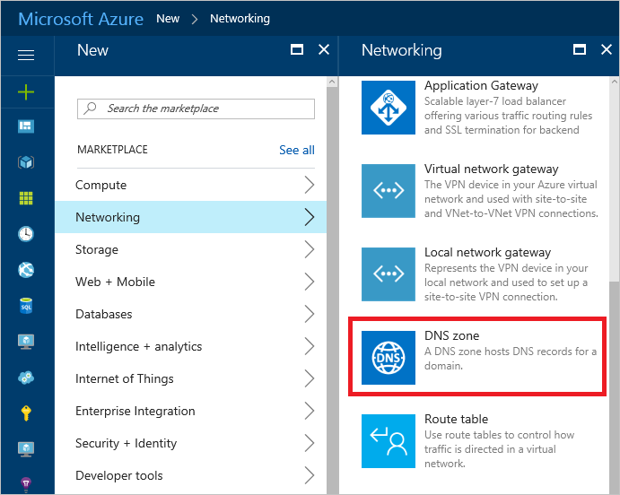
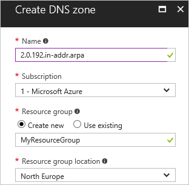
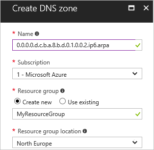
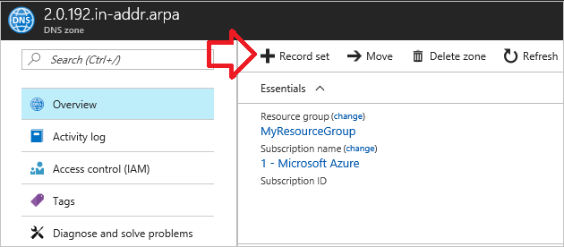
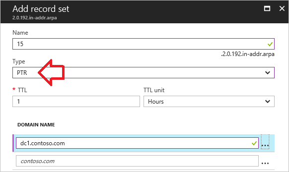
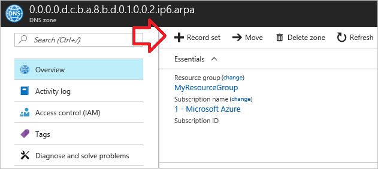
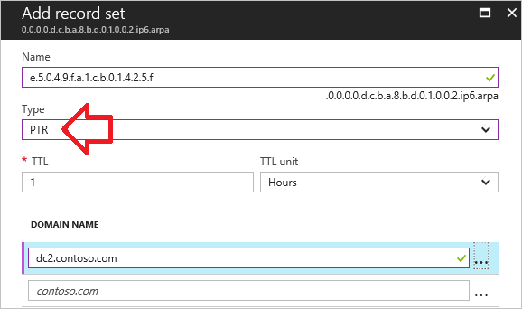
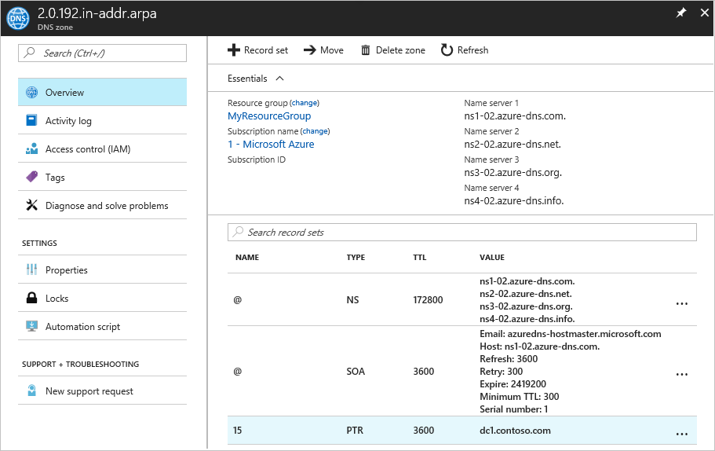
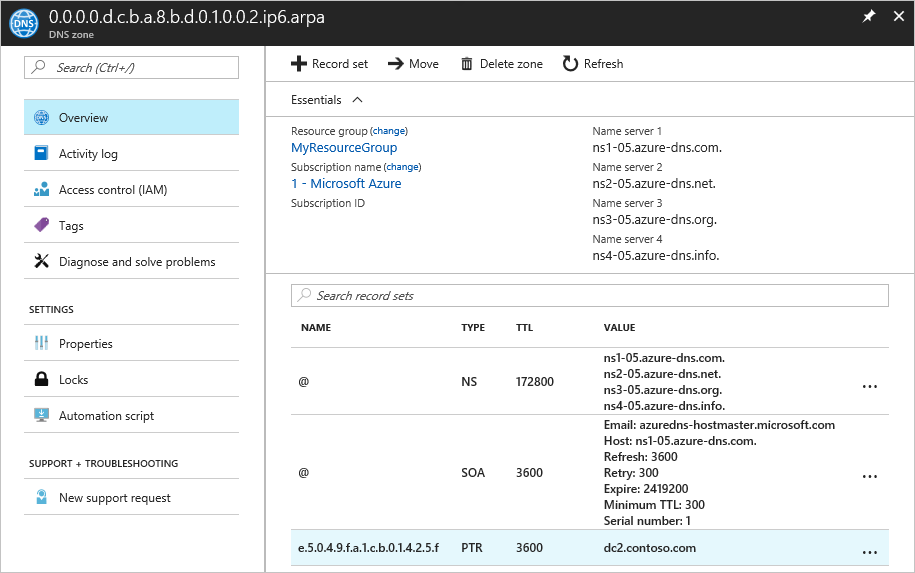

# Hosting reverse DNS lookup zones in Azure DNS

This article explains how to host the reverse DNS lookup zones for your assigned IP ranges in Azure DNS. The IP ranges represented by the reverse lookup zone must be assigned to your organization, typically by your ISP.

To configure reverse DNS for Azure-owned IP address assigned to your Azure service, see [configure the reverse lookup for the IP addresses allocated to your Azure service](dns-reverse-dns-for-azure-services.md).

Before reading this article, you should be familiar with this [Overview of reverse DNS and support in Azure](dns-reverse-dns-overview.md).

This article walks you through the steps to create your first reverse lookup DNS zone and record using the Azure portal, Azure PowerShell, Azure CLI 1.0 or Azure CLI 2.0.

## Create a reverse lookup DNS zone

1. Sign in to the [Azure portal](https://portal.azure.com)
1. On the Hub menu, click and click **New** > **Networking** > and then click **DNS zone** to open the **Create DNS zone** blade.

   

1. On the **Create DNS zone** blade, name your DNS zone. The name of the zone is crafted differently for IPv4 and IPv6 prefixes. Use either the instructions for [IPV4](#ipv4) or [IPv6](#ipv6) to name your zone. When complete click **Create** to create the zone.

### IPv4

The name of an IPv4 reverse lookup zone is based on the IP range it represents. It should be in the following format: `<IPv4 network prefix in reverse order>.in-addr.arpa`. For examples, see [overview of reverse DNS and support in Azure](dns-reverse-dns-overview.md#ipv4).

> [!NOTE]
> When creating classless reverse DNS lookup zones in Azure DNS, you must use a hyphen (`-`) rather than a forward slash ('/') in the zone name.
>
> For example, for the IP range 192.0.2.128/26, you must use `128-26.2.0.192.in-addr.arpa` as the zone name instead of `128/26.2.0.192.in-addr.arpa`.
>
> This is because, while both are supported by the DNS standards, DNS zone names containing the forward slash (`/`) character are not supported in Azure DNS.

The following example shows how to create a 'Class C' reverse DNS zone named `2.0.192.in-addr.arpa` in Azure DNS via the Azure portal:

 

The 'Resource group location' defines the location for the resource group, and has no impact on the DNS zone. The DNS zone location is always 'global', and is not shown.

The following examples show how to complete this task with Azure PowerShell and the Azure CLI:

#### PowerShell

```powershell
New-AzureRmDnsZone -Name 2.0.192.in-addr.arpa -ResourceGroupName MyResourceGroup
```

#### Azure CLI 1.0

```azurecli
azure network dns zone create MyResourceGroup 2.0.192.in-addr.arpa
```

#### Azure CLI 2.0

```azurecli
az network dns zone create -g MyResourceGroup -n 2.0.192.in-addr.arpa
```

### IPv6

The name of an IPv6 reverse lookup zone should be in the following form:
`<IPv6 network prefix in reverse order>.ip6.arpa`.  For examples, see [overview of reverse DNS and support in Azure](dns-reverse-dns-overview.md#ipv6).


The following example shows how to create an IPv6 reverse DNS lookup zone named `0.0.0.0.d.c.b.a.8.b.d.0.1.0.0.2.ip6.arpa` in Azure DNS via the Azure portal:

 

The 'Resource group location' defines the location for the resource group, and has no impact on the DNS zone. The DNS zone location is always 'global', and is not shown.

The following examples show how to complete this task with Azure PowerShell and the Azure CLI:

#### PowerShell

```powershell
New-AzureRmDnsZone -Name 0.0.0.0.d.c.b.a.8.b.d.0.1.0.0.2.ip6.arpa -ResourceGroupName MyResourceGroup
```

#### AzureCLI 1.0

```azurecli
azure network dns zone create MyResourceGroup 0.0.0.0.d.c.b.a.8.b.d.0.1.0.0.2.ip6.arpa
```

#### AzureCLI 2.0

```azurecli
az network dns zone create -g MyResourceGroup -n 0.0.0.0.d.c.b.a.8.b.d.0.1.0.0.2.ip6.arpa
```

## Delegate a reverse DNS lookup zone

Having created your reverse DNS lookup zone, you must ensure that the zone is delegated from the parent zone. DNS delegation enables the DNS name resolution process to find the name servers hosting your reverse DNS lookup zone. This enables those name servers to answer DNS reverse queries for the IP addresses in your address range.

For forward lookup zones, the process of delegating a DNS zone is described in [Delegate your domain to Azure DNS](dns-delegate-domain-azure-dns.md). Delegation for reverse lookup zones works the same way. The only difference is that you need to configure the name servers with the ISP who provided your IP range, rather than your domain name registrar.

## Create a DNS PTR record

### IPv4

The following example walks you through the process of creating a PTR record in a reverse DNS zone in Azure DNS. For other record types and to modify existing records, see [Manage DNS records and record sets by using the Azure portal](dns-operations-recordsets-portal.md).

1.	At the top of the **DNS zone** blade, select **+ Record set** to open the **Add record set** blade.

 

1. On the **Add record set** blade. 
1. Select **PTR** from the record "**Type**" menu.  
1. The name of the record set for a PTR record needs to be the rest of the IPv4 address in reverse order. In this example, the first three octets are already populated as part of the zone name (.2.0.192). Therefore, only the last octet is supplied in the name field. For example, you could name your record set "**15**" for a resource whose IP address is 192.0.2.15.  
1. In the "**Domain Name**" field, enter the fully qualified domain name (FQDN) of the resource using the IP.
1. Select **OK** at the bottom of the blade to create the DNS record.

 

The following are examples on how to complete this task with PowerShell and the AzureCLI:

#### PowerShell

```powershell
New-AzureRmDnsRecordSet -Name 15 -RecordType PTR -ZoneName 2.0.192.in-addr.arpa -ResourceGroupName MyResourceGroup -Ttl 3600 -DnsRecords (New-AzureRmDnsRecordConfig -Ptrdname "dc1.contoso.com")
```
#### AzureCLI 1.0

```azurecli
azure network dns record-set add-record MyResourceGroup 2.0.192.in-addr.arpa 15 PTR --ptrdname dc1.contoso.com  
```

#### AzureCLI 2.0

```azurecli
	az network dns record-set ptr add-record -g MyResourceGroup -z 2.0.192.in-addr.arpa -n 15 --ptrdname dc1.contoso.com
```

### IPv6

The following example walks you through the process of creating new 'PTR' record. For other record types and to modify existing records, see [Manage DNS records and record sets by using the Azure portal](dns-operations-recordsets-portal.md).

1. At the top of the **DNS zone blade**, select **+ Record set** to open the **Add record set** blade.

  

2. On the **Add record set** blade. 
3. Select **PTR** from the record "**Type**" menu.  
4. The name of the record set for a PTR record needs to be the rest of the IPv6 address in reverse order. It must not include any zero compression. In this example, the first 64 bits of the IPv6 are already populated as part of the zone name (0.0.0.0.c.d.b.a.8.b.d.0.1.0.0.2.ip6.arpa). Therefore, only the last 64 bits are supplied in the name field. The last 64 bits of the IP address are entered in reverse order, using a period as the delimiter between each hexadecimal number. For example, you could name your record set "**e.5.0.4.9.f.a.1.c.b.0.1.4.2.5.f**" for a resource whose IP address is 2001:0db8:abdc:0000:f524:10bc:1af9:405e.  
5. In the "**Domain Name**" field, enter the fully qualified domain name (FQDN) of the resource using the IP.
6. Select **OK** at the bottom of the blade to create the DNS record.



The following are examples on how to complete this task with PowerShell and the AzureCLI:

#### PowerShell

```powershell
New-AzureRmDnsRecordSet -Name "e.5.0.4.9.f.a.1.c.b.0.1.4.2.5.f" -RecordType PTR -ZoneName 0.0.0.0.c.d.b.a.8.b.d.0.1.0.0.2.ip6.arpa -ResourceGroupName MyResourceGroup -Ttl 3600 -DnsRecords (New-AzureRmDnsRecordConfig -Ptrdname "dc2.contoso.com")
```

#### AzureCLI 1.0

```
azure network dns record-set add-record MyResourceGroup 0.0.0.0.c.d.b.a.8.b.d.0.1.0.0.2.ip6.arpa e.5.0.4.9.f.a.1.c.b.0.1.4.2.5.f PTR --ptrdname dc2.contoso.com 
```
 
#### AzureCLI 2.0

```azurecli
	az network dns record-set ptr add-record -g MyResourceGroup -z 0.0.0.0.c.d.b.a.8.b.d.0.1.0.0.2.ip6.arpa -n e.5.0.4.9.f.a.1.c.b.0.1.4.2.5.f --ptrdname dc2.contoso.com
```

## View Records

To view the records you created, navigate to your DNS zone in the Azure portal. In the lower part of the **DNS zone** blade, you can see the records for the DNS zone. You should see the default NS and SOA records, which are created in every zone, plus any new records you have created.

### IPv4

DNS zone blade, showing IPv4 PTR records:



The following examples show how to view the PTR records using PowerShell or the Azure CLI:

#### PowerShell

```powershell
Get-AzureRmDnsRecordSet -ZoneName 2.0.192.in-addr.arpa -ResourceGroupName MyResourceGroup
```

#### Azure CLI 1.0

```azurecli
	azure network dns record-set list MyResourceGroup 2.0.192.in-addr.arpa
```

#### Azure CLI 2.0

```azurecli
	azure network dns record-set list -g MyResourceGroup -z 2.0.192.in-addr.arpa
```

### IPv6

DNS zone blade, showing IPv6 PTR records:



The following are examples on how to view the records with PowerShell and the AzureCLI:

#### PowerShell

```powershell
Get-AzureRmDnsRecordSet -ZoneName 0.0.0.0.c.d.b.a.8.b.d.0.1.0.0.2.ip6.arpa -ResourceGroupName MyResourceGroup
```

#### Azure CLI 1.0

```azurecli
	azure network dns record-set list MyResourceGroup 0.0.0.0.c.d.b.a.8.b.d.0.1.0.0.2.ip6.arpa
```

#### Azure CLI 2.0

```azurecli
	azure network dns record-set list -g MyResourceGroup -z 0.0.0.0.c.d.b.a.8.b.d.0.1.0.0.2.ip6.arpa
```

## FAQ

### Can I host reverse DNS lookup zones for my ISP-assigned IP blocks on Azure DNS?

Yes. Hosting the reverse lookup (ARPA) zones for your own IP ranges in Azure DNS is fully supported.

Create the reverse lookup zone in Azure DNS as explained in this article, then work with your ISP to [delegate the zone](dns-domain-delegation.md).  You can then manage the PTR records for each reverse lookup in the same way as other record types.

### How much does hosting my reverse DNS lookup zone cost?

Hosting the reverse DNS lookup zone for your ISP-assigned IP block in Azure DNS is charged at [standard Azure DNS rates](https://azure.microsoft.com/pricing/details/dns/).

### Can I host reverse DNS lookup zones for both IPv4 and IPv6 addresses in Azure DNS?

Yes. This article explains how to create both IPv4 and IPv6 reverse DNS lookup zones in Azure DNS.

### Can I import an existing reverse DNS lookup zone?

Yes. You can use the Azure CLI to import existing DNS zones into Azure DNS. This works for both forward lookup zones and reverse lookup zones.

For more information, see [Import and export a DNS zone file using the Azure CLI](dns-import-export.md).

## Next steps

For more information on reverse DNS, see [reverse DNS lookup on Wikipedia](http://en.wikipedia.org/wiki/Reverse_DNS_lookup).
<br>
Learn how to [manage reverse DNS records for your Azure services](dns-reverse-dns-for-azure-services.md).
