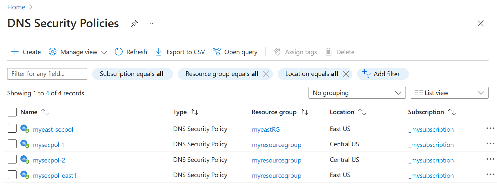
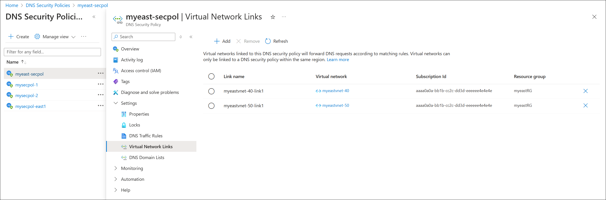
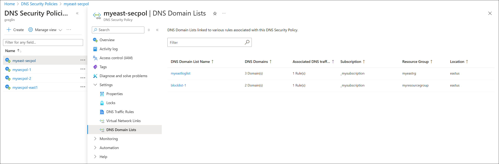
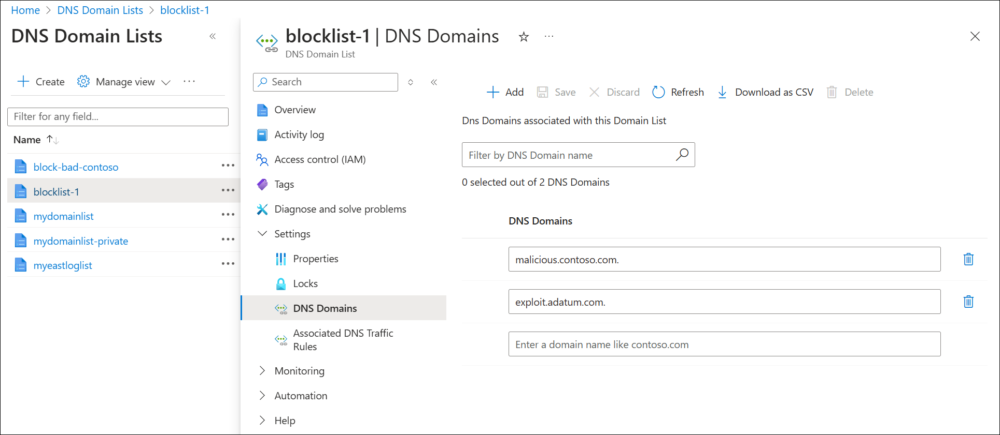
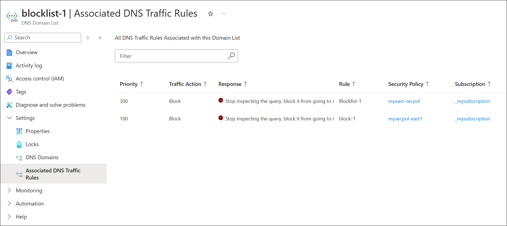

# DNS resolver policy

This article provides an overview of DNS resolver policy and Threat intelligence feed.

For more information about configuration of DNS resolver policy and Threat intelligence feed, see the following how-to guides:

- [Secure and view DNS traffic ](dns-traffic-log-how-to.md).

- [Secure your VNet with Threat intelligence feed](dns-traffic-log-how-to.md#secure-dns-traffic-with-threat-intelligence-feed).

## What is DNS resolver policy?

DNS resolver policy offers the ability to filter and log DNS queries at the virtual network (VNet) level. Policy applies to both public and private DNS traffic within a VNet. You can send DNS logs to a storage account, Log Analytics workspace, or Event Hubs. You can choose to allow, alert, or block DNS queries.

By using DNS resolver policy, you can:
- Create rules to protect against DNS-based attacks by blocking name resolution of known or malicious domains.
- Save and view detailed DNS logs to gain insight into your DNS traffic.

A DNS resolver policy has the following associated elements and properties:
- **[Location](#location)**: The Azure region where you create and deploy the resolver policy.
- **[DNS traffic rules](#dns-traffic-rules)**: Rules that allow, block, or alert based on priority and domain lists.
- **[Virtual network links](#virtual-network-links)**: A link that associates the resolver policy to a VNet.
- **[DNS domain lists](#dns-domain-lists)**: Location-based lists of DNS domains.

You can configure DNS resolver policy by using Azure PowerShell or the Azure portal.

## What is DNS Threat Intelligence?

Azure DNS resolver policy with Threat Intelligence feed helps you detect and prevent security incidents on customer virtual networks. It blocks known malicious domains sourced by [Microsoft’s Security Response Center (MSRC)](https://www.microsoft.com/msrc) from name resolution.

:::image type="content" source="./media/dns-security-policy/threat-intelligence-feed.png" alt-text="Diagram of the network flow of the DNS Threat Intelligence feed." lightbox="./media/dns-security-policy/threat-intelligence-feed.png":::

In addition to the features that DNS resolver policy already provides, you get a managed domain list. It helps protect workloads against known malicious domains by using Microsoft’s own managed Threat Intelligence feed.

The following benefits come from using DNS resolver policy with Threat Intelligence feed:

- **Smart protection**:

    - Almost all attacks begin with a DNS query. Threat Intelligence managed domain list enables the detection and prevention of security incidents early.

- **Continuous updates**:

    - Microsoft automatically updates the feed to protect against newly detected malicious domains.

- **Malicious domain monitoring and blocking**:

    - The flexibility of observation of the activity in alert only mode or block the suspected activity in blocking mode.

    - When you enable logging, you get visibility into all DNS traffic in the virtual network.

### Use cases

- Configure Threat Intelligence as a managed domain list in DNS resolver policies for an extra layer of protection against known malicious domains.

- Gain visibility of compromised hosts that attempt to resolve known malicious domains from virtual networks.

- Log and set up alerts when malicious domains are resolved in virtual networks where the Threat Intel feed is configured.

- Seamlessly integrate with virtual networks and other services such as Azure Private DNS Zones, Private Resolver, and other services in the virtual network.

## Location

A resolver policy can only apply to VNets in the same region. In the following example, you create two policies in each of two different regions (East US and Central US).

> [!IMPORTANT]
> The **policy:VNet** relationship is **1:N**. When you associate a VNet with a resolver policy (via [virtual network links](#virtual-network-links)), you can't associate that VNet with another resolver policy without first removing the existing virtual network link. You can associate a single DNS resolver policy with multiple VNets in the same region.

## DNS traffic rules

DNS traffic rules determine the action that is taken for a DNS query.

To display DNS traffic rules in the Azure portal, select a DNS resolver policy and then under **Settings**, select **DNS Traffic Rules**. See the following example:

- Rules are processed in order of **Priority** in the range 100-65000. Lower numbers are higher priority.
    * If a domain name is blocked in a lower priority rule, and the same domain is allowed in a higher priority rule, the domain name is allowed.
    * Rules follow the DNS hierarchy. If contoso.com is allowed in a higher priority rule, then sub.contoso.com is allowed, even if sub.contoso.com is blocked in a lower priority rule.
    * You can configure a policy on all domains by creating a rule that applies to the "." domain. Be careful when blocking domains so that you don't block necessary Azure services.
- You can dynamically add and delete rules from the list. Be sure to **Save** after editing rules in the portal.
- Multiple **DNS Domain Lists** are allowed per rule. You must have at least one DNS domain list.
- Each rule is associated with one of three **Traffic Actions**: **Allow**, **Block**, or **Alert**.
    * **Allow**: Permit the query to the associated domain lists and log the query.
    * **Block**: Block the query to the associated domain lists and log the block action.
    * **Alert**: Permit the query to the associated domain lists and log an alert.
- Rules can be individually **Enabled** or **Disabled**.

## Virtual network links

DNS resolver policies only apply to VNets that you link to the resolver policy. You can link a single resolver policy to multiple VNets, but you can only link one DNS resolver policy to a single VNet.

The following example shows a DNS resolver policy linked to two VNets (**myeastvnet-40**, **myeastvnet-50**):

- You can only link VNets that are in the same region as the resolver policy.
- When you link a VNet to a DNS resolver policy by using a virtual network link, the DNS resolver policy applies to all resources inside the VNet.

## DNS domain lists

DNS domain lists are lists of DNS domains that you associate to traffic rules.

Select **DNS Domain Lists** under **Settings** for a DNS resolver policy to view the current domain lists associated with the policy.

> [!NOTE]
> CNAME chains are examined ("chased") to determine if the traffic rules that are associated with a domain should apply. For example, a rule that applies to **malicious.contoso.com** also applies to **adatum.com** if **adatum.com** maps to **malicious.contoso.com** or if **malicious.contoso.com** appears anywhere in a CNAME chain for **adatum.com**.

The following example shows the DNS domain lists that are associated with the DNS resolver policy **myeast-secpol**:

You can associate a domain list with multiple DNS traffic rules in different resolver policies. Each DNS traffic rule must reference at least one domain list. You can create a DNS resolver policy before you create or associate any domain lists, and add them when you create the traffic rules. The following example shows a DNS domain list (**blocklist-1**) that contains two domains (**malicious.contoso.com**, **exploit.adatum.com**):

- A DNS domain list must contain at least one domain. Wildcard domains are allowed.

> [!IMPORTANT]
> Be careful when creating wildcard domain lists. For example, if you create a domain list that applies to all domains (by entering `.` as the DNS domain) and then configure a DNS traffic rule to block queries to this domain list, you can prevent required services from working.

When viewing a DNS domain list in the Azure portal, you can also select **Settings** > **Associated DNS Traffic Rules** to see a list of all traffic rules and the associated DNS resolver policies that reference the DNS domain list.

## Requirements and restrictions

| Restriction Type                 | Limit / Rule                                                                 |
|----------------------------------|-----------------------------------------------------------------------------|
| Virtual network restrictions     | - DNS resolver policies can only be applied to VNets in the same region as the DNS resolver policy. - You can link one resolver policy per VNet. |
| Resolver policy restrictions     | 1000                                                                        |
| DNS traffic rule restrictions    | 100                                                                         |
| Domain list restrictions         | 2,000                                                                       |
| Large Domain list restrictions   | 100,000                                                                     |
| Domain restrictions              | 100,000                                                                     |

## Related content

- [Secure and view DNS traffic](dns-traffic-log-how-to.md).
