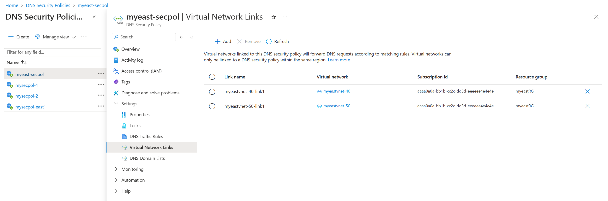
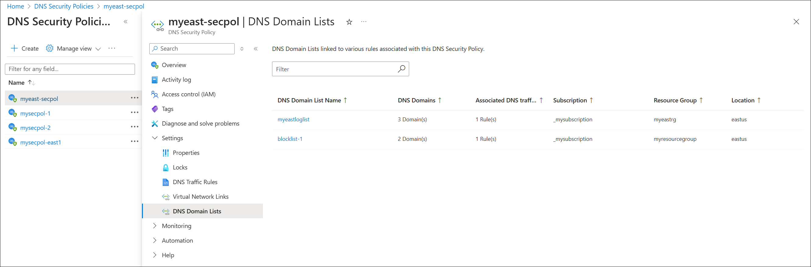

# DNS security policy (Preview)

This article provides an overview of DNS security policy. Also see the following how-to guide:

- [Secure and view DNS traffic (Preview)](dns-traffic-log-how-to.md).

> [!NOTE]
> DNS security policy is currently in PREVIEW.  
> See the [Supplemental Terms of Use for Microsoft Azure Previews](https://azure.microsoft.com/support/legal/preview-supplemental-terms/) for legal terms that apply to Azure features that are in beta, preview, or otherwise not yet released into general availability. 
> Some [Requirements and restrictions](#requirements-and-restrictions) apply to DNS security policy during preview.
 
## What DNS security policy?

DNS security policy offers the ability to filter and log DNS queries at the virtual network (VNet) level. Policy applies to both public and private DNS traffic within a VNet. DNS logs can be sent to a storage account, log analytics workspace, or event hubs. You can choose to allow, alert, or block DNS queries.

With DNS security policy you can:
- Create rules to protect against DNS-based attacks by blocking name resolution of known or malicious domains. 
- Save and view detailed DNS logs to gain insight into your DNS traffic.

A DNS security policy has the following associated elements and properties:
- **[Location](#location)**: The Azure region where the security policy is created and deployed.
- **[DNS traffic rules](#dns-traffic-rules)**: Rules that allow, block, or alert based on priority and domain lists. 
- **[Virtual network links](#virtual-network-links)**: A link that associates the security policy to a VNet. 
- **[DNS domain lists](#dns-domain-lists)**: Location-based lists of DNS domains.

DNS security policy can be configured using Azure PowerShell or the Azure portal.

## Location

A security policy can only apply to VNets in the same region. You can create up to 10 security policies per region during preview. In the following example, two policies are created in each of two different regions (East US and Central US). 

> [!IMPORTANT]
> The **policy:VNet** relationship is **1:N**. When a VNet is associated with a security policy (via [virtual network links](#virtual-network-links)), that VNet can't be associated with another security policy without first removing the existing virtual network link. A single DNS security policy can be associated with multiple VNets in the same region.

## DNS traffic rules

DNS traffic rules determine the action that is taken for a DNS query.

To display DNS traffic rules in the Azure portal, select a DNS security policy and then under **Settings**, select **DNS Traffic Rules**. See the following example:

- Rules are processed in order of **Priority** in the range 100-65000. Lower numbers are higher priority.
    * If a domain name is blocked in a lower priority rule, and the same domain is allowed in a higher priority rule, the domain name is allowed.
    * Rules follow the DNS hierarchy. If contoso.com is allowed in a higher priority rule, then sub.contoso.com is allowed, even if sub.contoso.com is blocked in a lower priority rule.
- You can dynamically add and delete rules from the list. Be sure to **Save** after editing rules in the portal.
- Multiple **DNS Domain Lists** are allowed per rule. You must have at least one DNS domain list. 
- Each rule is associated with one of three **Traffic Actions**: **Allow**, **Block**, or **Alert**.
    * **Allow**: Permit the query to the associated domain lists and log the query.
    * **Block**: Block the query to the associated domain lists and log the block action.
    * **Alert**: Permit the query to the associated domain lists and log an alert.
- Rules can be individually **Enabled** or **Disabled**.

## Virtual network links

DNS security policies only apply to VNets that are linked to the security policy. You can link a single security policy to multiple VNets, however a single VNet can only be linked to one DNS security policy. 

The following example shows a DNS security policy linked to two VNets (**myeastvnet-40**, **myeastvnet-50**):

- You can only link VNets that are in the same region as the security policy. 
- When you link a VNet to a DNS security policy using a virtual network link, the DNS security policy applies to all resources inside the VNet.

## DNS domain lists

DNS domain lists are lists of DNS domains that you associate to traffic rules. 

Select **DNS Domain Lists** under **Settings** for a DNS security policy to view the current domain lists associated with the policy. The following example shows the DNS domain lists that are associated with the DNS security policy **myeast-secpol**:

You can associate a domain list to multiple DNS traffic rules in different security policies. A security policy must contain at least one domain list. The following is an example of a DNS domain list (**blocklist-1**) that contains two domains (**malicious.contoso.com**, **exploit.adatum.com**):

- A DNS domain list must contain at least one domain. Wildcard domains are allowed.

> [!IMPORTANT]
> Be careful when creating wildcard domain lists. For example, if you create a domain list that applies to all domains (by entering `.` as the DNS domain) and then configure a DNS traffic rule to block queries to this domain list, you can prevent required services from working.

When viewing a DNS domain list in the Azure portal, you can also select **Settings** > **Associated DNS Traffic Rules** to see a list of all traffic rules and the associated DNS security policies that reference the DNS domain list.

## Requirements and restrictions

Preview access
- This DNS security policy preview is offered without a requirement to enroll in a pre-release feature preview.

Virtual network restrictions:
- DNS security policies can only be applied to VNets in the same region as the DNS security policy.
- You can link one security policy per VNet. 
- During preview, a single security policy can be linked to 50 VNets. This limit is increased to 500 for general availability.

Security policy restrictions:
- During preview, up to 10 security policies are allowed per region. This limit is increased to 1000 for general availability.

DNS traffic rule restrictions:
- During preview, up to 10 traffic rules are allowed per security policy. This limit is increased to 100 for general availability.

Domain list restrictions:
- During preview, up to 10 domain lists are allowed per region. This limit is increased to 1000 for general availability.

Domain restrictions:
- During preview, up to 1000 domains are allowed across all regions. This limit is increased to 100,000 for general availability.

## Related content

- [Secure and view DNS traffic (Preview)](dns-traffic-log-how-to.md).
