# Secure and view DNS traffic

This article shows you how to view and filter DNS traffic at the virtual network with [DNS resolver policy](dns-security-policy.md) and secure your DNS traffic with Threat intelligence feed in Azure DNS.

## Prerequisites

* If you don’t have an Azure subscription, create a [free account](https://azure.microsoft.com/pricing/purchase-options/azure-account?cid=msft_learn) before you begin.
* A virtual network is required. For more information, see [Create a virtual network](../virtual-network/quick-create-portal.md).

## Create a resolver policy

Choose one of the following methods to create a resolver policy using the Azure portal or PowerShell:

## [Azure portal](#tab/sign-portal)

To create a DNS resolver policy by using the Azure portal:

1. On the Azure portal **Home** page, search for and select **DNS Resolver Policies**. You can also choose **DNS Resolver Policy** from the Azure Marketplace.
2. Select **+ Create** to begin creating a new policy.
3. On the **Basics** tab, select the **Subscription** and **Resource group**, or create a new resource group.
1. Next to **Instance Name**, enter a name for the DNS resolver policy, and then choose the **Region** where the resolver policy applies.

     > [!NOTE]
     > You can only apply a DNS resolver policy to VNets in the same region as the resolver policy.

    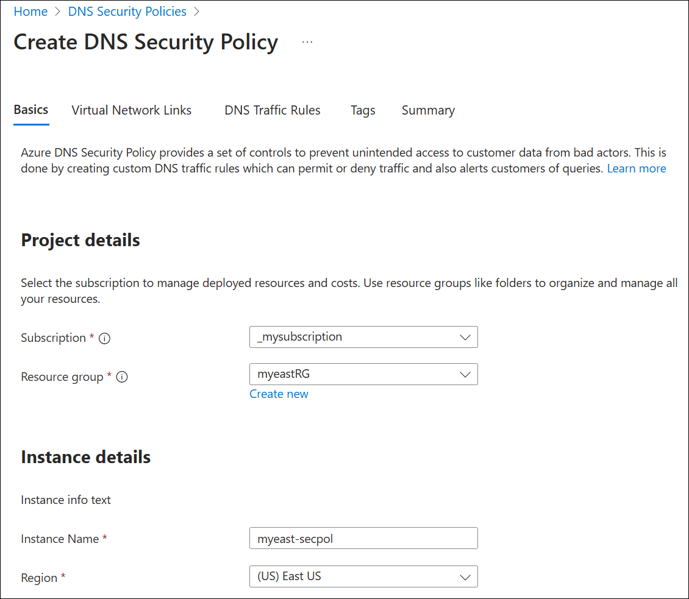

1. Select **Next: Virtual Networks Link** and then select **+ Add**.
1. VNets in the same region as the resolver policy are displayed. Select one or more available VNets and then select **Add**. You can't choose a VNet that is already associated with another resolver policy. In the following example, two VNets are associated with a resolver policy, leaving two VNets available to select.

    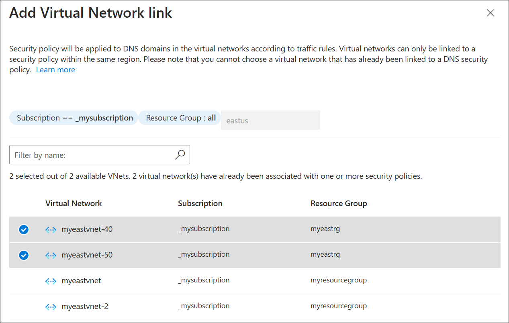

7. VNets that were selected are displayed. If desired, you can remove VNets from the list before creating virtual network links.

    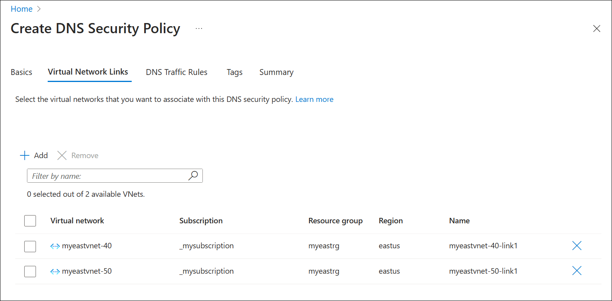

     > [!NOTE]
     > Virtual network links are created for all VNets displayed in the list, whether or not they are *selected*. Use checkboxes to select VNets for removal from the list.

1. Select **Review + create** and then select **Create**. This step skips **Next: DNS Traffic Rules**, but you can also create traffic rules now. In this guide, you create traffic rules and DNS domain lists and apply them to the DNS resolver policy later.

## Create a log analytics workspace

Skip this section if you already have a Log Analytics Workspace that you'd like to use.

To create a Log Analytics Workspace using the Azure portal:

1. On the Azure portal **Home** page, search for and select **Log Analytics workspaces**. You can also choose **Log Analytics Workspace** from the Azure Marketplace.
2. Select **+ Create** to begin creating a new workspace.
3. On the **Basics** tab, select the **Subscription** and **Resource group**, or create a new resource group.
4. Next to **Name**, enter a name for the workspace and then choose the **Region** for the workspace.

    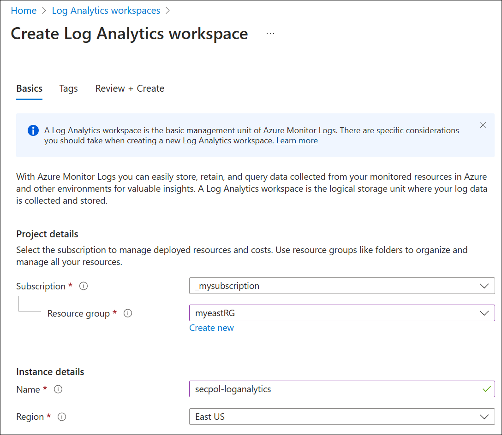

5. Select **Review + create** and then select **Create**.

## Configure diagnostic settings

After creating a Log Analytics workspace, configure the diagnostic settings in your resolver policy to use this workspace.

To configure diagnostic settings:

1. Select the DNS resolver policy that you created (**myeast-secpol** in this example).
2. Under **Monitoring**, select **Diagnostic settings**.
3. Select **Add diagnostic setting**.
4. Next to **Diagnostic setting name**, enter a name for the logs you collect here.
5. Under **Logs** and under **Metrics** select "all" logs and metrics.
6. Under **Destination details**, select **Send to Log Analytics workspace** and then choose the subscription and workspace that you created.
7. Select **Save**. See the following example.

    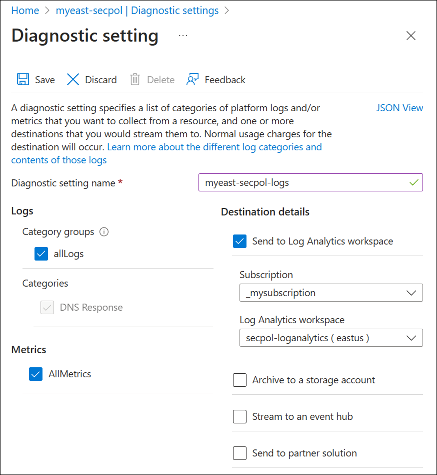

## Create a DNS domain list

To create a DNS domain list using the Azure portal:

1. On the Azure portal **Home** page, search for and select **DNS Domain Lists**.
2. Select **+ Create** to begin creating a new domain list.
3. On the **Basics** tab, select the **Subscription** and **Resource group**, or create a new resource group.
1. Next to **Domain list name**, enter a name for the domain list, and then choose the **Region** for the list.

     > [!NOTE]
     > Resolver policies require domain lists in the same region.

5. Select **Next: DNS Domains**.
6. On the **DNS Domains** tab, enter domain names manually one at a time, or import them from a comma-separated-value (CSV) file.

    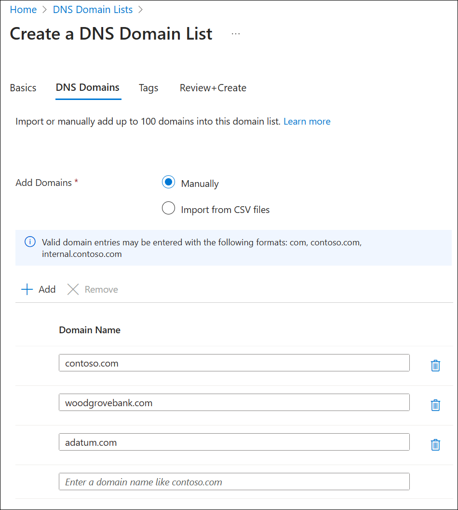

7. When you complete entering domain names, select **Review + create** and then select **Create**.

Repeat this section to create more domain lists if desired. Each domain list can be associated to a traffic rule that has one of three actions:

- **Allow**: Permit the DNS query and log it.
- **Block**: Block the DNS query and log the block action.
- **Alert**: Permit the DNS query and log an alert.

Multiple domain lists can be dynamically added or removed from a single DNS traffic rule.

## Configure DNS traffic rules

Now that you have a DNS domain list, configure the diagnostic settings in your resolver policy to use this workspace.

> [!NOTE]
> CNAME chains are examined ("chased") to determine if the traffic rules that are associated with a domain should apply. For example, a rule that applies to **malicious.contoso.com** also applies to **adatum.com** if **adatum.com** maps to **malicious.contoso.com** or if **malicious.contoso.com** appears anywhere in a CNAME chain for **adatum.com**.

To configure diagnostic settings:

1. Select the DNS resolver policy that you created (**myeast-secpol** in this example).
2. Under **Settings**, select **DNS Traffic Rules**.
3. Select **+ Add**. The **Add DNS Traffic Rule** pane opens.
4. Next to **Priority**, enter a value in the range of 100-65000. Lower number rules have higher priority.
5. Next to **Rule Name**, enter a name for the rule.
6. Next to **DNS Domain Lists**, select the domain lists to be used in this rule.
7. Next to **Traffic Action**, select **Allow**, **Block**, or **Alert** based on the type of action that should apply to the selected domains. In this example, **Allow** is chosen.
8. Leave the default **Rule State** as **Enabled** and select **Save**.

    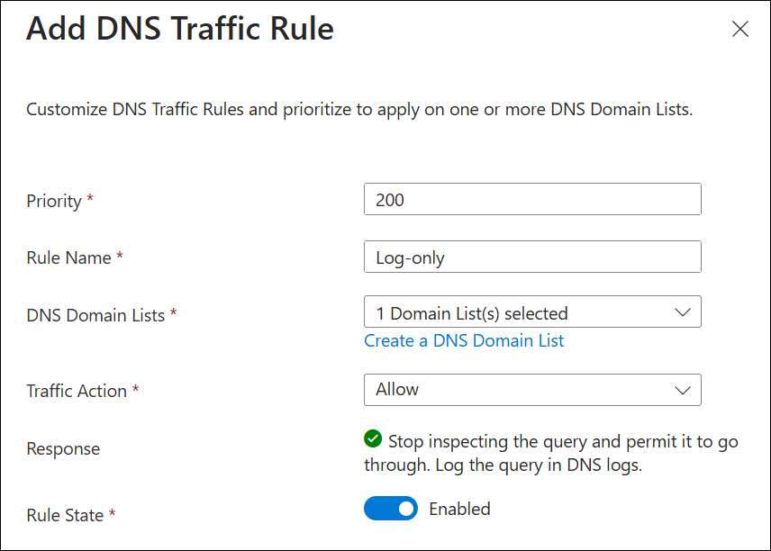

9. Refresh the view to verify that the rule was added successfully. You can edit traffic actions, DNS domain lists, rule priority, and rule state.

    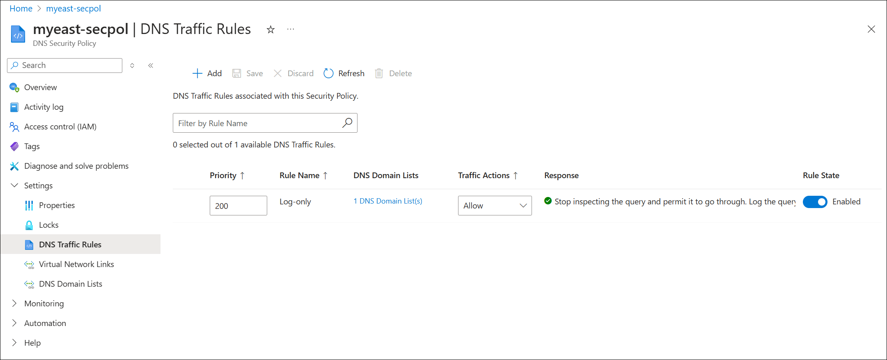

## Secure DNS traffic with Threat intelligence feed

The threat intelligence feed is a fully managed domain list that Microsoft continuously updates in the background. Within DNS resolver policy, treat it like any other standard domain list. Use the same configuration model for priority and for the chosen action (allow, block, or alert).

Select the threat intelligence feed by adding a new DNS traffic rule. Configure the rule with the action you want to apply and its respective priority.

Associate the threat intelligence feed with a DNS traffic rule by selecting **Azure DNS threat intel**:

:::image type="content" source="./media/dns-traffic-log-how-to/enable-threat-intelligence-feed.png" alt-text="Screenshot of enablement of Threat intelligence feed." lightbox="./media/dns-traffic-log-how-to/enable-threat-intelligence-feed.png":::

Configure the action and priority:

:::image type="content" source="./media/dns-traffic-log-how-to/threat-intelligence-rule.png" alt-text="Screenshot of threat intelligence rule." lightbox="./media/dns-traffic-log-how-to/threat-intelligence-rule.png":::

## View and test DNS logs

1. Go to your DNS resolver policy. Under **Monitoring**, select **Diagnostic settings**.
1. Select the Log Analytics workspace that you previously associated with the resolver policy (**secpol-loganalytics** in this example).
3. Select **Logs** on the left.
4. To view DNS queries from a virtual machine with IP address 10.40.40.4 in the same region, run a query as follows:

```Kusto
DNSQueryLogs
| where SourceIpAddress contains "10.40.40.4"
| limit 1000
```

See the following example:

[ 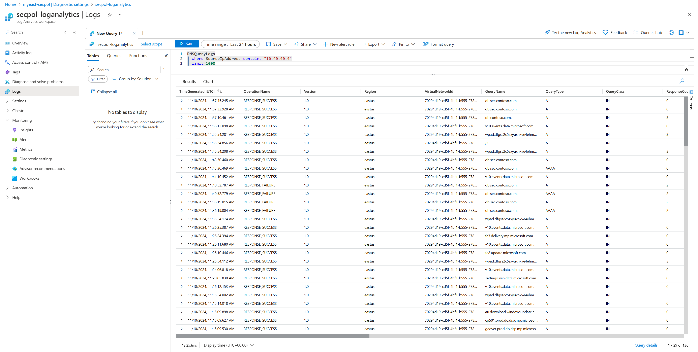 ](./media/dns-traffic-log-how-to/test-query.png#lightbox)

Recall that the traffic rule containing contoso.com was set to **Allow** queries. The query from the virtual machine results in a successful response:

```cmd
C:\>dig db.sec.contoso.com +short
10.0.1.2
```
Expanding the query details in log analytics displays data such as:
* OperationName: RESPONSE_SUCCESS
* Region: eastus
* QueryName: db.sec.contoso.com
* QueryType: A
* SourceIpAddress: 10.40.40.4
* ResolutionPath: PrivateDnsResolution
* ResolverPolicyRuleAction: Allow

If the traffic rule is edited and set to **Block** contoso.com queries, the query from the virtual machine results in a failed response. Be sure to select **Save** when you change the components of a rule.

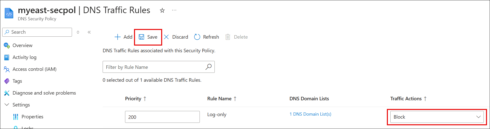

This change results in a failed query:

```

C:\>dig @168.63.129.16 db.sec.contoso.com
; <<>> DiG 9.18.33-1~deb12u2-Debian <<>> db.sec.contoso.com
;; global options: +cmd
;; Got answer:
;; ->>HEADER<<- opcode: QUERY, status: NOERROR, id: 26872
;; flags: qr rd ra; QUERY: 1, ANSWER: 1, AUTHORITY: 1, ADDITIONAL: 1

;; OPT PSEUDOSECTION:
; EDNS: version: 0, flags:; udp: 1224
; COOKIE: 336258f5985121ba (echoed)
;; QUESTION SECTION:
; db.sec.contoso.com. IN  A

;; ANSWER SECTION:
db.sec.contoso.com. 1006632960 IN CNAME blockpolicy.azuredns.invalid.

;; AUTHORITY SECTION:
blockpolicy.azuredns.invalid. 60 IN     SOA     ns1.azure-dns.com. support.azure.com. 1000 3600 600 1800 60

;; Query time: 0 msec
;; SERVER: 168.63.129.16#53(168.63.129.16) (UDP)
;; WHEN: Mon Sep 08 11:06:59 UTC 2025
;; MSG SIZE  rcvd: 183

```

The failed query is recorded in log analytics:

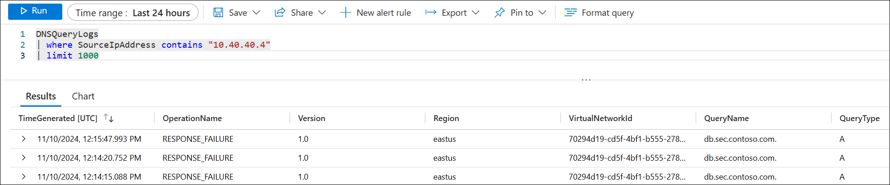

 > [!NOTE]
 > It can take a few minutes for query results to show up in log analytics.

## [PowerShell](#tab/sign-powershell)

Set up a local PowerShell repository and install the Az.DnsResolver PowerShell module. This is only needed if you aren't using Cloud Shell.

1. Create a new folder on your disk to act as a local PowerShell repository. In this example, use `C:\bin\PSRepo`.
1. Download [Az.DnsResolver.0.2.6.nupkg](https://github.com/sfiguemsft/privateresolver/blob/main/Az.DnsResolver.0.2.6.nupkg) into this directory.
3. Set up your local repository by running the following command:

    ```PowerShell
    # Register the repository
    Register-PSRepository -Name LocalPSRepo -SourceLocation 'C:\bin\PSRepo' -ScriptSourceLocation 'C:\bin\PSRepo' -InstallationPolicy Trusted

    # Install the Az.DnsResolver module
    Install-Module -Name Az.DnsResolver -RequiredVersion 0.2.6 -SkipPublisherCheck

    # If you already installed Az.DnsResolver, update your version to 0.2.6
    Update-Module -Name Az.DnsResolver

    # Confirm that the Az.DnsResolver module was installed properly
    Get-InstalledModule -Name Az.DnsResolver
    ```

4. Set the subscription context

    ```PowerShell
    # Connect PowerShell to Azure cloud
    Connect-AzAccount -Environment AzureCloud

    # Set your default subscription
    Select-AzSubscription -SubscriptionObject (Get-AzSubscription -SubscriptionId <your-sub-id>)
    ```

1. Create a DNS resolver policy with PowerShell.

    ```PowerShell
    $ErrorActionPreference = "Stop"

    ################################################################
    # Configure resource names and locations
    ################################################################

    $resourceNumber = 1 # Customize this if needed
    $region = "centralus" # Change this region to your preference
    if ($env:username) {$name = "$($env:username)"} else {$name = "$($env:USER)"}  # The environment variable is different in Cloud Shell vs local PowerShell
    $nameSuffix = "test-$($region)-$($name)-resolverpolicytest$($resourceNumber)-test"
    $resourceGroupName = "rg-$($nameSuffix)"
    $virtualNetworkName = "vnet-$($nameSuffix)"
    $resolverPolicyName = "dnsresolverpolicy-$($nameSuffix)"
    $domainListName = "domainlist-$($nameSuffix)"
    $securityRuleName = "securityrule-$($nameSuffix)"
    $resolverPolicyLinkName = "dnsresolverpolicylink"
    $storageAccountName = "stor$($name.ToLower())"  # Customize this, taking care that the name is not too long
    $storageAccountName = $storageAccountName.Substring(0, [Math]::Min(24, $storageAccountName.Length)) # Storage account names must be 3-24 characters long
    $diagnosticSettingName = "diagnosticsetting-$($nameSuffix)"
    $vnetId = "/subscriptions/$subscriptionId/resourceGroups/$resourceGroupName/providers/Microsoft.Network/virtualNetworks/$virtualNetworkName"

    ################################################################
    # Create resource group, virtual network, and storage account
    ################################################################

    Write-Host "Creating resource group"
    $rg = New-AzResourceGroup -Name $resourceGroupName -Location $region
    Write-Host ($rg | ConvertTo-Json -Depth 64)

    Write-Host "Creating virtual network"
    $defaultSubnet = New-AzVirtualNetworkSubnetConfig -Name "default" -AddressPrefix "10.$resourceNumber.0.0/24"
    $vnet = New-AzVirtualNetwork -Name $virtualNetworkName -ResourceGroupName $resourceGroupName -Location $region -AddressPrefix "10.$resourceNumber.0.0/16" -Subnet $defaultSubnet
    Write-Host ($vnet | ConvertTo-Json -Depth 64)

    Write-Host "Creating storage account"
    $storageAccount = New-AzStorageAccount -ResourceGroupName $resourceGroupName -Name $storageAccountName -Location $region -SkuName Standard_GRS
    Write-Host $storageAccount.ToString()

    ################################
    # Create DNS resolver policy
    ################################

    Write-Host "Creating DNS resolver policy"
    $resolverPolicy = New-AzDnsResolverPolicy -Location $region -ResourceGroupName $resourceGroupName -Name $resolverPolicyName
    Write-Host $resolverPolicy.ToJsonString()

    Write-Host "Creating DNS resolver policy virtual network link"
    $link = New-AzDnsResolverPolicyVirtualNetworkLink -Location $region -ResourceGroupName $resourceGroupName -DnsResolverPolicyName $resolverPolicyName -Name $resolverPolicyLinkName -VirtualNetworkId $vnetId
    Write-Host $link.ToJsonString()

    $log = New-AzDiagnosticSettingLogSettingsObject -Enabled $true -Category DnsResponse

    Write-Host "Creating diagnostic setting"
    $diagnosticSetting = New-AzDiagnosticSetting -Name $diagnosticSettingName -ResourceId  $resolverPolicy.id -Log $log -StorageAccountId $storageAccount.id
    Write-Host $diagnosticSetting.ToJsonString()

    Write-Host "Creating domain list"
    $domainList = New-AzDnsResolverDomainList -Location $region -ResourceGroupName $resourceGroupName -Name $domainListName -Domain @("contoso.com.", "adatum.com.")
    Write-Host $domainList.ToJsonString()

    Write-Host "Creating DNS resolver policy rule"
    $rule = New-AzDnsResolverPolicyDnsSecurityRule -ResourceGroupName $resourceGroupName -Name $securityRuleName -DnsResolverDomainList @{id = $domainList.Id;} -DnsSecurityRuleState "Enabled" -ActionType "Block" -ActionBlockResponseCode "SERVFAIL" -Priority 100 -DnsResolverPolicyName $resolverPolicyName -Location $region
    Write-Host $rule.ToJsonString()
    ```

6. Optional: Update DNS resolver policies with new values.

    ```PowerShell
    ################################
    # Update DNS resolver policy
    ################################

    Write-Host "Updating DNS resolver policy"
    $resolverPolicy = Update-AzDnsResolverPolicy -ResourceGroupName $resourceGroupName -Name $resolverPolicyName -Tag @{"key0" = "value0"}
    Write-Host $resolverPolicy.ToJsonString()

    Write-Host "Updating DNS resolver policy virtual network link"
    $link = Update-AzDnsResolverPolicyVirtualNetworkLink -ResourceGroupName $resourceGroupName -DnsResolverPolicyName $resolverPolicyName -Name $resolverPolicyLinkName -Tag @{"key1" = "value1"}
    Write-Host $link.ToJsonString()

    $log = New-AzDiagnosticSettingLogSettingsObject -Enabled $false -Category DnsResponse

    Write-Host "Updating diagnostic setting by disabling log category"
    $diagnosticSetting = New-AzDiagnosticSetting -Name $diagnosticSettingName -ResourceId  $resolverPolicy.id -Log $log -StorageAccountId $storageAccount.id
    Write-Host $diagnosticSetting.ToJsonString()

    Write-Host "Updating domain list"
    $domainList = Update-AzDnsResolverDomainList -ResourceGroupName $resourceGroupName -Name $domainListName -Tag @{"key2" = "value2"}
    Write-Host $domainList.ToJsonString()

    Write-Host "Updating DNS resolver policy rule"
    $rule = Update-AzDnsResolverPolicyDnsSecurityRule -ResourceGroupName $resourceGroupName -Name $securityRuleName -DnsResolverDomainList @{id = $domainList.Id;} -DnsResolverPolicyName $resolverPolicyName
    Write-Host $rule.ToJsonString()
    ```

1. Review the DNS resolver policy configuration.

    ```PowerShell
    ################################
    # Get DNS resolver policy
    ################################

    Write-Host "Getting DNS resolver policy"
    $resolverPolicy = Get-AzDnsResolverPolicy -ResourceGroupName $resourceGroupName -Name $resolverPolicyName
    Write-Host $resolverPolicy.ToJsonString()

    Write-Host "Getting DNS resolver policy virtual network link"
    $link = Get-AzDnsResolverPolicyVirtualNetworkLink -ResourceGroupName $resourceGroupName -DnsResolverPolicyName $resolverPolicyName -Name $resolverPolicyLinkName
    Write-Host $link.ToJsonString()

    Write-Host "Getting diagnostic setting"
    $diagnosticSetting = Get-AzDiagnosticSetting -ResourceId $resolverPolicy.id
    Write-Host $diagnosticSetting.ToJsonString()

    Write-Host "Getting domain list"
    $domainList = Get-AzDnsResolverDomainList -ResourceGroupName $resourceGroupName -Name $domainListName
    Write-Host $rule.ToJsonString()

    Write-Host "Getting DNS resolver policy rule"
    $rule = Get-AzDnsResolverPolicyDnsSecurityRule -ResourceGroupName $resourceGroupName -Name $securityRuleName -DnsResolverPolicyName $resolverPolicyName
    Write-Host $rule.ToJsonString()
    ```

## Test DNS resolver policy

To test your new resolver policy, connect to a host device inside the virtual network and issue a query for the domains that you blocked. In this example, the domain list is **contoso.com** and **adatum.com**.

Input:
```PowerShell
Resolve-DnsName -Name contoso.com -Type NS
```

Output:
```PowerShell
Resolve-DnsName : contoso.com : DNS server failure
At line:1 char:1
+ Resolve-DnsName -Name contoso.com -Type NS
+ ~~~~~~~~~~~~~~~~~~~~~~~~~~~~~~~~~~~~~~~~~~
    + CategoryInfo          : ResourceUnavailable: (contoso.com:String) [Resolve-DnsName], Win32Exception
    + FullyQualifiedErrorId : RCODE_SERVER_FAILURE,Microsoft.DnsClient.Commands.ResolveDnsName
```
---

## Related content

- Review concepts related to [DNS resolver policy](dns-security-policy.md).
- Review [Azure Private DNS zones scenarios](private-dns-scenarios.md).
- Review [DNS resolution in virtual networks](../virtual-network/virtual-networks-name-resolution-for-vms-and-role-instances.md).
