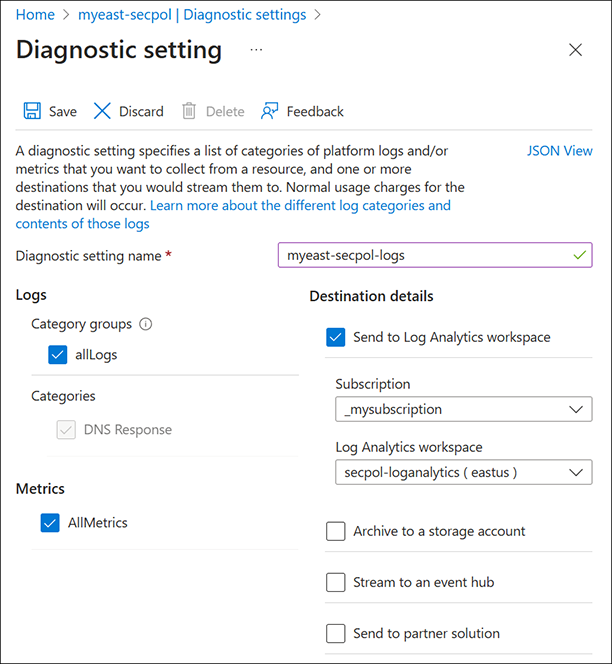

# Filter and view DNS traffic

This article shows you how to view and filter DNS traffic at the virtual network level. 

> [!NOTE]
> DNS security policy is in PREVIEW.<br> 
> See the [Supplemental Terms of Use for Microsoft Azure Previews](https://azure.microsoft.com/support/legal/preview-supplemental-terms/) for legal terms that apply to Azure features that are in beta, preview, or otherwise not yet released into general availability.<br>
> This DNS security policy preview is offered without a requirement to enroll in a preview. 

## Prerequisites

* If you don’t have an Azure subscription, create a [free account](https://azure.microsoft.com/free/?WT.mc_id=A261C142F) before you begin.
* A virtual network is required. For more information, see [Create a virtual network](../virtual-network/quick-create-portal.md).

## Create a security policy

Choose one of the following tabs to create a security policy using the Azure portal, Azure CLI, or PowerShell.

## [Azure portal](#tab/sign-portal)

To create a DNS security policy using the Azure portal:

1. On the Azure portal **Home** page, search for and select **DNS Security Policies**. You can also choose **Dns Security Policy** from the Azure Marketplace.
2. Select **+ Create** to begin creating a new policy.
3. On the **Basics** tab, select the **Subscription** and **Resource group**, or create a new resource group.
4. Next to **Instance Name**, enter a name for the DNS security policy.
5. Choose the **Region** where the security policy applies.

     > [!NOTE]
     > A DNS security policy can only be applied to VNets in the same region as the security policy.

    

6. Select **Next: Virtual Networks Link**.
7. Select **+ Add**.  
8. VNets in the same region as the security policy are displayed. Select one or more available VNets and then select **Add**. You can't choose a VNet that is already associated with another security policy. In the following example, two VNets have already been associated with a security policy, leaving two VNets available to select.

    

9. VNets that were selected are displayed. If desired, you can remove VNets from the list before creating virtual network links.

    

     > [!NOTE]
     > Virtual network links are created for all VNets displayed in the list, whether or not they are *selected*. Use checkboxes to select VNets for removal from the list.

10. Select **Review + create** and then select **Create**. Choosing **Next: DNS Traffic Rules** is skipped here, but you also have the option to create traffic rules now. In this guide, traffic rules and DNS domain lists are created and applied to DNS security policy later.

## Create a log analytics workspace

Skip this section if you already have a Log Analytics Workspace that you'd like to use.

To create a Log Analytics Workspace using the Azure portal:

1. On the Azure portal **Home** page, search for and select **Log Analytics workspaces**. You can also choose **Log Analytics Workspace** from the Azure Marketplace.
2. Select **+ Create** to begin creating a new workspace.
3. On the **Basics** tab, select the **Subscription** and **Resource group**, or create a new resource group.
4. Next to **Name**, enter a name for the workspace.
5. Choose the **Region** for the workspace.

    

6. Select **Review + create** and then select **Create**.

## Configure diagnostic settings

Now that you have a Log Analytics Workspace, configure the diagnostic settings in your security policy to use this workspace.

To configure diagnostic settings:

1. Select the DNS security policy that you created (**myeast-secpol** in this example).
2. Under **Monitoring**, select **Diagnostic settings**.
3. Select **Add diagnostic setting**.
4. Next to **Diagnostic setting name**, enter a name for the logs you collect here.
5. Under **Logs** and under **Metrics** select "all" logs and metrics.
6. Under **Destination details**, select **Send to Log Analytics workspace** and then choose the subscription and workspace that you created.
7. Select **Save**. See the following example.

    

## Create a DNS domain list

To create a DNS domain list using the Azure portal:

1. On the Azure portal **Home** page, search for and select **DNS Domain Lists**.
2. Select **+ Create** to begin creating a new domain list.
3. On the **Basics** tab, select the **Subscription** and **Resource group**, or create a new resource group.
4. Next to **Domain list name**, enter a name for the domain list.
5. Choose the **Region** for the list. 

     > [!NOTE]
     > Security policies require domain lists in the same region.

6. Select **Next: DNS Domains**.
7. On the **DNS Domains** tab, enter domain names manually one at a time, or import them from a comma-separated-value (CSV) file.

    

8. When you have completed entering domain names, select **Review + create** and then select **Create**.

Repeat this section to create additional domain lists if desired. Each domain list can be associated to a traffic rule that has one of three actions:

- **Allow**: Permit the DNS query and log it.
- **Block**: Block the DNS query and log the block action.
- **Alert**: Permit the DNS query and log an alert.

Multiple domain lists can be dynamically added or removed from a single DNS traffic rule.

## Configure DNS traffic rules

Now that you have a DNS domain list, configure the diagnostic settings in your security policy to use this workspace.

To configure diagnostic settings:

1. Select the DNS security policy that you created (**myeast-secpol** in this example).
2. Under **Settings**, select **DNS Traffic Rules**.
3. Select **+ Add**. The **Add DNS Traffic Rule** pane opens.
4. Next to **Priority**, enter a value in the range of 100-65000. Lower number rules have higher priority.
5. Next to **Rule Name**, enter a name for the rule.
6. Next to **DNS Domain Lists**, select the domain lists to be used in this rule.
7. Next to **Traffic Action**, select **Allow**, **Block**, or **Alert** based on the type of action that should apply to the selected domains. In this example, **Allow** is chosen.
8. Leave the default **Rule State** as **Enabled** and select **Save**.

    

9. Refresh the view to verify that the rule was added successfully. You can edit traffic actions, DNS domain lists, rule priority, and rule state.

    

## View and test DNS logs

1. Navigate to your DNS security policy and then under **Monitoring**, select **Diagnostic settings**.
2. Select the Log Analytics workspace that you previously associated with security policy (**secpol-loganalytics** in this example). 
3. Select **Logs** on the left.
4. To view DNS queries from a virtual machine with IP address 10.40.40.4 in the same region, run a query as follows:

```
DNSQueryLogs
| where SourceIpAddress contains "10.40.40.4"
| limit 1000
```

See the following example:

[  ](./media/dns-traffic-log-how-to/test-query.png#lightbox)

Recall that the traffic rule containing contoso.com was set to **Allow** queries. The query from the VM results in a successful response:

```cmd
C:\>dig db.sec.contoso.com +short
10.0.1.2
```
Expanding the query details in log analytics displays data such as:
* OperationName: RESPONSE_SUCCESS
* Region: eastus
* QueryName: db.sec.contoso.com
* QueryType: A
* SourceIpAddress: 10.40.40.4
* ResolutionPath: PrivateDnsResolution
* ResolverPolicyRuleAction: Allow

If the traffic rule is edited and set to **Block** contoso.com queries, the query from the VM results in a failed response. Be sure to select **Save** when you change the components of a rule.


This change results in a failed query:

```
C:\>dig db.sec.contoso.com

; <<>> DiG 9.9.2-P1 <<>> db.sec.contoso.com
;; global options: +cmd
;; Got answer:
;; ->>HEADER<<- opcode: QUERY, status: SERVFAIL, id: 24053
;; flags: qr rd ra; QUERY: 1, ANSWER: 0, AUTHORITY: 0, ADDITIONAL: 1
```

The failed query is recorded in log analytics:


> [NOTE!]
> It can take a few minutes for query results to show up in log analytics.


## [Azure CLI](#tab/sign-cli)

1. Sign a zone using the Azure CLI:

```azurepowershell-interactive
# Ensure you are logged in to your Azure account
az login

# Select the appropriate subscription
az account set --subscription "your-subscription-id"

# Enable DNSSEC for the DNS zone
az network dns dnssec-config create --resource-group "your-resource-group" --zone-name "adatum.com"

# Verify the DNSSEC configuration
az network dns dnssec-config show --resource-group "your-resource-group" --zone-name "adatum.com"
```

2. Something


## [PowerShell](#tab/sign-powershell)

1. Something using PowerShell:

```PowerShell
# Connect to your Azure account (if not already connected)
Connect-AzAccount

# Select the appropriate subscription
Select-AzSubscription -SubscriptionId "your-subscription-id"

# Enable DNSSEC for the DNS zone
New-AzDnsDnssecConfig -ResourceGroupName "your-resource-group" -ZoneName "adatum.com"

# Verify the DNSSEC configuration
Get-AzDnsDnssecConfig -ResourceGroupName "your-resource-group" -ZoneName "adatum.com"
```

2. Obtain something


---

## Next steps

- Learn how to [unsign a DNS zone](dnssec-unsign.md).
- Learn how to [host the reverse lookup zone for your ISP-assigned IP range in Azure DNS](dns-reverse-dns-for-azure-services.md).
- Learn how to [manage reverse DNS records for your Azure services](dns-reverse-dns-for-azure-services.md).