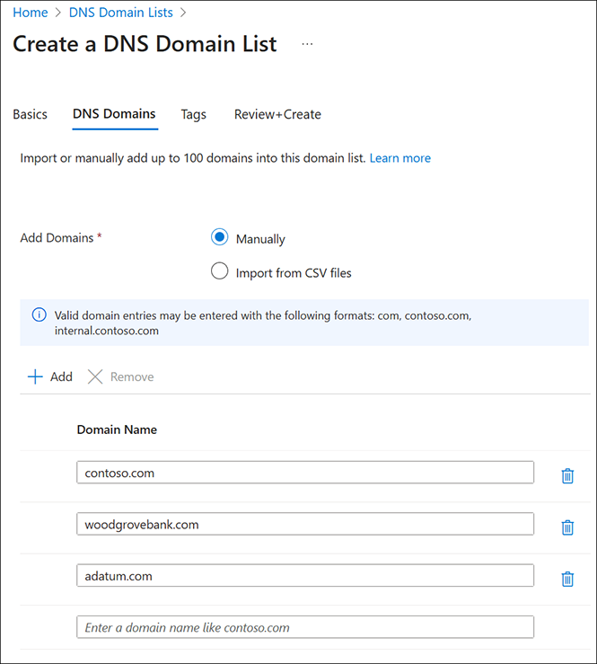

# Secure and view DNS traffic (Preview)

This article shows you how to view and filter DNS traffic at the virtual network with [DNS security policy](dns-security-policy.md).

> [!NOTE]
> DNS security policy is in PREVIEW.<br> 
> See the [Supplemental Terms of Use for Microsoft Azure Previews](https://azure.microsoft.com/support/legal/preview-supplemental-terms/) for legal terms that apply to Azure features that are in beta, preview, or otherwise not yet released into general availability.<br><br>
> This DNS security policy preview is offered without a requirement to enroll in a pre-release feature preview.

## Prerequisites

* If you don’t have an Azure subscription, create a [free account](https://azure.microsoft.com/free/?WT.mc_id=A261C142F) before you begin.
* A virtual network is required. For more information, see [Create a virtual network](../virtual-network/quick-create-portal.md).

## Create a security policy

Choose one of the following methods to create a security policy using the Azure portal or PowerShell:

## [Azure portal](#tab/sign-portal)

To create a DNS security policy using the Azure portal:

1. On the Azure portal **Home** page, search for and select **DNS Security Policies**. You can also choose **Dns Security Policy** from the Azure Marketplace.
2. Select **+ Create** to begin creating a new policy.
3. On the **Basics** tab, select the **Subscription** and **Resource group**, or create a new resource group.
4. Next to **Instance Name**, enter a name for the DNS security policy and then choose the **Region** where the security policy applies.

     > [!NOTE]
     > A DNS security policy can only be applied to VNets in the same region as the security policy.

    

5. Select **Next: Virtual Networks Link** and then select **+ Add**.  
6. VNets in the same region as the security policy are displayed. Select one or more available VNets and then select **Add**. You can't choose a VNet that is already associated with another security policy. In the following example, two VNets are associated with a security policy, leaving two VNets available to select.

    

7. VNets that were selected are displayed. If desired, you can remove VNets from the list before creating virtual network links.

    

     > [!NOTE]
     > Virtual network links are created for all VNets displayed in the list, whether or not they are *selected*. Use checkboxes to select VNets for removal from the list.

8. Select **Review + create** and then select **Create**. Choosing **Next: DNS Traffic Rules** is skipped here, but you can also create traffic rules now. In this guide, traffic rules and DNS domain lists are created and applied to DNS security policy later.

## Create a log analytics workspace

Skip this section if you already have a Log Analytics Workspace that you'd like to use.

To create a Log Analytics Workspace using the Azure portal:

1. On the Azure portal **Home** page, search for and select **Log Analytics workspaces**. You can also choose **Log Analytics Workspace** from the Azure Marketplace.
2. Select **+ Create** to begin creating a new workspace.
3. On the **Basics** tab, select the **Subscription** and **Resource group**, or create a new resource group.
4. Next to **Name**, enter a name for the workspace and then choose the **Region** for the workspace.

    

5. Select **Review + create** and then select **Create**.

## Configure diagnostic settings

Now that you have a Log Analytics Workspace, configure the diagnostic settings in your security policy to use this workspace.

To configure diagnostic settings:

1. Select the DNS security policy that you created (**myeast-secpol** in this example).
2. Under **Monitoring**, select **Diagnostic settings**.
3. Select **Add diagnostic setting**.
4. Next to **Diagnostic setting name**, enter a name for the logs you collect here.
5. Under **Logs** and under **Metrics** select "all" logs and metrics.
6. Under **Destination details**, select **Send to Log Analytics workspace** and then choose the subscription and workspace that you created.
7. Select **Save**. See the following example.

    

## Create a DNS domain list

To create a DNS domain list using the Azure portal:

1. On the Azure portal **Home** page, search for and select **DNS Domain Lists**.
2. Select **+ Create** to begin creating a new domain list.
3. On the **Basics** tab, select the **Subscription** and **Resource group**, or create a new resource group.
4. Next to **Domain list name**, enter a name for the domain list and then choose the **Region** for the list. 

     > [!NOTE]
     > Security policies require domain lists in the same region.

5. Select **Next: DNS Domains**.
6. On the **DNS Domains** tab, enter domain names manually one at a time, or import them from a comma-separated-value (CSV) file.

    

7. When you complete entering domain names, select **Review + create** and then select **Create**.

Repeat this section to create more domain lists if desired. Each domain list can be associated to a traffic rule that has one of three actions:

- **Allow**: Permit the DNS query and log it.
- **Block**: Block the DNS query and log the block action.
- **Alert**: Permit the DNS query and log an alert.

Multiple domain lists can be dynamically added or removed from a single DNS traffic rule.

## Configure DNS traffic rules

Now that you have a DNS domain list, configure the diagnostic settings in your security policy to use this workspace.

To configure diagnostic settings:

1. Select the DNS security policy that you created (**myeast-secpol** in this example).
2. Under **Settings**, select **DNS Traffic Rules**.
3. Select **+ Add**. The **Add DNS Traffic Rule** pane opens.
4. Next to **Priority**, enter a value in the range of 100-65000. Lower number rules have higher priority.
5. Next to **Rule Name**, enter a name for the rule.
6. Next to **DNS Domain Lists**, select the domain lists to be used in this rule.
7. Next to **Traffic Action**, select **Allow**, **Block**, or **Alert** based on the type of action that should apply to the selected domains. In this example, **Allow** is chosen.
8. Leave the default **Rule State** as **Enabled** and select **Save**.

    

9. Refresh the view to verify that the rule was added successfully. You can edit traffic actions, DNS domain lists, rule priority, and rule state.

    

## View and test DNS logs

1. Navigate to your DNS security policy and then under **Monitoring**, select **Diagnostic settings**.
2. Select the Log Analytics workspace that you previously associated with security policy (**secpol-loganalytics** in this example). 
3. Select **Logs** on the left.
4. To view DNS queries from a virtual machine with IP address 10.40.40.4 in the same region, run a query as follows:

```Kusto
DNSQueryLogs
| where SourceIpAddress contains "10.40.40.4"
| limit 1000
```

See the following example:

[  ](./media/dns-traffic-log-how-to/test-query.png#lightbox)

Recall that the traffic rule containing contoso.com was set to **Allow** queries. The query from the virtual machine results in a successful response:

```cmd
C:\>dig db.sec.contoso.com +short
10.0.1.2
```
Expanding the query details in log analytics displays data such as:
* OperationName: RESPONSE_SUCCESS
* Region: eastus
* QueryName: db.sec.contoso.com
* QueryType: A
* SourceIpAddress: 10.40.40.4
* ResolutionPath: PrivateDnsResolution
* ResolverPolicyRuleAction: Allow

If the traffic rule is edited and set to **Block** contoso.com queries, the query from the virtual machine results in a failed response. Be sure to select **Save** when you change the components of a rule.


This change results in a failed query:

```
C:\>dig db.sec.contoso.com

; <<>> DiG 9.9.2-P1 <<>> db.sec.contoso.com
;; global options: +cmd
;; Got answer:
;; ->>HEADER<<- opcode: QUERY, status: SERVFAIL, id: 24053
;; flags: qr rd ra; QUERY: 1, ANSWER: 0, AUTHORITY: 0, ADDITIONAL: 1
```

The failed query is recorded in log analytics:


 > [!NOTE]
 > It can take a few minutes for query results to show up in log analytics.

## [PowerShell](#tab/sign-powershell)

Set up a local PowerShell repository and install the Az.DnsResolver PowerShell module. This is only needed if you aren't using Cloud Shell.

1. Create a new folder on your disk to act as a local PowerShell repository. In this example, `C:\bin\PSRepo` is used. 
2. Download [Az.DnsResolver.0.2.6.nupkg](https://github.com/sfiguemsft/privateresolver/blob/main/Az.DnsResolver.0.2.6.nupkg) into this directory. 
3. Set up your local repository by running the following command:

    ```PowerShell
    # Register the repository
    Register-PSRepository -Name LocalPSRepo -SourceLocation 'C:\bin\PSRepo' -ScriptSourceLocation 'C:\bin\PSRepo' -InstallationPolicy Trusted

    # Install the Az.DnsResolver module
    Install-Module -Name Az.DnsResolver -RequiredVersion 0.2.6 -SkipPublisherCheck

    # If you already installed Az.DnsResolver, update your version to 0.2.6
    Update-Module -Name Az.DnsResolver

    # Confirm that the Az.DnsResolver module was installed properly
    Get-InstalledModule -Name Az.DnsResolver
    ```

4. Set the subscription context

    ```PowerShell
    # Connect PowerShell to Azure cloud
    Connect-AzAccount -Environment AzureCloud

    # Set your default subscription
    Select-AzSubscription -SubscriptionObject (Get-AzSubscription -SubscriptionId <your-sub-id>)
    ```

5. Create a DNS security policy with PowerShell. 

    ```PowerShell
    $ErrorActionPreference = "Stop"

    ################################################################
    # Configure resource names and locations
    ################################################################

    $resourceNumber = 1 # Customize this if needed
    $region = "centralus" # Change this region to your preference
    if ($env:username) {$name = "$($env:username)"} else {$name = "$($env:USER)"}  # The environment variable is different in Cloud Shell vs local PowerShell
    $nameSuffix = "test-$($region)-$($name)-resolverpolicytest$($resourceNumber)-test"
    $resourceGroupName = "rg-$($nameSuffix)"
    $virtualNetworkName = "vnet-$($nameSuffix)"
    $resolverPolicyName = "dnsresolverpolicy-$($nameSuffix)"
    $domainListName = "domainlist-$($nameSuffix)"
    $securityRuleName = "securityrule-$($nameSuffix)"
    $resolverPolicyLinkName = "dnsresolverpolicylink"
    $storageAccountName = "stor$($name.ToLower())"  # Customize this, taking care that the name is not too long
    $storageAccountName = $storageAccountName.Substring(0, [Math]::Min(24, $storageAccountName.Length)) # Storage account names must be 3-24 characters long
    $diagnosticSettingName = "diagnosticsetting-$($nameSuffix)"
    $vnetId = "/subscriptions/$subscriptionId/resourceGroups/$resourceGroupName/providers/Microsoft.Network/virtualNetworks/$virtualNetworkName"

    ################################################################
    # Create resource group, virtual network, and storage account
    ################################################################

    Write-Host "Creating resource group"
    $rg = New-AzResourceGroup -Name $resourceGroupName -Location $region
    Write-Host ($rg | ConvertTo-Json -Depth 64)

    Write-Host "Creating virtual network"
    $defaultSubnet = New-AzVirtualNetworkSubnetConfig -Name "default" -AddressPrefix "10.$resourceNumber.0.0/24"
    $vnet = New-AzVirtualNetwork -Name $virtualNetworkName -ResourceGroupName $resourceGroupName -Location $region -AddressPrefix "10.$resourceNumber.0.0/16" -Subnet $defaultSubnet
    Write-Host ($vnet | ConvertTo-Json -Depth 64)

    Write-Host "Creating storage account"
    $storageAccount = New-AzStorageAccount -ResourceGroupName $resourceGroupName -Name $storageAccountName -Location $region -SkuName Standard_GRS
    Write-Host $storageAccount.ToString()

    ################################
    # Create DNS security policy
    ################################

    Write-Host "Creating DNS resolver policy"
    $resolverPolicy = New-AzDnsResolverPolicy -Location $region -ResourceGroupName $resourceGroupName -Name $resolverPolicyName
    Write-Host $resolverPolicy.ToJsonString()

    Write-Host "Creating DNS resolver policy virtual network link"
    $link = New-AzDnsResolverPolicyVirtualNetworkLink -Location $region -ResourceGroupName $resourceGroupName -DnsResolverPolicyName $resolverPolicyName -Name $resolverPolicyLinkName -VirtualNetworkId $vnetId
    Write-Host $link.ToJsonString()

    $log = New-AzDiagnosticSettingLogSettingsObject -Enabled $true -Category DnsResponse

    Write-Host "Creating diagnostic setting"
    $diagnosticSetting = New-AzDiagnosticSetting -Name $diagnosticSettingName -ResourceId  $resolverPolicy.id -Log $log -StorageAccountId $storageAccount.id
    Write-Host $diagnosticSetting.ToJsonString()

    Write-Host "Creating domain list"
    $domainList = New-AzDnsResolverDomainList -Location $region -ResourceGroupName $resourceGroupName -Name $domainListName -Domain @("contoso.com.", "adatum.com.")
    Write-Host $domainList.ToJsonString()

    Write-Host "Creating DNS security policy rule"
    $rule = New-AzDnsResolverPolicyDnsSecurityRule -ResourceGroupName $resourceGroupName -Name $securityRuleName -DnsResolverDomainList @{id = $domainList.Id;} -DnsSecurityRuleState "Enabled" -ActionType "Block" -ActionBlockResponseCode "SERVFAIL" -Priority 100 -DnsResolverPolicyName $resolverPolicyName -Location $region
    Write-Host $rule.ToJsonString()
    ```

6. Optional: Update DNS resolver policies with new values.

    ```PowerShell
    ################################
    # Update DNS security policy
    ################################

    Write-Host "Updating DNS resolver policy"
    $resolverPolicy = Update-AzDnsResolverPolicy -ResourceGroupName $resourceGroupName -Name $resolverPolicyName -Tag @{"key0" = "value0"} 
    Write-Host $resolverPolicy.ToJsonString()

    Write-Host "Updating DNS resolver policy virtual network link"
    $link = Update-AzDnsResolverPolicyVirtualNetworkLink -ResourceGroupName $resourceGroupName -DnsResolverPolicyName $resolverPolicyName -Name $resolverPolicyLinkName -Tag @{"key1" = "value1"} 
    Write-Host $link.ToJsonString()

    $log = New-AzDiagnosticSettingLogSettingsObject -Enabled $false -Category DnsResponse

    Write-Host "Updating diagnostic setting by disabling log category"
    $diagnosticSetting = New-AzDiagnosticSetting -Name $diagnosticSettingName -ResourceId  $resolverPolicy.id -Log $log -StorageAccountId $storageAccount.id
    Write-Host $diagnosticSetting.ToJsonString()

    Write-Host "Updating domain list"
    $domainList = Update-AzDnsResolverDomainList -ResourceGroupName $resourceGroupName -Name $domainListName -Tag @{"key2" = "value2"} 
    Write-Host $domainList.ToJsonString()

    Write-Host "Updating DNS security policy rule"
    $rule = Update-AzDnsResolverPolicyDnsSecurityRule -ResourceGroupName $resourceGroupName -Name $securityRuleName -DnsResolverDomainList @{id = $domainList.Id;} -DnsResolverPolicyName $resolverPolicyName
    Write-Host $rule.ToJsonString()
    ```

7. Review the DNS security policy configuration.

    ```PowerShell
    ################################
    # Get DNS security policy
    ################################

    Write-Host "Getting DNS resolver policy"
    $resolverPolicy = Get-AzDnsResolverPolicy -ResourceGroupName $resourceGroupName -Name $resolverPolicyName
    Write-Host $resolverPolicy.ToJsonString()

    Write-Host "Getting DNS resolver policy virtual network link"
    $link = Get-AzDnsResolverPolicyVirtualNetworkLink -ResourceGroupName $resourceGroupName -DnsResolverPolicyName $resolverPolicyName -Name $resolverPolicyLinkName
    Write-Host $link.ToJsonString()

    Write-Host "Getting diagnostic setting"
    $diagnosticSetting = Get-AzDiagnosticSetting -ResourceId $resolverPolicy.id
    Write-Host $diagnosticSetting.ToJsonString()

    Write-Host "Getting domain list"
    $domainList = Get-AzDnsResolverDomainList -ResourceGroupName $resourceGroupName -Name $domainListName
    Write-Host $rule.ToJsonString()

    Write-Host "Getting DNS security policy rule"
    $rule = Get-AzDnsResolverPolicyDnsSecurityRule -ResourceGroupName $resourceGroupName -Name $securityRuleName -DnsResolverPolicyName $resolverPolicyName
    Write-Host $rule.ToJsonString()
    ```

## Test DNS security policy

To test your new security policy, connect to a host device inside the virtual network and issue a query for the domains that you blocked. In this example the domainlist is **contoso.com** and **adatum.com**.

Input:
```PowerShell
Resolve-DnsName -Name contoso.com -Type NS
```

Output:
```PowerShell
Resolve-DnsName : contoso.com : DNS server failure
At line:1 char:1
+ Resolve-DnsName -Name contoso.com -Type NS
+ ~~~~~~~~~~~~~~~~~~~~~~~~~~~~~~~~~~~~~~~~~~
    + CategoryInfo          : ResourceUnavailable: (contoso.com:String) [Resolve-DnsName], Win32Exception
    + FullyQualifiedErrorId : RCODE_SERVER_FAILURE,Microsoft.DnsClient.Commands.ResolveDnsName
```
---

## Related content

- Review concepts related to [DNS security policy](dns-security-policy.md).
- Review [Azure Private DNS zones scenarios](private-dns-scenarios.md).
- Review [DNS resolution in virtual networks](../virtual-network/virtual-networks-name-resolution-for-vms-and-role-instances.md).
