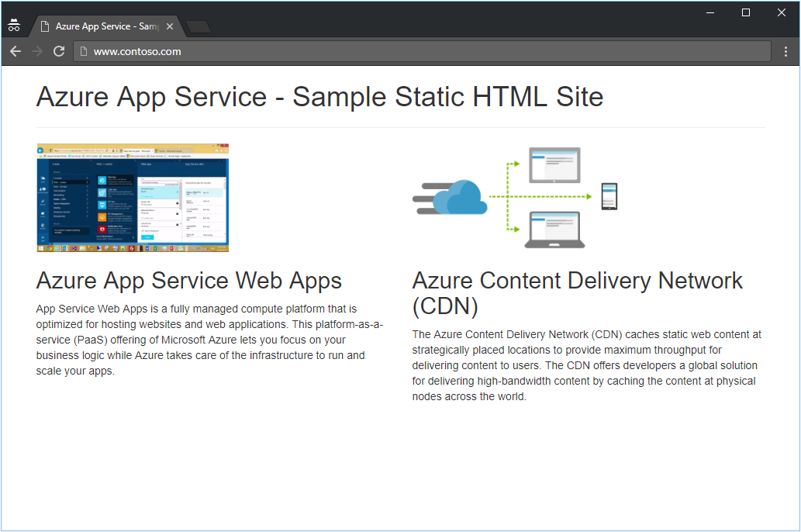

# Tutorial: Create DNS records in a custom domain for a web app 

You can configure Azure DNS to host a custom domain for your web apps. For example, you can create an Azure web app and have your users access it using either www\.contoso.com or contoso.com as a fully qualified domain name (FQDN).

> [!NOTE]
> Contoso.com is used as an example throughout this tutorial. Substitute your own domain name for contoso.com.

To do this, you have to create three records:

* A root "A" record pointing to contoso.com
* A root "TXT" record for verification
* A "CNAME" record for the www name that points to the A record

Keep in mind that if you create an A record for a web app in Azure, the A record must be manually updated if the underlying IP address for the web app changes.

In this tutorial, you learn how to:

> [!div class="checklist"]
> * Create an A and TXT record for your custom domain
> * Create a CNAME record for your custom domain
> * Test the new records
> * Add custom host names you your web app
> * Test the custom host names


If you don’t have an Azure subscription, create a [free account](https://azure.microsoft.com/free/?WT.mc_id=A261C142F) before you begin.

[!INCLUDE [cloud-shell-try-it.md](../../includes/cloud-shell-try-it.md)]

## Prerequisites

[!INCLUDE [updated-for-az](../../includes/updated-for-az.md)]

* You must have a domain name available to test with that you can host in Azure DNS . You must have full control of this domain. Full control includes the ability to set the name server (NS) records for the domain.
* [Create an App Service app](../app-service/app-service-web-get-started-html.md), or use an app that you created for another tutorial.

* Create a DNS zone in Azure DNS, and delegate the zone in your registrar to Azure DNS.

   1. To create a DNS zone, follow the steps in [Create a DNS zone](dns-getstarted-create-dnszone.md).
   2. To delegate your zone to Azure DNS, follow the steps in [DNS domain delegation](dns-delegate-domain-azure-dns.md).

After creating a zone and delegating it to Azure DNS, you can then create records for your custom domain.

## Create an A record and TXT record

An A record is used to map a name to its IP address. In the following example, assign "\@" as an A record using your web app IPv4 address. \@ typically represents the root domain.

### Get the IPv4 address

In the left navigation of the App Services page in the Azure portal, select **Custom domains**. 


In the **Custom domains** page, copy the app's IPv4 address:


### Create the A record

```azurepowershell
New-AzDnsRecordSet -Name "@" -RecordType "A" -ZoneName "contoso.com" `
 -ResourceGroupName "MyAzureResourceGroup" -Ttl 600 `
 -DnsRecords (New-AzDnsRecordConfig -IPv4Address "<your web app IP address>")
```

### Create the TXT record

App Services uses this record only at configuration time to verify that you own the custom domain. You can delete this TXT record after your custom domain is validated and configured in App Service.

> [!NOTE]
> If you want to verify the domain name, but not route production traffic to the web app, you only need to specify the TXT record for the verification step.  Verification does not require an A or CNAME record in addition to the TXT record.

```azurepowershell
New-AzDnsRecordSet -ZoneName contoso.com -ResourceGroupName MyAzureResourceGroup `
 -Name "@" -RecordType "txt" -Ttl 600 `
 -DnsRecords (New-AzDnsRecordConfig -Value  "contoso.azurewebsites.net")
```

## Create the CNAME record

If your domain is already managed by Azure DNS (see [DNS domain delegation](dns-domain-delegation.md), you can use the following example to create a CNAME record for contoso.azurewebsites.net.

Open Azure PowerShell and create a new CNAME record. This example creates a record set type CNAME with a "time to live" of 600 seconds in DNS zone named "contoso.com" with the alias for the web app contoso.azurewebsites.net.

### Create the record

```azurepowershell
New-AzDnsRecordSet -ZoneName contoso.com -ResourceGroupName "MyAzureResourceGroup" `
 -Name "www" -RecordType "CNAME" -Ttl 600 `
 -DnsRecords (New-AzDnsRecordConfig -cname "contoso.azurewebsites.net")
```

The following example is the response:

```
    Name              : www
    ZoneName          : contoso.com
    ResourceGroupName : myresourcegroup
    Ttl               : 600
    Etag              : 8baceeb9-4c2c-4608-a22c-229923ee185
    RecordType        : CNAME
    Records           : {contoso.azurewebsites.net}
    Tags              : {}
```

## Test the new records

You can validate the records were created correctly by querying the "www.contoso.com"  and "contoso.com" using nslookup, as shown below:

```
PS C:\> nslookup
Default Server:  Default
Address:  192.168.0.1

> www.contoso.com
Server:  default server
Address:  192.168.0.1

Non-authoritative answer:
Name:    <instance of web app service>.cloudapp.net
Address:  <ip of web app service>
Aliases:  www.contoso.com
contoso.azurewebsites.net
<instance of web app service>.vip.azurewebsites.windows.net

> contoso.com
Server:  default server
Address:  192.168.0.1

Non-authoritative answer:
Name:    contoso.com
Address:  <ip of web app service>

> set type=txt
> contoso.com

Server:  default server
Address:  192.168.0.1

Non-authoritative answer:
contoso.com text =

        "contoso.azurewebsites.net"
```
## Add custom host names

Now you can add the custom host names to your web app:

```azurepowershell
set-AzWebApp `
 -Name contoso `
 -ResourceGroupName MyAzureResourceGroup `
 -HostNames @("contoso.com","www.contoso.com","contoso.azurewebsites.net")
```
## Test the custom host names

Open a browser and browse to `http://www.<your domainname>` and `http://<you domain name>`.

> [!NOTE]
> Make sure you include the `http://` prefix, otherwise your browser may attempt to predict a URL for you!

You should see the same page for both URLs. For example:




## Clean up resources

When you no longer need the resources created in this tutorial, you can delete the **myresourcegroup** resource group.

## Next steps

Learn how to create Azure DNS private zones.

> [!div class="nextstepaction"]
> [Get started with Azure DNS private zones using PowerShell](private-dns-getstarted-powershell.md)
