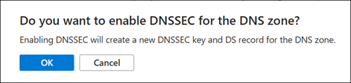

# How to sign your Azure Public DNS zone with DNSSEC

This article shows you how to sign your DNS zone with [Domain Name System Security Extensions (DNSSEC)](dnssec.md). 

To remove DNSSEC signing from a zone, see [How to unsign your Azure Public DNS zone](dnssec-unsign.md).

## Prerequisites

* The DNS zone must be hosted by Azure Public DNS. For more information, see [Manage DNS zones](/azure/dns/dns-operations-dnszones-portal).
* The parent DNS zone must be signed with DNSSEC. Most major top level domains (.com, .net, .org) are already signed.

## Sign a zone with DNSSEC

To protect your DNS zone with DNSSEC, you must first sign the zone. The zone signing process creates a delegation signer (DS) record that must then be added to the parent zone.

## [Azure portal](#tab/sign-portal)

To sign your zone with DNSSEC using the Azure portal:

1. On the Azure portal Home page, search for and select **DNS zones**.
2. Select your DNS zone, and then from the zone's **Overview** page, select **DNSSEC**. You can select **DNSSEC** from the menu at the top, or under **DNS Management**.

    [  ](./media/dnssec-how-to/select-dnssec.png#lightbox)

3. Select the **Enable DNSSEC** checkbox. 

    

4. When you are prompted to confirm that you wish to enable DNSSEC, select **OK**.<br>

    

5. Wait for zone signing to complete. After the zone is signed, review the **DNSSEC delegation information** that is displayed. Notice that the status is: **Signed but not delegated**.

    [  ](./media/dnssec-how-to/ds-missing.png#lightbox)

    > [!NOTE]
    > If your Azure network configuration doesn't allow delegation checking, the delegation message shown here is suppressed. In this case, you can use a public [DNSSEC debugger](https://aka.ms/DNSSECdebugger) to verify delegation status.

6. Copy the delegation information and use it to create a DS record in the parent zone. 

    1. If the parent zone is a top level domain (for example: `.com`), you must add the DS record at your registrar. Each registrar has its own process. The registrar might ask for values such as the Key Tag, Algorithm, Digest Type, and Key Digest. In the example shown here, these values are:

        **Key Tag**: 4535<br>
        **Algorithm**: 13<br>
        **Digest Type**: 2<br>
        **Digest**: 7A1C9811A965C46319D94D1D4BC6321762B632133F196F876C65802EC5089001

        When you provide the DS record to your registrar, the registrar adds the DS record to the parent zone, such as the Top Level Domain (TLD) zone.

    2. If you own the parent zone, you can add a DS record directly to the parent yourself. The following example shows how to add a DS record to the DNS zone **adatum.com** for the child zone **secure.adatum.com** when both zones are hosted using Azure Public DNS:

        [  ](./media/dnssec-how-to/ds-add.png#lightbox) 
        [  ](./media/dnssec-how-to/ds-added.png#lightbox)

    3. If you don't own the parent zone, send the DS record to the owner of the parent zone with instructions to add it into their zone.

7. When the DS record has been uploaded to the parent zone, select the DNSSEC information page for your zone and verify that **Signed and delegation established** is displayed. Your DNS zone is now fully DNSSEC signed.

    [  ](./media/dnssec-how-to/delegated.png#lightbox)

    > [!NOTE]
    > If your Azure network configuration doesn't allow delegation checking, the delegation message shown here is suppressed. In this case, you can use a public [DNSSEC debugger](https://aka.ms/DNSSECdebugger) to verify delegation status.

## [Azure CLI](#tab/sign-cli)

1. Sign a zone using the Azure CLI:

```azurepowershell-interactive
# Ensure you are logged in to your Azure account
az login

# Select the appropriate subscription
az account set --subscription "your-subscription-id"

# Enable DNSSEC for the DNS zone
az network dns dnssec-config create --resource-group "your-resource-group" --zone-name "adatum.com"

# Verify the DNSSEC configuration
az network dns dnssec-config show --resource-group "your-resource-group" --zone-name "adatum.com"
```

2. Obtain the delegation information and use it to create a DS record in the parent zone.

You can use the following Azure CLI command to display the DS record information:

```azurepowershell-interactive
az network dns zone show --name "adatum.com" --resource-group "your-resource-group" | jq '.signingKeys[] | select(.delegationSignerInfo != null) | .delegationSignerInfo'
```
Sample output:

```
  {
    "digestAlgorithmType": 2,
    "digestValue": "0B9E68FC1711B4AC4EC0FCE5E673EDB0AFDC18F27EA94861CDF08C7100EA776C",
    "record": "26767 13 2 0B9E68FC1711B4AC4EC0FCE5E673EDB0AFDC18F27EA94861CDF08C7100EA776C"
  }
```

Alternatively, you can also obtain DS information by using dig.exe on the command line:

```Cmd
dig adatum.com DS +dnssec
```

Sample output:

```Cmd
;; ANSWER SECTION:
adatum.com.        86400   IN      DS      26767 13 2 0B9E68FC1711B4AC4EC0FCE5E673EDB0AFDC18F27EA94861CDF08C71 00EA776C
```
In these examples, the DS values are:
- Key Tag: 26767
- Algorithm: 13
- Digest Type: 2
- Digest: 0B9E68FC1711B4AC4EC0FCE5E673EDB0AFDC18F27EA94861CDF08C7100EA776C


3. If the parent zone is a top level domain (for example: `.com`), you must add the DS record at your registrar. Each registrar has its own process.

4. If you own the parent zone, you can add a DS record directly to the parent yourself. The following example shows how to add a DS record to the DNS zone **adatum.com** for the child zone **secure.adatum.com** when both zones are signed and hosted using Azure Public DNS:

```azurepowershell-interactive
az network dns record-set ds add-record --resource-group "your-resource-group" --zone-name "adatum.com" --record-set-name "secure" --key-tag <key-tag> --algorithm <algorithm> --digest <digest> --digest-type <digest-type>
```

5. If you don't own the parent zone, send the DS record to the owner of the parent zone with instructions to add it into their zone.

## [PowerShell](#tab/sign-powershell)

1. Sign and verify your zone using PowerShell:

```PowerShell
# Connect to your Azure account (if not already connected)
Connect-AzAccount

# Select the appropriate subscription
Select-AzSubscription -SubscriptionId "your-subscription-id"

# Enable DNSSEC for the DNS zone
New-AzDnsDnssecConfig -ResourceGroupName "your-resource-group" -ZoneName "adatum.com"

# Verify the DNSSEC configuration
Get-AzDnsDnssecConfig -ResourceGroupName "your-resource-group" -ZoneName "adatum.com"
```

2. Obtain the delegation information and use it to create a DS record in the parent zone.

```PowerShell
Get-AzDnsDnssecConfig -ResourceGroupName "dns-rg" -ZoneName "adatum.com" | Select-Object -ExpandProperty SigningKey | Select-Object -ExpandProperty delegationSignerInfo
```

Example output:

```PowerShell
DigestAlgorithmType DigestValue                                                      Record
------------------- -----------                                                      ------
                  2 0B9E68FC1711B4AC4EC0FCE5E673EDB0AFDC18F27EA94861CDF08C7100EA776C 26767 13 2 0B9E68FC1711B4AC4EC0FCE5E673EDB0AFDC18F27EA94861CDF08C7100EA776C
```

In these examples, the DS values are:
- Key Tag: 26767
- Algorithm: 13
- Digest Type: 2
- Digest: 0B9E68FC1711B4AC4EC0FCE5E673EDB0AFDC18F27EA94861CDF08C7100EA776C

3. If the parent zone is a top level domain (for example: `.com`), you must add the DS record at your registrar. Each registrar has its own process.

4. If you own the parent zone, you can add a DS record directly to the parent yourself. The following example shows how to add a DS record to the DNS zone **adatum.com** for the child zone **secure.adatum.com** when both zones are signed and hosted using Azure Public DNS. Replace \<key-tag\>, \<algorithm\>, \<digest\>, and \<digest-type\> with the appropriate values from the DS record you queried previously.

```PowerShell
$dsRecord = New-AzDnsRecordConfig -DnsRecordType DS -KeyTag <key-tag> -Algorithm <algorithm> -Digest <digest> -DigestType <digest-type>
New-AzDnsRecordSet -ResourceGroupName "dns-rg" -ZoneName "adatum.com" -Name "secure" -RecordType DS -Ttl 3600 -DnsRecords $dsRecord
```
5. If you don't own the parent zone, send the DS record to the owner of the parent zone with instructions to add it into their zone.
---

## Next steps

- Learn how to [unsign a DNS zone](dnssec-unsign.md).
- Learn how to [host the reverse lookup zone for your ISP-assigned IP range in Azure DNS](dns-reverse-dns-for-azure-services.md).
- Learn how to [manage reverse DNS records for your Azure services](dns-reverse-dns-for-azure-services.md).