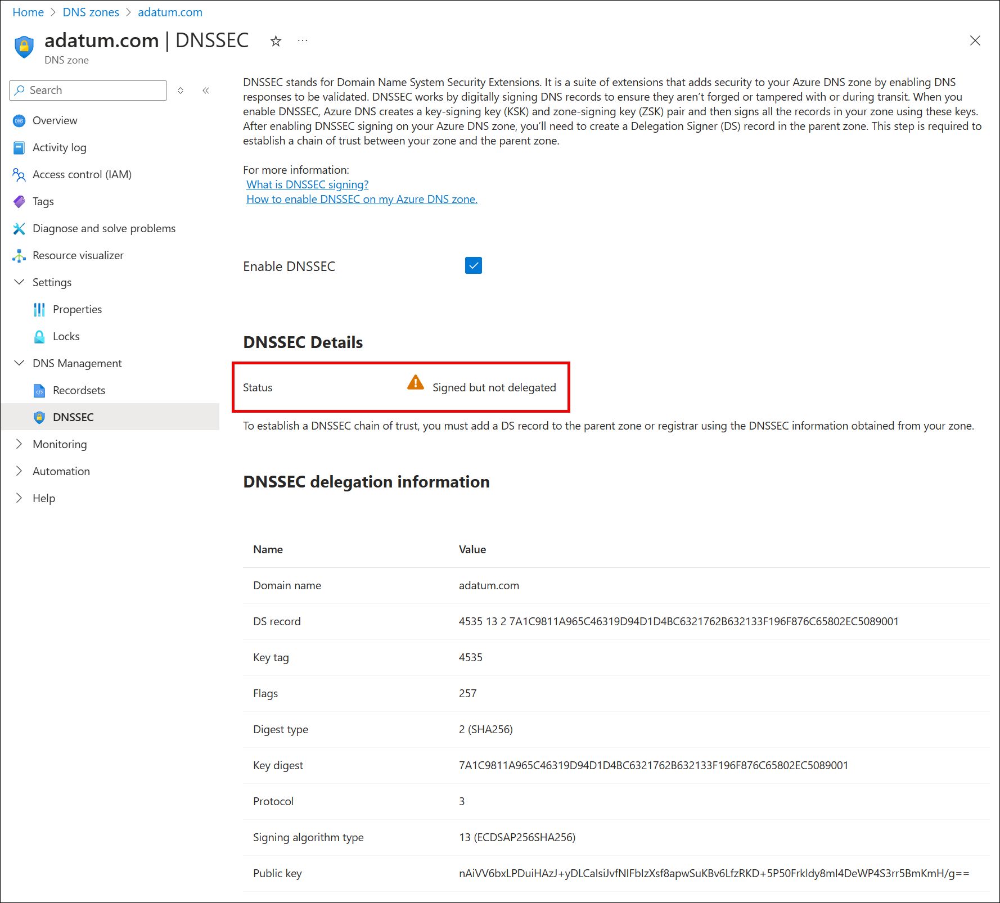
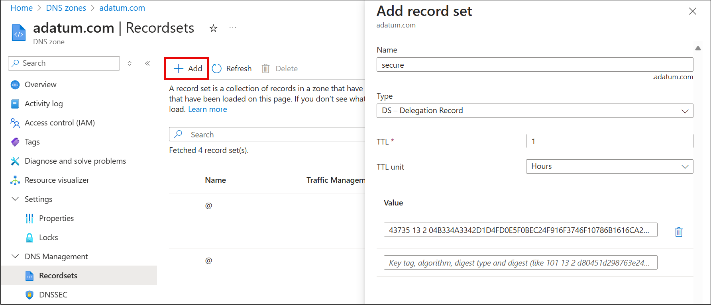

# How to sign your Azure pubic DNS zone with DNSSEC (Preview)

This article shows you how to sign your DNS zone with DNSSEC using the Azure portal.

## Prerequisites

* The DNS zone must be hosted by Azure Public DNS. For more information, see [Manage DNS zones](/azure/dns/dns-operations-dnszones-portal).
* The parent DNS zone must be signed with DNSSEC. Most major top level domains (.com, .net, .org) are already signed.
* You must register to the public preview for DNSSEC, using either the [Azure portal](#register-using-the-azure-portal) or the [Azure CLI](#register-using-the-azure-cli). 

## Register to the preview

### Register using the Azure CLI

Register for the preview using the Azure CLI:

```azurepowershell-interactive
Set-AzContext -Subscription <subscription-id>
Get-AzProviderFeature -FeatureName AllowDnsSecSigning -ProviderNamespace "Microsoft.Network"
Register-AzProviderFeature -FeatureName AllowDnsSecSigning -ProviderNamespace Microsoft.Network
```

### Register using the Azure portal

Use the following steps to enroll into the public preview for DNSSEC zone signing via the Azure portal:

1. Sign in to the [Azure portal](https://portal.azure.com/).
2. In the search box, enter _subscriptions_ and select **Subscriptions**.

    :::image type="content" source="../azure-resource-manager/management/media/preview-features/search.png" alt-text="Azure portal search.":::

3. Select the link for your subscription's name.

    :::image type="content" source="../azure-resource-manager/management/media/preview-features/subscriptions.png" alt-text="Select Azure subscription.":::

4. From the left menu, under **Settings** select **Preview features**.

    :::image type="content" source="../azure-resource-manager/management/media/preview-features/preview-features-menu.png" alt-text="Azure preview features menu.":::

5. You see a list of available preview features and your current registration status.

    :::image type="content" source="../azure-resource-manager/management/media/preview-features/preview-features-list.png" alt-text="Azure portal list of preview features.":::

6. From **Preview features** type into the filter box **AllowDnsSecSigning**, check the feature, and click **Register**.

    :::image type="content" source="../azure-resource-manager/management/media/preview-features/filter.png" alt-text="Azure portal filter preview features.":::

## Sign a zone with DNSSEC

To protect your DNS zone with DNSSEC, you must first sign the zone. The zone signing process creates a delegation signer (DS) record that must then be added to the parent zone.

# [Azure portal](#tab/sign-portal)

To sign your zone with DNSSEC using the Azure portal:

1. On the Azure portal Home page, search for and select **DNS zones**.
2. Select your DNS zone, and then from the zone's **Overview** page, select **DNSSEC**. You can select **DNSSEC** from the menu at the top, or under **DNS Management**.

    

3. Select the **Enable DNSSEC** checkbox and when you are prompted to confirm that you wish to enable DNSSEC, select **OK**.

    

4. After the zone is signed, review the **DNSSEC delegation information** that is displayed. Notice that the status is: **Signed but not delegated**.

    

5. Copy the delegation information and use it to create a DS record in the parent zone. 

    1. If the parent zone is a top level domain or you don't own the parent zone, you must add the DS record at your registrar. Each registrar has its own process. The registrar might ask for values such as the Key Tag, Algorithm, Digest Type, and Key Digest. In the example shown here, these values are:

        **Key Tag**: 4535<br>
        **Algorithm**: 13<br>
        **Digest Type**: 2<br>
        **Digest**: 7A1C9811A965C46319D94D1D4BC6321762B632133F196F876C65802EC5089001

    2. If you own the parent zone, you can add a DS record directly to the parent yourself. The following example shows how to add a DS record to the DNS zone **adatum.com** for the child zone **secure.adatum.com** when both zones are hosted using Azure Public DNS:

        
        

6. When the DS record has been uploaded to the parent zone, select the DNSSEC information page for your zone and verify that **Signed and delegation established** is displayed.

    

# [Azure CLI](#tab/sign-cli)

Sign a zone using the Azure CLI:

```azurepowershell-interactive
commands here
```

# [PowerShell](#tab/sign-powershell)

Sign a zone using PowerShell:

```PowerShell
commands here
```

## Next steps

To learn more about alias records, see the following articles:

- [Tutorial: Configure an alias record to refer to an Azure public IP address](tutorial-alias-pip.md)
- [Tutorial: Configure an alias record to support apex domain names with Traffic Manager](tutorial-alias-tm.md)
- [DNS FAQ](./dns-faq.yml)

To learn how to migrate an active DNS name, see [Migrate an active DNS name to Azure App Service](../app-service/manage-custom-dns-migrate-domain.md).