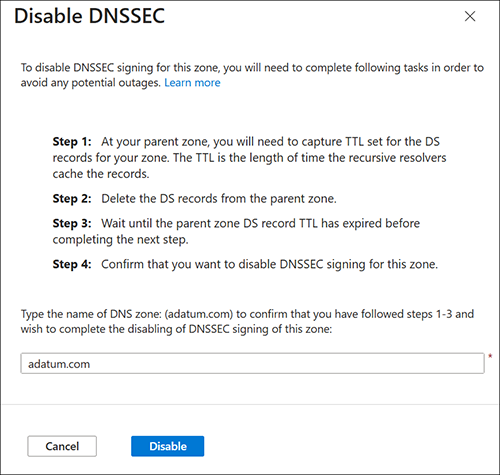

# How to unsign your Azure Public DNS zone

This article shows you how to remove [Domain Name System Security Extensions (DNSSEC)](dnssec.md) from your Azure Public DNS zone.

To sign a zone with DNSSEC, see [How to sign your Azure Public DNS zone with DNSSEC](dnssec-how-to.md).

## Prerequisites

* The DNS zone must be hosted by Azure Public DNS. For more information, see [Manage DNS zones](/azure/dns/dns-operations-dnszones-portal).
* You must have permission to delete a DS record from the parent DNS zone. Most top level domains (.com, .net, .org) allow you to do this using your registrar.

## Unsign a zone

> [!IMPORTANT]
> Removing DNSSEC from your DNS zone requires that you first remove the delegation signer (DS) record from the parent zone, and wait for the time-to-live (TTL) of the DS record to expire. After the DS record TTL has expired, you can safely unsign the zone.

## [Azure portal](#tab/sign-portal)

To unsign a zone using the Azure portal:

1. On the Azure portal Home page, search for and select **DNS zones**.
2. Select your DNS zone, and then from the zone's **Overview** page, select **DNSSEC**. You can select **DNSSEC** from the menu at the top, or under **DNS Management**.
3. If you have successfully removed the DS record at your registrar for this zone, you see that the DNSSEC status is **Signed but not delegated**. Do not proceed until you see this status.

    

4. Clear the **Enable DNSSEC** checkbox and select **OK** in the popup dialog box confirming that you wish to disable DNSSEC.

    

5. In the **Disable DNSSEC** pane, type the name of your domain and then select **Disable**. 

    

6. The zone is now unsigned.

## [Azure CLI](#tab/sign-cli)

Unsign a DNSSEC-signed zone using the Azure CLI:

1. To unsign a signed zone, issue the following commands. Replace the values for subscription ID, resource group, and zone name with your values.

```azurepowershell-interactive
# Ensure you are logged in to your Azure account
az login

# Select the appropriate subscription
az account set --subscription "your-subscription-id"

# Disable DNSSEC for the DNS zone
az network dns dnssec-config delete --resource-group "your-resource-group" --zone-name "adatum.com"

# Verify the DNSSEC configuration has been removed
az network dns dnssec-config show --resource-group "your-resource-group" --zone-name "adatum.com"
```

2. Confirm that **(NotFound) DNSSEC is not enabled for DNS zone 'adatum.com'** is displayed after the last command. The zone is now unsigned.

## [PowerShell](#tab/sign-powershell)

1. Use the following commands to remove DNSSEC signing from your zone and view the zone status using PowerShell. Replace the values for subscription ID, resource group, and zone name with your values.

```PowerShell
# Connect to your Azure account (if not already connected)
Connect-AzAccount

# Select the appropriate subscription
Select-AzSubscription -SubscriptionId "your-subscription-id"

# Disable DNSSEC for the DNS zone
Remove-AzDnsDnssecConfig -ResourceGroupName "your-resource-group" -ZoneName "adatum.com"

# View the DNSSEC configuration
Get-AzDnsDnssecConfig -ResourceGroupName "your-resource-group" -ZoneName "adatum.com"
```

2. Confirm that **DNSSEC is not enabled for DNS zone 'adatum.com'** is displayed after the last command. The zone is now unsigned.

---

## Next steps

- Learn how to [sign a DNS zone with DNSSEC](dnssec-how-to.md).
- Learn how to [host the reverse lookup zone for your ISP-assigned IP range in Azure DNS](dns-reverse-dns-for-azure-services.md).
- Learn how to [manage reverse DNS records for your Azure services](dns-reverse-dns-for-azure-services.md).