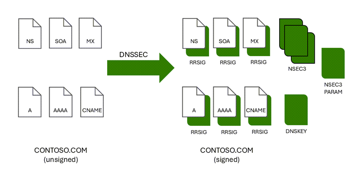

# What is DNSSEC?

Domain Name System Security Extensions (DNSSEC) is a suite of extensions that add security to the Domain Name System (DNS) protocol by enabling DNS responses to be validated as genuine. DNSSEC provides origin authority, data integrity, and authenticated denial of existence. With DNSSEC, the DNS protocol is much less susceptible to certain types of attacks, particularly DNS spoofing attacks.

The core DNSSEC extensions are specified in the following Request for Comments (RFCs):

* [RFC 4033](https://datatracker.ietf.org/doc/html/rfc4033): "DNS Security Introduction and Requirements"
* [RFC 4034](https://datatracker.ietf.org/doc/html/rfc4034): "Resource Records for the DNS Security Extensions"
* [RFC 4035](https://datatracker.ietf.org/doc/html/rfc4035): "Protocol Modifications for the DNS Security Extensions"

For a summary of RFCs, see [RFC9364](https://www.rfc-editor.org/rfc/rfc9364): DNS Security Extensions (DNSSEC).

## Why sign a zone with DNSSEC?

> [!NOTE]
> DNSSEC zone signing is currently in Public Preview. For more information, see [How to sign your Azure Public DNS zone with DNSSEC (Preview)](dnssec-how-to.md).

DNSSEC validation of DNS responses can prevent common types of DNS hijacking attacks, also known as DNS redirection. DNS hijacking occurs when a client device is redirected to a malicious server by using incorrect (spoofed) DNS responses. An example of how DNS hijacking works is shown in the following figure.

  

**Normal DNS resolution**:
1. A client device sends a DNS query for **contoso.com** to a DNS server.
2. The DNS server responds with a DNS resource record for **contoso.com**.
3. The client device requests a response from **contoso.com**.
4. The contoso.com app or web server returns a response to the client.

**DNS hijacking**
1. A client device sends a DNS query for **contoso.com** to a hijacked DNS server.
2. The DNS server responds with an invalid (spoofed) DNS resource record for **contoso.com**.
3. The client device requests a response for **contoso.com** from malicious server.
4. The malicious server returns a spoofed response to the client.

The type of DNS resource record that is spoofed depends on the type of DNS hijacking attack. An MX record might be spoofed to redirect client emails, or a spoofed A record might send clients to a malicious web server.  

DNSSEC works to prevent DNS hijacking by performing validation on DNS responses.

## How DNSSEC works

DNS zones can be secured with DNSSEC using a process called zone signing. Signing a zone with DNSSEC adds validation support without changing the basic mechanism of a DNS query and response. To sign a zone with DNSSEC, the zone's primary authoritative DNS server must support DNSSEC.

[DNSSEC validation](#dnssec-validation) of DNS responses occurs by using digital signatures. Resource Record Signatures (RRSIGs) and other cryptographic records are added to the zone when it is signed. 

The following figure shows DNS resource records in the zone contoso.com before and after zone signing.

  

If a DNS resolver is DNSSEC-aware, it can set the DNSSEC OK (DO) flag in the DNS query to 1. This tells the responding DNS server to include DNSSEC records to be in it's response. The resolver can then use the DNSSEC records to validate that the DNS response is genuine. In order for DNSSEC validation to work end-to-end, there must be an unbroken [chain of trust](#chain-of-trust).

## Chain of trust

 A chain of trust occurs when all the DNS servers involved in sending a response for a DNS query are able to validate that the response was not modified during transit. 

 Authoritative servers:
- Authoritative DNS servers maintain a chain of trust by verifying the authenticiy of the DNS zone in the DNS hierarchy. For example, if a parent zone doesn't have a delegation signer (DS) record for a child zone, it can't verify the DNSSEC status of the child zone and the chain of trust is broken.

Recursive servers:
- Recursive DNS servers, also called resolving or caching DNS servers, maintain a chain of trust through the use of trust anchors. A trust anchor is a public cryptographic key for a signed zone. 
    - If a recursive DNS server does not have a DNSSEC trust anchor, it will not perform DNSSEC validation.
    - If a recursive DNS server has a DNSSEC trust anchor for either a child zone or its parent zone the recursive DNS server verifies that a DS record for the child zone is present in the parent zone and then performs DNSSEC validation. If the recursive DNS server determines that the parent zone does not have a DS record for the child zone, it assumes the child zone is insecure and does not perform DNSSEC validation.
    - In rare cases, a recursive server can have DNSSEC validation disabled or are not DNSSEC-aware.

## DNSSEC validation

A recursive DNS server uses the DNSKEY resource record to validate responses from the authoritative DNS server by decrypting digital signatures that are contained in DNSSEC-related resource records, and then by computing and comparing hash values. If hash values are the same, it provides a reply to the DNS client with the DNS data that it requested, such as a host (A) resource record. 

  

If hash values are not the same, it replies with a SERVFAIL message. In this way, a DNSSEC-capable, resolving DNS server with a valid trust anchor installed protects against DNS spoofing attacks whether or not DNS clients are DNSSEC-aware.

## DNSSEC-related resource records

Table here

## Next steps

- Learn how to [sign a DNS zone with DNSSEC](dnssec-how-to.md).
- Learn how to [unsign a DNS zone](dnssec-unsign.md).
- Learn how to [host the reverse lookup zone for your ISP-assigned IP range in Azure DNS](dns-reverse-dns-for-azure-services.md).
- Learn how to [manage reverse DNS records for your Azure services](dns-reverse-dns-for-azure-services.md).
