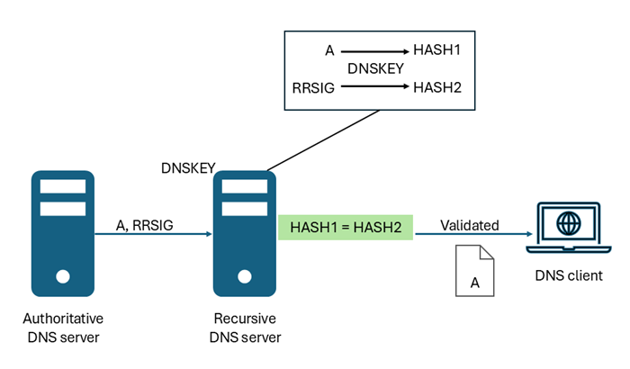

# DNSSEC overview

This article provides an overview of Domain Name System Security Extensions (DNSSEC) and includes an introduction to [DNSSEC terminology](#dnssec-terminology). Benefits of DNSSEC zone signing are described and examples are provided for viewing DNSSEC related resource records. When you are ready to sign your Azure public DNS zone, see the following how-to guides:

- [How to sign your Azure Public DNS zone with DNSSEC](dnssec-how-to.md).
- [How to unsign your Azure Public DNS zone](dnssec-unsign.md)
 
## What is DNSSEC?

DNSSEC is a suite of extensions that add security to the Domain Name System (DNS) protocol by enabling DNS responses to be validated as genuine. DNSSEC provides origin authority, data integrity, and authenticated denial of existence. With DNSSEC, the DNS protocol is much less susceptible to certain types of attacks, particularly DNS spoofing attacks.

The core DNSSEC extensions are specified in the following Request for Comments (RFCs):

* [RFC 4033](https://datatracker.ietf.org/doc/html/rfc4033): "DNS Security Introduction and Requirements"
* [RFC 4034](https://datatracker.ietf.org/doc/html/rfc4034): "Resource Records for the DNS Security Extensions"
* [RFC 4035](https://datatracker.ietf.org/doc/html/rfc4035): "Protocol Modifications for the DNS Security Extensions"

For a summary of DNSSEC RFCs, see [RFC9364](https://www.rfc-editor.org/rfc/rfc9364): DNS Security Extensions (DNSSEC).

## How DNSSEC works

DNS zones are secured with DNSSEC using a process called zone signing. Signing a zone with DNSSEC adds validation support without changing the basic mechanism of a DNS query and response. To sign a zone with DNSSEC, the zone's primary authoritative DNS server must support DNSSEC.

Resource Record Signatures (RRSIGs) and other cryptographic records are added to the zone when it's signed. The following figure shows DNS resource records in the zone contoso.com before and after zone signing.

  

[DNSSEC validation](#dnssec-validation) of DNS responses occurs by using these digital signatures with an unbroken [chain of trust](#chain-of-trust).

> [!NOTE]
> DNSSEC-related resource records aren't displayed in the Azure portal. For more information, see [View DNSSEC-related resource records](#view-dnssec-related-resource-records). 

## Why sign a zone with DNSSEC?

Signing a zone with DNSSEC is required for compliance with some security guidelines, such as SC-20: Secure Name/Address Resolution Service. 

DNSSEC validation of DNS responses can prevent common types of DNS hijacking attacks, also known as DNS redirection. DNS hijacking occurs when a client device is redirected to a malicious server by using incorrect (spoofed) DNS responses. DNS cache poisoning is a common method used to spoof DNS responses.

An example of how DNS hijacking works is shown in the following figure.

  

**Normal DNS resolution**:
1. A client device sends a DNS query for **contoso.com** to a DNS server.
2. The DNS server responds with a DNS resource record for **contoso.com**.
3. The client device requests a response from **contoso.com**.
4. The contoso.com app or web server returns a response to the client.

**DNS hijacking**
1. A client device sends a DNS query for **contoso.com** to a hijacked DNS server.
2. The DNS server responds with an invalid (spoofed) DNS resource record for **contoso.com**.
3. The client device requests a response for **contoso.com** from malicious server.
4. The malicious server returns a spoofed response to the client.

The type of DNS resource record that is spoofed depends on the type of DNS hijacking attack. An MX record might be spoofed to redirect client emails, or a spoofed A record might send clients to a malicious web server.

DNSSEC works to prevent DNS hijacking by performing validation on DNS responses. In the DNS hijacking scenario pictured here, the client device can reject non-validated DNS responses if the contoso.com domain is signed with DNSSEC. To reject non-validated DNS responses, the client device must enforce [DNSSEC validation](#dnssec-validation) for contoso.com.

DNSSEC also includes Next Secure 3 (NSEC3) to prevent zone enumeration. Zone enumeration, also known as zone walking, is an attack whereby the attacker establishes a list of all names in a zone, including child zones. 

Before you sign a zone with DNSSEC, be sure to understand [how DNSSEC works](#how-dnssec-works). When you are ready to sign a zone, see [How to sign your Azure Public DNS zone with DNSSEC](dnssec-how-to.md).

## DNSSEC validation

If a DNS server is DNSSEC-aware, it can set the DNSSEC OK (DO) flag in a DNS query to a value of `1`. This value tells the responding DNS server to include DNSSEC-related resource records with the response. These DNSSEC records are Resource Record Signature (RRSIG) records that are used to validate that the DNS response is genuine. 

A recursive (non-authoritative) DNS server performs DNSSEC validation on RRSIG records using a [trust anchor](#trust-anchors-and-dnssec-validation) (DNSKEY). The server uses a DNSKEY to decrypt digital signatures in RRSIG records (and other DNSSEC-related records), and then computes and compares hash values. If hash values are the same, it provides a reply to the DNS client with the DNS data that it requested, such as a host address (A) record. See the following diagram:

  

If hash values aren't the same, the recursive DNS server replies with a SERVFAIL message. In this way, DNSSEC-capable resolving (or forwarding) DNS servers with a valid trust anchor installed can protect against DNS hijacking in the path between the recursive server and the authoritative server. This protection doesn't require DNS client devices to be DNSSEC-aware or to enforce DNS response validation, provided the local (last hop) recursive DNS server is itself secure from hijacking.

Windows 10 and Windows 11 client devices are [nonvalidating security-aware stub resolvers](#dnssec-terminology). These client devices don't perform validation, but can enforce DNSSEC validation using Group Policy. [The NRPT](/previous-versions/windows/it-pro/windows-server-2012-r2-and-2012/dn593632(v=ws.11)) can be used to create and enforce namespace based DNSSEC validation policy.

### Trust anchors and DNSSEC validation

> [!NOTE] 
> DNSSEC response validation is not performed by the default Azure-provided resolver. The information in this section is helpful if you are setting up your own recursive DNS servers for DNSSEC validation or troubleshooting validation issues.

Trust anchors operate based on the DNS namespace hierarchy. A recursive DNS server can have any number of trust anchors, or no trust anchors. Trust anchors can be added for a single child DNS zone, or any parent zone. If a recursive DNS server has a root (.) trust anchor, then it can perform DNSSEC validation on any DNS zone. For more information, see [Root Zone Operator Information](https://www.iana.org/dnssec).

The DNSSEC validation process works with trust anchors as follows:
  - If a recursive DNS server doesn't have a DNSSEC trust anchor for a zone or the zone's parent hierarchical namespace, it will not perform DNSSEC validation on that zone.
  - If a recursive DNS server has a DNSSEC trust anchor for a zone's parent namespace and it receives a query for the child zone, it checks to see if a DS record for the child zones is present in the parent zone. 
    - If the DS record is found, the recursive DNS server performs DNSSEC validation. 
    - If the recursive DNS server determines that the parent zone doesn't have a DS record for the child zone, it assumes the child zone is insecure and doesn't perform DNSSEC validation.
  - If multiple recursive DNS servers are involved in a DNS response (including forwarders), each server must be able to perform DNSSEC validation on the response so that there is an unbroken chain of trust.
  - Recursive servers that have DNSSEC validation disabled or aren't DNSSEC-aware don't perform validation.

## Chain of trust

 A chain of trust occurs when all the DNS servers involved in sending a response for a DNS query are able to validate that the response wasn't modified during transit. In order for DNSSEC validation to work end-to-end, the chain of trust must be unbroken. This chain of trust applies to both authoritative and non-authoritative (recursive) servers.

### Authoritative servers  

Authoritative DNS servers maintain a chain of trust through the use of delegation signer (DS) records. DS records are used to verify the authenticity of child zones in the DNS hierarchy. 
 - In order for DNSSEC validation to occur on a signed zone, the parent of the signed zone must also be signed. The parent zone also must have a DS record for the child zone.
 - During the validation process, a zone's parent is queried for the DS record. If the DS record is not present, or the DS record data in the parent does not match the DNSKEY data in the child zone, the chain of trust is broken and validation fails.

### Recursive servers

Recursive DNS servers (also called resolving or caching DNS servers) maintain a chain of trust through the use of DNSSEC trust anchors. 
- The trust anchor is a DNSKEY record, or DS record containing a [hash](/dotnet/standard/security/ensuring-data-integrity-with-hash-codes) of a DNSKEY record. The DNSKEY record is created on an authoritative server when a zone is signed, and removed from the zone if the zone is unsigned. 
- Trust anchors must be manually installed on recursive DNS servers. 
- If a trust anchor for a parent zone is present, a recursive server can validate all child zones in the hierarchical namespace. This includes forwarded queries. To support DNSSEC validation of all DNSSEC-signed DNS zones, you can install a trust anchor for the root (.) zone.

## Key rollover

The zone signing key (ZSK) in a DNSSEC-signed zone is periodically rolled over (replaced) automatically by Azure. It should not be necessary to replace your key signing key (KSK), but this option is available by contacting Microsoft support. Replacing the KSK requires that you also update your DS record in the parent zone.

## Zone signing Algorithm

Zones are DNSSEC signed using Elliptic Curve Digital Signature Algorithm (ECDSAP256SHA256).

## DNSSEC-related resource records

The following table provides a short description of DNSSEC-related records. For more detailed information, see [RFC 4034: Resource Records for the DNS Security Extensions](https://datatracker.ietf.org/doc/html/rfc4034) and [RFC 7344: Automating DNSSEC Delegation Trust Maintenance](https://datatracker.ietf.org/doc/html/rfc7344).

| Record | Description |
| --- | --- |
| Resource record signature (RRSIG) | A DNSSEC resource record type that is used to hold a signature, which covers a set of DNS records for a particular name and type. |
| DNSKEY | A DNSSEC resource record type that is used to store a public key. |
| Delegation signer (DS) | A DNSSEC resource record type that is used to secure a delegation. |
| Next secure (NSEC) | A DNSSEC resource record type that is used to prove nonexistence of a DNS name. |
| Next secure 3 (NSEC3) | The NSEC3 resource record that provides hashed, authenticated denial of existence for DNS resource record sets. |
| Next secure 3 parameters (NSEC3PARAM) | Specifies parameters for NSEC3 records. |
| Child delegation signer (CDS) | This record is optional. If present, the CDS record can be used by a child zone to specify the desired contents of the DS record in a parent zone. |
| Child DNSKEY (CDNSKEY) | This record is optional. If the CDNSKEY record is present in a child zone, it can be used to generate a DS record from a DNSKEY record. |

### View DNSSEC-related resource records

DNSSEC-related records are not displayed in the Azure portal. To view DNSSEC-related records, use command line tools such as Resolve-DnsName or dig.exe. These tools are available using Cloud Shell, or locally if installed on your device. Be sure to set the DO flag in your query by using the `-dnssecok` option in Resolve-DnsName or the `+dnssec` option in dig.exe. 

> [!IMPORTANT]
> Don't use the nslookup.exe command-line tool to query for DNSSEC-related records. The nslookup.exe tool uses an internal DNS client that isn't DNSSEC-aware. 

See the following examples:

```PowerShell
PS C:\> resolve-dnsname server1.contoso.com -dnssecok

Name                                      Type   TTL   Section    IPAddress
----                                      ----   ---   -------    ---------
server1.contoso.com                        A     3600  Answer     203.0.113.1

Name        : server1.contoso.com
QueryType   : RRSIG
TTL         : 3600
Section     : Answer
TypeCovered : A
Algorithm   : 13
LabelCount  : 3
OriginalTtl : 3600
Expiration  : 9/20/2024 11:25:54 PM
Signed      : 9/18/2024 9:25:54 PM
Signer      : contoso.com
Signature   : {193, 20, 122, 196…}
```

```Cmd
C:\>dig server1.contoso.com +dnssec

; <<>> DiG 9.9.2-P1 <<>> server1.contoso.com +dnssec
;; global options: +cmd
;; Got answer:
;; ->>HEADER<<- opcode: QUERY, status: NOERROR, id: 61065
;; flags: qr rd ra; QUERY: 1, ANSWER: 2, AUTHORITY: 0, ADDITIONAL: 1

;; OPT PSEUDOSECTION:
; EDNS: version: 0, flags: do; udp: 512
;; QUESTION SECTION:
;server1.contoso.com.       IN      A

;; ANSWER SECTION:
server1.contoso.com. 3600   IN      A       203.0.113.1
server1.contoso.com. 3600   IN      RRSIG   A 13 3 3600 20240920232359 20240918212359 11530 contoso.com. GmxeQhNk1nJZiep7nuCS2qmOQ+Ffs78Z2eoOgIYP3j417yqwS1DasfA5 e1UZ4HuujDk2G6GIbs0ji3RiM9ZpGQ==

;; Query time: 153 msec
;; SERVER: 192.168.1.1#53(192.168.1.1)
;; WHEN: Thu Sep 19 15:23:45 2024
;; MSG SIZE  rcvd: 179
```

```PowerShell
PS C:\> resolve-dnsname contoso.com -Type dnskey -dnssecok

Name                                 Type   TTL   Section    Flags  Protocol Algorithm      Key
----                                 ----   ---   -------    -----  -------- ---------      ---
contoso.com                          DNSKEY 3600  Answer     256    DNSSEC   13             {115, 117, 214,
                                                                                                165…}
contoso.com                          DNSKEY 3600  Answer     256    DNSSEC   13             {149, 166, 55, 78…}
contoso.com                          DNSKEY 3600  Answer     257    DNSSEC   13             {45, 176, 217, 2…}

Name        : contoso.com
QueryType   : RRSIG
TTL         : 3600
Section     : Answer
TypeCovered : DNSKEY
Algorithm   : 13
LabelCount  : 2
OriginalTtl : 3600
Expiration  : 11/17/2024 9:00:15 PM
Signed      : 9/18/2024 9:00:15 PM
Signer      : contoso.com
Signature   : {241, 147, 134, 121…}
```

```Cmd
C:\>dig contoso.com dnskey

; <<>> DiG 9.9.2-P1 <<>> contoso.com dnskey
;; global options: +cmd
;; Got answer:
;; ->>HEADER<<- opcode: QUERY, status: NOERROR, id: 46254
;; flags: qr rd ra; QUERY: 1, ANSWER: 3, AUTHORITY: 0, ADDITIONAL: 1

;; OPT PSEUDOSECTION:
; EDNS: version: 0, flags:; udp: 512
;; QUESTION SECTION:
;contoso.com.               IN      DNSKEY

;; ANSWER SECTION:
contoso.com.        3600    IN      DNSKEY  256 3 13 laY3Toc/VTyjupgp/+WgD05N+euB6Qe1iaM/253k7bkaA0Dx+gSDhbH2 5wXTt+uLQgPljL9OusKTneLdhU+1iA==
contoso.com.        3600    IN      DNSKEY  257 3 13 LbDZAtjG8E9Ftih+LC8CqQrSZIJFFJMtP6hmN3qBRqLbtAj4JWtr2cVE ufXM5Pd/yW+Ca36augQDucd5n4SgTg==
contoso.com.        3600    IN      DNSKEY  256 3 13 c3XWpTqZ0q9IO+YqMEtOBHZSzGGeyFKq0+3xzs6tifvD1rey1Obhrkz4 DJlEIxy2m84VsG1Ij9VYdtGxxeVHIQ==

;; Query time: 182 msec
;; SERVER: 192.168.1.1#53(192.168.1.1)
;; WHEN: Thu Sep 19 16:35:10 2024
;; MSG SIZE  rcvd: 284
```

## DNSSEC terminology

This list is provided to help understand some of the common terms used when discussing DNSSEC. Also see: [DNSSEC-related resource records](#dnssec-related-resource-records)

| Term | Description |
| --- | --- |
| Authenticated data (AD) bit | A data bit that indicates in a response that all data included in the answer and authority sections of the response has been authenticated by the DNS server according to the policies of that server. |
| Authentication chain | A chain of signed and validated DNS records that extends from a preconfigured trust anchor to some child zone in the DNS tree. |
| DNS Extension (EDNS0) | A DNS record that carries extended DNS header information, such as the **DO bit** and maximum UDP packet size. |
| DNS Security Extensions (DNSSEC) | Extensions to the DNS service that provide mechanisms for signing and for securely resolving DNS data. |
| DNSSEC OK (DO) bit | A bit in the EDNS0 portion of a DNS request that signals that the client is DNSSEC-aware. |
| DNSSEC validation | DNSSEC validation is the process of verifying the origin and integrity of DNS data using public cryptographic keys. |
| Island of security | A signed zone that doesn't have an authentication chain from its delegating parent zone. |
| Key signing key (KSK) | An authentication key that corresponds to a private key that is used to sign one or more other signing keys for a given zone. Typically, the private key that corresponds to a KSK signs a zone signing key (ZSK), which in turn has a corresponding private key that signs other zone data. Local policy can require that the ZSK be changed frequently, while the KSK can have a longer validity period in order to provide a more stable, secure entry point into the zone. Designating an authentication key as a KSK is purely an operational issue: DNSSEC validation doesn't distinguish between KSKs and other DNSSEC authentication keys. It's possible to use a single key as both a KSK and a ZSK. |
| Nonvalidating security-aware stub resolver | A security-aware stub resolver that trusts one or more security-aware DNS servers to perform DNSSEC validation on its behalf. |
| secure entry point (SEP) key | A subset of public keys within the DNSKEY RRSet. A SEP key is used either to generate a DS RR or is distributed to resolvers that use the key as a trust anchor. |
| Security-aware DNS server | A DNS server that implements the DNS security extensions as defined in RFCs 4033 [5], 4034 [6], and 4035 [7]. In particular, a security-aware DNS server is an entity that receives DNS queries, sends DNS responses, supports the EDNS0 [3] message size extension and the DO bit, and supports the DNSSEC record types and message header bits. |
| Signed zone | A zone whose records are signed as defined by RFC 4035 [7] Section 2. A signed zone can contain DNSKEY, NSEC, NSEC3, NSEC3PARAM, RRSIG, and DS resource records. These resource records enable DNS data to be validated by resolvers. |
| Trust anchor | A preconfigured public key that is associated with a particular zone. A trust anchor enables a DNS resolver to validate signed DNSSEC resource records for that zone and to build authentication chains to child zones. |
| Unsigned zone | Any DNS zone that has not been signed as defined by RFC 4035 [7] Section 2. |
| Zone signing | Zone signing is the process of creating and adding DNSSEC-related resource records to a zone, making it compatible with DNSSEC validation. |
| Zone unsigning | Zone unsigning is the process of removing DNSSEC-related resource records from a zone, restoring it to an unsigned status. |
| Zone signing key (ZSK) | An authentication key that corresponds to a private key that is used to sign a zone. Typically, a zone signing key is part of the same DNSKEY RRSet as the key signing key whose corresponding private key signs this DNSKEY RRSet, but the zone signing key is used for a slightly different purpose and can differ from the key signing key in other ways, such as in validity lifetime. Designating an authentication key as a zone signing key is purely an operational issue; DNSSEC validation doesn't distinguish between zone signing keys and other DNSSEC authentication keys. It's possible to use a single key as both a key signing key and a zone signing key. |

## Next steps

- Learn how to [sign a DNS zone with DNSSEC](dnssec-how-to.md).
- Learn how to [unsign a DNS zone](dnssec-unsign.md).
- Learn how to [host the reverse lookup zone for your ISP-assigned IP range in Azure DNS](dns-reverse-dns-for-azure-services.md).
- Learn how to [manage reverse DNS records for your Azure services](dns-reverse-dns-for-azure-services.md).
