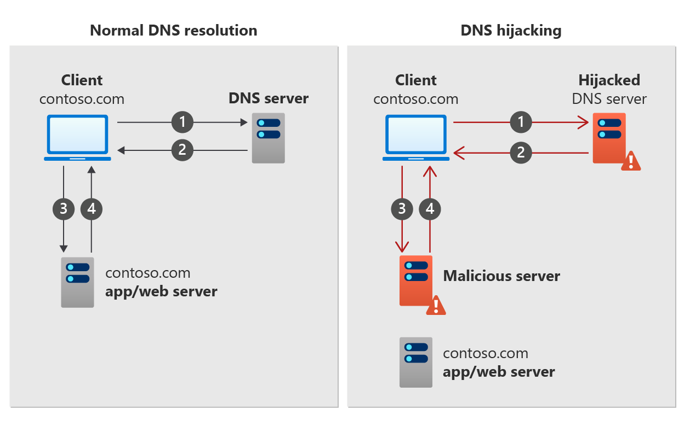

# What is DNSSEC?

Domain Name System Security Extensions (DNSSEC) is a suite of extensions that add security to the Domain Name System (DNS) protocol by enabling DNS responses to be validated. DNSSEC provides origin authority, data integrity, and authenticated denial of existence. With DNSSEC, the DNS protocol is much less susceptible to certain types of attacks, particularly DNS spoofing attacks.

## How DNSSEC works

DNS zones can be secured with DNSSEC using a process called zone signing. Signing a zone with DNSSEC adds validation support to a zone without changing the basic mechanism of a DNS query and response. To sign a zone with DNSSEC, the zone's primary authoritative DNS server must support DNSSEC.

Validation of DNS responses occurs by using digital signatures included with DNS responses. These digital signatures are contained in DNSSEC-related resource records that are generated and added to the zone during zone signing.

## Why sign a zone with DNSSEC?

DNSSEC validation of DNS responses can prevent common types of DNS hijacking attacks, also known as DNS redirection. DNS hijacking occurs when a client device is redirected to a malicious server by using incorrect (spoofed) DNS responses. An example of how DNS hijacking works is shown in the following figure.

**Normal DNS resolution**:
1. A client device sends a DNS query for **contoso.com** to a DNS server.
2. The DNS server responds with a DNS resource record for **contoso.com**.
3. The client device requests a response from **contoso.com**.
4. The contoso.com app or web server returns a response to the client.

**DNS hijacking**
1. A client device sends a DNS query for **contoso.com** to a hijacked DNS server.
2. The DNS server responds with an invalid (spoofed) DNS resource record for **contoso.com**.
3. The client device requests a response for **contoso.com** from malicious server.
4. The malicious server returns a spoofed response to the client.

The type of DNS resource record that is spoofed depends on the type of DNS hijacking attack. An MX record might be spoofed to redirect client emails, or a spoofed A record might send clients to a malicious web server.  

DNSSEC works to prevent DNS hijacking by performing validation on DNS responses.

## Chain of trust

In order to validate DNS responses, DNSSEC requires a chain of trust.

## Next steps

- For more information about reverse DNS, see [reverse DNS lookup on Wikipedia](https://en.wikipedia.org/wiki/Reverse_DNS_lookup).
- Learn how to [host the reverse lookup zone for your ISP-assigned IP range in Azure DNS](dns-reverse-dns-for-azure-services.md).
- Learn how to [manage reverse DNS records for your Azure services](dns-reverse-dns-for-azure-services.md).
