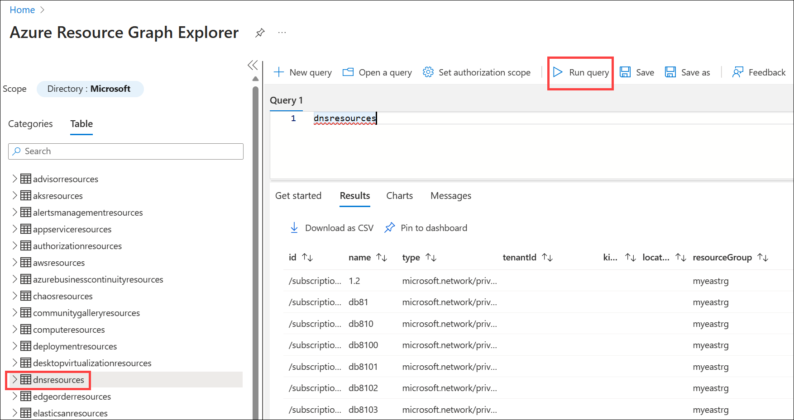
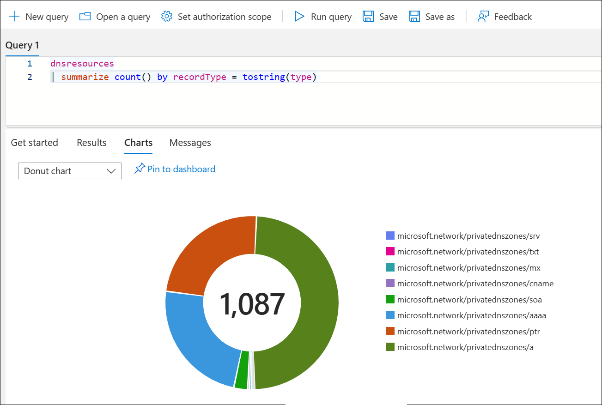
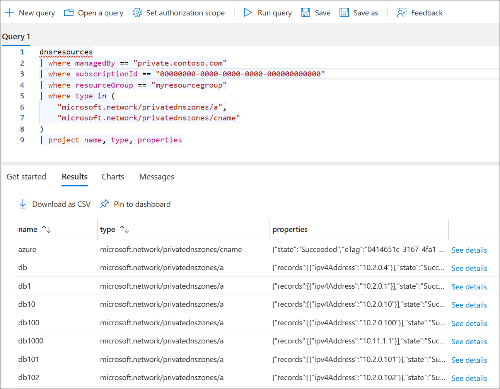
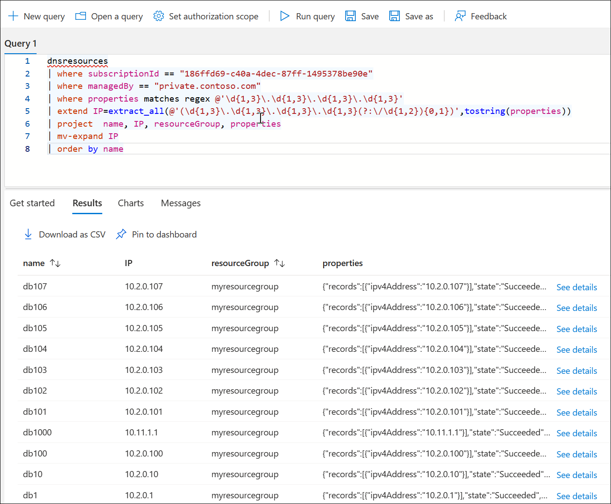
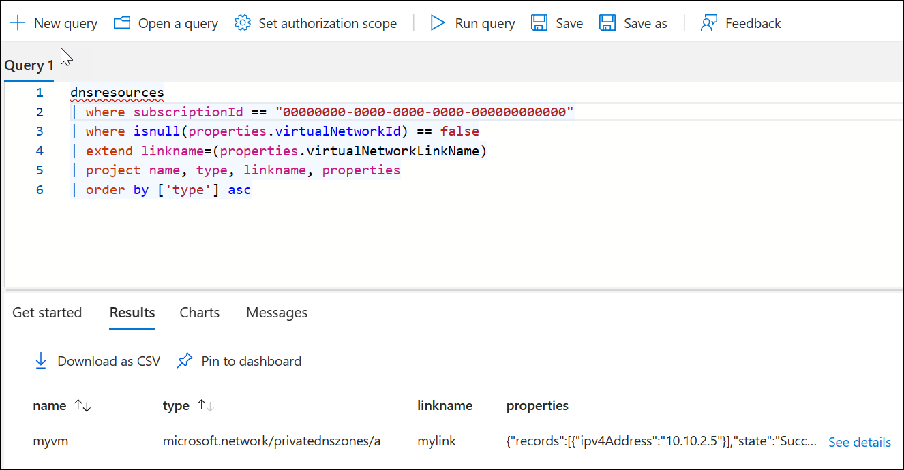
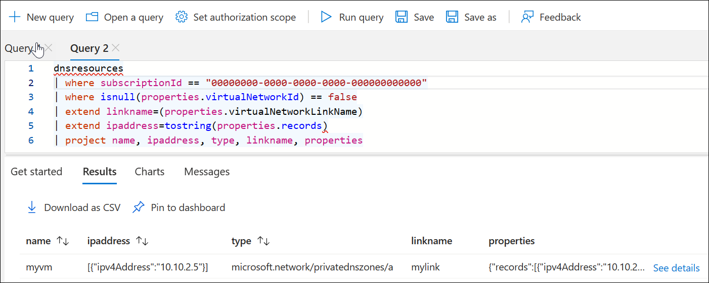

# Private DNS information in Azure Resource Graph

This article describes some of the ways you can use Azure Resource Graph Exporer to view information about your Azure Private DNS zones and records. Some example queries are provided.

[Azure Resource Graph](../governance/resource-graph/overview.md) (ARG) is an Azure service that allows you to query your Azure resources with complex filtering, grouping, and sorting. ARG queries provide detailed information about your resources and you can display the results in several ways. 

You can display information about your DNS zones, including:

- The type and number of resource records in one or all zones
- A list of resource record names and IP addresses
- Virtual network links
- Autoregistered resource records

This is a brief list. Many other details can be queried. 

## The dnsresources table

To use Resource Graph in the Azure portal, search and select **Resource Graph Explorer**. In the left-hand navigation pane, select the **Table** tab and review the **dnsresources** table. This table is used to query private DNS zone data. Public DNS zones aren't queried when you use this table. 

Select **dnsresources** to create a basic query and then click **Run query** to return the results. See the following example:



To replace IDs with display names and show values as links where possible, toggle **Formatted results** to **On** in the upper right corner of the display. To view the details for a record, scroll to the right and select **See details**. The first few records shown in the previous example are PTR records (type = microsoft.network/privatednszones/ptr).

## Count resource records by type

The following query uses the **dnsresources** table to provide a count of resource records by type for all private zones:

```Kusto
dnsresources
| summarize count() by recordType = tostring(type)
```


The query counts all records that the current subscription has permission to view. You can also view the count visually by selecting the **Charts** tab and then selecting the chart type. The following is an example of a **Donut chart**:



## List, filter, search, and sort resource records

Query results can be filtered by specifying parameters such as the zone name, subscription ID, resource group, or record type. For example, the following example query returns list of A or CNAME records in the zone **private.contoso.com** for a given subscription and resource group. The output of this query is similar to viewing the private zone, with the added ability to filter and sort results by name and type:

```Kusto
dnsresources
| where managedBy == "private.contoso.com"
| where subscriptionId == "<your subscription ID>"
| where resourceGroup == "<your resource group name>"
| where type in (
    "microsoft.network/privatednszones/a",
    "microsoft.network/privatednszones/cname"
)
| project name, type, properties
```



Record types that can be specified are: a, aaaa, cname, mx, ptr, soa, srv, and txt. 

You can also query for specific IP addresses or address ranges. The following query returns private DNS records that match a specific IPv4 address:

```Kusto
dnsresources
| where properties['records'][0]['ipv4Address'] == "10.10.2.5"
| project name, type, resourceGroup, properties
```

### Regular expressions

The Kusto query language also supports [regular expressions](/azure/data-explorer/kusto/query/re2). The following query uses a regular expression to match and list all IPv4 addresses in the given private DNS zone and specified subscription:

```Kusto
dnsresources
| where subscriptionId == "<your subscription ID>"
| where managedBy == "private.contoso.com"
| where properties matches regex @'\d{1,3}\.\d{1,3}\.\d{1,3}\.\d{1,3}'
| extend IP=extract_all(@'(\d{1,3}\.\d{1,3}\.\d{1,3}\.\d{1,3}(?:\/\d{1,2}){0,1})',tostring(properties))
| project  name, IP, resourceGroup, properties
| mv-expand IP
| order by name
```


## Zones with virtual network links

The following query lists all private DNS zones that have virtual network links and displays the autoregistration status. This query uses the generic **resources** table, not the **dnsresources** table and specifies a resource type of only **privatednszones**.

```Kusto
resources
| where subscriptionId == "<your subscription ID>"
| where ['type'] == "microsoft.network/privatednszones/virtualnetworklinks"
| extend registrationEnabled=(properties.registrationEnabled)
| project name, registrationEnabled, resourceGroup, properties
```


## Autoregistered DNS records

The following query lists autoregistered IPv4 private DNS records:

```Kusto
dnsresources
| where subscriptionId == "<your subscription ID>"
| where isnull(properties.virtualNetworkId) == false
| extend linkname=(properties.virtualNetworkLinkName)
| extend ipaddress=properties['records'][0]['ipv4Address']
| project name, ipaddress, type, linkname, properties
```


## Next steps

* Learn how to [manage record sets and records](./private-dns-getstarted-cli.md) in your DNS zone.
