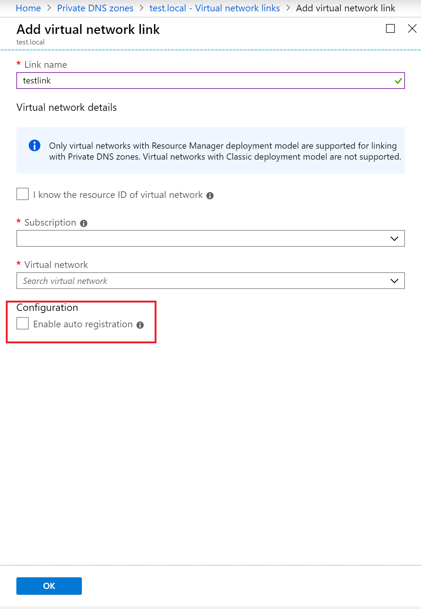

# What is a autoregistration

The Azure DNS private zones auto registration feature takes the pain out of DNS record management for virtual machines deployed in a virtual network. When you [link an virtual network](./private-dns-virtualnetworklinks.md) with a private DNS zone and enable auto registration for all the virtual machines, the DNS records for the virtual machines deployed in the virtual network are automatically created in the private DNS zone. In addition to forward look records (A records), reverse lookup records (PTR records) are also automatically created for the virtual machines.
If you add more virtual machines to the virtual network, DNS records for these virtual machines will also be automatically created in the linked private DNS zone.

When you delete a virtual machine, the DNS records for the virtual machine will be automatically deleted from the private DNS zone.

You can enable autoregistration by selecting "Enable Registration" option while creating a virtual network link.

## Restrictions

* Autoregistration works only for virtual machines. For all other resources like internal load balancers etc., you can create DNS records manually in the private DNS zone linked to the virtual network.
* DNS records will be created automatically only for the primary NIC of the virtual machine. If your virtual machines have more than one NIC, you can manually create the DNS records for other network interfaces.
* autoregistration for IPv6 (AAAA records) is not supported.

## Next steps

* Learn how to create a private zone in Azure DNS by using [Azure PowerShell](./private-dns-getstarted-powershell.md) or [Azure CLI](./private-dns-getstarted-cli.md).

* Read about some common [private zone scenarios](./private-dns-scenarios.md) that can be realized with private zones in Azure DNS.

* For common questions and answers about private zones in Azure DNS, including specific behavior you can expect for certain kinds of operations, see [Private DNS FAQ](./dns-faq-private.md).
