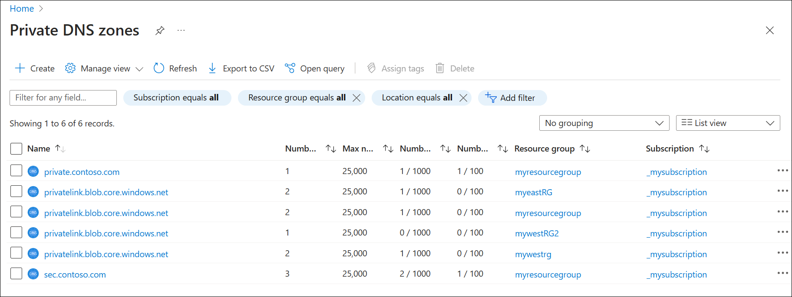

# Fallback to internet for Azure Private DNS zones

This article shows you how to set the [ResolutionPolicy](/java/api/com.azure.resourcemanager.privatedns.models.resolutionpolicy) property in Azure Private DNS to enable fallback to internet recursion when an authoritative NXDOMAIN response is received for a Private Link zone. NXDOMAIN is also known as a negative response. When a DNS resolver receives (or has cached) a negative response, it sends no DNS response to the DNS client and the query fails.

## Problem

Private DNS queries for Azure Private Link and network isolation scenarios across different tenants and resource groups have unique name resolution paths. This can affect the ability to reach Private Link-enabled resources outside a tenant's control. VM-based workarounds exist to address this issue, but these solutions increase operational complexity and are associated with security risks and higher costs.

## Solution

The [ResolutionPolicy](/azure/templates/microsoft.network/privatednszones/virtualnetworklinks?pivots=deployment-language-bicep#virtualnetworklinkproperties) property in Azure Private DNS is a fully managed native solution. This property enables public recursion via Azure’s recursive resolver fleet when an authoritative NXDOMAIN response is received for a private link zone, and the private address fails to resolve. Resolution policy is enabled at the virtual network link level with the **NxDomainRedirect** setting. In the Azure portal, **NxDomainRedirect** is enabled by selecting **Enable fallback to internet** in virtual network link configuration.

### Policy definition

The [ResolutionPolicy](/java/api/com.azure.resourcemanager.privatedns.models.resolutionpolicy) property is available in API version 2024-06-01 or higher. In the following example, **resolutionPolicy** is set to **NxDomainRedirect** at the **virtualNetworkLinks** resource level:

```Bicep
{
  "id": "'string'",
  "name": '"string'",
  "type": "Microsoft.Network/privateDnsZones/virtualNetworkLinks",
  "location": "global",
  "properties": {
    "provisioningState": "Succeeded",
    "registrationEnabled": bool,
    "resolutionPolicy": "NxDomainRedirect",
    "virtualNetwork": {
      "id": "'string'"
    }
  }
}
```

This setting is available in the Azure portal at: **Private DNS zones** > **Virtual Network Links** > **Enable fallback to internet**.

### How it works

An NXDOMAIN (RCODE3) response means the (Private Link) queried domain name doesn't exist. This negative answer typically prevents resolvers from retrying the query until the cached negative answer expires.

When the **NxDomainRedirect** resolution policy is enabled on a virtual network link, the Azure recursive resolver retries the query. The resolver uses the public endpoint QNAME as the query label each time an NXDOMAIN response is received from PrivateEdge for that private zone scope.

This change can be seen in the CNAME chain resolution.

```cmd
C:\>nslookup remoteprivateendpoint.blob.core.windows.net
Server:  UnKnown
Address:  168.63.129.16

Non-authoritative answer:
Name:    blob.mwh20prdstr02e.store.core.windows.net
Address:  203.0.113.33
Aliases:  remoteprivateendpoint.blob.core.windows.net
          remoteprivateendpoint.privatelink.blob.core.windows.net
```

### Limitations

* This policy is only available for Private DNS zones associated to Private Link resources.
* The ResolutionPolicy parameter only accepts **Default** or **NxDomainRedirect** as possible values.

## Demonstrate fallback to internet resolution

The following example shows how to enable fallback to internet resolution for a private link zone (for example: privatelink.blob.core.windows.net).

## Prerequisites

* At least two resource groups: each with a virtual network, and a private endpoint. 
  * The resource groups can be in different regions, or the same region.
  * Storage accounts are used with private endpoints in this example, but other PaaS services can be linked. 
* At least one virtual machine in one of the virtual networks is required to run DNS queries.
  * The virtual network where the virtual machine resides should be linked to one of the private link zones.

This guide assumes you have provisioned the prerequisite resources before proceeding. For more information, see [Use Azure Private Endpoints](/azure/storage/common/storage-private-endpoints).

## Review Private DNS zones

1. On the Azure portal **Home** page, search for and select **Private DNS zones**.
2. Review the list of names and verify that at least two private DNS zones have the same name (**privatelink.blob.core.windows.net**). See the following example: 

    [  ](./media/private-dns-fallback/private-zones.png#lightbox)

3. Select the private link zones and then select **Recordsets**. 
4. Verify that records for storage accounts are present in each private zone.

    > [!NOTE]
    > Storage accounts that are in the same resource group have resource records in the same Private DNS zone.<br>
    > Storage accounts that are in different resource groups have resource records in different (identically named) Private DNS zones.

## Demonstrate DNS resolution failure

1. Write down the fully qualified domain name (FQDN) and IP address for a storage account in the first private link zone shown (for example: `myeaststorageacct1.privatelink.blob.core.windows.net`, `10.40.40.5`).
2. Also write down the FQDN and IP address for a different Private DNS zone with the same name (for example: `myeaststorageacct2.privatelink.blob.core.windows.net`, `10.10.10.5`).
    * At least one of these Private DNS zones must have a virtual network link to the VNet where you can run queries from a virtual machine.
3. Open a command prompt on your Azure virtual machine and attempt to resolve the FQDN of both storage accounts. See the following example:

    ```cmd
    C:\>dig myeaststorageacct1.privatelink.blob.core.windows.net +short
    10.40.40.5

    C:\>dig myeaststorageacct2.privatelink.blob.core.windows.net +short

    ```
4. Notice that one storage account resolves and the other storage account doesn't resolve.

## Configure fallback to internet resolution

1. Select each of the private DNS zones again, select **Virtual Network Links**, and then select the pencil "edit" icon. See the following example:

   

2. At the bottom of the page, select **Enable fallback to internet** and then select **Save**.

   

3. Repeat these steps for each private link zone, and allow time for the virtual network links to update.
4. Attempt to resolve the FQDN of the storage accounts again. See the following example:

    ```cmd
    C:\>dig myeaststorageacct1.privatelink.blob.core.windows.net +short
    10.40.40.5

    C:\>dig myeaststorageacct2.privatelink.blob.core.windows.net +short
    blob.bl5prdstr19c.store.core.windows.net.
    203.0.113.161
    ```
    The storage account that wasn't resolving is now successfully resolving via the internet, enabling you to reach this Private Link-enabled resource.

## Query fallback-enabled virtual network links

You can use [Azure Resource Graph Explorer](/azure/governance/resource-graph/overview) or the Azure CLI to query for fallback-enabled virtual network links. See the following examples: 

```Kusto
resources
| where tostring(properties.resolutionPolicy) contains 'NxDomainRedirect'
| extend privateDnsZone = extract("/privateDnsZones/([^/]+)/", 1, id)
| project privateDnsZone, resourceGroup, properties.resolutionPolicy
```


**Input**:
```azurecli
az graph query -q "resources
| where tostring(properties.resolutionPolicy) contains 'NxDomainRedirect'
| extend privateDnsZone = extract('/privateDnsZones/([^/]+)/', 1, id)
| project privateDnsZone, resourceGroup, properties.resolutionPolicy"
```

**Output**:
```azurecli
{
  "count": 4,
  "data": [
    {
      "privateDnsZone": "privatelink.blob.core.windows.net",
      "properties_resolutionPolicy": "NxDomainRedirect",
      "resourceGroup": "myresourcegroup"
    },
    {
      "privateDnsZone": "privatelink.blob.core.windows.net",
      "properties_resolutionPolicy": "NxDomainRedirect",
      "resourceGroup": "mywestrg2"
    },
    {
      "privateDnsZone": "privatelink.blob.core.windows.net",
      "properties_resolutionPolicy": "NxDomainRedirect",
      "resourceGroup": "mywestrg"
    },
    {
      "privateDnsZone": "privatelink.blob.core.windows.net",
      "properties_resolutionPolicy": "NxDomainRedirect",
      "resourceGroup": "myeastrg"
    }
  ],
  "skip_token": null,
  "total_records": 4
}
```

To display the resolution policy values for all private link enabled zones, you can use the following Azure Resource Graph Explorer and Azure CLI queries:

```Kusto
resources
| where tostring(properties) contains 'resolutionPolicy'
| extend privateDnsZone = extract("/privateDnsZones/([^/]+)/", 1, id)
| project privateDnsZone, resourceGroup, properties.resolutionPolicy
```

**Input**:
```azurecli
az graph query -q "resources
| where tostring(properties) contains 'resolutionPolicy'
| extend privateDnsZone = extract('/privateDnsZones/([^/]+)/', 1, id)
| project privateDnsZone, resourceGroup, properties.resolutionPolicy"
```

The following Azure CLI example output has one of the private link enabled zones set to **Default** (fallback disabled) to demonstrate how this is displayed.

**Output**:
```azurecli
{
  "count": 4,
  "data": [
    {
      "privateDnsZone": "privatelink.blob.core.windows.net",
      "properties_resolutionPolicy": "Default",
      "resourceGroup": "mywestrg"
    },
    {
      "privateDnsZone": "privatelink.blob.core.windows.net",
      "properties_resolutionPolicy": "NxDomainRedirect",
      "resourceGroup": "myresourcegroup"
    },
    {
      "privateDnsZone": "privatelink.blob.core.windows.net",
      "properties_resolutionPolicy": "NxDomainRedirect",
      "resourceGroup": "mywestrg2"
    },
    {
      "privateDnsZone": "privatelink.blob.core.windows.net",
      "properties_resolutionPolicy": "NxDomainRedirect",
      "resourceGroup": "myeastrg"
    }
  ],
  "skip_token": null,
  "total_records": 4
}
```


## Next steps

* Learn how to [manage record sets and records](./private-dns-getstarted-cli.md) in your DNS zone.
