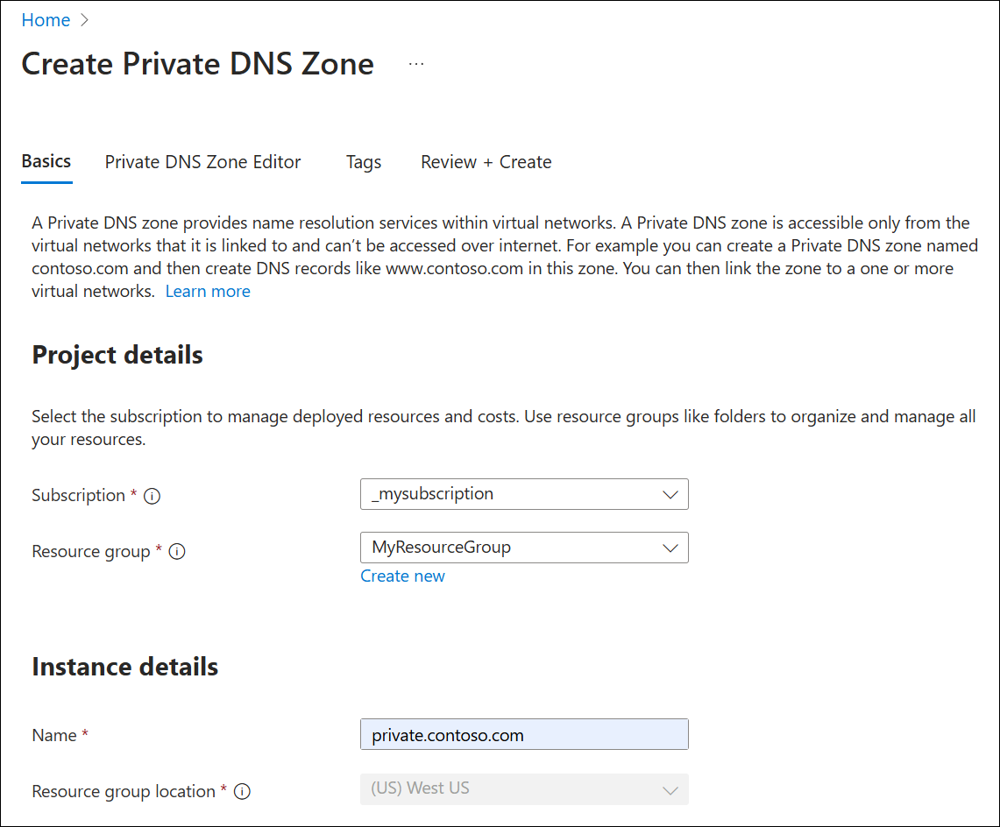
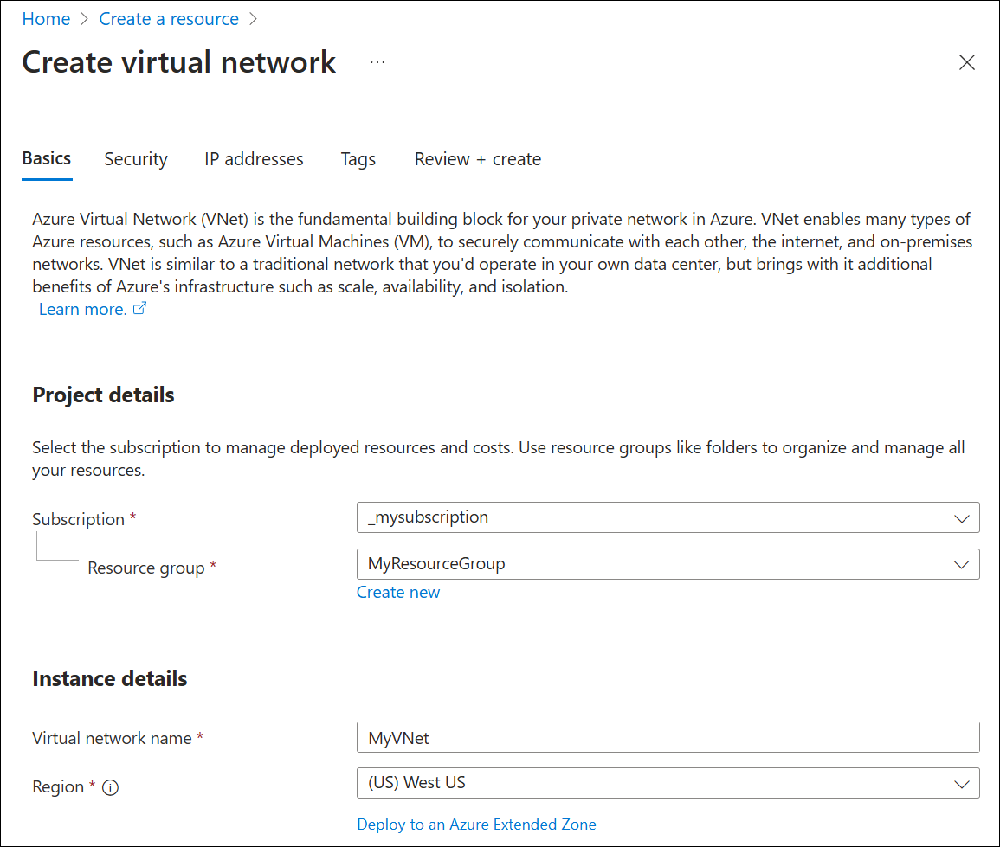
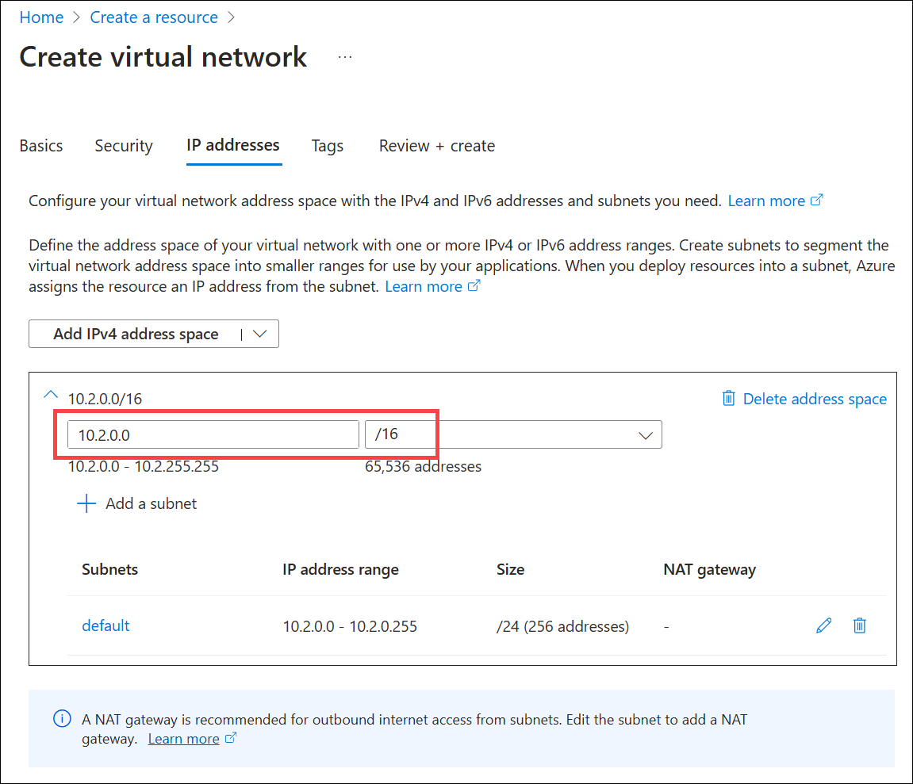
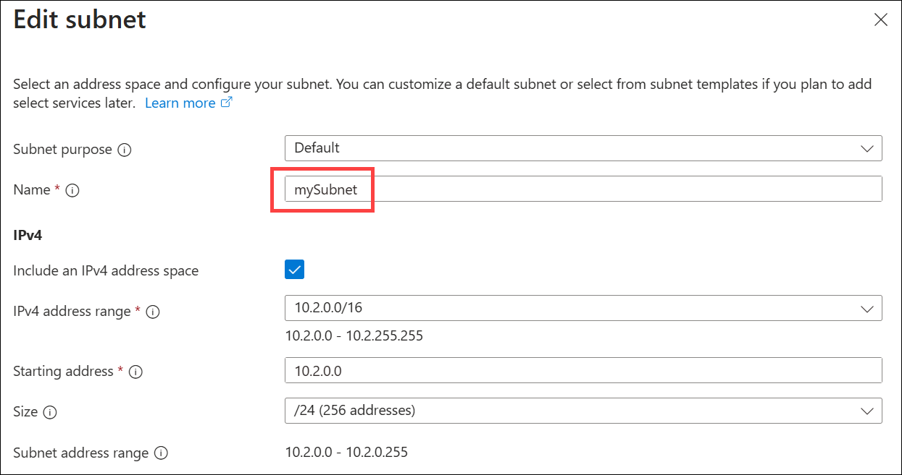
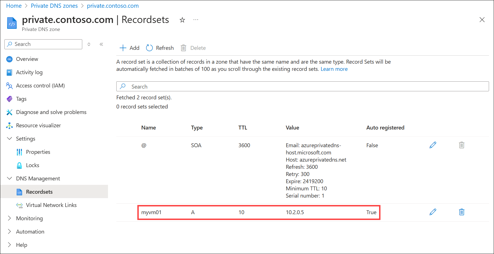
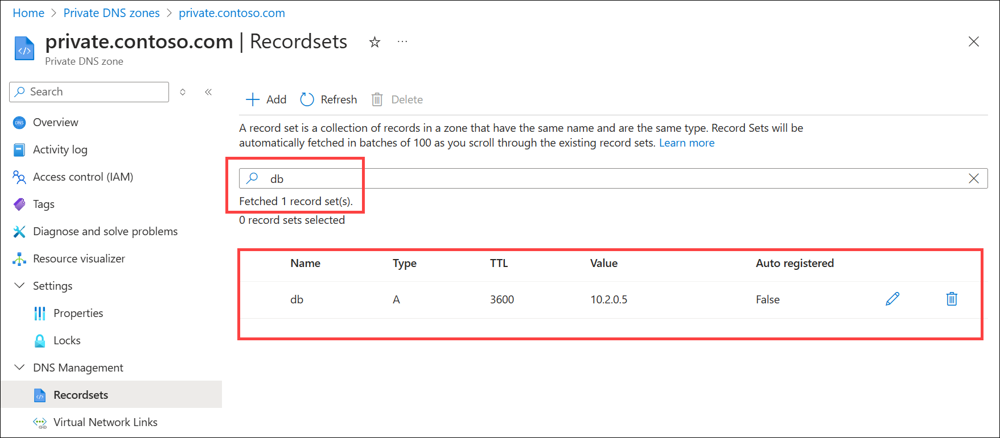
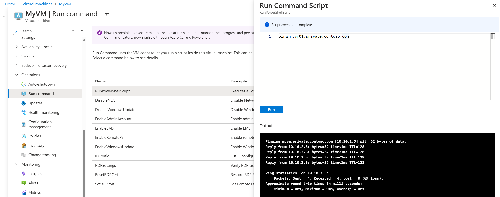

# Quickstart: Create an Azure private DNS zone using the Azure portal

This quickstart walks you through the steps to create your first private DNS zone and record using the Azure portal. 

A DNS zone is used to host the DNS records for a particular domain. Public DNS zones have unique names and are visible on the Internet. However, a private DNS zone name must only be unique within its resource group and the DNS records are not visible on the Internet. To start hosting your private domain in Azure Private DNS, you first need to create a DNS zone for that domain name. Next, the DNS records for your private domain are created inside this DNS zone. 

> [!IMPORTANT]
> When you create a private DNS zone, Azure stores the zone data as a global resource. This means that the private zone isn't dependent on a single virtual network or region. You can link the same private zone to multiple virtual networks in different regions. If service is interrupted in one virtual network, your private zone is still available. For more information, see [Azure Private DNS zone resiliency](private-dns-resiliency.md). 

## Virtual private links

To resolve DNS records in a private DNS zone, resources must typically be *linked* to the private zone. Linking is accomplished by creating a [virtual network link](private-dns-virtual-network-links.md) that associates the virtual network to the private zone.

When you create a virtual network link, you can (optionally) enable autoregistration of DNS records for devices in the virtual network. If autoregistration is enabled, Azure private DNS updates DNS records whenever a virtual machine inside the linked virtual network is created, changes its IP address, or is deleted. For more information, see [What is the autoregistration feature in Azure DNS private zones](private-dns-autoregistration.md).

> [!NOTE]
> Other methods are available for resolving DNS records in private DNS zones that don't always require a virtual network link. These methods are beyond the scope of this quickstart article. For more information, see [What is Azure DNS Private Resolver](dns-private-resolver-overview.md).

In this article, a virtual machines is used in a single virtual network. The virtual network is linked to your private DNS zone with autoregistration enabled. The setup is summarized in the following figure.

:::image type="content" source="media/private-dns-portal/private-dns-quickstart-summary.png" alt-text="Summary diagram of the quickstart setup." border="false" lightbox="media/private-dns-portal/private-dns-quickstart-summary.png":::

## Prerequisites

If you don’t have an Azure subscription, create a [free account](https://azure.microsoft.com/free/?WT.mc_id=A261C142F) before you begin.

If you prefer, you can complete this quickstart using [Azure PowerShell](private-dns-getstarted-powershell.md) or [Azure CLI](private-dns-getstarted-cli.md).

## Create a private DNS zone

The following example creates a DNS zone called **private.contoso.com** in a resource group called **MyResourceGroup**.

1. On the portal search bar, type **private dns zones** in the search text box and press **Enter**.
2. Under **Marketplace**, select **Private DNS zone**. The **Create Private DNS Zone** page opens.

    

3. On the **Create Private DNS Zone** page, type or select the following values:
   - **Resource group**: Select an existing resource group, or choose **Create new**. Enter a resource group name, and then select **OK**. For example: **MyResourceGroup**. The resource group name must be unique within the Azure subscription.
   -  **Name**: Type **private.contoso.com** for this example.
4. The **Resource group location** is selected already if you use an existing resource group. If you created a new resource group, choose a location, for example: **(US) West US**.

    

5. Select **Review + Create** and then select **Create**. It might take a few minutes to create the zone.

## Create the virtual network and subnet

1. From the Azure portal home page, select **Create a resource** > **Networking** > **Virtual network**, or search for **Virtual network** in the search box and then select **+ Create**.
2. On the **Create virtual network** page, enter the following:
- **Subscription**: Select your Azure subscription.
- **Resource group**: Select an existing resource group or create a new one. The resource group doesn't need to be the same as the one used for the private DNS zone. In this example the same resource group is used (**MyResourceGroup**).
- **Virtual network name**: Enter a name for the new virtual network. **MyVNet** is used in this example.
- **Region**: If you created a new resource group, choose a location. **(US) West US** is used in this example.

  

3. Select the **IP addresses** tab, and under **Add IPv4 address space** edit the default address space by entering **10.2.0.0/16**.

    

4. In the subnets area, select the pen icon to edit the name of the default subnet, or delete the default subnet and select **+ Add a subnet**. The **Edit subnet** or **Add a subnet** pane opens, respectively. The Edit subnet pane is shown in this example.
5. Next to Name, enter mySubnet and verify that the **Subnet address range** is **10.2.0.0 - 10.2.0.255**. The **Size** should be **/24 (256 addresses)**. These values are set by default based on the parent VNet address range.

    

6. Select **Save**, select **Review + create**, and then select **Create**.

## Link the virtual network

Next, link the private DNS zone to the virtual network by adding a virtual network link.

1. Search for and select **Private DNS zones** and then select your private zone. For example: **private.contoso.com**.
2. Under **DNS Management**, select **Virtual Network Links** and then select **+ Add**.
3. Enter the following parameters:
- **Link name**: Provide a name for the link, for example: **MyVNetLink**.
- **Subscription**: Select our subscription.
- **Virtual Network**: Select the virtual network that you created, for example: **MyVNet**.
4. Under **Configuration**, select the checkbox next to **Enable auto registration**.

    

5. Select **Create**, wait until the virtual link is created, and then verify that it is listed on the **Virtual Network Links** page.

## Create the test virtual machine

Now, create a virtual machine to test autoregistgration in your private DNS zone:

1. On the portal page upper left, select **Create a resource**, and then select **Windows Server 2019 Datacenter**.
2. Select **MyResourceGroup** for the resource group.
3. Type **myVM01** - for the name of the virtual machine.
4. Select ***(US) West US** for the **Region**.
5. Enter a name for the administrator user name.
6. Enter a password and confirm the password.
7. For **Public inbound ports**, select **Allow selected ports**, and then select **RDP (3389)** for **Select inbound ports**.
8. Accept the other defaults for the page and then click **Next: Disks >**.
9. Accept the defaults on the **Disks** page, then click **Next: Networking >**.
10. Make sure that **myAzureVNet** is selected for the virtual network.
11. Accept the other defaults for the page, and then click **Next: Management >**.
12. For **Boot diagnostics**, select **Disable**, accept the other defaults, and then select **Review + create**.
13. Review the settings and then click **Create**. It will take a few minutes for the virtual machine allocation to complete.
14. Search for and select **Virtual machines** and then verify that the VM status is **Running**. If it isn't running, start the virtual machine.

## Review autoregistion

1. Search for or select **Private DNS zones** and then select the **private.contoso.com** zone.
2. Under DNS Management, select Recordsets.
3. Verify that a DNS record exists of **Type** **A** with an **Auto registered** value of **True**. See the following example:

    

## Create another DNS record

 You can also add records to the private DNS zone manually. The following example creates a record with the hostname **db** in the DNS Zone **private.contoso.com**. The fully qualified name of the record set is **db.private.contoso.com**. The record type is **A**, with an IP address corresponding to the autoregistered IP address of  **myVM01.private.contoso.com**.

1. Search for or select **Private DNS zones** and then select the **private.contoso.com** zone.
2. Under **DNS Management**, select **Recordsets**.
3. Select **+ Add**.
3. Under **Name**, enter **db**.
4. Next to **IP Address**, type the IP address you see for **myVM01**.
5. Select **OK**.

## Search and display records

By default, the **Recordsets** node displays all record sets in the zone. A record set is a collection of records that have the same name and are the same type. Record sets are automatically fetched in batches of 100 as you scroll through the list.

You can also search and display specific DNS record sets in the zone by entering a value in the search box. In the following example, one record with the name **db** is displayed:

  

You can search by name, type, TTL, value, or autoregistration status. For example, the record **db** in this example is also displayed by searching for **A** (display all records of type A), **3600** (the record's TTL value), **10.2.0.5** (the IP address of the A record), or **False** (non-autoregistered records). All records in the zone that match the search criteria are displayed in batches of 100.

## Test the private zone

Now you can test the name resolution for your **private.contoso.com** private zone. 

You can use the ping command to test name resolution. You can do this by connecting to the virtual machine and opening a command prompt, or by using the **Run command** on this virtual machine.

To use the Run command:

1. Select **Virtual machines**, select your virtual machine, and then under **Operations** select **Run command**.
2. Select **RunPowerShellScript**, under **Run Command Script** enter **ping myvm01.private.contoso.com** and then select **Run**. See the following example:

    [  ](./media/private-dns-portal/ping-vm.png#lightbox)

3. Now ping the **db** name you created previously:
   ```
   Pinging db.private.contoso.com [10.10.2.5] with 32 bytes of data:
   Reply from 10.10.2.5: bytes=32 time<1ms TTL=128
   Reply from 10.10.2.5: bytes=32 time<1ms TTL=128
   Reply from 10.10.2.5: bytes=32 time<1ms TTL=128
   Reply from 10.10.2.5: bytes=32 time<1ms TTL=128

   Ping statistics for 10.10.2.5:
       Packets: Sent = 4, Received = 4, Lost = 0 (0% loss),
   Approximate round trip times in milli-seconds:
       Minimum = 0ms, Maximum = 0ms, Average = 0ms
   ```

## Clean up resources

When no longer needed, delete the **MyResourceGroup** resource group to delete the resources created in this quickstart.

## Next steps

> [!div class="nextstepaction"]
> [Azure DNS Private Zones scenarios](private-dns-scenarios.md)
