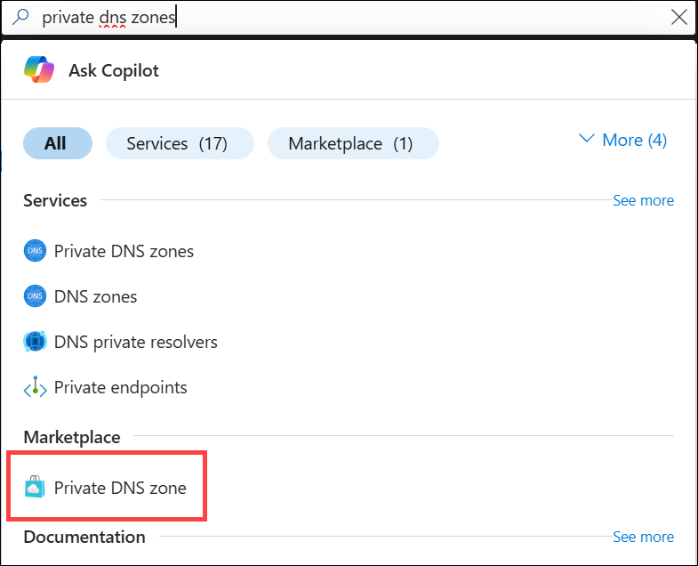
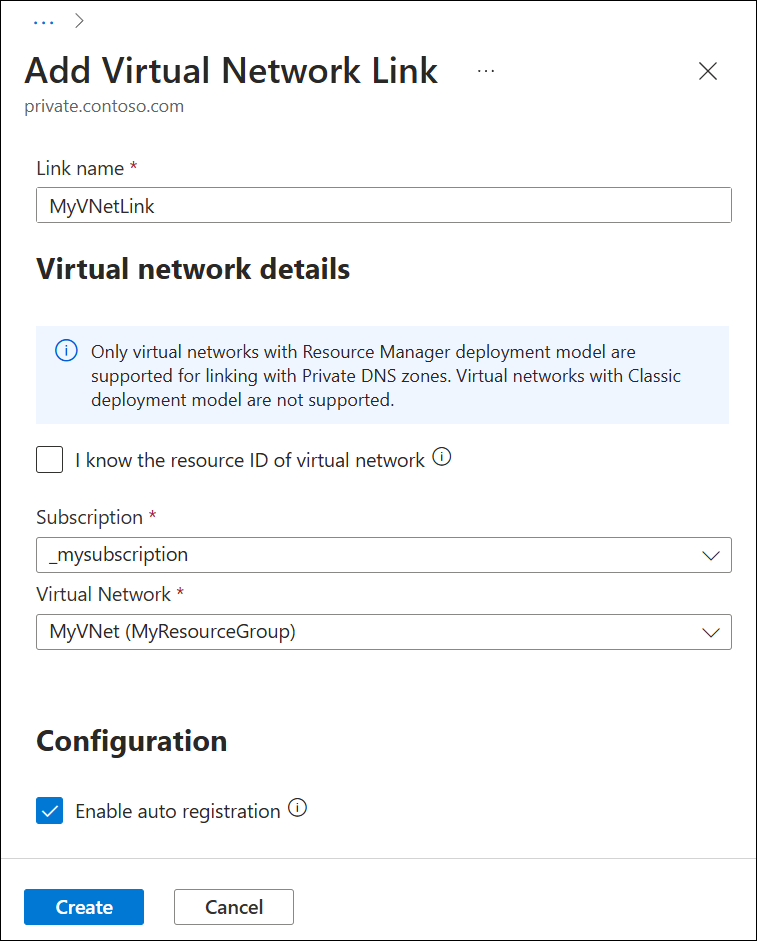

# Quickstart: Create an Azure private DNS zone using the Azure portal

This quickstart walks you through the steps to create your first private DNS zone and record using the Azure portal.

A DNS zone is used to host the DNS records for a particular domain. To start hosting your domain in Azure DNS, you need to create a DNS zone for that domain name. Each DNS record for your domain is then created inside this DNS zone. To publish a private DNS zone to your virtual network, you specify the list of virtual networks that are allowed to resolve records within the zone.  These are called *linked* virtual networks. When autoregistration is enabled, Azure DNS also updates the zone records whenever a virtual machine is created, changes its' IP address, or is deleted.

## Prerequisites

If you don’t have an Azure subscription, create a [free account](https://azure.microsoft.com/free/?WT.mc_id=A261C142F) before you begin.

If you prefer, you can complete this quickstart using [Azure PowerShell](private-dns-getstarted-powershell.md) or [Azure CLI](private-dns-getstarted-cli.md).

## Create a private DNS zone

The following example creates a DNS zone called **private.contoso.com** in a resource group called **MyAzureResourceGroup**.

A DNS zone contains the DNS entries for a domain. To start hosting your domain in Azure DNS, you create a DNS zone for that domain name.



1. On the portal search bar, type **private dns zones** in the search text box and press **Enter**.
1. Select **Private DNS zone**.
2. Select **Create private dns zone**.

1. On the **Create Private DNS zone** page, type or select the following values:

   - **Resource group**: Select **Create new**, enter *MyAzureResourceGroup*, and select **OK**. The resource group name must be unique within the Azure subscription.
   -  **Name**: Type *private.contoso.com* for this example.
1. For **Resource group location**, select **West Central US**.

1. Select **Review + Create**.

1. Select **Create**.

It may take a few minutes to create the zone.

## Virtual network and parameters

In this section you'll need to replace the following parameters in the steps with the information below:

| Parameter                   | Value                |
|-----------------------------|----------------------|
| **\<resource-group-name>**  | MyAzureResourceGroup (Select existing resource group) |
| **\<virtual-network-name>** | MyAzureVNet          |
| **\<region-name>**          | West Central US      |
| **\<IPv4-address-space>**   | 10.2.0.0\16          |
| **\<subnet-name>**          | MyAzureSubnet        |
| **\<subnet-address-range>** | 10.2.0.0\24          |


[!INCLUDE [virtual-networks-create-new](../../includes/virtual-networks-create-new.md)]

## Link the virtual network

To link the private DNS zone to a virtual network, you create a virtual network link.



1. Open the **MyAzureResourceGroup** resource group and select the **private.contoso.com** private zone.
2. On the left pane, select **Virtual network links**.
3. Select **Add**.
4. Type **myLink** for the **Link name**.
5. For **Virtual network**, select **myAzureVNet**.
6. Select the **Enable auto registration** check box.
7. Select **OK**.

## Create the test virtual machines

Now, create two virtual machines so you can test your private DNS zone:

1. On the portal page upper left, select **Create a resource**, and then select **Windows Server 2016 Datacenter**.
1. Select **MyAzureResourceGroup** for the resource group.
1. Type **myVM01** - for the name of the virtual machine.
1. Select **West Central US** for the **Region**.
1. Enter a name for the administrator user name.
2. Enter a password and confirm the password.
5. For **Public inbound ports**, select **Allow selected ports**, and then select **RDP (3389)** for **Select inbound ports**.
10. Accept the other defaults for the page and then click **Next: Disks >**.
11. Accept the defaults on the **Disks** page, then click **Next: Networking >**.
1. Make sure that **myAzureVNet** is selected for the virtual network.
1. Accept the other defaults for the page, and then click **Next: Management >**.
2. For **Boot diagnostics**, select **Off**, accept the other defaults, and then select **Review + create**.
1. Review the settings and then click **Create**.

Repeat these steps and create another virtual machine named **myVM02**.

It will take a few minutes for both virtual machines to complete.

## Create an additional DNS record

 The following example creates a record with the relative name **db** in the DNS Zone **private.contoso.com**, in resource group **MyAzureResourceGroup**. The fully qualified name of the record set is **db.private.contoso.com**. The record type is "A", with the IP address of **myVM01**.

1. Open the **MyAzureResourceGroup** resource group and select the **private.contoso.com** private zone.
2. Select **+ Record set**.
3. For **Name**, type **db**.
4. For **IP Address**, type the IP address you see for **myVM01**. This should be auto registered when the virtual machine started.
5. Select **OK**.

## Test the private zone

Now you can test the name resolution for your **private.contoso.com** private zone.

### Configure VMs to allow inbound ICMP

You can use the ping command to test name resolution. So, configure the firewall on both virtual machines to allow inbound ICMP packets.

1. Connect to myVM01, and open a Windows PowerShell window with administrator privileges.
2. Run the following command:

   ```powershell
   New-NetFirewallRule –DisplayName "Allow ICMPv4-In" –Protocol ICMPv4
   ```

Repeat for myVM02.

### Ping the VMs by name

1. From the myVM02 Windows PowerShell command prompt, ping myVM01 using the automatically registered host name:
   ```
   ping myVM01.private.contoso.com
   ```
   You should see output that looks similar to this:
   ```
   PS C:\> ping myvm01.private.contoso.com

   Pinging myvm01.private.contoso.com [10.2.0.4] with 32 bytes of data:
   Reply from 10.2.0.4: bytes=32 time<1ms TTL=128
   Reply from 10.2.0.4: bytes=32 time=1ms TTL=128
   Reply from 10.2.0.4: bytes=32 time<1ms TTL=128
   Reply from 10.2.0.4: bytes=32 time<1ms TTL=128

   Ping statistics for 10.2.0.4:
       Packets: Sent = 4, Received = 4, Lost = 0 (0% loss),
   Approximate round trip times in milli-seconds:
       Minimum = 0ms, Maximum = 1ms, Average = 0ms
   PS C:\>
   ```
2. Now ping the **db** name you created previously:
   ```
   ping db.private.contoso.com
   ```
   You should see output that looks similar to this:
   ```
   PS C:\> ping db.private.contoso.com

   Pinging db.private.contoso.com [10.2.0.4] with 32 bytes of data:
   Reply from 10.2.0.4: bytes=32 time<1ms TTL=128
   Reply from 10.2.0.4: bytes=32 time<1ms TTL=128
   Reply from 10.2.0.4: bytes=32 time<1ms TTL=128
   Reply from 10.2.0.4: bytes=32 time<1ms TTL=128

   Ping statistics for 10.2.0.4:
       Packets: Sent = 4, Received = 4, Lost = 0 (0% loss),
   Approximate round trip times in milli-seconds:
       Minimum = 0ms, Maximum = 0ms, Average = 0ms
   PS C:\>
   ```

## Clean up resources

When no longer needed, delete the **MyAzureResourceGroup** resource group to delete the resources created in this quickstart.


## Next steps

> [!div class="nextstepaction"]
> [Azure DNS Private Zones scenarios](private-dns-scenarios.md)
