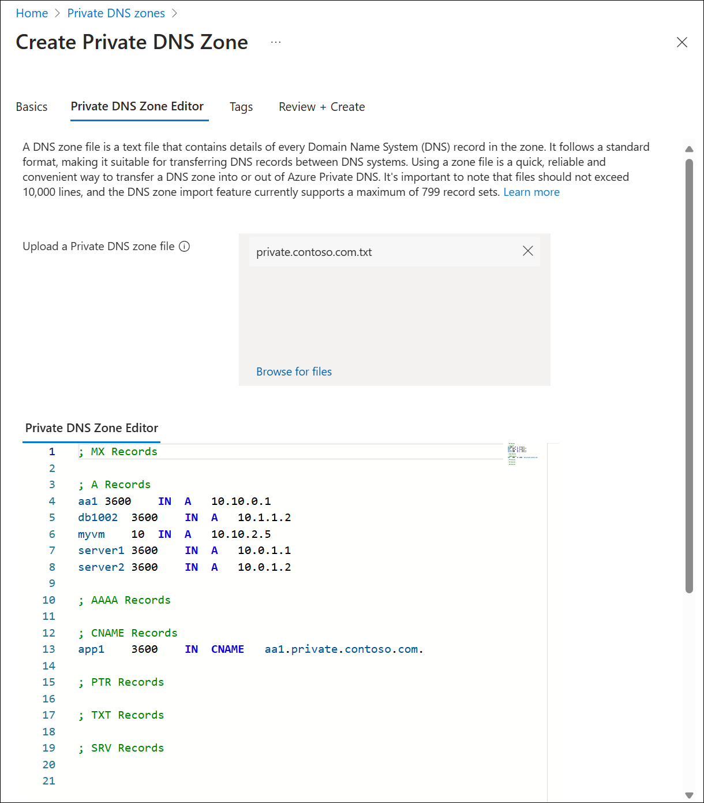
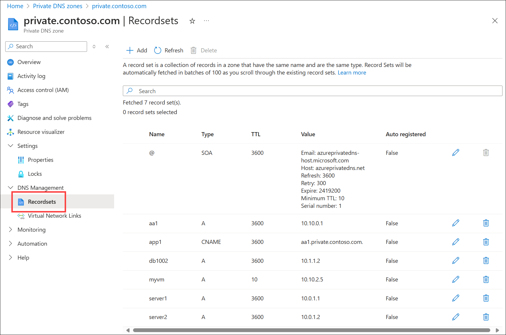
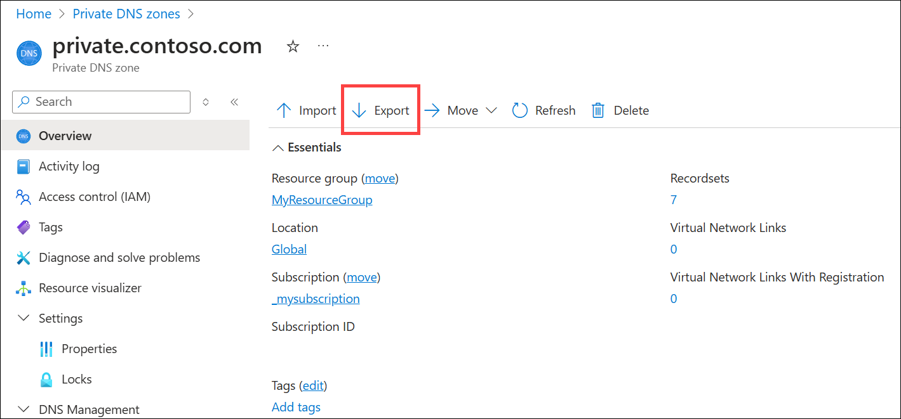

# Import and export a private DNS zone file using the Azure portal

In this article, you learn how to  import and export a DNS zone file in Azure Private DNS using Azure portal. You can also [import and export a zone file using Azure CLI](private-dns-import-export.md). Import and export cmdlets are not currently available in Azure PowerShell.

## Introduction to DNS zone migration

A DNS zone file is a text file containing information about every DNS record in the zone. It follows a standard format, making it suitable for transferring DNS records between DNS systems. Using a zone file is a fast and convenient way to import DNS zones into Azure DNS. You can also export a zone file from Azure DNS to use with other DNS systems.

Azure DNS supports importing and exporting zone files via the Azure CLI and the Azure portal.

## Obtain your existing DNS zone file

Before you import a DNS zone file into Azure DNS, you need to obtain a copy of the zone file. The source of this file depends on where the DNS zone is hosted.

* If your DNS zone is hosted by a partner service, the service should provide a way for you to download the DNS zone file. Partner services include domain registrar, dedicated DNS hosting provider, or an alternative cloud provider.
* If your DNS zone is hosted on Windows DNS, the default folder for the zone files is **%systemroot%\system32\dns**. The full path to each zone file is also shown on the **General** tab of the DNS console.
* If your DNS zone is hosted using BIND, the location of the zone file for each zone gets specified in the BIND configuration file **named.conf**.

> [!IMPORTANT]
> If the zone file that you import contains CNAME entries that point to names in a another zone, Azure DNS must be able to resolve resource records in the other zone.

## Import a DNS zone file into Azure DNS

Importing a zone file creates a new zone in Azure DNS if the zone doesn't already exist. If the zone exists, then the record sets in the zone file are merged with the existing record sets.

### Merge behavior

* By default, the new record sets get merged with the existing record sets. Identical records within a merged record set aren't duplicated.
* When record sets are merged, the time to live (TTL) of pre-existing record sets is used.
* Start of Authority (SOA) parameters, except `host` are always taken from the imported zone file. The name server record set at the zone apex also always uses the TTL taken from the imported zone file.
* An imported CNAME record will replace the existing CNAME record that has the same name. 
* When a conflict happens between a CNAME record and another record with the same name of different type, the existing record gets used.

### Additional information about importing

The following notes provide more details about the zone import process.

* The `$TTL` directive is optional, and is supported. When no `$TTL` directive is given, records without an explicit TTL are imported set to a default TTL of 3600 seconds. When two records in the same record set specify different TTLs, the lower value is used.
* The `$ORIGIN` directive is optional, and is supported. When no `$ORIGIN` is set, the default value used is the zone name as specified on the command line, including the ending dot (.).
* The `$INCLUDE` and `$GENERATE` directives aren't supported.
* The following record types are supported: A, AAAA, CAA, CNAME, MX, NS, SOA, SRV, and TXT.
* The SOA record is created automatically by Azure DNS when a zone is created. When you import a zone file, all SOA parameters are taken from the zone file *except* the `host` parameter. This parameter uses the value provided by Azure DNS because it needs to refer to the primary name server provided by Azure DNS.
* The name server record set at the zone apex is also created automatically by Azure DNS when the zone is created. Only the TTL of this record set is imported. These records contain the name server names provided by Azure DNS. The record data isn't overwritten by the values contained in the imported zone file.
* Azure DNS supports only single-string TXT records. Multistring TXT records are to be concatenated and truncated to 255 characters.
* The zone file to be imported must contain 10k or fewer lines with no more than 3k record sets.

## Import a zone file

1. Obtain a copy of the zone file for the zone you wish to import. 
    
    > [!NOTE]
    > If the Start of Authority (SOA) record is present in the zone, it is overwritten with values that are compatible with Azure Private DNS. Nameserver (NS) records must be removed prior to import. Compatible resource record types for Azure Private DNS include A, AAAA, CNAME, MX, PTR, SOA, SRV, and TXT. Incompatible records are underlined in red in the Private DNS Zone Editor.

    The following small zone file and resource records are used in this example:

    ```text
    ; MX Records

    ; A Records
    aa1	3600	IN	A	10.10.0.1
    db1002	3600	IN	A	10.1.1.2
    myvm	10	IN	A	10.10.2.5
    server1	3600	IN	A	10.0.1.1
    server2	3600	IN	A	10.0.1.2

    ; AAAA Records

    ; CNAME Records
    app1	3600	IN	CNAME	aa1.private.contoso.com.

    ; PTR Records

    ; TXT Records

    ; SRV Records
    ```
    Names used:
    - Origin zone name: **private.contoso.com** 
    - Destination zone name: **private.contoso.com** 
    - Zone filename: **private.contoso.com.txt** 
    - Resource group: **myresourcegroup** 
2. Open the **Private DNS zones** overview page and select **Create**.
3. On the **Create DNS zone** page, type or select the following values:
    - **Resource group**: Choose an existing resource group, or select **Create new**, enter **myresourcegroup**, and select **OK**.
    - **Name**: Type **private.contoso.com** for this example.
4. Select the **Private DNS Zone Editor** tab and then drag and drop or browse and select the **private.contoso.com.txt** file. The **Private DNS Zone Editor** opens.
5. If changes to the zone are needed, you can edit the values that are displayed.

    

6. Select **Review + Create** and then select **Create**.
7. When deployment is complete, select **Go to resource** and then select **Recordsets**. An SOA record compatible with Azure Private DNS is automatically added to the zone. See the following example:

    [  ](./media/private-dns-import-export-portal/recordsets.png#lightbox)

## Export a zone file

1. Open the **Private DNS zones** overview page and select the zone you wish to export. For example, **private.contoso.com**. See the following example:

    

2. Select **Export**.  The file is downloaded to your default downloads directory as a text file with the name AzurePrivateDnsZone-private.contoso.com-`number`.txt where `number` is an autogenerated index number.
3. Open the file to view the contents. See the following example:

    ```text
    ; 	Exported zone file from Azure Private DNS
    ; 	Zone name: private.contoso.com
    ; 	Date and time (UTC): Mon, 17 Jun 2024 20:35:47 GMT

    $TTL 10
    $ORIGIN private.contoso.com

    ; SOA Record
    @	 3600		IN	SOA	azureprivatedns.net	azureprivatedns-host.microsoft.com	(
	 	 	1	 ;serial
	 	 	3600	 ;refresh
	 	 	300	 ;retry
	 	 	2419200	 ;expire
	 	 	10	 ;minimum ttl
    )

    ; MX Records

    ; A Records
    aa1	3600	IN	A	10.10.0.1
    db1002	3600	IN	A	10.1.1.2
    myvm	10	IN	A	10.10.2.5
    server1	3600	IN	A	10.0.1.1
    server2	3600	IN	A	10.0.1.2

    ; AAAA Records

    ; CNAME Records
    app1	3600	IN	CNAME	aa1.private.contoso.com.

    ; PTR Records

    ; TXT Records

    ; SRV Records
    ```

## Next steps

* Learn how to [manage record sets and records](./dns-getstarted-cli.md) in your DNS zone.
