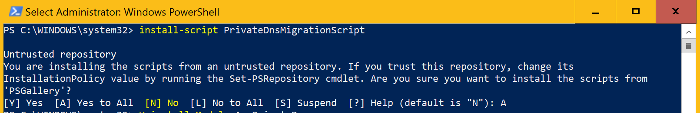
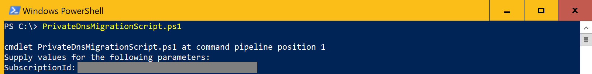
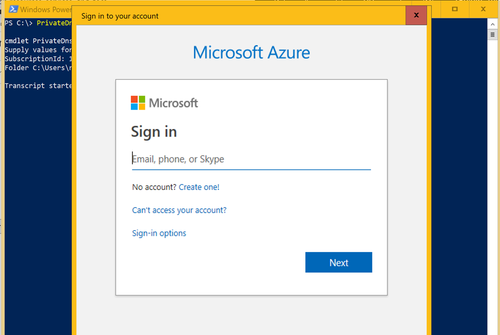
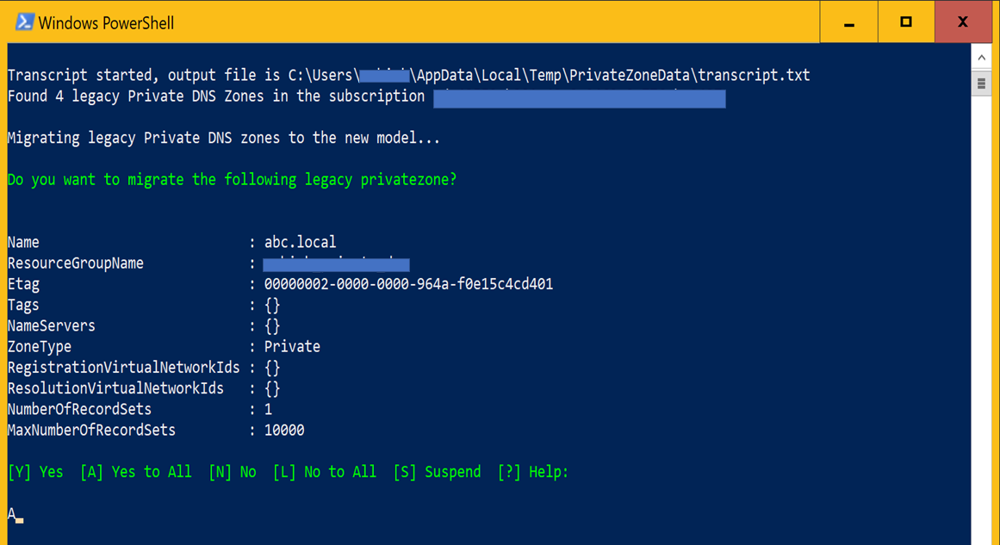
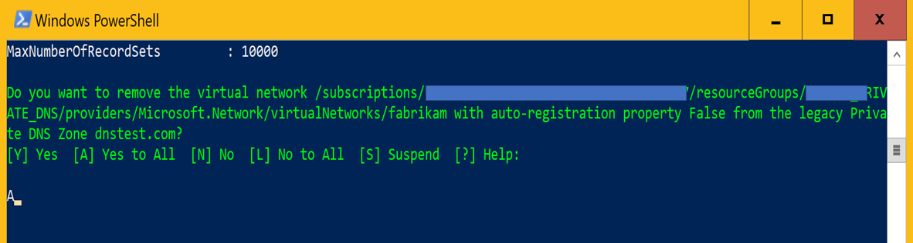
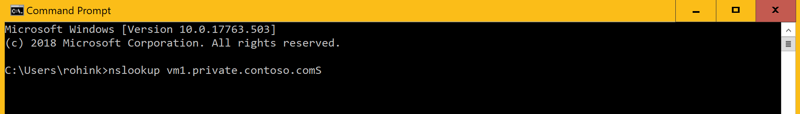
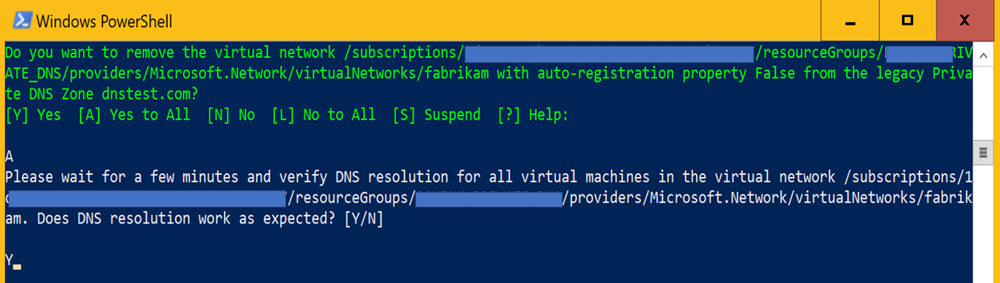
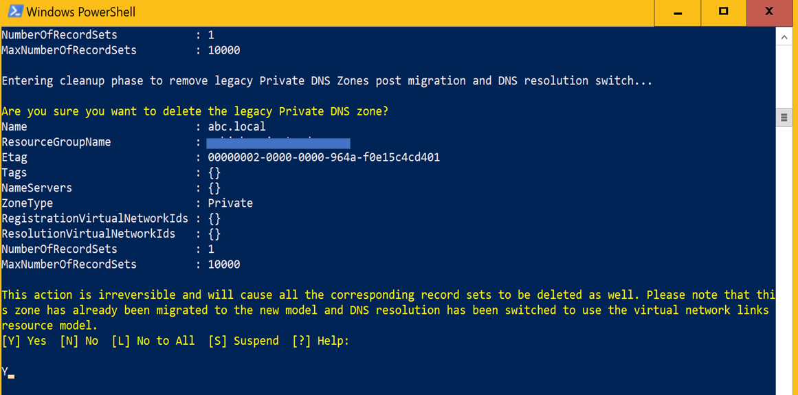

# Migrating legacy Azure DNS private zones to new resource model

We shipped a new API/resource model for Azure DNS private zones as part of the preview refresh release. Preview refresh provides new functionality and removes several limitations and restrictions of the initial public preview. However, these benefits aren't available on the private DNS zones that have been created using legacy API. To get the benefits of the new release, you must migrate your legacy private DNS zone resources to new resource model. The migration process is  simple, and we've provided a PowerShell script to automate this process. This guide provides step by step instruction for migrating your Azure DNS private zones to new resource model.

## Prerequisites

Make sure you have installed latest version of Azure PowerShell. For more information on Azure PowerShell (Az) and how to install it visit https://docs.microsoft.com/powershell/azure/new-azureps-module-az

Make sure that you've Az.PrivateDns module for the Azure PowerShell installed. To install this module, open an elevated PowerShell window (Administrative mode) and enter following command

```powershell
Install-Module -Name Az.PrivateDns -AllowPrerelease
```

>[!IMPORTANT]
>The migration process is fully automated and isn't expected to cause any downtime. However, if you're using Azure DNS private zones (preview) in a critical production environment you should execute below migration process during a planned maintenance time window. Make sure that you don't modify the configuration or record-sets of a private DNS zones while you're running the migration script.

## Installing the script

Open an elevated PowerShell window (Administrative mode) and run following command

```powershell
install-script PrivateDnsMigrationScript
```

Enter “A” when prompted to install the script



You can also manually obtain the latest version of PowerShell script at https://www.powershellgallery.com/packages/PrivateDnsMigrationScript

## Running the script

Execute following command to run the script

```powershell
PrivateDnsMigrationScript.ps1
```



### Enter the subscription ID and sign-in to Azure

You’ll be prompted to enter subscription ID containing the private DNS zones that you intend to migrate. You’ll be asked to sign-in to your Azure account. Complete the sign-in so that script can access the private DNS zone resources in the subscription.



### Select the DNS zones you want to migrate

The script with get the list of all private DNS zones in the subscription and prompt you to confirm which ones you want to migrate. Enter “A” to migrate all private DNS zones. Once you execute this step, the script will create new private DNS zones using new resource model and copy the data into the new DSN zone. This step will not alter your existing private DNS zones in anyway.



### Switching DNS resolution to the new DNS zones

Once the zones and records have been copied to the new resource model, the script will prompt you to switch the DNS resolution to new DNS zones. This step removes the association between legacy private DNS zones and your virtual networks. When the legacy zone is unlinked from the virtual networks, the new DNS zones created in above step would automatically take over the DNS resolution for those virtual networks.

Select ‘A’ to switch the DNS resolution for all virtual networks.



### Verify the DNS resolution

Before proceeding further, verify that DNS resolution on your DNS zones is working as expected. You can sign-in to your azure VMs and issue nslookup query against the migrated zones to verify that DNS resolution is working.



If you find that DNS queries aren't resolving, wait for a few minutes and retry the queries. If DNS queries are working as expected, enter ‘Y’ when script prompts you to remove the virtual network from the private DNS zone.



>[!IMPORTANT]
>If because of any reason DNS resolution against the migrated zones isn't working as expected, enter ‘N’ in above step and script will switch the DNS resolution back to legacy zones. Create a support ticket and we can help you with migration of your DNS zones.

## Cleanup

This step will delete the legacy DNS zones and should be executed only after you've verified that DNS resolution is working as expected. You’ll be prompted to delete each private DNS zone. Enter ‘Y’ at every prompt after verifying that DNS resolution for that zones is working properly.



## Update Your automation

If you're using automation including templates, PowerShell scripts or custom code developed using SDK, you must update your automation to use the new resource model for the private DNS zones. Below are the links to new private DNS CLI/PS/SDK documentation.
* [Azure DNS private zones REST API](https://docs.microsoft.com/rest/api/dns/privatedns/privatezones)
* [Azure DNS private zones CLI](https://docs.microsoft.com/cli/azure/ext/privatedns/network/private-dns?view=azure-cli-latest)
* [Azure DNS private zones PowerShell](https://docs.microsoft.com/powershell/module/az.privatedns/?view=azps-2.3.2)
* [Azure DNS private zones SDK](https://docs.microsoft.com/dotnet/api/overview/azure/privatedns/management?view=azure-dotnet-preview)

## Need further help

Create a support ticket if you need further help with the migration process or because of any reason the above listed steps don't work for you. Include the transcript file generated by the PowerShell script with your support ticket.

## Next steps

* Learn how to create a private zone in Azure DNS using [Azure PowerShell](./private-dns-getstarted-powershell.md) or [Azure CLI](./private-dns-getstarted-cli.md).

* Read about some common [private zone scenarios](./private-dns-scenarios.md) that can be realized with private zones in Azure DNS.

* For common questions and answers about private zones in Azure DNS, including specific behavior you can expect for certain kinds of operations, see [Private DNS FAQ](./dns-faq-private.md).

* Learn about DNS zones and records by visiting [DNS zones and records overview](dns-zones-records.md).

* Learn about some of the other key [networking capabilities](../networking/networking-overview.md) of Azure.
