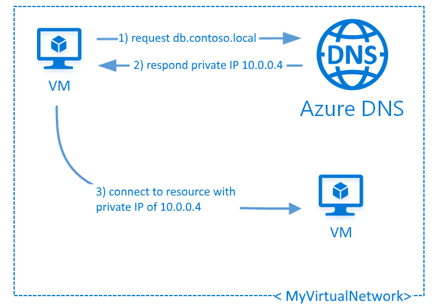

# What is Azure Private DNS?

> [!IMPORTANT]
> Azure Private DNS is currently in public preview.
> This preview version is provided without a service level agreement, and it's not recommended for production workloads. Certain features might not be supported or might have constrained capabilities.
> For more information, see [Supplemental Terms of Use for Microsoft Azure Previews](https://azure.microsoft.com/support/legal/preview-supplemental-terms/).

The Domain Name System, or DNS, is responsible for translating (or resolving) a service name to its IP address.  Azure DNS is a hosting service for DNS domains, providing name resolution using the Microsoft Azure infrastructure. In addition to supporting internet-facing DNS domains, Azure DNS also supports private DNS zones.

Azure Private DNS provides a reliable, secure DNS service to manage and resolve domain names in a virtual network without the need to add a custom DNS solution. By using private DNS zones, you can use your own custom domain names rather than the Azure-provided names available today. Using custom domain names helps you to tailor your virtual network architecture to best suit your organization's needs. It provides name resolution for virtual machines (VMs) within a virtual network and between virtual networks. Additionally, you can configure zones names with a split-horizon view, which allows a private and a public DNS zone to share the name.

To resolve the records of a private DNS zone from your virtual network, you must link the virtual network with the zone. Linked virtual networks have full access and can resolve all DNS records published in the private zone. Additionally, you can also enable autoregistration on a virtual network link. If you enable autoregistration on a virtual network link, the DNS records for the virtual machines on that virtual network are registered in the private zone. When autoregistration is enabled, Azure DNS also updates the zone records whenever a virtual machine is created, changes its' IP address, or is deleted.

> [!NOTE]
> As a best practice, do not use a *.local* domain for your private DNS zone. Not all operating systems support this.

## Benefits

Azure Private DNS provides the following benefits:

* **Removes the need for custom DNS solutions**. Previously, many customers created custom DNS solutions to manage DNS zones in their virtual network. You can now manage DNS zones using the native Azure infrastructure, which removes the burden of creating and managing custom DNS solutions.

* **Use all common DNS records types**. Azure DNS supports A, AAAA, CNAME, MX, PTR, SOA, SRV, and TXT records.

* **Automatic hostname record management**. Along with hosting your custom DNS records, Azure automatically maintains hostname records for the VMs in the specified virtual networks. In this scenario, you can optimize the domain names you use without needing to create custom DNS solutions or modify applications.

* **Hostname resolution between virtual networks**. Unlike Azure-provided host names, private DNS zones can be shared between virtual networks. This capability simplifies cross-network and service-discovery scenarios, such as virtual network peering.

* **Familiar tools and user experience**. To reduce the learning curve, this service uses well-established Azure DNS tools (Azure portal, Azure PowerShell, Azure CLI, Azure Resource Manager templates, and the REST API).

* **Split-horizon DNS support**. With Azure DNS, you can create zones with the same name that resolve to different answers from within a virtual network and from the public internet. A typical scenario for split-horizon DNS is to provide a dedicated version of a service for use inside your virtual network.

* **Available in all Azure regions**. The Azure DNS private zones feature is available in all Azure regions in the Azure public cloud.

## Capabilities

Azure DNS provides the following capabilities:

* **Automatic registration of virtual machines from a virtual network that's linked to a private zone with autoregistration enabled**. The virtual machines are registered (added) to the private zone as A records pointing to their private IP addresses. When a virtual machine in a virtual network link with autoregistration enabled is deleted, Azure DNS also automatically removes the corresponding DNS record from the linked private zone.

* **Forward DNS resolution is supported across virtual networks that are linked to the private zone**. For cross-virtual network DNS resolution, there's no explicit dependency such that the virtual networks are peered with each other. However, you might want to peer virtual networks for other scenarios (for example, HTTP traffic).

* **Reverse DNS lookup is supported within the virtual-network scope**. Reverse DNS lookup for a private IP within the virtual network assigned to a private zone returns the FQDN that includes the host/record name and the zone name as the suffix.

## Known issues
The following items are known bugs and issues in the preview release:
* If you delete a virtual network linked to a private DNS zone, it doesn't delete the links to the private DNS zone. The link fails if you recreate the virtual network with same name and resource group and try to link it again to any private DNS zone. To work around this issue, create the virtual network in a different resource group or with a different name in the same resource group.
* If you move a virtual network to another resource group or subscription, it does not update the links to the private DNS zone. The name resolution for the moved virtual network continues to work, however you'll see old ARM IDs of the virtual network when you view the virtual network links of the private DNS zone.
* Currently, linked virtual networks hosted in UAE North, UAE Central, South Africa West, South Africa North, Canada East, France South may fail and you may see intermittent DNS resolution issues. 

## Other considerations

Azure DNS has the following limitations:

* A specific virtual network can be linked to only one private zone as if automatic registration of VM DNS records is enabled. You can however link multiple virtual networks to a single DNS zone.
* Reverse DNS works only for private IP space in the linked virtual network
* Reverse DNS for a private IP for a linked virtual network returns "internal.cloudapp.net" as the default suffix for the virtual machine. For virtual networks that are linked to a private zone with autoregistration enabled, reverse DNS for a private IP returns 2 FQDNs, one with default the suffix *internal.cloudapp.net* and another with the private zone suffix.
* Conditional forwarding is not natively supported at the moment. To enable resolution between Azure and on-premises networks. See [Name resolution for VMs and role instances](../virtual-network/virtual-networks-name-resolution-for-vms-and-role-instances.md)
 
## Pricing

For pricing information, see [Azure DNS Pricing](https://azure.microsoft.com/pricing/details/dns/).

## Next steps

* Learn how to create a private zone in Azure DNS by using [Azure PowerShell](./private-dns-getstarted-powershell.md) or [Azure CLI](./private-dns-getstarted-cli.md).

* Read about some common [private zone scenarios](./private-dns-scenarios.md) that can be realized with private zones in Azure DNS.

* For common questions and answers about private zones in Azure DNS, including specific behavior you can expect for certain kinds of operations, see [Private DNS FAQ](./dns-faq-private.md).

* Learn about DNS zones and records by visiting [DNS zones and records overview](dns-zones-records.md).

* Learn about some of the other key [networking capabilities](../networking/networking-overview.md) of Azure.
