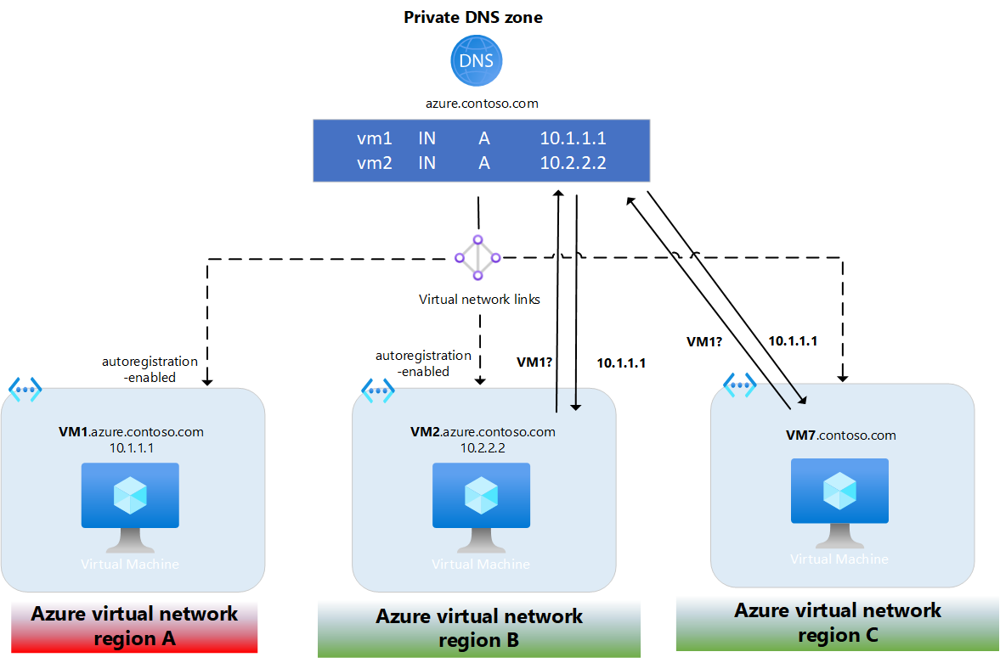

# Azure Private DNS zone resiliency

DNS private zones are resilient to regional outages because zone data is globally available. Resource records in a private zone are automatically replicated across regions. 

## Resiliency example

The following figure illustrates the availability of private zone data across multiple regions.

In this example:
- The private zone azure.contoso.com is linked to VNets in three different regions. Autoregistration is enabled in two regions.
- A temporary outage occurs in region A.
- Regions B and C are still able to successfully query DNS names in the private zone, including names that are autoregistered from region A (ex: VM1).
- Region B can add, edit, or delete records from the private DNS zone as needed.
- Service interruption in region A doesn't affect name resolution in the other regions.

The example shown here doesn't illustrate a disaster recovery scenario, however the global nature of private zones also makes it possible to recreate VM1 in another VNet and assume its workload.

> [!NOTE]
> Azure Private DNS is an availability zone foundational, zone-reduntant service. For more information, see [Azure services with availability zone support](/azure/reliability/availability-zones-service-support#azure-services-with-availability-zone-support). 

## Next steps
- To learn more about Private DNS zones, see [Using Azure DNS for private domains](private-dns-overview.md).
- Learn how to [create a Private DNS zone](./private-dns-getstarted-powershell.md) in Azure DNS.
- Learn about DNS zones and records by visiting: [DNS zones and records overview](dns-zones-records.md).
- Learn about some of the other key [networking capabilities](../networking/fundamentals/networking-overview.md) of Azure.
