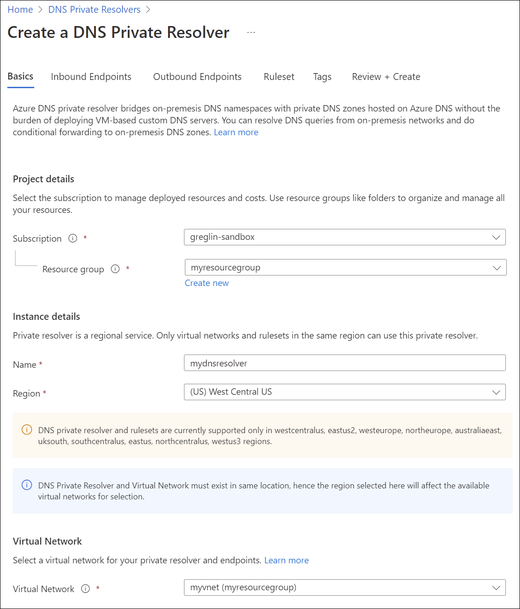
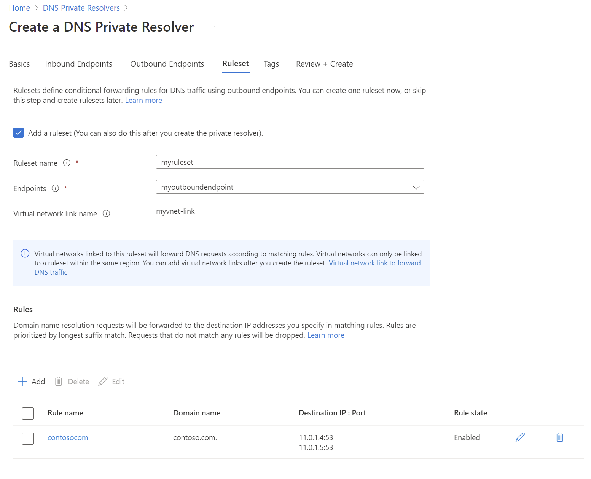
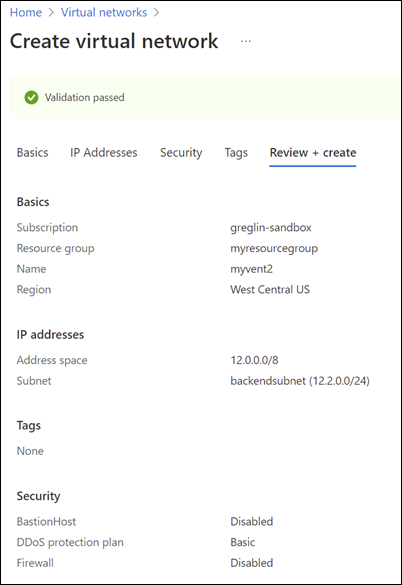

# Quickstart: Create an Azure private DNS Resolver using the Azure portal

This quickstart walks you through the steps to create an Azure DNS Private Resolver (Public Preview) using the Azure portal. If you prefer, you can complete this quickstart using [Azure PowerShell](private-dns-getstarted-powershell.md).

The Azure DNS Private Resolver enables you to query Azure DNS private zones from an on-prem environment, and vice versa, without deploying VM based DNS servers. You no longer need to provision IaaS based solutions on your virtual networks to resolve names registered on Azure private DNS zones. You can configure conditional forwarding of domains back to on-prem, multi-cloud and public DNS servers. For more information, including benefits, capabilities, and regional availability, see [What is Azure DNS Private Resolver](private-dns-resolver-overview.md).

## Prerequisites

An Azure subscription is required.
- If you don't already have an Azure subscription, you can create a [free account](https://azure.microsoft.com/free/?WT.mc_id=A261C142F).

## Register the Microsoft.Network provider namespace

Before you can use Microsoft.Network services with your Azure subscription, you must register the Microsoft.Network namespace:

1. Click the **Subscription** blade in the Azure portal, and then choose your subscription by clicking on it.
2. Under **Settings** click on **Resource Providers**.
3, Click on **Microsoft.Network** and then click on Register.

## Create a resource group

First, create or choose an existing resource group to host the resources for your DNS resolver. The resource group must be in a [supported region](private-dns-resolver-overview.md#regional-availability). In this example, the location is **West Central US**. To create a new resource group:

1. Click [Create a resource group](https://ms.portal.azure.com/#create/Microsoft.ResourceGroup), the resource group name, choose a supported region, click **Review + create**, and then click **Create**.

## Create a virtual network

Next, add a virtual network to the resource group that you created, and configure subnets.

1. Click the resource group you created, click **Create**, select **Networking** from the list of categories, and then next to **Virtual network**, click **Create**.
2. On the **Basics** tab, enter a name for the new virtual network and verify the location is the same as your resource group.
3. On the **IP Addresses** tab, replace the default address space with 10.0.0.0/8.
4. Click the **default** subnet and edit the subnet name and address range:
    - Subnet name: snet-inbound
    - Subnet address range: 10.0.0.0/28
    - Click **Save** to save your changes.
5. Click **Add subnet** and configure the outbound endpoint subnet:
    - Subnet name: snet-outbound
    - Subnet address range: 10.1.1.0/28
    - Click **Add** to add this subnet.
6. Click **Review + create** and then click **Create**.

## Create a DNS resolver inside the virtual network 

1. To display the **DNS Private Resolvers** resource during public preview, click [here](https://go.microsoft.com/fwlink/?linkid=2194569).
2. Next to Azure services, click **DNS Private Resolvers**, click **Create**, and then on the **Basics** tab enter the following:
    - Subscription: Enter your subscription name.
    - Resource group: Enter the name of the resource group that you created.
    - Name: Enter a name for your DNS resolver (ex: mydnsresolver).
    - Region: Enter the region you used for the Virtual Network.
    - Virtual Network: Select the virtual network that you created.

    Don't create the DNS resolver yet.

    

3. Click the **Inbound Endpoints** tab, click **Add an endpoint**, and then enter a name next to **Endpoint name** (ex: myinboundendpoint).
4. Next to **Subnet**, select the inbound endpoint subnet you created (ex: snet-inbound, 10.0.0.0/28) and then click **Save**.
5. Click the **Outbound Endpoints** tab, click **Add an endpoint**, and then enter a name next to **Endpoint name** (ex: myoutboundendpoint).
6. Next to **Subnet**, select the outbound endpoint subnet you created (ex: snet-outbound, 10.1.1.0/28) and then click **Save**.
7. Click the **Ruleset** tab, select **Add a ruleset**, and enter the following:
    - Ruleset name: Enter a name for your ruleset (ex: myruleset).
    - Endpoints: Select the outbound endpoint that you created (ex: myoutboundendpoint). 
8. Under **Rules**, click **Add** and enter your conditional DNS forwarding rules. For example:
    - Rule name: Enter a rule name (ex: contosocom).
    - Domain Name: Enter a domain name with a trailing dot (ex: contoso.com.).
    - Rule State: Choose **Enabled** or **Disabled**. The default is enabled.
    - Click **Add a destination** and enter a desired destination IPv4 address.
    - Click *Add a destination** to add more destination IPv4 addresses (ex: 11.0.1.4, 11.0.1.5).  
    - When you're finished adding destination addresses, click **Add**.
9. Click **Review and Create**, and then click **Create**.

This example has only one conditional forwarding rule, but you can create many. Edit the rules to enable or disable them as needed.

After clicking Create, the new DNS resolver will begin deployment. This process might take a minute or two, and you'll see the status of each component as it is deployed.

## Create a second virtual network

Create a second virtual network to simulate an on-prem or other environment. To create a second virtual network:

1. Click on **Virtual Networks** from the **Azure services** list, or search for **Virtual Networks** and then click **Virtual Networks**.
2. Click **Create**, select your subscription and select the same resource group that you have been using in this guide (ex: myresourcegroup).
3. On the Basics tab, enter a name for the new virtual network (ex: myvnet2).
4. Verify that the **Region** selected is the same region used previously in this guide (ex: West Central US).
5. On the IP Addresses tab, edit the default IP address space and enter a simulated on-prem address space (ex: 12.0.0.0/8). 
6. Click on **Add subnet** and enter the following:
    - Subnet name: backendsubnet
    - Subnet address range: 12.2.0.0/24
7. Click **Add**, click **Review + create**, and then click **Create**.

    

    

## Test the private resolver

You should now be able to send DNS traffic to your DNS resolver and resolve records based on your forwarding rulesets, including:
- Azure DNS private zones linked to the virtual network where the resolver is deployed.
- DNS zones in the public internet DNS namespace.
- Private DNS zones that are hosted on-prem.

## Next steps

> [!div class="nextstepaction"]
> [What is Azure private DNS Resolver?](private-dns-resolver-overview.md)
